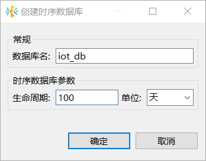
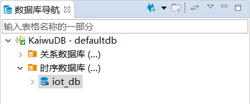
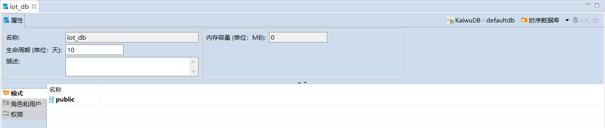
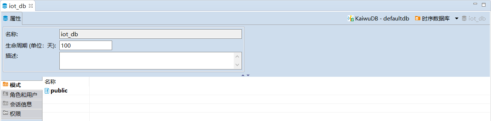
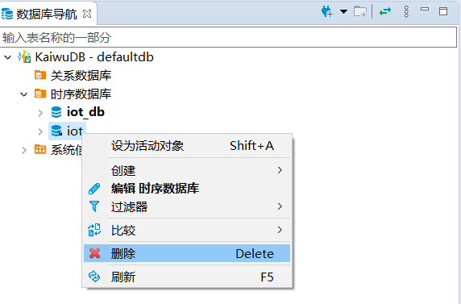
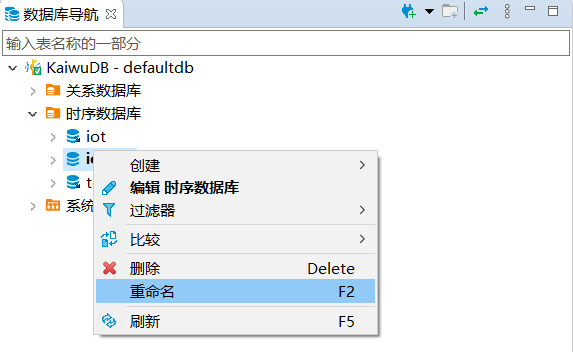
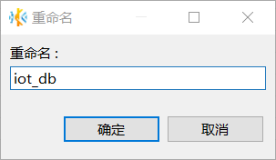

# 数据库管理

KaiwuDB 开发者中心支持创建、编辑、查看、重命名和删除时序数据库。

::: warning 说明
避免频繁地创建、删除数据库。
:::

## 创建数据库

### 前提条件

用户拥有 DATABASE CREATE 或 ALL 权限。

### 步骤

如需创建时序数据库，遵循以下步骤。

1. 在数据库导航区，右键单击**时序数据库**，然后选择**新建时序数据库**。

    

2. 在**创建时序数据库**窗口，填写数据库名称，设置数据库生命周期，然后单击**确定**。默认情况下，数据库的生命周期为 `0` 天，即永不过期。

    

    创建成功后，新建数据库将自动显示在数据库导航区内，继承 KWDB 数据库系统的角色和用户设置。

    

## 编辑数据库

### 前提条件

用户拥有 DATABASE CREATE 或 ALL 权限。

### 步骤

如需修改时序数据库的生命周期，遵循以下步骤。

1. 在数据库导航区，双击需要修改的数据库，或者右键单击需要修改的数据库，然后选择**编辑时序数据库**。
2. 在数据库对象窗口，修改数据库的生命周期。

    

3. 单击页面右下方的保存按钮。
4. 在**执行修改**窗口，确认 SQL 语句无误，然后单击**执行**。

## 查看数据库

在数据库导航区，双击需要查看的数据库，查看数据库的属性以及属性下的模式、角色、用户、会话信息和权限信息。

## 删除数据库

### 前提条件

- 用户拥有 DATABASE DROP 权限。
- 要删除的数据库不是当前使用的数据库。

### 步骤

如需删除时序数据库，遵循以下步骤。

1. 在数据库导航区，右键单击需要删除的数据库，然后选择**删除**。

    

2. 在**删除对象**窗口，单击**是**。删除成功后，系统将自动更新导航栏菜单。

    

## 重命名数据库

::: warning 说明
新数据库名称必须唯一，并且遵循[数据库标识符规则](../../sql-reference/sql-identifiers.md)，最大长度不得超过 63 字节。目前，数据库名称不支持中文字符。
:::

### 前提条件

- 用户为 Admin 用户或者 Admin 角色成员。
- 待重命名数据库不是当前使用的数据库。

### 步骤

如需重命名时序数据库，遵循以下步骤。

1. 在数据库导航区，右键单击需要重命名的数据库，然后选择**重命名**。

    

2. 在**重命名**窗口，设置新的数据库名称，然后单击**确定**。

    

3. 在**重命名脚本**窗口，确认新数据库名称，然后单击**执行**。
