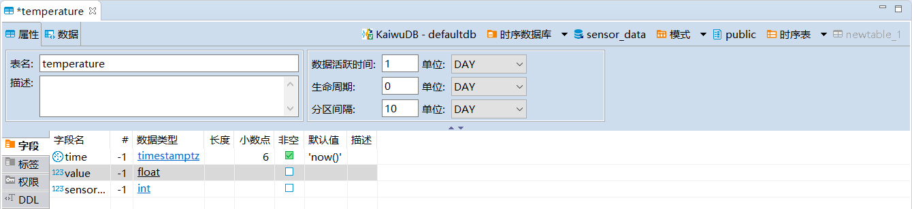
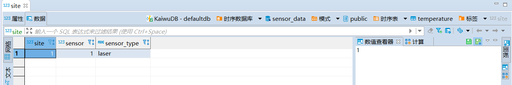
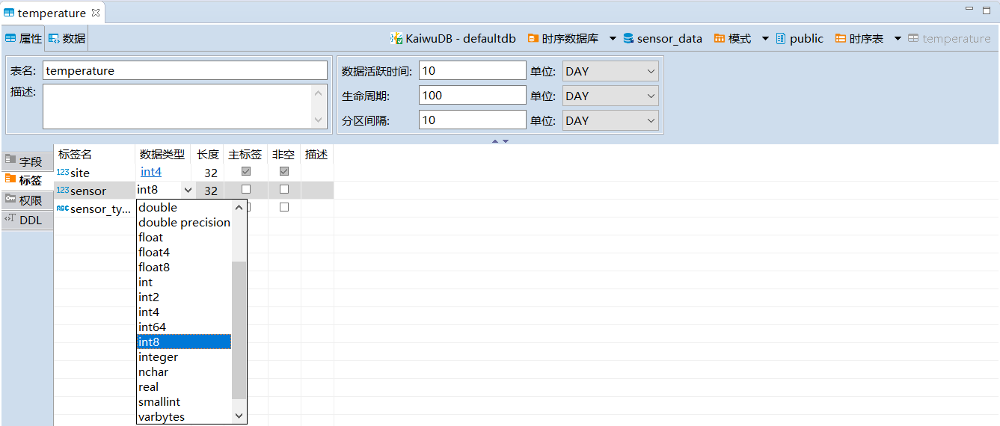

# 时序表管理

时序表用于存储时间序列数据。KaiwuDB 开发者中心支持管理时序表以及表中的字段、标签、权限等元素。

## 时序表

KaiwuDB 开发者中心支持创建、编辑、查看、删除、重命名时序表，向表中写入数据或从表中读取数据，以及为时序表生成 SQL 语句。

::: warning 说明
避免频繁地创建、删除时序表。
:::

### 前提条件

- 创建、编辑时序表
  - 用户拥有 TABLE CREATE 或 ALL 权限。
- 删除时序表
  - 用户拥有 TABLE DROP 权限。
- 重命名时序表
  - 用户为 Admin 用户或者 Admin 角色成员。
  - 待重命名数据库不是当前使用的数据库。
- 从时序表中导出数据
  - 用户为 Admin 用户或者 Admin 角色成员。
- 向时序表中写入数据
  - 用户为 Admin 用户或者 Admin 角色成员。

### 创建时序表

如需创建时序表，遵循以下步骤。

1. 在数据库导航区，选择要操作的数据库和模式。
2. 右键单击**时序表**，然后选择**新建时序表**。

    

    系统将自动创建名为 **newtable** 的表，并打开对象窗口。

3. 在**属性**页签，填写表名，根据需要设置表的生命周期和描述信息。表名的最大长度为 128 字节。默认情况下，表的生命周期为 `0` 天， 即永不过期。
4. 在**字段**页签，至少添加两个字段。字段名的最大长度为 128 字节。第一个字段的数据类型必须为 `timestamp` 或 `timestamptz` 且非空。实际上，系统会将 `timestamp` 数据类型处理为 `timestamptz` 数据类型。

    

5. 在**标签**页签添加标签，设置标签名称、数据类型、长度、是否为主标签，是否非空和描述信息，然后单击**保存**。

    ::: warning 说明

    - 每张时序表至少需要设置一个主标签，且主标签必须为非空标签。
    - 标签名暂时不支持中文字符，最大长度为 128 字节。

    :::

    

6. 在**执行修改**窗口，确认 SQL 语句无误，然后单击**执行**。

### 编辑时序表

时序表支持以下编辑表操作：

- 添加、修改、删除、重命名字段。更多详细信息，参见[字段](#字段)。
- 添加、修改、删除、重命名主标签之外的其它标签，更多详细信息，参见[标签](#标签)。
- 添加和删除数据。
- 修改表的生命周期。
- 修改表的描述信息。

#### 编辑数据

目前，KaiwuDB 开发者中心支持向时序表中添加新数据或者从时序表中删除已有数据。

::: warning 说明

- 系统支持为指定的列写入数据，对于未指定的列，如果该列支持 `NULL` 值，系统将自动插入默认值 `NULL`。如果该列不支持 `NULL` 值，系统将提示 `Null value in column %s violates null-null constraints.`。
- 输入 `TIMESTAMP` 或 `TIMESTAMPTZ` 类型数据时，日期部分需要使用短横线（`-`）、双引号（`""`）或正斜杠符号（`/`）分割，时间部分需要使用冒号（`:`）分割，支持精确到微秒，例如：`'2023-01-25 10:10:10.123'`、`'2023 01 25 10:10:10.123'` 或 `'2023/01/25 10:10:10.123'`。
- KWDB 支持对具有相同时间戳的数据进行去重处理。默认情况下，后写入的数据会覆盖已存在的具有相同时间戳的数据。用户可通过 `SET CLUSTER SETTING ts.dedup.rule=[ merge | override | discard]` 语句设置数据去重策略。有关详细信息，参见[集群参数配置](../../db-operation/cluster-settings-config.md)

:::

如需编辑时序表中的数据，遵循以下步骤。

1. 在数据库导航区，右键单击需要编辑数据的表，然后选择**编辑数据**。
2. 在**数据**页面，进行以下操作：

    - 单击页面下方的**添加新行**按钮，向表中加入相应的数据。
    - 单击页面下方的**复制当前行**按钮，复制当前行数据。
    - 单击页面下方的**删除行**按钮或者使用 `Alt` + `Delete` 快捷键，删除选中的行数据。

      

3. 如需查看对应的 SQL 语句，单击**生成 SQL 语句**，然后单击**执行**。
4. 如果无需查看 SQL 语句，单击**保存**。

#### 修改生命周期

如需修改时序表的生命周期，遵循以下步骤。

1. 在数据库导航区，双击需要修改的时序表，或者右键单击需要修改的时序表，然后选择**编辑时序表**。

2. 修改生命周期，例如 `20d`，然后单击**保存**。

    

3. 在**执行修改**窗口，确认 SQL 语句无误，然后单击**执行**。

#### 修改描述信息

如需添加、修改或删除表的描述信息，遵循以下步骤。

1. 在数据库导航区，双击需要修改的时序表，或者右键单击需要修改的时序表，然后选择**编辑时序表**。

2. 在属性页签的描述对话框内添加、修改或删除表的描述信息，然后单击**保存**。

   

3. 在**执行修改**窗口，确认 SQL 语句无误，然后单击**执行**。

### 查看时序表

在数据库导航区，双击需要查看的时序表，即可查看时序表的属性和数据信息。

### 删除时序表

如需删除时序表，遵循以下步骤。

1. 在数据库导航区，右键单击需要删除的时序表，然后选择**删除**。

    

2. 在**删除对象**窗口，单击**是**。

### 重命名时序表

::: warning 说明
新表名必须唯一，并且遵循[数据库标识符规则](../../sql-reference/sql-identifiers.md)。表名的最大长度为 128 字节。目前，时序表名称不支持中文字符。
:::

如需重命名时序表，遵循以下步骤。

1. 在数据库导航区，右键单击需要重命名的时序表，然后选择**重命名**。
2. 在**重命名**窗口，编辑表名称，然后单击**确定**。

    

3. 单击页面右下方的保存按钮。
4. 在**执行修改**窗口，确认 SQL 语句无误，然后单击**执行**。

### 导出数据

如需导出时序表中的数据，遵循以下步骤。

1. 在数据库导航区，右键单击需要导出数据的时序表，然后选择**导出数据**。
2. 在**数据转化**窗口，选择数据传输目标的类型和格式，然后单击**下一步**。

    

3. 设置提取、格式和导出选项，然后单击**下一步**。

    

4. 设置导出输出参数，例如目录、文件名称、编码、是否压缩和分割等，然后单击**下一步**。

    

5. 检查导出设置，然后单击**完成**。成功导出数据后，系统将提示完成数据转换。

### 导入数据

如需向时序表中导入数据，遵循以下步骤。

1. 在数据库导航区，右键单击需要导入数据的时序表，然后选择**导入数据**。
2. 在**数据转化**窗口，选择数据传输源的类型和格式，单击**下一步**。

    

3. 在输入文件窗口，单击**源端名称**下的表，选择文件或文件所在目录，然后单击**下一步**。

    - 如需导入单个数据文件，选择需要导入的数据文件。
    - 如需导入多个文件，勾选**批量导入**，然后选择文件所在的目录。

      

4. 在**预览数据导入过程**窗口，确认预览数据，然后单击**下一步**。

    

5. 设置数据加载方式、执行过程和打开方式，然后单击**下一步**。

    

6. 检查导入设置，然后单击**完成**。成功导入数据后，系统将提示完成数据转换。

### 生成 SQL 语句

KaiwuDB 开发者中心支持为时序表生成以下 SQL 语句：

- SELECT
- INSERT
- UPDATE
- DELETE
- MERGE
- DDL

如需为时序表生成 SQL 语句，遵循以下步骤。

1. 在数据库导航区，右键单击需要生成 SQL 语句的表，选择**生成 SQL**，然后选择需要生成的 SQL 语句。

    

2. 在**生成 SQL 语句**窗口，选择是否**使用标准名称**和**紧凑型 SQL**，然后单击**复制**或**关闭**。

    默认情况下，使用标准名称，不使用紧凑型 SQL。

## 字段

字段页面以表格的形式展示字段名、序号、数据类型、长度、是否非空、默认值和描述信息。

### 前提条件

- 需要添加、修改、删除、重命名字段的时序表不在读写过程中。
- 用户拥有 TABLE CREATE 或 ALL 权限。

### 创建字段

::: warning 说明
目前，字段名称暂时不支持中文字符，且不能与已有字段和标签重名。字段名的最大长度为 128 字节。
:::

如需为时序表添加字段，遵循以下步骤。

1. 单击**字段**页面右下角的**新建字段**按钮，或者右键单击**字段**页面空白处，然后选择**新建字段**。

    

2. 在**编辑属性**窗口，编辑字段名称、数据类型、长度、是否非空以及字段描述，然后单击**确定**。

    

3. 单击页面右下方的保存按钮。
4. 在**执行修改**窗口，确认 SQL 语句无误，然后单击**执行**。

### 修改字段属性

目前，时序表支持修改字段的数据类型、宽度和描述信息。

:::warning 说明

- 转换后的数据类型宽度必须大于原数据类型的宽度，如 `INT4` 可以转换为 `INT8`，但不能转换为 `INT2`，`CHAR(200)` 可以转为 `VARCHAR(254)`，但不能转为 `VARCHAR(100)`。
- CHAR、VARCHAR、NCHAR 和 NVARCHAR 字符类型支持同数据类型的宽度转换，但只能增加宽度不能降低宽度，例如 `CHAR(100)` 可以转换成 `CHAR(200)`, 不能转换为 `CHAR(50)`。
- 数值类型转字符类型和字符类型间转换需满足特殊要求。更多信息，参见[时序数据类型](../../sql-reference/data-type/data-type-ts-db.md)。

:::

如需修改时序表的字段，遵循以下步骤。

1. 在数据库导航区，双击需要修改的时序表。

2. 如需更改数据类型，在**字段**页面，单击需要修改字段的数据类型信息，然后在下拉菜单中，选择新的数据类型。

    

3. 如需修改同数据类型的宽度，单击需要修改字段的长度值，然后输入新数值。

4. 如需修改字段的描述信息，单击需要修改字段的描述框，然后输入字段描述。

5. 单击页面右下方的保存按钮。

6. 在**执行修改**窗口，确认 SQL 语句无误，然后单击**执行**。

    

### 删除字段

如需删除时序表的字段，遵循以下步骤。

1. 在数据库导航区，双击需要修改的时序表。
2. 在**字段**页面，右键单击需要删除的字段，然后选择**删除**。

    

3. 单击页签右下方的保存按钮。
4. 在**执行修改**窗口，确认 SQL 语句无误，然后单击**执行**。

### 重命名字段

::: warning 说明
目前，新字段名称暂时不支持中文字符，且不能与已有字段和标签重名。字段名的最大长度为 128 字节。
:::

如需重命名时序表的字段，遵循以下步骤。

1. 在数据库导航区，双击需要修改的时序表。
2. 在**字段**页面，右键单击需要重命名的字段，然后选择**重命名**。

    

3. 在**重命名**窗口，编辑字段名称，然后单击**确定**。

    

4. 单击页面右下方的保存按钮。
5. 在**执行修改**窗口，确认 SQL 语句无误，然后单击**执行**。

## 标签

标签页面以表格的形式展示标签名、数据类型、长度、是否为主标签以及是否非空信息。

### 前提条件

- 添加、修改、删除、重命名标签
  - 需要添加、修改标签的时序表不在读写过程中。
  - 用户拥有 TABLE CREATE 或 ALL 权限。
- 修改标签值
  - 用户拥有目标表的 UPDATE 权限。
- 导出标签数据
  - 用户为 Admin 用户或者 Admin 角色成员。
- 导入标签数据
  - 用户为 Admin 用户或者 Admin 角色成员。

### 创建标签

::: warning 说明

- 时序表不支持添加主标签和非空标签。
- 标签名暂时不支持中文字符，最大长度为 128 字节。

:::

如需为时序表添加标签，遵循以下步骤。

1. 在数据库导航区，双击需要修改的时序表。
2. 在**标签**页面，单击右下角**新建标签**按钮，或者右键单击**标签**页面空白处，然后选择**新建标签**。

    

3. 在**标签**窗口，编辑标签名称和属性信息，然后单击**确定**。

    

4. 单击页面右下方的保存按钮。
5. 在**执行修改**窗口，确认 SQL 语句无误，然后单击**执行**。

### 查看标签值

如需查看时序表的标签值，遵循以下步骤。

1. 在数据库导航区，双击需要查看标签的时序表。

2. 在**标签**页面，双击任一标签。

3. 在标签的**数据**页签，即可查看所有标签值。

    

### 修改标签属性

KaiwuDB 开发者中心支持修改标签的数据类型、宽度和描述信息。

:::warning 说明

- 转换后的数据类型宽度必须大于原数据类型的宽度，如 `INT4` 可以转换为 `INT8`，但不能转换为 `INT2`，`CHAR(200)` 可以转为 `VARCHAR(254)`，但不能转为 `VARCHAR(100)`。
- CHAR、VARCHAR、NCHAR 和 NVARCHAR 字符类型支持同数据类型的宽度转换，但只能增加宽度不能降低宽度，例如 `CHAR(100)` 可以转换成 `CHAR(200)`, 不能转换为 `CHAR(50)`。
- 数值类型转字符类型和字符类型间转换需满足特殊要求。更多信息，参见[时序数据类型](../../sql-reference/data-type/data-type-ts-db.md)。

:::

如需修改标签的数据类型、宽度或描述信息，遵循以下步骤。

1. 在数据库导航区，双击需要修改的时序表。

2. 如需更改数据类型，在**标签**页面，单击需要修改标签的数据类型信息，然后在下拉菜单中，选择新的数据类型。

    

3. 如需修改同数据类型的宽度，单击需要修改的长度值，然后输入新数值。

4. 如需修改标签的描述信息，单击需要修改的描述框，然后输入字段描述。

    

5. 单击页面右下方的保存按钮。

6. 在**执行修改**窗口，确认 SQL 语句无误，然后单击**执行**。

### 编辑标签值

::: warning 说明
时序表不支持修改主标签。
:::

如需修改时序表的标签值，遵循以下步骤。

1. 在数据库导航区，双击需要修改标签值的时序表。
2. 在**数据**页面，进行以下操作：

    - 修改标签值：双击需要修改的标签值，输入拟修改的值。
    - 添加标签值：单击页面下方的**添加新行**按钮，即可为所有标签添加新的标签值。如果新写入的主标签值与已有主标签值相同，系统只保留首次写入的主标签和普通标签值。
    - 删除标签值：单击页面下方的**删除行**按钮或者使用 `Alt` + `Delete` 快捷键，删除指定行的所有标签值。删除标签值后，标签值对应的数据列数据也会一同删除。

      

3. 如需查看对应的 SQL 语句，单击**生成 SQL 语句**，然后单击**执行**。
4. 如果无需查看 SQL 语句，单击**保存**。

### 删除标签

::: warning 说明
时序表不支持删除主标签。
:::

如需删除时序表的标签，遵循以下步骤。

1. 在数据库导航区，双击需要修改的时序表。
2. 在**标签**页面，右键单击需要删除的标签，然后选择**删除**。
3. 在**标签**窗口，设置标签名称、数据类型和长度。
4. 单击页面右下方的保存按钮。
5. 在**执行修改**窗口，确认 SQL 语句无误，然后单击**执行**。

### 重命名标签

::: warning 说明

- 时序表不支持重命名主标签。
- 新标签名称暂不支持中文字符，且不能与已有标签或字段重名。
- 新标签名的最大长度为 128 字节。

:::

如需重命名时序表的标签，遵循以下步骤。

1. 在数据库导航区，双击需要修改的时序表。
2. 在**标签**页面，右键单击需要重命名的标签，然后选择**重命名**。

    

3. 在**重命名**窗口，编辑标签名称，然后单击**确定**。

    

4. 单击页面右下方的保存按钮。
5. 在**执行修改**窗口，确认 SQL 语句无误，然后单击**执行**。

### 导出标签数据

时序表只支持导出表内的标签数据。

如需导出时序表的数据，遵循以下步骤。

1. 在数据库导航区，双击需要导出数据的时序表。
2. 右键单击需要导出标签数据的任一标签，然后选择**导出数据**。
3. 在**数据转化**窗口，选择数据传输目标类型的和格式，然后单击**下一步**。

    

4. 设置提取、格式和导出选项，然后单击**下一步**。

    

5. 设置导出输出参数，例如目录、文件名称、编码、是否压缩和分割等，然后单击**下一步**。

    

6. 检查导出设置，然后单击**完成**。成功导出数据后，系统将提示完成数据转换。

### 导入标签数据

如需向时序表中导入数据，遵循以下步骤。

1. 在数据库导航区，双击需要导入数据的时序表。
2. 右键单击需要导入标签数据的任一标签，然后选择**导入数据**。
3. 在**数据转化**窗口，选择数据传输源的类型和格式，单击**下一步**。

    

4. 在输入文件窗口，单击**源端名称**下的表，选择文件或文件所在目录，然后单击**下一步**。

   - 如需导入单个数据文件，选择需要导入的数据文件。
   - 如需导入多个文件，勾选**批量导入**，然后选择文件所在的目录。

    

5. 在**预览数据导入过程**窗口，确认预览数据，然后单击**下一步**。
6. 设置数据加载方式、执行过程和打开方式，然后单击**下一步**。

    

7. 检查导入设置，然后单击**完成**。成功导入数据后，系统将提示完成数据转换。

## 权限管理

权限管理用于赋予不同用户指定表的相关权限。

### 赋予权限

如需为用户赋予权限，遵循以下步骤。

1. 在指定表的对象窗口，单击**权限**页签，打开指定表的权限页面。
2. 选择需要授权的用户，勾选相应的权限。

    

3. 单击页面右下方的保存按钮。
4. 在**执行修改**窗口，确认 SQL 语句无误，然后单击**执行**。

### 撤销权限

如需撤销用户权限，遵循以下步骤。

1. 在指定表的对象窗口，单击**权限**页签，打开指定表的权限页面。
2. 选择需要撤销授权的用户，取消勾选相应的权限。

    

3. 单击页面右下方的保存按钮。
4. 在**执行修改**窗口，确认 SQL 语句无误，然后单击**执行**。

## 查看 DDL 语句

在指定表的对象窗口，单击 **DDL** 页签，即可查看相关语句。用户可以按需选择是否显示权限和注释。

