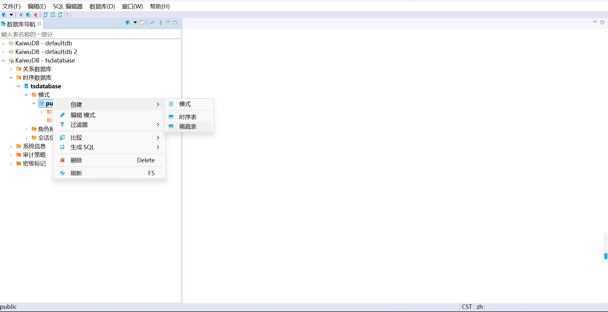
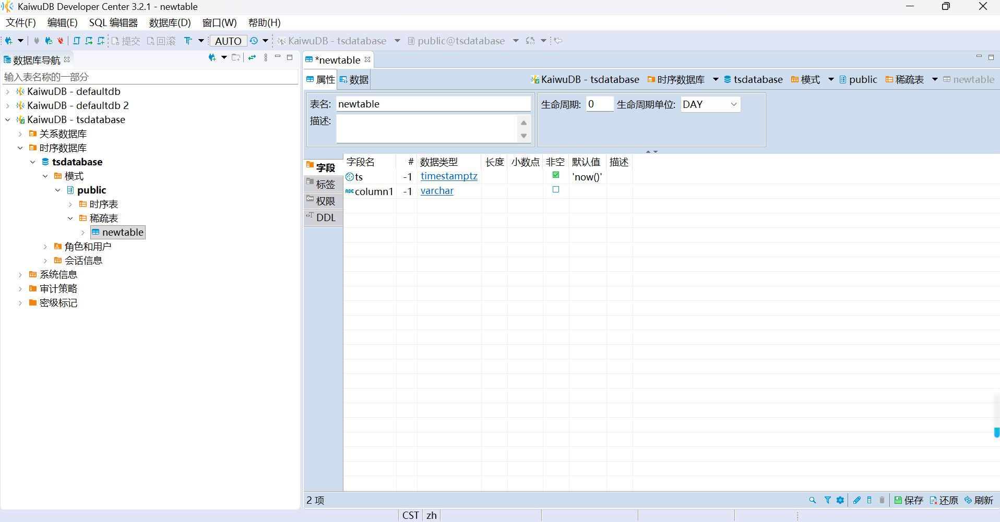
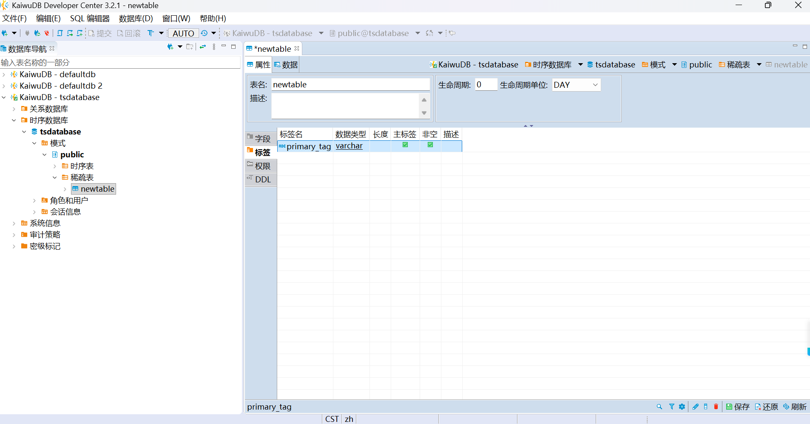
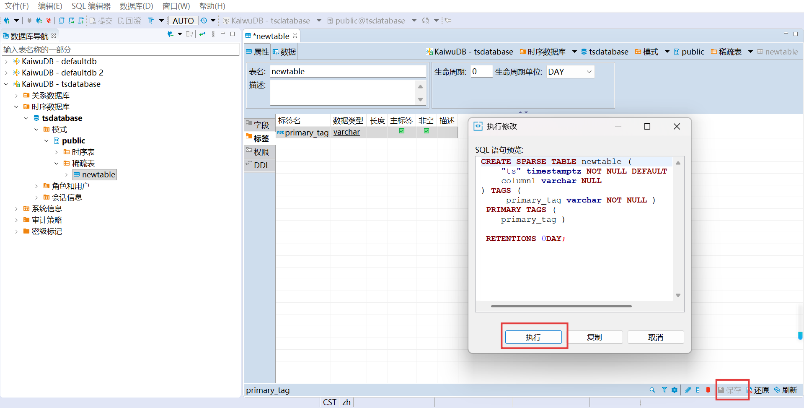
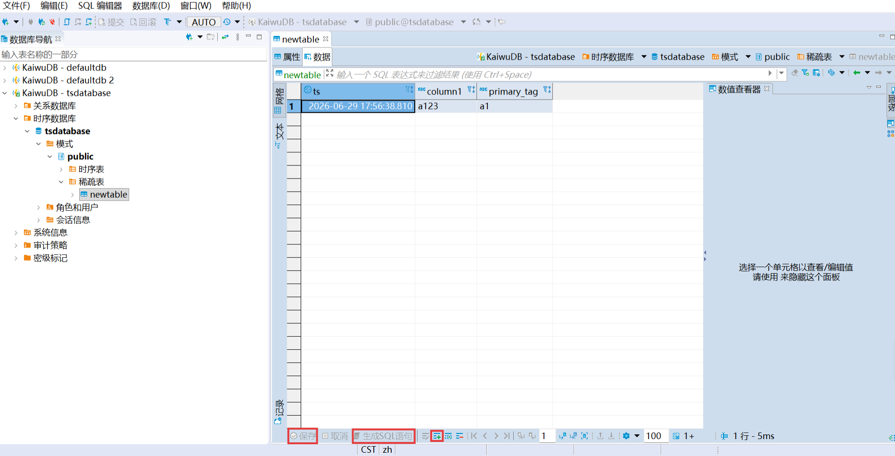
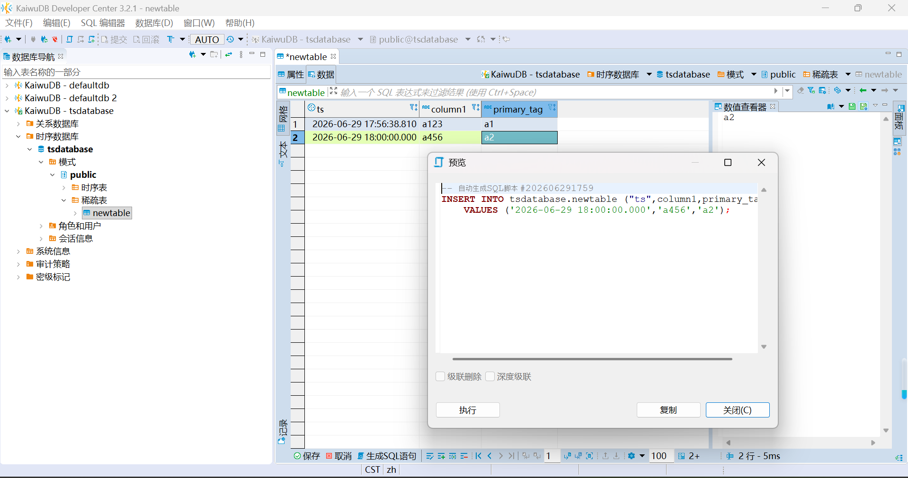
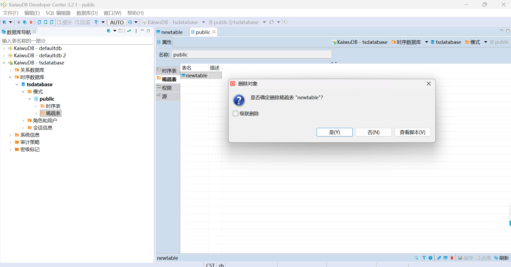
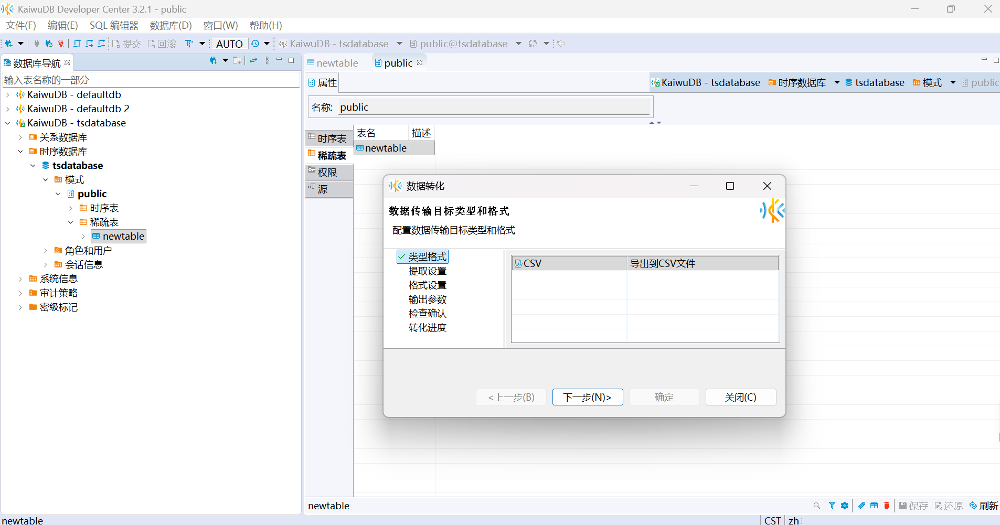

# 稀疏表管理

KaiwuDB 开发者中心支持管理稀疏表以及表中的数据，支持创建、编辑、删除稀疏表，支持导入、导出稀疏表数据。

## 创建稀疏表

### 步骤

如需创建稀疏表，遵循以下步骤。

1. 在数据库导航区，右键单击**public**模式或右键单击**稀疏表**目录，然后选择**创建**再选择**稀疏表**。

    

    系统将自动创建名为 **newtable** 的表，并打开对象窗口。

2. 在**字段**页签，右键单击空白处选择新建字段，再弹出的页面中配置字段信息并保存。

    

3. 在**标签**页签，右键单击空白处，创建标签，在弹出的页面中配置标签信息并保存。

    

4. 填写必要信息后点击右下方**保存**按钮，可以在弹出的页面中查看建表DDL语句，然后单击**执行**。

   

## 查看、编辑稀疏表

### 步骤

如需查看、编辑稀疏表中数据，需遵循以下步骤：

1. 在稀疏表详情页面点击表中数据进入数据编辑器，可以查看当前稀疏表数据。

   

   ::: warning 提示：

   当稀疏表中没有数据时，编辑器加载并展示稀疏表全部列；当表中有数据时，数据编辑器会获取稀疏表主标签值，默认按照首行返回结果值拼接`where`子句进行过滤，并在数据编辑器顶部过滤文本框中显示，表格中仅展示非空值列。

   ::: 

2. 用户点击稀疏表数据详情页面下方工具栏**添加新行**按钮可新增一行单元格并填写相应数据，单击**生成SQL语句**按钮可以查看执行的SQL语句，点击**保存**按钮可插入数据：

   

   

## 删除稀疏表

### 步骤

如需删除稀疏表，需遵循以下步骤：

1. 在数据库导航区，右键单击某一稀疏表，选择删除稀疏表；
2. 进入模式详情页面，选择某一稀疏表，选择删除稀疏表，点击界面右下工具栏**删除**按钮；
3. 弹出**删除对象**确认页面，点击**Yes**即可删除稀疏表，点击**查看脚本**即可查看删除稀疏表所执行的SQL语句。

   

## 导入、导出数据

### 步骤

如需导入、导出稀疏表中数据，需遵循以下步骤：

1. 右键单击某一稀疏表对象，选择**导出数据**或**导入数据**选项；
2. 进入**数据转化**界面，按照界面导航栏指引可完成稀疏表数据的导入与导出。

   