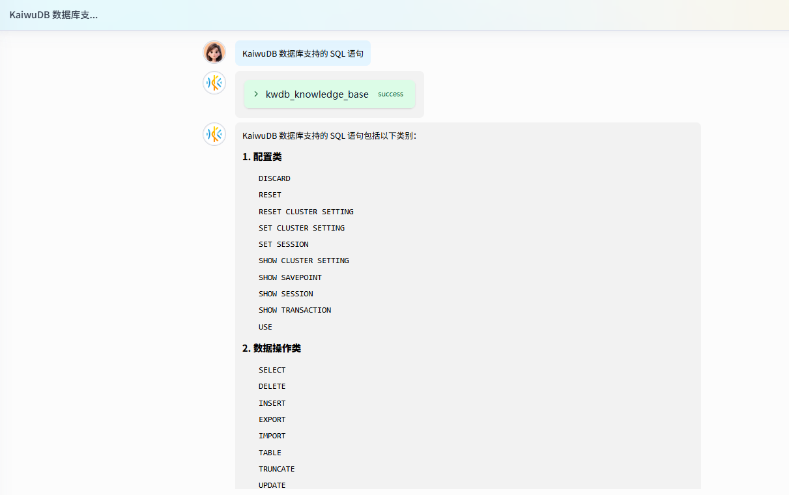
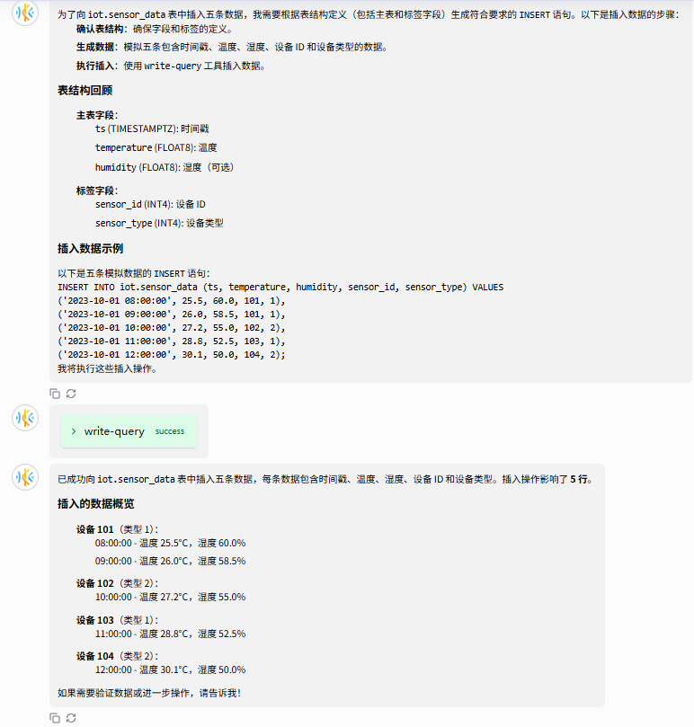

# 使用举例

本节通过具体示例介绍 KAT 的典型使用场景，包括与 KWDB 知识库和数据库交互、自动部署 KWDB 及预测分析引擎、数据库性能测试等。

在应用 NL2SQL 之前，用户使用 SQL 语句与数据库进行交互。随着自然语言处理技术的新突破，用户完全可以使用自然语言跟数据库交流。自然语言查询允许用户更直观、更高效地与数据库进行交互。KAT 通过 Agentic Workflow 以及 MCP 提供的数据库 Schema、SQL 参考信息，并配合在线 KWDB 知识库，实现 NL2SQL，从而节省用户编写和优化 SQL 语句的成本。此外，系统还支持通过表选择、字段剪枝和结果验证等手段提升查询的准确性。

## 与 KWDB 知识库交互

在 KAT 对话页面，用户输入一个问题 “KWDB 数据库支持的 SQL 语句”。KWDB Agent Server 通过 MCP 协议连接 KWDB 知识库，获取用户想要了解的信息。



## 与 KWDB 数据库交互

以下示例假设已经创建一个数据库（`iot`）和 一张表（`sensor_data`）。用户向 `sensor_data` 表中写入五条记录。

在 KAT 对话页面，用户输入一个问题：“向 sensor_data 表中插入五条数据”。KAT 配置的大模型将其转化为可执行的 SQL 语句：

```sql
INSERT INTO iot.sensor_data (ts, temperature, humidity, sensor_id, sensor_type) VALUES
('2023-10-01 08:00:00', 25.5, 60.0, 101, 1),
('2023-10-01 09:00:00', 26.0, 58.5, 101, 1),
('2023-10-01 10:00:00', 27.2, 55.0, 102, 2),
('2023-10-01 11:00:00', 28.8, 52.5, 103, 1),
('2023-10-01 12:00:00', 30.1, 50.0, 104, 2);
```

运行结果如下所示：



从上图中可以看出，KAT 首先确认目标表中的结构，然后调取 KWDB MCP Server 的 write-query 工具向目标表中写入数据。最后再由 KAT 中配置的大模型来汇总数据。

## 自动部署 KWDB

::: warning 说明
KAT 通过 AI 执行安装部署操作，对用户环境有一定风险，建议在生产环境中谨慎使用。
:::

KAT 根据用户输入的指令，自动配置环境、安装依赖、检查端口、部署和启动数据库以及初始化设置等，并提供自然语言指导，缩短部署时间，提升部署成功率。

本节介绍 KAT 如何根据用户输入的指令，自动部署 KWDB 数据库。用户也可以根据需要自定义提示词，定义 KWDB 数据库的部署策略和部署模式，包括：

- 安装策略：单机部署、分布式集群部署
- 安装模式：裸机部署、容器部署
- 安全模式：安全模式、非安装模式

### 前提条件

- 已部署并启动 KAT。
- 已获取 [KWDB 安装包](https://gitee.com/kwdb/kwdb/releases)并将其放置在待部署数据库的服务器上，或已通过以下命令获取 KWDB 容器镜像：

    ```bash
    docker pull kwdb/kwdb:<version>
    ```

- 待部署服务器已开启 SSH 服务，且已允许 root 用户通过密码登录。
- （可选）如需以安全模式连接 KWDB 数据库，用户还需在部署 KAT 的时候，将生成的 CA 证书、客户端证书和节点证书挂载到容器中。

### 步骤

1. 配置数据库连接信息，包括数据库连接方式、数据库地址、SSH 端口号、用户名、用户密码等。有关详细信息，参见[连接数据库](./kat-ui.md#连接数据库)。
2. 创建新对话。有关详细信息，参见[创建新会话](./kat-ui.md#创建新会话)。
3. 在右侧消息交互页面，输入指令，然后单击发送按钮。

    以下是裸机单节点部署 KWDB 的提示词示例。用户可以按实际需求修改数据库的相关信息。

    ```text
    请帮我部署一套开源版 KWDB，安装包在 /tmp 路径下，版本为 V3.1.0，部署模式为单机 TLS 安全模式，本地节点为 10.10.10.1。
    ```

## 自动部署 KaiwuDB 预测分析引擎

:::warning 说明
- KAT 通过 AI 执行安装部署操作，对用户环境有一定风险，建议在生产环境中谨慎使用。
- 预测分析引擎为企业版功能，开源版暂不支持。如需试用，请联系[技术支持](https://www.kaiwudb.com/support/)。有关企业版详细信息，参见[企业版文档](https://www.kaiwudb.com/kaiwudb_docs/#/ml-services/ml-service-overview.html)。
:::

KaiwuDB 预测分析引擎提供从模型导入、模型训练、模型预测、模型评估到模型更新的全生命周期管理能力，支持用户通过 SQL 语句进行管理和预测分析模型。本节介绍 KAT 如何根据用户输入的指令，自动部署 KaiwuDB 预测分析引擎。用户也可以根据需要自定义提示词，定义 KaiwuDB 预测分析引擎的安装服务和安装方式：

- 安装服务：训练服务、推理服务、全部安装
- 安装方式：在线安装、离线安装

本示例在 Ubuntu 20.04 或 Ubuntu 22.04 操作系统上部署 KaiwuDB 预测分析引擎。

### 前提条件

- 已部署并启动 KAT。
- 已部署并启动 KaiwuDB（V3.1.0 及以上版本）。
- [联系](https://www.kaiwudb.com/support/) KaiwuDB 技术支持人员，获取 KaiwuDB 预测分析引擎安装包并将其放置在待部署的服务器上。
- 已安装 [net-tools](https://sourceforge.net/projects/net-tools/)。

### 环境要求

以下是安装部署 KaiwuDB 预测分析引擎的推荐配置。

- CPU：≥16 核
- 内存：≥32 GB
- Docker 数据目录：≥ 60 GB

### 步骤

1. 在左侧导航栏单击**设置**，然后选择**预测分析引擎**页签。配置 KaiwuDB 预测分析引擎，包括预测分析引擎地址、端口号、用户名、用户密码、数据库节点名称等。有关详细信息，参见[添加预测分析引擎](./kat-ui.md#添加预测分析引擎)。
2. 在左侧导航栏单击**对话**。
3. 在**对话列表**区域，单击**新对话**。
4. 在右侧消息交互页面，按需选择语言、LLM 模型、目标数据库，输入指令，然后单击发送按钮。

    示例

    ```text
    请帮我部署 KaiwuDB 预测分析引擎。
    ```

    KAT 启动预测分析引擎的部署流程。用户可通过自然对话交互，引导系统获取大模型部署所需的全部关键信息，从而高效、便捷地完成预测分析引擎的部署。

## 数据库性能测试

[TSBS MCP Server](../perf-benchmark/tsbs-mcp-server.md)  是基于 [MCP](https://modelcontextprotocol.io/introduction)（Model Context Protocol，模型上下文协议）Go SDK 开发的性能测试服务。KAT 支持调用 TSBS MCP Server 对数据库进行读写性能测试。

### 前提条件

- 已部署并启动 KAT。
- 已部署并启动 KWDB。
- 已安装并运行 [TSBS MCP Server](../perf-benchmark/tsbs-mcp-server.md)。

### 步骤

1. 在左侧导航栏单击**设置**，然后选择 **MCP Server** 页签。
2. 单击**添加配置**。然后在弹出的对话框中，添加 TSBS MCP Server 信息，包括 TSBS MCP Server 的名称、连接模式、主机等。有关详细信息，参见[添加 MCP Server](./kat-ui.md#添加-mcp-server)。
3. 在左侧导航栏单击**对话**。
4. 在**对话列表**区域，单击**新对话**。
5. 在右侧消息交互页面，按需选择语言、LLM 模型、目标数据库，输入指令，然后单击发送按钮。

    示例

    ```text
    请使用 TSBS MCP Server 对目标数据库进行性能测试。
    ```

    KAT 调用 TSBS MCP Server。用户可通过自然对话交互，引导系统获取大模型所需的全部关键信息，从而高效、便捷地完成目标数据库的读写性能测试。
