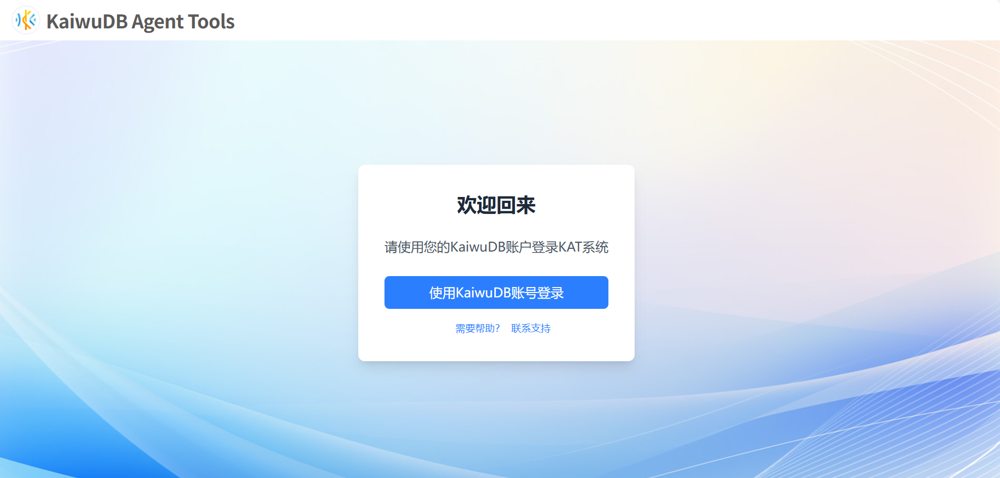
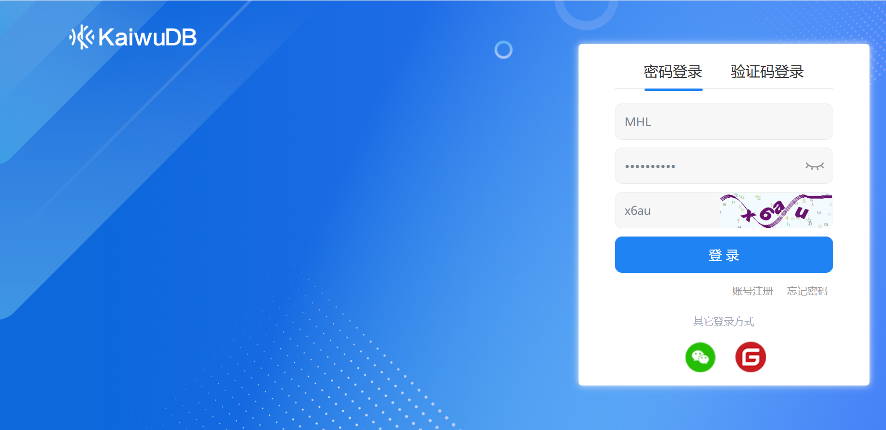
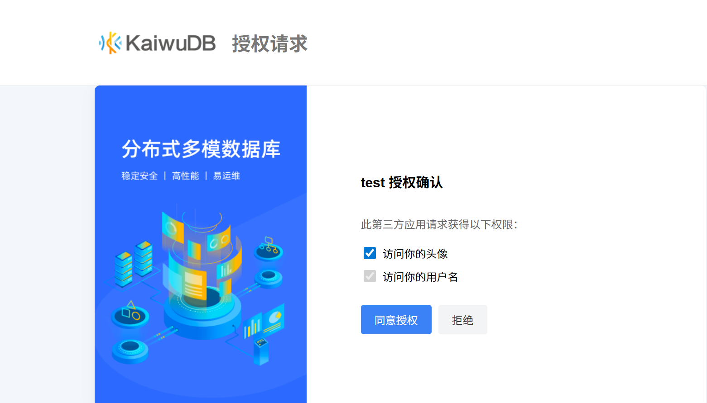

# 安装部署

用户可以在 Windows、MacOS、Linux 平台部署 KAT。本文档介绍如何使用 Docker Compose 整体部署 KAT。

## 部署 KAT

### 前提条件

- 已[安装](https://docs.docker.com/compose/install/) Docker Compose。
- KAT 默认使用以下端口。确保目标机器的以下端口没有被占用且没有被防火墙拦截。如需使用其他端口，可在安装部署过程中进行修改。
  - `8000`：KWDB Agent Server API 服务端口。
  - `8123`：KWDB Agent Server Copilot 服务的端口。
  - `3000`：KWDB Agent UI 的端口。
  - `3100`：KWDB Agent VIS 的端口。
- 安装用户为 root 用户。root 用户在进行部署时无需输入密码。
- [联系](https://www.kaiwudb.com/support/) KaiwuDB 技术支持人员，获取 KWDB Agent Server 镜像。
- [联系](https://www.kaiwudb.com/support/) KaiwuDB 技术支持人员，获取 KWDB Agent UI 镜像。
- [联系](https://www.kaiwudb.com/support/) KaiwuDB 技术支持人员，获取 KWDB Agent VIS 镜像。
- （可选）如需以安全模式连接 KaiwuDB 数据库，用户需要生成 CA 证书和密钥、客户端证书和密钥、节点证书和密钥。有关详细信息，参见 [`kwdb cert` 命令参考](../kwbase-cli-tool.md#kwbase-cert)。

### 步骤

如需使用 YAML 文件部署 KAT，遵循以下步骤。

1. 创建一个目录。然后在该目录下创建 `docker-compose.yml` 配置文件并配置相关参数。

    配置文件示例：

    ```yaml
    version: "3.9"
    services:
      kat-server:
        image: "$kat-server"
        container_name: kat-server
        restart: unless-stopped
        environment:
          LOG_LEVEL: "your_log_level"
          DATABASE_URL: "your_kat_database_url"
          LANGCHAIN_TRACING: "false"
          LANGSMITH_PROJECT: "your_langchain_project_name"
          LANGSMITH_ENDPOINT: "your_langchain_project_endpoint_url"
          LANGSMITH_API_KEY: "your_langchain_api_key"
          KNOWLEDGE_API_URL: "your_knowledge_api_url"
        network_mode: host
        volumes:
          - /your/local/path/data/:/app/data/
          - /your/local/path/certs:/app/certs # 如需以安全模式连接 KaiwuDB 数据库。
          - /your/local/path/kwdb-mcp-server:/user/local/bin/kwdb-mcp-server # （可选）挂载 KWDB MCP Server 二进制安装包。
        command: ["/app/entrypoint.sh"]

      kat-ui:
        image: "$kat-ui"
        container_name: kat-ui
        restart: unless-stopped
        network_mode: host
        environment:
          COPILOT_URL: http://localhost:8123
          BACKEND_URL: http://localhost:8000

      kat-vis:
        image: "$kat-vis"
        container_name: kat-vis
        restart: unless-stopped
        # MacOS 系统不能使用 host 模式
        network_mode: host
        #ports:
        #  - "3100:3100"
        environment:
          RENDERED_IMAGE_HOST_PATH: http://localhost:3100/charts
        volumes:
          - /your/local/path/data/charts:/tmp/kat-vis-charts
      ```

    参数说明:
      - `r.restart`：KWDB Agent Server 的重启方式。
      - `kat-server.environment`：KWDB Agent Server 支持的环境变量。用户可根据实际环境按需修改以下环境变量。
        - `LOG_LEVEL`：日志级别，支持设置为 `ERROR`、`WARN`、`INFO`、或 `DEBUG`选项。
        - `DATABASE_URL`：KAT 数据库的路径。推荐使用 `sqlite+aiosqlite:////app/katserver.db`。该参数取值，需要与 KAT 数据库文件挂载目录保持一致。
        - `LANGCHAIN_TRACING`：配置是否开启 LangChain 链路追踪。支持设置为 `true` 或 `false`。
        - `LANGSMITH_PROJECT`：待追踪的项目名称。
        - `LANGSMITH_ENDPOINT`：LangSmith 收集过程数据的 API 地址。默认设置为 `https://api.smith.langchain.com`。
        - `LANGSMITH_API_KEY`：LangSmith API 密钥。
        - `KNOWLEDGE_API_URL`：KaiwuDB 知识库的 API 地址，默认设置为 `http://117.73.9.174:8001/proxy/knowledge`。
      - `kat-server.network_mode`: 配置 KWDB Agent Server 的网络访问模式。支持设置为 `host`，表示 KWDB Agent Server 容器直接使用宿主机的网络配置，而无需创建独立的虚拟网络环境。
      - `kat-server.volumns`：数据库的映射目录。
      - `kat-server.command`：容器启动后，默认执行的命令。
      - `kat-ui.image`：KWDB Agent UI 的镜像名称。
      - `kat-ui.container_name`：自定义 KWDB Agent UI 的容器名称。
      - `kat-ui.restart`：KWDB Agent UI 的重启方式。
      - `kat-ui.network_mode`: 配置 KWDB Agent UI 的网络访问模式。该参数取值需要与 `kat-server.network_mode` 参数的取值保持一致。
      - `kat-ui.environment`：KWDB Agent UI 支持的环境变量。用户可根据实际环境按需修改以下环境变量。
        - `COPILOT_URL`：KWDB Agent Server Copilot 服务的地址。
        - `BACKEND_URL`：KWDB Agent Server API 服务的地址。
      - `kat-vis.image`：KWDB Agent VIS 的镜像名称。
      - `kat-vis.container_name`：自定义 KWDB Agent VIS 的容器名称。
      - `kat-vis.restart`：KWDB Agent VIS 的重启方式。
      - `kat-vis.network_mode`：配置 KWDB Agent VIS 的网络访问模式。该参数取值需要与 `kat-server.network_mode` 参数的取值保持一致。
      - `kat-vis.ports`：可选参数，KWDB Agent VIS 服务的端口映射配置。
      - `kat-vis.environment`：KWDB Agent VIS 支持的环境变量。用户可根据实际环境按需修改以下环境变量。
        - `RENDERED_IMAGE_HOST_PATH`：生成的图片的 URL 前缀。
      - `kat-vis.volumes`：KWDB Agent VIS 服务的的映射目录。

2. 启动 KAT。

    ```shell
    docker-compose up -d
    ```

3. （可选）停止 KAT。

    ```shell
    docker-compose down
    ```

## 访问 KAT

::: warning 说明
对于 Chrome 浏览器，建议使用 Chrome 110 及以上版本的浏览器。
:::

成功启动 KAT 后，用户即可通过 `http://localhost:3000/` 访问 KAT。

### 前提条件

已[注册](https://www.kaiwudb.com/reg) KaiwuDB 账号。

### 步骤

1. 在 KAT UI 界面，单击**使用 KaiwuDB 账号**登录，跳转到登录页面。

    

2. 输入用户名、密码和验证码，然后单击**登录**。

    

3. 在**授权请求**页面，单击**同意授权**。认证成功后，页面将自动跳转到 KAT UI 界面。

    

4. （可选）如需安全退出当前账户，单击用户头像，然后再单击​**​退出​登录**​按钮。退出后，用户将无法进行任何提问或系统配置操作，需重新登录方可使用。

    
