# KAT 用户界面

KAT 主界面采用侧边栏导航设计，包含以下主要区域：

- 左侧导航栏：提供**对话**、**任务**和**设置**三个主要页面的入口。

- 中央内容区域：根据选择的导航项显示对应页面。

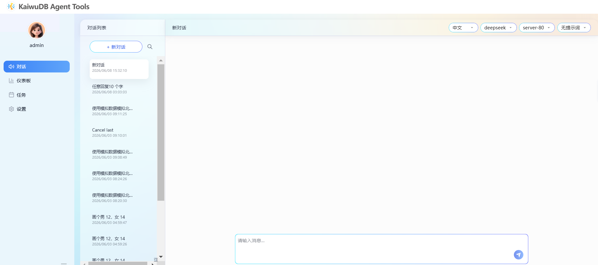

## 对话页面

KAT 支持创建新会话、查看、分享、重命名和删除历史会话。

### 创建新会话

#### 前提条件

已设置界面语言、添加 LLM 模型、数据库和提示词。有关详细信息，参见[通用配置](#通用配置)、[连接数据库](#连接数据库)、[添加提示词](#添加提示词)。

#### 步骤

1. 在左侧导航栏单击**对话**。

2. 在**对话列表**区域，单击**新对话**。

3. 在右侧消息交互页面，按需选择语言、LLM 模型、目标数据库、提示词，输入要查询的内容，然后单击发送按钮。

    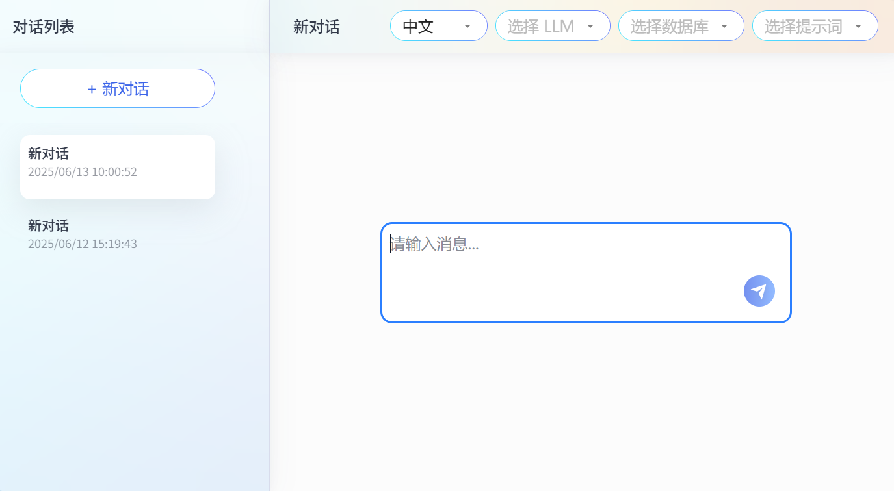

4. （可选）在**对话列表**区域，查看已创建的会话。

5. （可选）在**对话列表**区域，单击历史会话右上角的三个点图标，然后从下拉菜单中选择**分享**选项，复制该对话内容。

6. （可选）在**对话列表**区域，单击历史会话右上角的三个点图标，然后从下拉菜单中选择**重命名**选项，更改会话名称。用户也可以直接双击会话名称，更改会话名称。

7. （可选）在**对话列表**区域，单击历史会话右上角的三个点图标，然后从下拉菜单中选择**删除**选项，删除目标历史会话。

## 任务页面

KAT 支持基于 CRON 的定时任务，定时触发 LLM 模型在特定提示词、特定 LLM 模型下，针对特定数据库的操作。KAT 支持创建新任务、查看和删除历史任务。

### 创建新任务

1. 在左侧导航栏单击**任务**。

2. 在**任务列表**区域，单击**新任务**。

3. 在右侧消息交互页面，配置任务的基本信息。

    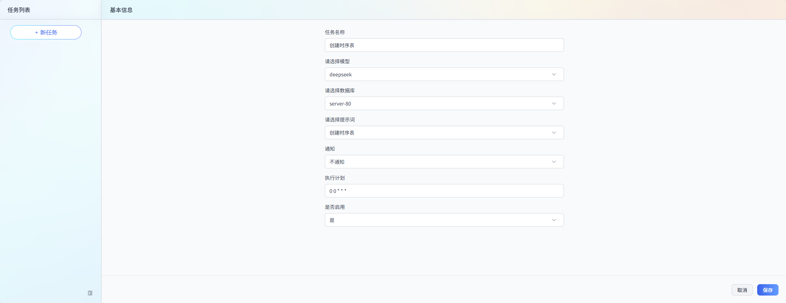

    - `任务名称`：任务的名称。便于后续查询和管理任务。
    - `模型`：在下拉列表中选择目标 LLM 模型。
    - `数据库`：在下拉列表中选择目标数据库。
    - `提示词`：在下拉列表中选择目标提示词。

        ::: warning 说明
        目标提示词的角色需要是 `assistant`。
        :::

    - `通知`：配置是否发布目标任务的 Webhook 通知。
    - `执行计划`：配置任务的执行计划。KAT 支持通过 CRON 表达式来指定在某个时间点或者周期性执行任务。
    - `是否启用`：选择是否启用该任务。勾选后，系统启用该任务。

4. 单击**保存**。

5. （可选）在**任务列表**区域，查看已创建的任务。

6. （可选）在**任务列表**区域，单击已创建的任务，可以修改目标任务。

7. （可选）在**任务列表**区域，单击历史任务右上角的三个点图标，然后从下拉菜单中选择**删除**选项，删除目标历史任务。

## 设置页面

### 通用配置

1. 在左侧导航栏单击**设置**，然后选择**通用**页签。

    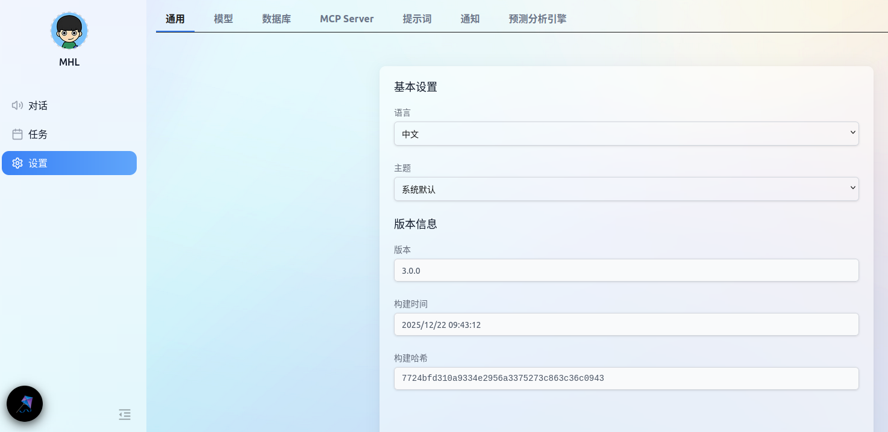

2. 设置语言和主题。

    - 基本设置
      - `语言`：支持**中文**和 **English** 两个选项。
      - `主题`：设置界面主题。支持**系统默认**、**亮色**和**深色**三个选项。默认为**系统默认**选项。
    - 版本信息
      - `版本`：当前使用的 KAT 版本。
      - `构建时间`：KAT 版本的构建时间。
      - `构建哈希`：KAT 版本的构建哈希值。

### 模型配置

KAT 支持添加模型、修改模型配置和删除模型。

#### 添加模型

##### 前提条件

- 已获取待部署模型的 API 密钥。
- 已获取待部署模型的 API 基础 URL。该选项只适用于自定义模型供应商。

##### 步骤

如需添加模型，遵循以下步骤。

1. 在左侧导航栏单击**设置**，然后选择**模型**页签。

2. 单击**添加配置**。然后在弹出的对话框中，添加模型信息。

    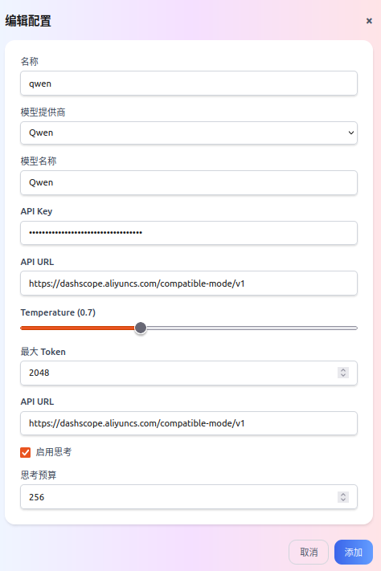

    - `名称`：模型的配置名称，便于后续查询和查找管理模型。
    - `模型供应商`：模型供应商的名称。支持 **OpenAI**、**Anthropic**、**Google**、**Qwen** 和**自定义**选项。默认为 **OpenAI**。
    - `模型名称`：模型名称。
    - `API Key`：模型的 API 密钥。
    - `API URL`：模型的 API 基础 URL。该参数只适用于**自定义**模型供应商。
    - `Temperature`：模型的温度值。
    - `最大 Token`：模型的最大令牌数。
    - `启用思考`：是否启用思考模型。该参数只适用于已配置思考模型的模型供应商。
    - `思考预算`：思考模型使用的思考预算。该参数只适用于已配置思考模型的模型供应商。

3. 单击**添加**。

#### 修改模型配置

如需修改模型配置，遵循以下步骤。

1. 在左侧导航栏单击**设置**，然后选择**模型**页签。

2. 单击指定模型对应的编辑图标。

3. 在弹出的对话框中修改模型的配置信息。有关模型的配置信息，参见[添加模型](#添加模型)。

4. 单击**保存**。

#### 删除模型配置

如需删除模型配置，遵循以下步骤。

1. 在左侧导航栏单击**设置**，然后选择**模型**页签。

2. 单击指定模型对应的删除图标。

    

3. 在弹出的对话框中，单击**确定**。

### 数据库配置

KAT 支持添加、修改和删除数据库连接。

#### 连接数据库

KAT 支持配置多个数据库连接，但是同一时间只有一个数据库连接生效。

##### 前提条件

- 如需连接已有 KWDB 实例，需确保 KWDB 已安装并正常运行，参见 [KWDB 官方文档](../../deployment/cluster-deployment/script-deployment.md)。
- 如需通过 KAT 部署 KWDB，可在 KWDB 安装部署前提前配置数据库连接信息。

##### 步骤

如需添加数据库连接信息，遵循以下步骤。

1. 在左侧导航栏单击**设置**，然后选择**数据库**页签。

2. 单击**添加配置**。然后在弹出的对话框中，添加数据库信息。

    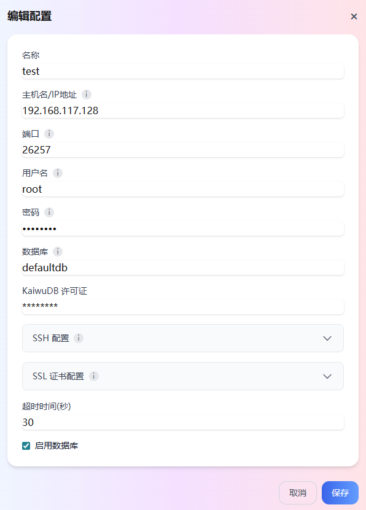

    - `名称`：数据库的配置名称，便于后续查询和管理数据库。
    - `连接模式`：数据库连接模式。支持 **STDIO** 和 **Streamable HTTP** 模式。默认为 **STDIO** 模式。
    - `数据库 URI`/`数据库 URL`：KWDB 数据库的连接地址。安装部署 KWDB 时该参数为必填参数。格式示例：`postgresql://root:@<主机IP>:26257/defaultdb?sslmode=disable`。
    - `主机`：可选参数，KWDB 数据库所在主机的 IP 地址。
    - `端口`：可选参数，KWDB 数据库所在主机的连接端口。
    - `用户名`：可选参数，KWDB 数据库所在主机的安装用户名。安装部署 KWDB 时该用户必须为 root 用户。
    - `安装用户密码`：可选参数，KWDB 数据库所在主机的安装用户密码。
    - `运行用户密码`：可选参数，KWDB 数据库所在主机的运行用户密码。
    - `KaiwuDB 许可证`：可选参数，KWDB 数据库无需配置。
    - `超时时间`：设置数据库连接的超时时间（单位：秒）。默认为 `30s`。
    - `启用数据库`：配置是否启用数据库。勾选后，系统启用该数据库。通过 KAT 部署或连接 KWDB 时，需确保该选项已启用。

3. 单击**添加**。

#### 修改数据库配置

如需修改数据库配置，遵循以下步骤。

1. 在左侧导航栏单击**设置**，然后选择**数据库**页签。
2. 单击指定数据库对应的编辑图标。
3. 在弹出的对话框中修改数据库的配置信息。有关数据库的配置信息，参见[连接数据库](#连接数据库)。
4. 单击**保存**。

#### 删除数据库配置

::: warning 说明
删除数据库后，无法恢复数据库中的数据。请谨慎操作。
:::

如需删除数据库配置，遵循以下步骤。

1. 在左侧导航栏单击**设置**，然后选择**数据库**页签。
2. 单击指定数据库对应的删除图标。

    

3. 在弹出的对话框中，单击**确定**。

### MCP Server 配置

KAT 支持添加、修改、删除、导入和导出 MCP Server 配置。

#### 添加 MCP Server

默认情况下，KAT 集成 KWDB MCP Server。如需添加其他 MCP Server，遵循以下步骤。

1. 在左侧导航栏单击**设置**，然后选择 **MCP Server** 页签。
2. 单击**添加配置**。然后在弹出的对话框中，添加 MCP Server 信息。

    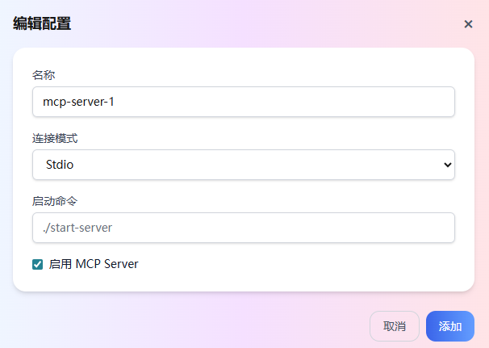

    - `名称`：MCP Server 的名称，便于后续查找、管理 MCP Server。
    - `连接模式`：MCP Server 的连接方式，支持 **StdIO** 和 **Streamable HTTP** 模式。
    - `主机`：MCP Server 的 IP 地址。该参数只适用于 **Streamable HTTP** 模式。
    - `启动命令`：配置启动 MCP Server 的命令。该参数只适用于 **StdIO** 模式
    - `启用 MCP Server`：配置是否启用 MCP Server。勾选后，系统启用该 MCP Server。

3. 单击**添加**。

#### 修改 MCP Server 配置

如需修改 MCP Server 配置，遵循以下步骤。

1. 在左侧导航栏单击**设置**，然后选择 **MCP Server** 页签。
2. 单击指定 MCP Server 对应的编辑图标。
3. 在弹出的对话框中修改 MCP Server 的配置信息。有关 MCP Server 的配置信息，参见[添加 MCP Server](#添加-mcp-server)。
4. 单击**保存**。

#### 删除 MCP Server 配置

如需删除 MCP Server 配置，遵循以下步骤。

1. 在左侧导航栏单击**设置**，然后选择 **MCP Server** 页签。
2. 单击指定 MCP Server 对应的删除图标。

    

3. 在弹出的对话框中，单击**确定**。

#### 导入 MCP Server 配置

::: warning 说明

- 导入 MCP Server 配置时，系统仅校验配置格式与字段完整性，不验证配置项的业务逻辑准确性。
- 如果待导入的 MCP Server 配置文件为空或者格式错误，则导入失败并返回报错。

:::

KAT 支持去重导入 JSON 格式的 MCP Server 配置。KAT 也支持预览待导入的数据，方便用户核对待导入的内容和格式。在预览界面，用户可以设置筛选条件，仅导入符合要求的数据。执行导入操作时，即使部分数据导入失败，系统也不回滚导入成功的数据，只一次性返回导入失败的全部数据，方便用户集中查看与处理。如需导入 MCP Server 配置，遵循以下步骤。

1. 在左侧导航栏单击**设置**，然后选择 **MCP Server** 页签。
2. 单击**导入**。
3. 在弹出的对话框中选择待导入的目标文件，然后单击**打开**。
4. 在弹出的对话框中，预览待导入的 MCP server 配置，选择待导入的目标文件，然后单击**导入**。

    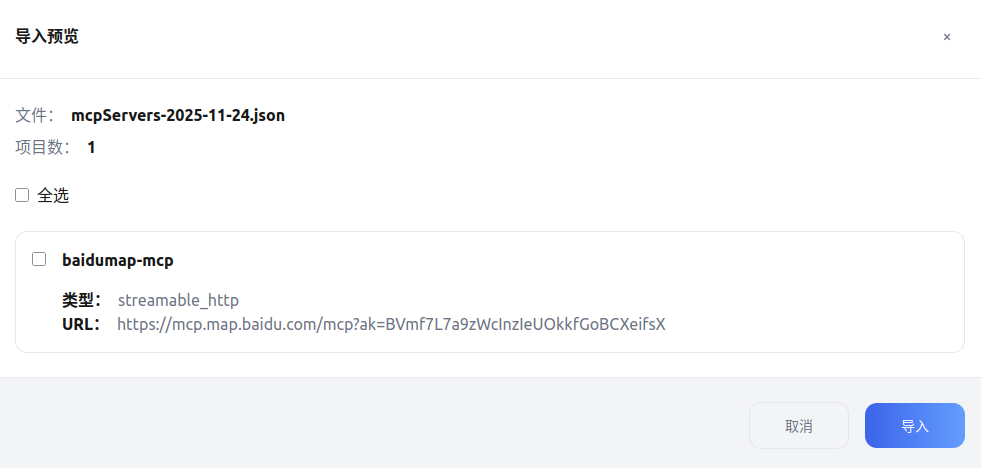

#### 导出 MCP Server 配置

KAT 支持导出单个 MCP Server 配置或批量导出多个 MCP Server 配置。如需导出 MCP Server 配置，遵循以下步骤。

1. 在左侧导航栏单击**设置**，然后选择 **MCP Server** 页签。
2. 选择待导出的 MCP Server 配置，然后单击**导出**。

### 提示词配置

提示词是一种自然语言指令，它为 LLM 提供任务指导。模型会根据提示词产生相应的输出。通过配置提示词可以引导模型理解用户的具体需求，并生成更准确和高质量的输出，确保模型的响应能够满足用户在不同场景下的应用需求。

KAT 支持添加、修改、删除、导入和导出提示词。

#### 添加提示词

如需添加自定义提示词，遵循以下步骤。

1. 在左侧导航栏单击**设置**，然后选择**提示词**页签。
2. 单击**添加配置**。然后在弹出的对话框中，自定义提示词。

    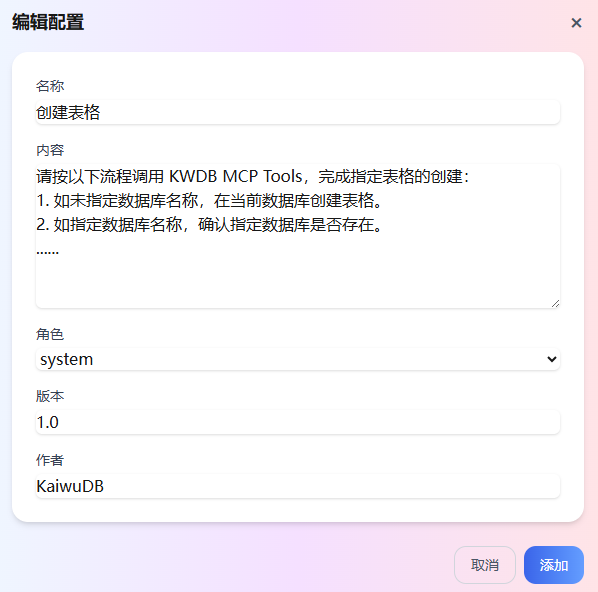

    - `名称`：提示词的名称。便于后续查询和管理提示词。
    - `内容`：提示词的具体内容。
    - `角色`：创建提示词的角色。支持 **system**、**user**、**assistant** 三个选项。默认为 **system** 选项。
    - `版本`：提示词的版本。
    - `作者`：创建提示词的作者。

3. 单击**添加**。

#### 修改提示词

如需修改提示词，遵循以下步骤。

1. 在左侧导航栏单击**设置**，然后选择**提示词**页签。
2. 单击指定提示词对应的编辑图标。
3. 在弹出的对话框中修改提示词的配置信息。有关提示词的配置信息，参见[添加提示词](#添加提示词)。
4. 单击**保存**。

#### 删除提示词

如需删除提示词，遵循以下步骤。

1. 在左侧导航栏单击**设置**，然后选择**提示词**页签。
2. 单击指定提示词对应的删除图标。

    

3. 在弹出的对话框中，单击**确定**。

#### 导入提示词

::: warning 说明

- 导入提示词时，系统仅校验配置格式与字段完整性，不验证配置项的业务逻辑准确性。
- 如果待导入的提示词文件为空或者包含系统不支持的特殊符号，则导入失败并返回报错。

:::

KAT 支持去重导入 JSON 格式的提示词。提示词配置界面只校验配置的格式。KAT 也支持预览待导入的提示词，方便用户核对待导入的内容和格式。在预览界面，用户可以设置筛选条件，仅导入符合要求的提示词。执行导入操作时，即使部分数据导入失败，系统也不回滚导入成功的数据，只一次性返回导入失败的全部数据，方便用户集中查看与处理。如需导入提示词，遵循以下步骤。

1. 在左侧导航栏单击**设置**，然后选择**提示词**页签。
2. 单击**导入**。
3. 在弹出的对话框中选择待导入的目标文件，然后单击**打开**。
4. 在弹出的对话框中，预览待导入的提示词，选择待导入的目标文件，然后单击**导入**。

    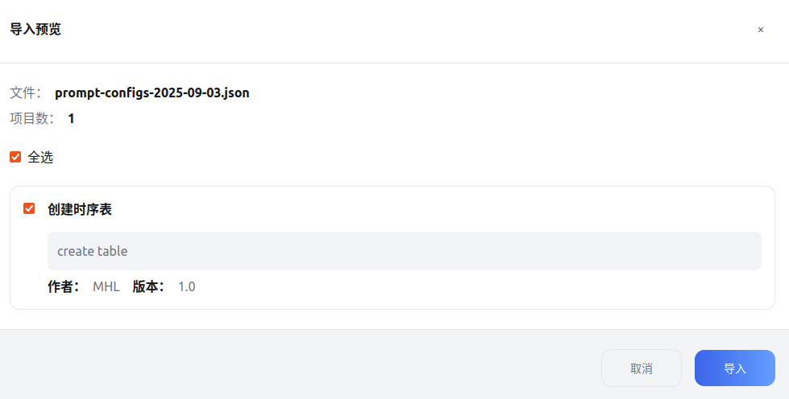

#### 导出提示词

KAT 支持导出单个提示词或批量导出多个提示词。如需导出提示词，遵循以下步骤。

1. 在左侧导航栏单击**设置**，然后选择**提示词**页签。
2. 选择待导出的提示词，然后单击**导出**。

### 通知配置

KAT 支持 Webhook 配置，包括 Webhook URL 地址、触发事件等。Webhook 配置支持飞书、指定的邮件地址。当配置的触发事件发生时，KAT 自动将对应订阅的内容发送至对应的 URL 地址，以便第三方应用可以接收数据。KAT 支持添加、修改、删除通知。

#### 添加通知

如需添加通知，遵循以下步骤。

1. 在左侧导航栏单击**设置**，然后选择**通知**页签。
2. 单击**添加配置**。然后在弹出的对话框中，自定义通知。

    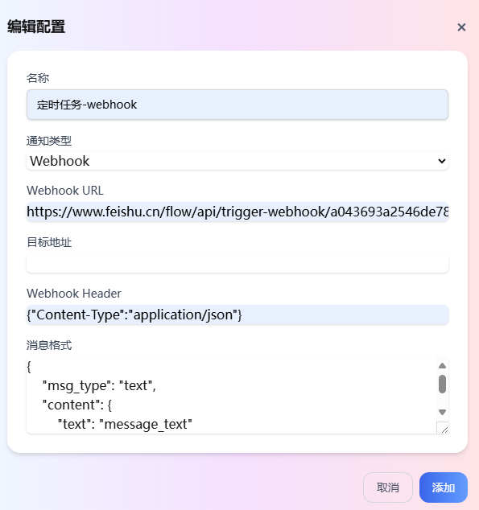

    - `名称`：通知的名称。便于后续查询和管理通知。
    - `通知类型`：通知的类型，支持 Webhook 和 Email 两种形式。
    - `Webhook URL`：通知接收方的 URL 地址。
    - `目标地址`：通知接收方的 Email 地址。
    - `Webhook Header`：Webhook 请求头部。
    - `消息格式`：通知的格式。

3. 单击**添加**。

#### 修改通知

如需修改通知，遵循以下步骤。

1. 在左侧导航栏单击**设置**，然后选择**通知**页签。
2. 单击指定通知对应的编辑图标。
3. 在弹出的对话框中修改通知的配置信息。有关通知的配置信息，参见[添加通知](#添加通知)。
4. 单击**保存**。

#### 删除通知

如需删除通知，遵循以下步骤。

1. 在左侧导航栏单击**设置**，然后选择**通知**页签。
2. 单击指定通知对应的删除图标。

    

3. 在弹出的对话框中，单击**确定**。

### 预测分析引擎配置

:::warning 说明
预测分析引擎为企业版功能，开源版暂不支持。如需试用，请联系[技术支持](https://www.kaiwudb.com/support/)。预测分析引擎相关详细信息，参见[企业版文档](https://www.kaiwudb.com/kaiwudb_docs/#/ml-services/ml-service-overview.html)。
:::

KaiwuDB 在多模数据库基础上开发了预测分析引擎，用于提供从模型导入、模型训练、模型预测、模型评估到模型更新的全生命周期管理能力。任何具备数据库应用开发背景的应用开发人员都可以轻松地导入、训练、预测、评估、更新模型。KAT 支持添加、修改和删除预测分析引擎配置。

#### 添加预测分析引擎

如需添加 KaiwuDB 预测分析引擎，遵循以下步骤。

1. 在左侧导航栏单击**设置**，然后选择**预测分析引擎**页签。
2. 单击**添加配置**。然后在弹出的对话框中，添加 KaiwuDB 预测分析引擎信息。

    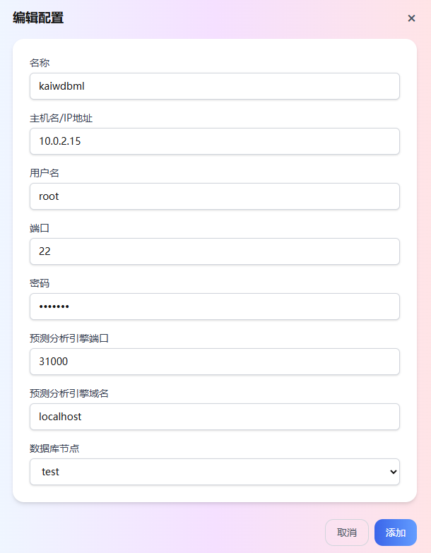

    - `名称`：KaiwuDB 预测分析引擎的名称，便于后续查找、管理 KaiwuDB 预测分析引擎。
    - `主机`：KaiwuDB 预测分析引擎所在主机的 IP 地址。
    - `用户名`：KaiwuDB 预测分析引擎所在主机的安装用户名。
    - `端口`：KaiwuDB 预测分析引擎所在主机的连接端口。
    - `密码`：KaiwuDB 预测分析引擎所在主机的安装用户密码。
    - `预测分析引擎端口`：KaiwuDB 预测分析引擎的服务端口。
    - `预测分析引擎域名`：KaiwuDB 预测分析引擎的 IP 地址。
    - `数据库节点`：KaiwuDB 数据库节点名称。

3. 单击**添加**。

#### 修改预测分析引擎配置

如需修改 KaiwuDB 预测分析引擎配置，遵循以下步骤。

1. 在左侧导航栏单击**设置**，然后选择**预测分析引擎**页签。
2. 单击KaiwuDB 预测分析引擎对应的编辑图标。
3. 在弹出的对话框中修改 KaiwuDB 预测分析引擎的配置信息。有关 KaiwuDB 预测分析引擎的配置信息，参见[添加预测分析引擎](#添加预测分析引擎)。
4. 单击**保存**。

#### 删除预测分析引擎配置

如需删除 KaiwuDB 预测分析引擎配置，遵循以下步骤。

1. 在左侧导航栏单击**设置**，然后选择**预测分析引擎**页签。
2. 单击指定 KaiwuDB 预测分析引擎对应的删除图标。

    

3. 在弹出的对话框中，单击**确定**。
