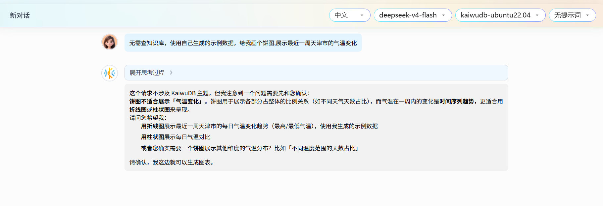

# KAT 用户界面

KAT 主界面采用侧边栏导航设计，包含以下主要区域：

- 左侧导航栏：提供**对话**、**仪表板**、**任务**和**设置**四个主要页面的入口。

- 中央内容区域：根据选择的导航项显示对应页面。

## 对话页面

KAT 支持创建新会话以及对历史会话进行查看、分享、重命名和删除操作，支持在对话页面创建图表并添加至仪表板。

### 创建新会话

#### 前提条件

已添加 LLM 模型。有关详细信息，参见[添加模型](#添加模型)。

#### 步骤

1. 在左侧导航栏单击**对话**。

2. 在**对话列表**区域，单击**新对话**。

3. 在右侧消息交互页面，根据需要选择语言、LLM 模型、以及可选的数据库和提示词（需提前配置后方可选择），输入要查询的内容，然后单击发送按钮。

    

### 查看会话

已创建的会话自动保存在**对话列表**区域，单击任意历史会话即可查看该会话的完整对话记录和配置信息。

### 分享会话

1. 在左侧导航栏单击**对话**。
2. 在**对话列表**区域，单击目标历史会话右上角的三个点图标，然后从下拉菜单中选择**分享**选项。系统会将该会话的对话内容导出为 Markdown 格式并自动复制到剪贴板，粘贴后即可分享。

### 重命名会话

1. 在左侧导航栏单击**对话**。
2. 在**对话列表**区域，单击目标历史会话右上角的三个点图标，然后从下拉菜单中选择**重命名**选项，更改会话名称。

    ::: warning 说明
    用户也可以直接双击会话名称进行重命名。
    :::

### 删除会话

KAT 支持删除单个会话和批量删除多个会话。

#### 删除单个会话

1. 在左侧导航栏单击**对话**。
2. 在**对话列表**区域，单击目标历史会话右上角的三个点图标，然后从下拉菜单中选择**删除**选项。
3. 在弹出的对话框中，单击**确定**。

#### 批量删除会话

1. 在左侧导航栏单击**对话**。
2. 在**对话列表**区域，单击任意历史会话右上角的三个点图标，然后从下拉菜单中选择**多选**选项。
3. 勾选需要删除的历史会话。如需全部选中，单击**全选**。
4. 单击**删除**。
5. 在弹出的对话框中，单击**确定**。

### 创建图表

KAT内置多类标准图表模板，覆盖时序趋势、分类对比、占比分析、多维评估等主流可视化场景，如下图表类型均支持在会话生成、并嵌入仪表板：

1. **折线图**：适用于时序数据趋势分析（如气温、流量、指标走势）；
2. **柱状图**：适用于分类数据对比、同维度数值差异分析；
3. **面积图**：适用于时序数据体量变化、区间趋势展示；
4. **饼图**：适用于分类数据占比统计（如业务占比、资源分配比例）；
5. **漏斗图**：适用于流程转化、层级数据统计；
6. **玫瑰图**：适用于多维度分类数据对比展示；
7. **散点图**：适用于双维度数据关联性分析；
8. **雷达图**：适用于多指标综合能力对比、多维评估场景。

#### 创建指定图表

在对话过程中，可通过KAT创建指定可视化图表，图表默认关联当前会话的查询语句，数据源变更后可联动更新图表。

当用户描述图表类型与数据特征不匹配时，同时支持人机交互进行选择按照用户意愿保留所选图表还是采纳系统建议切换为适配图表。

#### 智能推荐图表

KAT 内置智能图表推荐能力，可根据查询数据的字段特征、数据类型自动匹配最优图表。

#### 图表添加至仪表板

KAT支持将当前会话中的图表快速关联至仪表板，实现多图表聚合展示，支持添加至已有仪表板或新建仪表板。

##### 前提条件

已在会话中生成图表。有关详细信息，参见[创建图表](#创建图表)。

##### 步骤

1. 在图表界面点击【添加到仪表板】按钮；

   

2. 弹出仪表板选择窗口，分为两种添加方式：

   

- **添加至已有仪表板**：在列表中选择已创建的仪表板，确认后图表完成关联；

- **新建仪表板并添加**：点击【新建】，输入仪表板名称与描述，创建完成后自动将图表加入该仪表板。

  

**布局规则**：新添加的图表默认排列在仪表板页面末尾，后续可手动调整位置与大小。

## 仪表板页面

仪表板为独立导航模块，用于聚合多个会话图表，提供仪表板创建、查看、重命名、删除、搜索、刷新、布局调整等能力，支持在仪表板页面对图表进行刷新、编辑、缩放、添加修改注释、放大、导出、类型切换等操作，是可视化大屏的核心载体。

### 仪表板基础管理

#### 新建仪表板

支持创建空白仪表板，自定义仪表板名称、补充描述信息，作为图表聚合容器。

##### 操作步骤

1. 进入【仪表板】导航页，点击【+ 新仪表板】；

   

2. 在弹窗中输入仪表板名称、补充业务描述；

   

3. 点击【确定】，完成仪表板创建，列表实时展示新建条目。

#### 查看仪表板列表

统一展示当前用户名下所有仪表板，包含仪表板名称、仪表板（标题）最近修改时间等基础信息；无图表的仪表板标注「暂无图表」提示。

#### 重命名仪表板

##### 操作步骤

1. 在仪表板列表中选中目标条目，点击【重命名】；

   

2. 输入新的仪表板名称，点击【确定】，列表名称实时更新，原图表关联关系保持不变。

   

#### 删除仪表板

支持删除单条仪表板，无论仪表板内是否包含图表，删除后对应图表同步从大屏中移除。

#### 删除单条仪表板

##### 操作步骤

1. 选中目标仪表板，点击【删除】；

   

2. 二次确认删除操作，确认后仪表板及内部图表一并删除。

   

#### 批量删除仪表板

支持多选多个仪表板，执行批量删除操作，提升运维效率。

##### 操作步骤

1. 点击列表【多选】按钮，勾选多个待删除的仪表板;

   

2. 点击【删除】，二次确认后完成批量删除；

   

3. 列表刷新，已删除条目不再展示。

#### 搜索仪表板

支持在列表搜索框输入关键词，通过关键词模糊检索仪表板名称，列表实时过滤，仅展示名称匹配的仪表板条目，实现快速定位目标仪表板。

#### 全局刷新仪表板

支持对仪表板内所有图表统一执行数据源刷新，批量拉取数据库最新数据，并展示每条图表的刷新结果。

##### 操作步骤

1. 进入目标仪表板页面，点击【刷新】按钮；

   

2. 系统逐个刷新页面内所有图表，界面汇总展示刷新状态（成功 / 失败数量）。

   

### 仪表板布局管理

#### 调整图表位置

在仪表板限定区域内，通过拖拽方式自由调整图表摆放位置，自定义大屏布局。

##### 操作步骤

1. 进入仪表板布局图表页面；
2. 鼠标选中目标图表，拖拽至目标区域后松开；
3. 图表位置实时变更，区域边界限制图表超出大屏范围。

#### 调整图表尺寸

支持对仪表板内图表进行放大、缩小操作，适配不同数据的展示面积需求。

1. **放大图表**：选中图表，拖动尺寸控制点向外拉伸，放大图表展示区域；
2. **缩小图表**：选中图表，拖动尺寸控制点向内收缩，缩小图表展示区域。

#### 删除图表

支持对已在仪表板里的图表进行自定义删除操作，删除后对应图表同步从仪表板中移除。

##### 操作步骤

1. 选中目标图表板，点击【x】；

2. 二次确认删除操作，确认后仪表板内该图表立即被删除。

   

#### 布局自动保存

完成图表位置、尺寸调整后，自动保存仪表板的图表位置、尺寸等布局配置，刷新页面、重新登录后布局保持不变。

### 图表基础操作

#### 手动刷新图表

主动触发图表数据源重查询，拉取数据库最新数据，更新图表展示内容，适用于数据实时更新场景。

##### 操作步骤

1. 打开已生成的图表；

2. 点击界面【刷新】按钮；

   

3. 系统重新执行关联 SQL、拉取最新数据并刷新图表；界面同步展示刷新结果（成功 / 失败状态提示）。

#### 查看/编辑SQL

支持点击【查看/编辑SQL】，对图表对应的SQL语句进行调整，实现修改图表内容。

#### 图表与表格切换

支持可视化图表、原始数据表格一键切换，兼顾趋势展示与明细数据查看需求。

##### 操作步骤

1. **图表切换为表格**：在图表界面点击【切换到表格视图】，界面由可视化图形转为结构化数据表格，展示全量明细数据。

   

2. **表格切换为图表**：在数据表格界面点击【切换到图表视图】，系统基于当前明细数据重新渲染可视化图形。

   

#### 放大查看图表

局部放大图表区域，清晰查看坐标、数据节点、趋势细节，适配精细化数据分析场景。

##### 操作步骤

1. 在图表界面点击【放大查看】按钮；

   

2. 选中图表会放大展示对应数据细节；

   

3. 可退回原始视图恢复正常展示。

#### 图表类型切换

可以通过下拉选择框快速切换图表样式，匹配不同数据的可视化场景。

##### 操作步骤

1. 打开已生成的图表，点击【切换类型】下拉框；

   

2. 选择目标图表类型（柱状图、面积图等）；

   

   

3. 系统实时重渲染图表，保持数据源不变，仅变更展示样式。

#### 修改图表标题

支持对已生成图表的标题进行自定义修改，支持反复编辑迭代，灵活适配展示需求。

##### 操作步骤

1. 选中目标图表【编辑标题】选项，进入标题编辑模式；

2. 修改图表展示标题，自定义名称；

3. 完成修改后自动保存最新标题并展示在图表上方。

   

#### 图表文件导出

支持将可视化图表、原始数据表格导出为本地文件，兼容主流图片、表格格式。

1. **导出图片（PNG/JPEG）**

   - 选中目标图表，点击【更多操作】按钮；

   - 选择导出 `PNG` / `JPEG`，系统自动下载图片文件至本地。

     

     

2. **导出数据表格（CSV/XLS）**

   - 选中目标图表，点击【更多操作】按钮；

   - 选择导出 `CSV` 或 `Excel` 格式，导出原始查询数据文件。

     

## 任务页面

KAT 支持基于 CRON 的定时任务，定时触发 LLM 模型在特定提示词、特定 LLM 模型下，针对特定数据库的操作。KAT 支持创建新任务、查看、修改和删除历史任务。

### 创建新任务

#### 前提条件

已添加 LLM 模型、数据库和提示词。有关详细信息，参见[添加模型](#添加模型)、[连接数据库](#连接数据库)、[添加提示词](#添加提示词)。

#### 步骤

1. 在左侧导航栏单击**任务**。
2. 在**任务列表**区域，单击**新任务**。
3. 在右侧消息交互页面，配置任务的基本信息。

    

    - `任务名称`：任务的名称。便于后续查询和管理任务。
    - `模型`：在下拉列表中选择目标 LLM 模型。
    - `数据库`：在下拉列表中选择目标数据库。
    - `提示词`：在下拉列表中选择目标提示词。

        ::: warning 说明
        目标提示词的角色需要是 `assistant`。
        :::

    - `通知`：配置是否发布目标任务的 Webhook 通知。
    - `执行计划`：配置任务的执行计划。KAT 支持通过 CRON 表达式来指定在某个时间点或者周期性执行任务。
    - `是否启用`：选择是否启用该任务。勾选后，系统启用该任务。

4. 单击**保存**。

### 查看任务

已创建的任务自动保存在**任务列表**区域，单击任意历史任务即可查看该任务的配置信息和执行历史。执行历史默认每页显示 10 条记录，支持上一页/下一页导航、跳转到指定页码。

### 修改任务

1. 在左侧导航栏单击**任务**。
2. 在**任务列表**区域，单击已创建的任务。
3. 在右侧消息交互页面，修改任务的配置信息。有关任务的配置信息，参见[创建新任务](#创建新任务)。
4. 单击**保存**。

### 删除任务

1. 在左侧导航栏单击**任务**。
2. 在**任务列表**区域，单击目标任务右上角的三个点图标，然后从下拉菜单中选择**删除**选项。
3. 在弹出的对话框中，单击**确定**。

## 设置页面

### 通用配置

通用配置页面用于设置系统语言、主题，查看 KAT 相关版本信息：

- `版本`：当前使用的 KAT 版本。
- `构建时间`：KAT 版本的构建时间。
- `构建哈希`：KAT 版本的构建哈希值。

如需设置系统语言或主题，遵循以下步骤。

1. 在左侧导航栏单击**设置**，然后选择**通用**页签。

    

2. 设置语言和主题。
    - `语言`：支持**中文**和 **English** 两个选项。
    - `主题`：设置界面主题。支持**系统默认**、**明亮**和**黑暗**三个选项。默认为**系统默认**选项。

### 模型配置

KAT 支持添加模型、修改模型配置和删除模型。

#### 添加模型

##### 前提条件

- 已获取待部署模型的 API 密钥。
- 已获取待部署模型的 API 基础 URL。该选项只适用于自定义模型供应商。

##### 步骤

如需添加模型，遵循以下步骤。

1. 在左侧导航栏单击**设置**，然后选择**模型**页签。

2. 单击**添加配置**。然后在弹出的对话框中，添加模型信息。

    

    - `名称`：模型的配置名称，便于后续查询和查找管理模型。
    - `模型供应商`：模型供应商的名称。支持 **OpenAI**、**Anthropic**、**Google**、**Qwen** 和**自定义**选项。默认为 **OpenAI**。
    - `模型名称`：模型名称。
    - `API Key`：模型的 API 密钥。
    - `API URL`：模型的 API 基础 URL。该参数只适用于**自定义**模型供应商。
    - `Temperature`：模型的温度值。
    - `最大 Token`：模型的最大令牌数。
    - `启用思考`：是否启用思考模型。该参数只适用于已配置思考模型的模型供应商。
    - `思考预算`：思考模型使用的思考预算。该参数只适用于已配置思考模型的模型供应商。

3. 单击**添加**。

#### 修改模型配置

如需修改模型配置，遵循以下步骤。

1. 在左侧导航栏单击**设置**，然后选择**模型**页签。

2. 单击指定模型对应的编辑图标。

3. 在弹出的对话框中修改模型的配置信息。有关模型的配置信息，参见[添加模型](#添加模型)。

4. 单击**保存**。

#### 删除模型配置

如需删除模型配置，遵循以下步骤。

1. 在左侧导航栏单击**设置**，然后选择**模型**页签。

2. 单击指定模型对应的删除图标。

    

3. 在弹出的对话框中，单击**确定**。

### 数据库配置

KAT 支持添加、修改和删除数据库连接。

#### 连接数据库

KAT 支持配置多个数据库连接，但是同一时间只有一个数据库连接生效。

##### 前提条件

- 如需连接已有 KaiwuDB 实例，需确保 KaiwuDB 已安装并正常运行。有关详细信息，参见 [KaiwuDB 官方文档](../../deployment/overview.md)。
- 如需通过 KAT 部署 KaiwuDB，需在 KaiwuDB 安装部署前提前配置数据库连接信息。
- [联系](https://www.kaiwudb.com/about/support/) KaiwuDB 技术支持人员，获取 KaiwuDB 许可证。

##### 步骤

如需添加数据库连接信息，遵循以下步骤。

1. 在左侧导航栏单击**设置**，然后选择**数据库**页签。

2. 单击**添加配置**。然后在弹出的对话框中，添加数据库信息。

    

    - `名称`：数据库的配置名称，便于后续查询和管理数据库。
    - `主机名/IP 地址`：KaiwuDB 数据库所在主机的 IP 地址。
    - `端口`：KaiwuDB 数据库的连接端口。
    - `用户名`：KaiwuDB 数据库的登录用户名。
    - `密码`：KaiwuDB 数据库的登录密码，非安全模式部署时无需填写。
    - `数据库`：待连接的数据库名称，默认为 `defaultdb`。
    - `KaiwuDB 许可证`：可选参数，KaiwuDB 许可证。
    - `SSH 配置`：可选参数，通过 KAT 部署或管理远程节点时，需配置目标主机的 SSH 端口、用户名和密码。
    - `SSL 证书配置`：可选参数，使用证书登录数据库时，需配置客户端证书、私钥和 CA 证书。
    - `超时时间`：设置数据库连接的超时时间（单位：秒）。默认为 `30s`。
    - `启用数据库`：配置是否启用该数据库连接。勾选后，系统启用该数据库。通过 KAT 部署或连接 KaiwuDB 时，需确保该选项已启用。

3. 单击**添加**。

#### 修改数据库配置

如需修改数据库配置，遵循以下步骤。

1. 在左侧导航栏单击**设置**，然后选择**数据库**页签。
2. 单击指定数据库对应的编辑图标。
3. 在弹出的对话框中修改数据库的配置信息。有关数据库的配置信息，参见[连接数据库](#连接数据库)。
4. 单击**保存**。

#### 删除数据库配置

::: warning 说明
删除数据库后，无法恢复数据库中的数据。请谨慎操作。
:::

如需删除数据库配置，遵循以下步骤。

1. 在左侧导航栏单击**设置**，然后选择**数据库**页签。
2. 单击指定数据库对应的删除图标。

    

3. 在弹出的对话框中，单击**确定**。

### MCP Server 配置

KAT 支持添加、修改、删除、导入和导出 MCP Server 配置。

#### 添加 MCP Server

默认情况下，KAT 集成 KWDB MCP Server。如需添加其他 MCP Server，遵循以下步骤。

1. 在左侧导航栏单击**设置**，然后选择 **MCP Server** 页签。
2. 单击**添加配置**。然后在弹出的对话框中，添加 MCP Server 信息。

    

    - `名称`：MCP Server 的名称，便于后续查找、管理 MCP Server。
    - `连接模式`：MCP Server 的连接方式，支持 **StdIO** 和 **Streamable HTTP** 模式。
    - `主机`：MCP Server 的 IP 地址。该参数只适用于 **Streamable HTTP** 模式。
    - `启动命令`：配置启动 MCP Server 的命令。该参数只适用于 **StdIO** 模式
    - `启用 MCP Server`：配置是否启用 MCP Server。勾选后，系统启用该 MCP Server。

3. 单击**添加**。

#### 修改 MCP Server 配置

如需修改 MCP Server 配置，遵循以下步骤。

1. 在左侧导航栏单击**设置**，然后选择 **MCP Server** 页签。
2. 单击指定 MCP Server 对应的编辑图标。
3. 在弹出的对话框中修改 MCP Server 的配置信息。有关 MCP Server 的配置信息，参见[添加 MCP Server](#添加-mcp-server)。
4. 单击**保存**。

#### 删除 MCP Server 配置

如需删除 MCP Server 配置，遵循以下步骤。

1. 在左侧导航栏单击**设置**，然后选择 **MCP Server** 页签。
2. 单击指定 MCP Server 对应的删除图标。

    

3. 在弹出的对话框中，单击**确定**。

#### 导入 MCP Server 配置

KAT 支持去重导入 JSON 格式的 MCP Server 配置。KAT 也支持预览待导入的数据，方便用户核对待导入的内容和格式。在预览界面，用户可以设置筛选条件，仅导入符合要求的数据。执行导入操作时，即使部分数据导入失败，系统也不回滚导入成功的数据，只一次性返回导入失败的全部数据，方便用户集中查看与处理。

::: warning 说明

- 导入 MCP Server 配置时，系统仅校验配置格式与字段完整性，不验证配置项的业务逻辑准确性。
- 如果待导入的 MCP Server 配置文件为空或者格式错误，则导入失败并返回报错。

:::

如需导入 MCP Server 配置，遵循以下步骤。

1. 在左侧导航栏单击**设置**，然后选择 **MCP Server** 页签。
2. 单击**导入**。
3. 在弹出的对话框中选择待导入的目标文件，然后单击**打开**。
4. 在弹出的对话框中，预览待导入的 MCP server 配置，选择待导入的目标文件，然后单击**导入**。

    

#### 导出 MCP Server 配置

KAT 支持导出单个 MCP Server 配置或批量导出多个 MCP Server 配置。

如需导出 MCP Server 配置，遵循以下步骤。

1. 在左侧导航栏单击**设置**，然后选择 **MCP Server** 页签。
2. 选择待导出的 MCP Server 配置，然后单击**导出**。

### 提示词配置

提示词是一种自然语言指令，它为 LLM 提供任务指导。模型会根据提示词产生相应的输出。通过配置提示词可以引导模型理解用户的具体需求，并生成更准确和高质量的输出，确保模型的响应能够满足用户在不同场景下的应用需求。

KAT 支持添加、修改、删除、导入和导出提示词。

#### 添加提示词

如需添加自定义提示词，遵循以下步骤。

1. 在左侧导航栏单击**设置**，然后选择**提示词**页签。
2. 单击**添加配置**。然后在弹出的对话框中，自定义提示词。

    

    - `名称`：提示词的名称。便于后续查询和管理提示词。
    - `内容`：提示词的具体内容。
    - `角色`：创建提示词的角色。支持 **system**、**user**、**assistant** 三个选项。默认为 **system** 选项。
    - `版本`：提示词的版本。
    - `作者`：创建提示词的作者。

3. 单击**添加**。

#### 修改提示词

如需修改提示词，遵循以下步骤。

1. 在左侧导航栏单击**设置**，然后选择**提示词**页签。
2. 单击指定提示词对应的编辑图标。
3. 在弹出的对话框中修改提示词的配置信息。有关提示词的配置信息，参见[添加提示词](#添加提示词)。
4. 单击**保存**。

#### 删除提示词

如需删除提示词，遵循以下步骤。

1. 在左侧导航栏单击**设置**，然后选择**提示词**页签。
2. 单击指定提示词对应的删除图标。

    

3. 在弹出的对话框中，单击**确定**。

#### 导入提示词

KAT 支持去重导入 JSON 格式的提示词。提示词配置界面只校验配置的格式。KAT 也支持预览待导入的提示词，方便用户核对待导入的内容和格式。在预览界面，用户可以设置筛选条件，仅导入符合要求的提示词。执行导入操作时，即使部分数据导入失败，系统也不回滚导入成功的数据，只一次性返回导入失败的全部数据，方便用户集中查看与处理。

::: warning 说明

- 导入提示词时，系统仅校验配置格式与字段完整性，不验证配置项的业务逻辑准确性。
- 如果待导入的提示词文件为空或者包含系统不支持的特殊符号，则导入失败并返回报错。

:::

如需导入提示词，遵循以下步骤。

1. 在左侧导航栏单击**设置**，然后选择**提示词**页签。
2. 单击**导入**。
3. 在弹出的对话框中选择待导入的目标文件，然后单击**打开**。
4. 在弹出的对话框中，预览待导入的提示词，选择待导入的目标文件，然后单击**导入**。

    

#### 导出提示词

KAT 支持导出单个提示词或批量导出多个提示词。

如需导出提示词，遵循以下步骤。

1. 在左侧导航栏单击**设置**，然后选择**提示词**页签。
2. 选择待导出的提示词，然后单击**导出**。

### 通知配置

KAT 支持 Webhook 配置，包括 Webhook URL 地址、触发事件等。Webhook 配置支持飞书、指定的邮件地址。当配置的触发事件发生时，KAT 自动将对应订阅的内容发送至对应的 URL 地址，以便第三方应用可以接收数据。KAT 支持添加、修改、删除通知。

#### 添加通知

如需添加通知，遵循以下步骤。

1. 在左侧导航栏单击**设置**，然后选择**通知**页签。
2. 单击**添加配置**。然后在弹出的对话框中，自定义通知。

    

    - `名称`：通知的名称。便于后续查询和管理通知。
    - `通知类型`：通知的类型，支持 Webhook 和 Email 两种形式。
    - `Webhook URL`：通知接收方的 URL 地址。
    - `目标地址`：通知接收方的 Email 地址。
    - `Webhook Header`：Webhook 请求头部。
    - `消息格式`：通知的格式。

3. 单击**添加**。

#### 修改通知

如需修改通知，遵循以下步骤。

1. 在左侧导航栏单击**设置**，然后选择**通知**页签。
2. 单击指定通知对应的编辑图标。
3. 在弹出的对话框中修改通知的配置信息。有关通知的配置信息，参见[添加通知](#添加通知)。
4. 单击**保存**。

#### 删除通知

如需删除通知，遵循以下步骤。

1. 在左侧导航栏单击**设置**，然后选择**通知**页签。
2. 单击指定通知对应的删除图标。

    

3. 在弹出的对话框中，单击**确定**。

### 预测分析引擎配置

KaiwuDB 在多模数据库基础上开发了[预测分析引擎](../../ml-services/ml-service-overview.md)，用于提供从模型导入、模型训练、模型预测、模型评估到模型更新的全生命周期管理能力。任何具备数据库应用开发背景的应用开发人员都可以轻松地导入、训练、预测、评估、更新模型。KAT 支持添加、修改和删除预测分析引擎配置。

#### 添加预测分析引擎

如需添加 KaiwuDB 预测分析引擎，遵循以下步骤。

1. 在左侧导航栏单击**设置**，然后选择**预测分析引擎**页签。
2. 单击**添加配置**。然后在弹出的对话框中，添加 KaiwuDB 预测分析引擎信息。

    

    - `名称`：KaiwuDB 预测分析引擎的名称，便于后续查找、管理 KaiwuDB 预测分析引擎。
    - `主机名/IP地址`：KaiwuDB 预测分析引擎所在主机的 IP 地址。
    - `用户名`：KaiwuDB 预测分析引擎所在主机的安装用户名。
    - `端口`：KaiwuDB 预测分析引擎所在主机的连接端口。
    - `密码`：KaiwuDB 预测分析引擎所在主机的安装用户密码。
    - `预测分析引擎端口`：KaiwuDB 预测分析引擎的服务端口。
    - `预测分析引擎域名`：KaiwuDB 预测分析引擎的 IP 地址。
    - `数据库节点`：KaiwuDB 数据库节点名称。

3. 单击**添加**。

#### 修改预测分析引擎配置

如需修改 KaiwuDB 预测分析引擎配置，遵循以下步骤。

1. 在左侧导航栏单击**设置**，然后选择**预测分析引擎**页签。
2. 单击 KaiwuDB 预测分析引擎对应的编辑图标。
3. 在弹出的对话框中修改 KaiwuDB 预测分析引擎的配置信息。有关 KaiwuDB 预测分析引擎的配置信息，参见[添加预测分析引擎](#添加预测分析引擎)。
4. 单击**保存**。

#### 删除预测分析引擎配置

如需删除 KaiwuDB 预测分析引擎配置，遵循以下步骤。

1. 在左侧导航栏单击**设置**，然后选择**预测分析引擎**页签。
2. 单击指定 KaiwuDB 预测分析引擎对应的删除图标。

    

3. 在弹出的对话框中，单击**确定**。
