# KGA 用户界面

KGA 主界面采用侧边栏导航设计，包含以下主要区域：

- 左侧导航栏：提供**对话**、**任务**、**巡检报告**和**设置**四个主要页面的入口。

- 中央内容区域：根据选择的导航项显示对应页面。

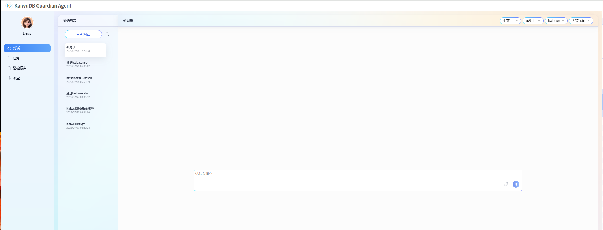

## 对话页面

KGA 支持创建新会话以及对历史会话进行查看、分享、重命名和删除操作，支持在对话页面进行数据查询并以图表展示。

### 创建新会话

#### 前提条件

已添加 LLM 模型。有关详细信息，参见[添加模型](#添加模型)。

#### 步骤

1. 在左侧导航栏单击**对话**。

2. 在**对话列表**区域，单击**新对话**。

3. 在右侧消息交互页面，根据需要选择语言、LLM 模型、以及可选的数据库和提示词（需提前配置后方可选择），输入要查询的内容，然后单击发送按钮。

    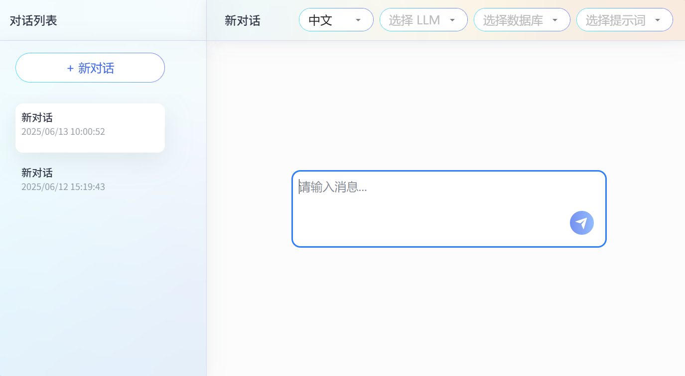

### 查看会话

已创建的会话自动保存在**对话列表**区域，单击任意历史会话即可查看该会话的完整对话记录和配置信息。

### 分享会话

1. 在左侧导航栏单击**对话**。
2. 在**对话列表**区域，单击目标历史会话右上角的三个点图标，然后从下拉菜单中选择**分享**选项。系统会将该会话的对话内容导出为 Markdown 格式并自动复制到剪贴板，粘贴后即可分享。

### 重命名会话

1. 在左侧导航栏单击**对话**。
2. 在**对话列表**区域，单击目标历史会话右上角的三个点图标，然后从下拉菜单中选择**重命名**选项，更改会话名称。

    ::: warning 说明
    用户也可以直接双击会话名称进行重命名。
    :::

### 删除会话

KGA 支持删除单个会话和批量删除多个会话。

#### 删除单个会话

1. 在左侧导航栏单击**对话**。
2. 在**对话列表**区域，单击目标历史会话右上角的三个点图标，然后从下拉菜单中选择**删除**选项。
3. 在弹出的对话框中，单击**确定**。

#### 批量删除会话

1. 在左侧导航栏单击**对话**。
2. 在**对话列表**区域，单击任意历史会话右上角的三个点图标，然后从下拉菜单中选择**多选**选项。
3. 勾选需要删除的历史会话。如需全部选中，单击**全选**。
4. 单击**删除**。
5. 在弹出的对话框中，单击**确定**。

#### 会话内指定内容分享

1. 打开目标会话。
2. 选中目标内容（指定部分内容，或者全选）。
3. 支持分享和分享为图片两种方式。
- 分享是将选中内容导出为Markdown 格式并自动复制到剪贴板。
- 分享为图片支持下载为本地图片，也可复制到剪切板。

    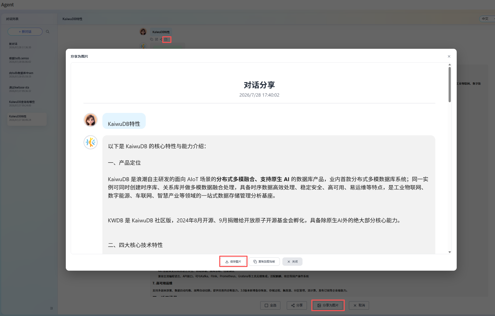

### 创建图表

KGA内置多类标准图表模板，覆盖时序趋势、分类对比、占比分析、多维评估等主流可视化场景，如下图表类型均支持在会话生成、并嵌入仪表板：

1. **折线图**：适用于时序数据趋势分析（如气温、流量、指标走势）；
2. **柱状图**：适用于分类数据对比、同维度数值差异分析；
3. **面积图**：适用于时序数据体量变化、区间趋势展示；
4. **饼图**：适用于分类数据占比统计（如业务占比、资源分配比例）；
5. **漏斗图**：适用于流程转化、层级数据统计；
6. **玫瑰图**：适用于多维度分类数据对比展示；
7. **散点图**：适用于双维度数据关联性分析；
8. **雷达图**：适用于多指标综合能力对比、多维评估场景。

#### 创建指定图表

在对话过程中，可通过KGA创建指定可视化图表，图表默认关联当前会话的查询语句。

当用户描述图表类型与数据特征不匹配时，同时支持人机交互进行选择按照用户意愿保留所选图表还是采纳系统建议切换为适配图表。

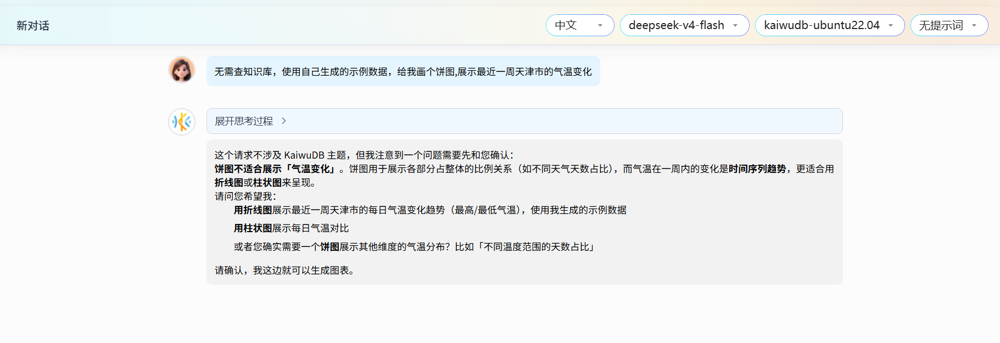

#### 智能推荐图表

KGA 内置智能图表推荐能力，可根据查询数据的字段特征、数据类型自动匹配最优图表。

## 任务页面

KGA 支持基于 CRON 的定时任务，定时触发 LLM 模型在特定提示词、特定 LLM 模型下，针对特定数据库的操作。KGA 支持创建新任务、查看、修改和删除历史任务。

### 创建新任务

#### 前提条件

已添加 LLM 模型、数据库和提示词。有关详细信息，参见[添加模型](#添加模型)、[连接数据库](#连接数据库)、[添加提示词](#添加提示词)。

#### 步骤

1. 在左侧导航栏单击**任务**。
2. 在**任务列表**区域，单击**新任务**。
3. 在右侧消息交互页面，配置任务的基本信息。

    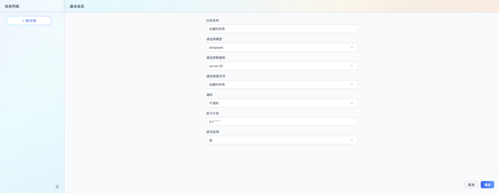

    - `任务名称`：任务的名称。便于后续查询和管理任务。
    - `模型`：在下拉列表中选择目标 LLM 模型。
    - `数据库`：在下拉列表中选择目标数据库。
    - `提示词`：在下拉列表中选择目标提示词。
    - `通知`：配置是否发布目标任务的 Webhook 通知。
    - `执行计划`：配置任务的执行计划。KGA 支持通过 CRON 表达式来指定在某个时间点或者周期性执行任务。
    - `是否启用`：选择是否启用该任务。勾选后，系统启用该任务。

4. 单击**保存**。

### 查看任务

已创建的任务自动保存在**任务列表**区域，单击任意历史任务即可查看该任务的配置信息和执行历史。执行历史默认每页显示 10 条记录，支持上一页/下一页导航、跳转到指定页码。

### 修改任务

1. 在左侧导航栏单击**任务**。
2. 在**任务列表**区域，单击已创建的任务。
3. 在右侧消息交互页面，修改任务的配置信息。有关任务的配置信息，参见[创建新任务](#创建新任务)。
4. 单击**保存**。

### 删除任务

1. 在左侧导航栏单击**任务**。
2. 在**任务列表**区域，单击目标任务右上角的三个点图标，然后从下拉菜单中选择**删除**选项。
3. 在弹出的对话框中，单击**确定**。

## 巡检报告

巡检报告页面用于查看历史任务生成的报告，按着数据库配置、年月、报告三个层级展示。

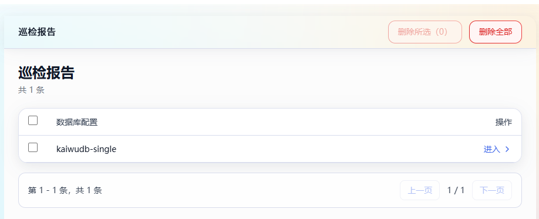
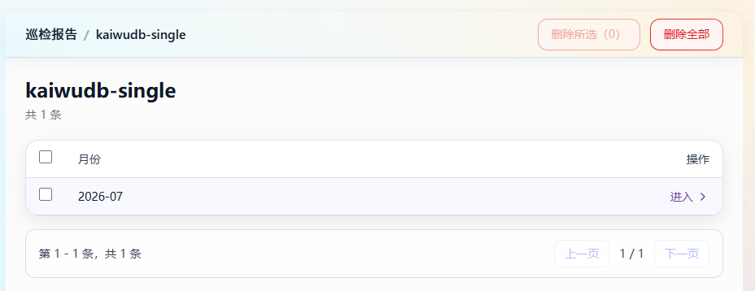
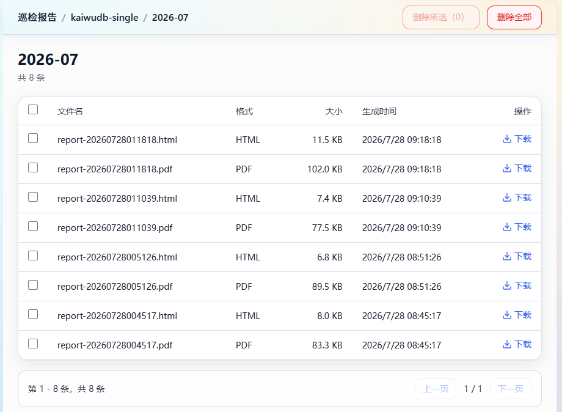

### 下载报告

KGA UI页面支持Html、PDF两种格式的下载。

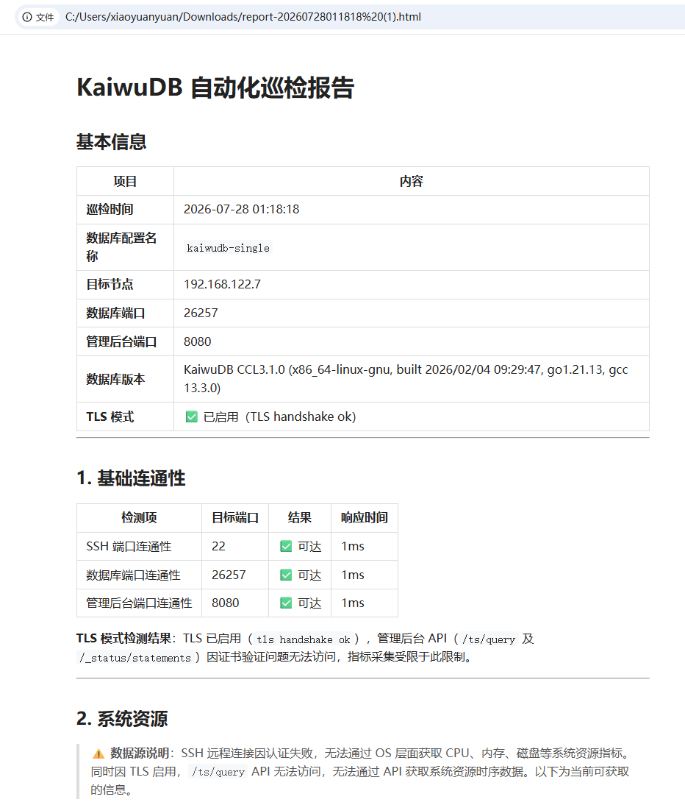
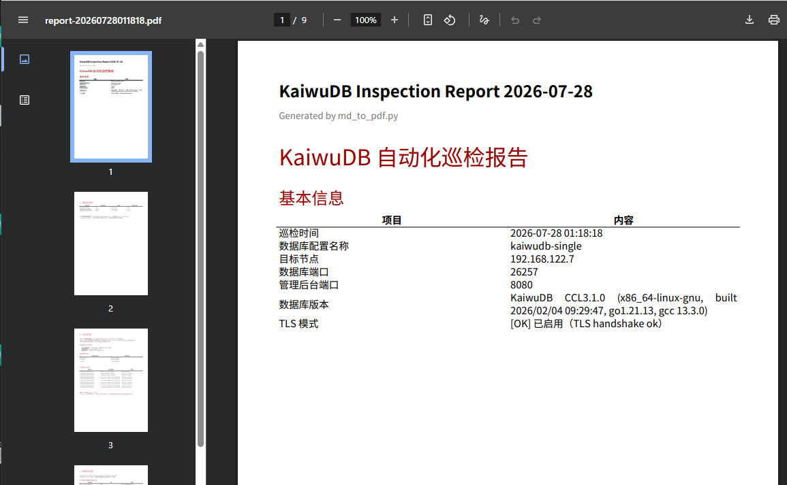

### 删除报告

KGA提供单个、多个、年月、数据库配置、全部等多层级的删除功能。

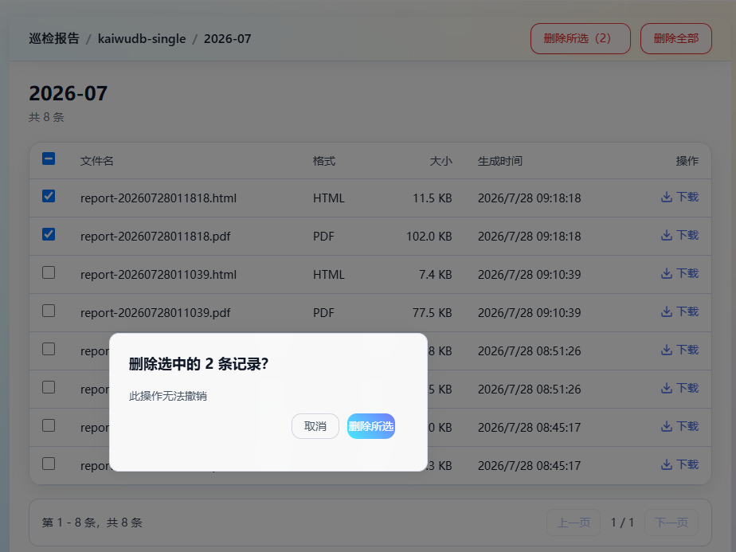
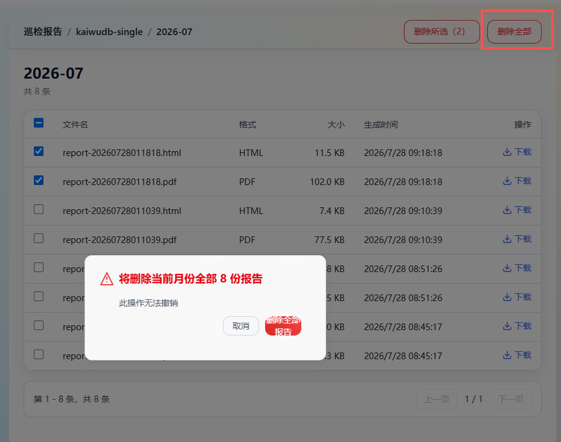

## 设置页面

### 通用配置

通用配置页面用于设置系统语言、主题，查看 KGA 相关版本信息：

- `版本`：当前使用的 KGA 版本。
- `构建时间`：KGA 版本的构建时间。
- `构建哈希`：KGA 版本的构建哈希值。

如需设置系统语言或主题，遵循以下步骤。

1. 在左侧导航栏单击**设置**，然后选择**通用**页签。

    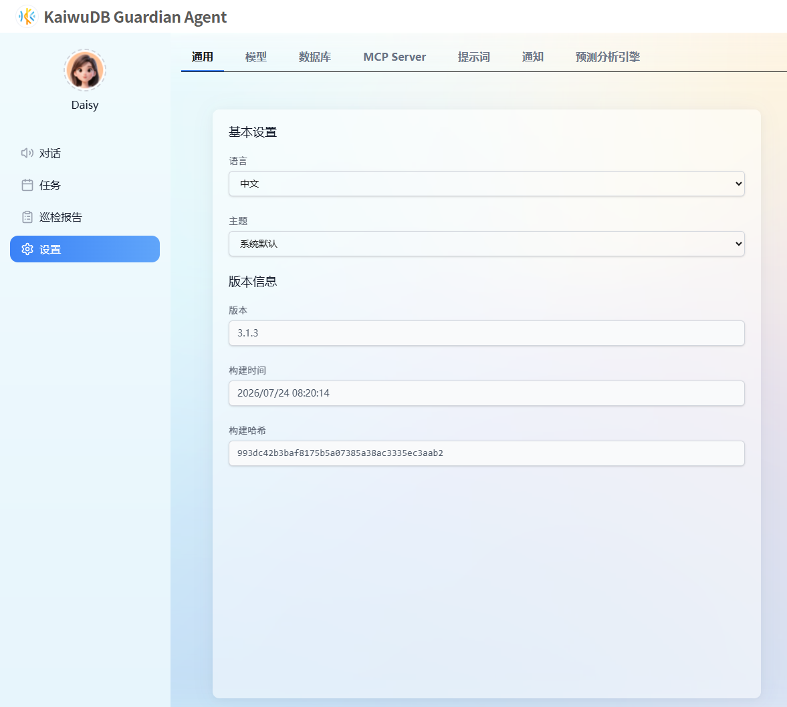

2. 设置语言和主题。
    - `语言`：支持**中文**和 **English** 两个选项。
    - `主题`：设置界面主题。支持**系统默认**、**明亮**和**黑暗**三个选项。默认为**系统默认**选项。

### 模型配置

KGA 支持添加、修改和删除模型配置；支持模型的启用和禁用，在会话界面，仅展示开启的模型名称列表。

#### 添加模型

##### 前提条件

- 已获取待配置模型的 API 名称、密钥、URL。

##### 步骤

如需添加模型，遵循以下步骤。

1. 在左侧导航栏单击**设置**，然后选择**模型**页签。

2. 单击**添加配置**。然后在弹出的对话框中，添加模型信息。

    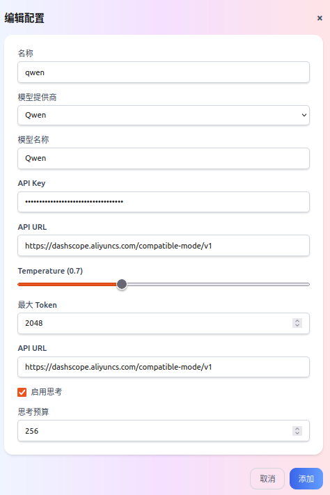

    - `名称`：模型的配置名称，便于后续查询和查找管理模型。
    - `模型供应商`：模型供应商的名称。支持 **Qwen**、**DeepSeek**、**字节豆包**、**Kimi**、**MiniMax**、**智谱 GLM** 和**自定义**选项。默认为 **自定义**。
    - `模型名称`：模型名称。
    - `API Key`：模型的 API 密钥。
    - `API URL`：模型的 API 基础 URL。
    - `Temperature`：模型的温度值。
    - `最大 Token`：模型的最大令牌数。
    - `思考模式`：`思考预算`、`推理强度`、`保留思考`根据所选`模型供应商`而定，不是全部`模型供应商`都支持。
      - `思考模式`：是否启用思考模型。该参数只适用于已配置思考模型的模型供应商。
      - `思考预算`：思考模型使用的思考预算。
      - `推理强度`：思考模型的推理强度。该参数的可选项因模型不同而不同。
      - `保留思考`：思考是否保留。提供`全部保留`、`不保留`两个选项。

3. 单击**添加**。

#### 修改模型配置

如需修改模型配置，遵循以下步骤。

1. 在左侧导航栏单击**设置**，然后选择**模型**页签。

2. 单击指定模型对应的编辑图标。

3. 在弹出的对话框中修改模型的配置信息。有关模型的配置信息，参见[添加模型](#添加模型)。

4. 单击**保存**。

#### 删除模型配置

如需删除模型配置，遵循以下步骤。

1. 在左侧导航栏单击**设置**，然后选择**模型**页签。

2. 单击指定模型对应的删除图标。

    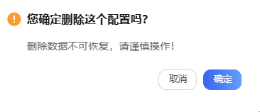

3. 在弹出的对话框中，单击**确定**。

### 数据库配置

KGA 支持添加、修改和删除数据库连接；支持数据库配置的启用和禁用，在会话界面，仅展示开启的模数据配置名称列表。

#### 连接数据库

KGA 支持配置多个数据库连接，但是同一时间只有一个数据库连接生效。

##### 前提条件

- 如需连接已有 KWDB 实例，需确保 KWDB 已安装并正常运行。有关详细信息，参见 [KWDB 官方文档](../../deployment/overview.md)。
- 如需通过 KGA 部署 KWDB，需在 KWDB 安装部署前提前配置数据库连接信息和服务器连接信息。

##### 步骤

如需添加数据库连接信息，遵循以下步骤。

1. 在左侧导航栏单击**设置**，然后选择**数据库**页签。

2. 单击**添加配置**。然后在弹出的对话框中，添加数据库信息。

    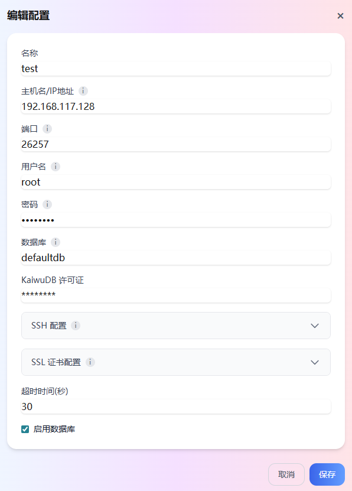

    - `名称`：数据库的连接名称，便于后续查询和管理数据库。
    - `主机名/IP 地址`：KWDB 数据库所在主机的 IP 地址。
    - `端口`：KWDB 数据库的连接端口。
    - `用户名`：KWDB 数据库的登录用户名。
    - `密码`：KWDB 数据库的登录密码，非安全模式部署时无需填写。
    - `数据库`：待连接的数据库名称，默认为 `defaultdb`。
    - `KaiwuDB 许可证`：可选参数。KWDB无需填写。
    - `SSH 配置`：可选参数，通过 KGA 部署或管理远程节点时，需配置目标主机的 SSH 端口、用户名和密码。
    - `SSL 证书配置`：可选参数，使用证书登录数据库时，需配置客户端证书、私钥和 CA 证书。
    - `超时时间`：设置数据库连接的超时时间（单位：秒）。默认为 `30s`。
    - `启用数据库`：是否启用该数据库连接。勾选后，系统启用该数据库。通过 KGA 部署或连接 KWDB 时，需确保该选项已启用。

3. 单击**添加**。

#### 修改数据库配置

如需修改数据库配置，遵循以下步骤。

1. 在左侧导航栏单击**设置**，然后选择**数据库**页签。
2. 单击指定数据库对应的编辑图标。
3. 在弹出的对话框中修改数据库的配置信息。有关数据库的配置信息，参见[连接数据库](#连接数据库)。
4. 单击**保存**。

#### 删除数据库配置

::: warning 说明
删除数据库配置后，无法撤销该操作，请谨慎操作。
:::

如需删除数据库配置，遵循以下步骤。

1. 在左侧导航栏单击**设置**，然后选择**数据库**页签。
2. 单击指定数据库对应的删除图标。

    

3. 在弹出的对话框中，单击**确定**。

### MCP Server 配置

KGA 支持添加、修改、删除、导入和导出 MCP Server 配置。

#### 添加 MCP Server

默认情况下，KGA 集成 KWDB MCP Server。如需添加其他 MCP Server，遵循以下步骤。

1. 在左侧导航栏单击**设置**，然后选择 **MCP Server** 页签。
2. 单击**添加配置**。然后在弹出的对话框中，添加 MCP Server 信息。

    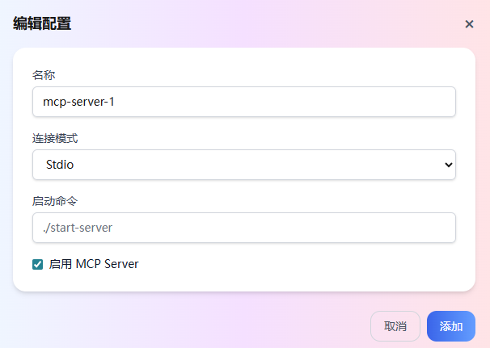

    - `名称`：MCP Server 的名称，便于后续查找、管理 MCP Server。
    - `连接模式`：MCP Server 的连接方式，支持 **StdIO** 和 **Streamable HTTP** 模式。
    - `主机`：MCP Server 的 IP 地址。该参数只适用于 **Streamable HTTP** 模式。
    - `启动命令`：配置启动 MCP Server 的命令。该参数只适用于 **StdIO** 模式
    - `启用 MCP Server`：配置是否启用 MCP Server。勾选后，系统启用该 MCP Server。

3. 单击**添加**。

#### 修改 MCP Server 配置

如需修改 MCP Server 配置，遵循以下步骤。

1. 在左侧导航栏单击**设置**，然后选择 **MCP Server** 页签。
2. 单击指定 MCP Server 对应的编辑图标。
3. 在弹出的对话框中修改 MCP Server 的配置信息。有关 MCP Server 的配置信息，参见[添加 MCP Server](#添加-mcp-server)。
4. 单击**保存**。

#### 删除 MCP Server 配置

如需删除 MCP Server 配置，遵循以下步骤。

1. 在左侧导航栏单击**设置**，然后选择 **MCP Server** 页签。
2. 单击指定 MCP Server 对应的删除图标。

    

3. 在弹出的对话框中，单击**确定**。

### 提示词配置

提示词是一种自然语言指令，它为 LLM 提供任务指导。模型会根据提示词产生相应的输出。通过配置提示词可以引导模型理解用户的具体需求，并生成更准确和高质量的输出，确保模型的响应能够满足用户在不同场景下的应用需求。

KGA 支持添加、修改、删除、导入和导出提示词。

#### 添加提示词

如需添加自定义提示词，遵循以下步骤。

1. 在左侧导航栏单击**设置**，然后选择**提示词**页签。
2. 单击**添加配置**。然后在弹出的对话框中，自定义提示词。

    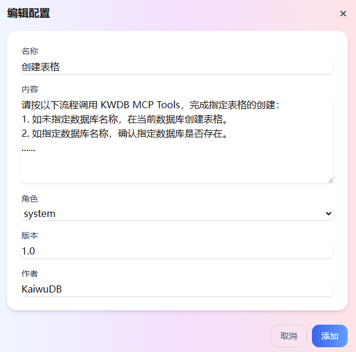

    - `名称`：提示词的名称。便于后续查询和管理提示词。
    - `内容`：提示词的具体内容。
    - `角色`：创建提示词的角色。支持 **system**、**user**、**assistant** 三个选项。默认为 **system** 选项。
    - `版本`：提示词的版本。
    - `作者`：创建提示词的作者。

3. 单击**添加**。

#### 修改提示词

如需修改提示词，遵循以下步骤。

1. 在左侧导航栏单击**设置**，然后选择**提示词**页签。
2. 单击指定提示词对应的编辑图标。
3. 在弹出的对话框中修改提示词的配置信息。有关提示词的配置信息，参见[添加提示词](#添加提示词)。
4. 单击**保存**。

#### 删除提示词

如需删除提示词，遵循以下步骤。

1. 在左侧导航栏单击**设置**，然后选择**提示词**页签。
2. 单击指定提示词对应的删除图标。

    

3. 在弹出的对话框中，单击**确定**。

### 导入导出管理

KGA支持提示词、MCP Server配置信息的批量处理，导入导出功能按钮在提示词、MCP Server配置页面。

#### 导入配置

- 支持去重导入 JSON 格式的提示词或MCP Server配置信息。
- 支持预览待导入的配置信息，方便用户核对待导入的内容和格式。
- 支持设置筛选条件，仅导入符合要求的提示词。
- 执行导入操作时，即使部分数据导入失败，系统也不回滚导入成功的数据，只一次性返回导入失败的全部数据，方便用户集中查看与处理。

::: warning 说明

- 导入 MCP Server 配置时，系统仅校验配置格式与字段完整性，不验证配置项的业务逻辑准确性。
- 如果待导入的 MCP Server 配置文件为空或者格式错误，则导入失败并返回报错。

:::

如需导入 MCP Server 或 提示词 配置信息，遵循以下步骤。

1. 在左侧导航栏单击**设置**，然后选择 **MCP Server** 或 **提示词r** 页签。
2. 单击**导入**。
3. 在弹出的对话框中选择待导入的目标文件，然后单击**打开**。
4. 在弹出的对话框中，预览待导入的配置信息，选择待导入的目标文件，然后单击**导入**。
   
    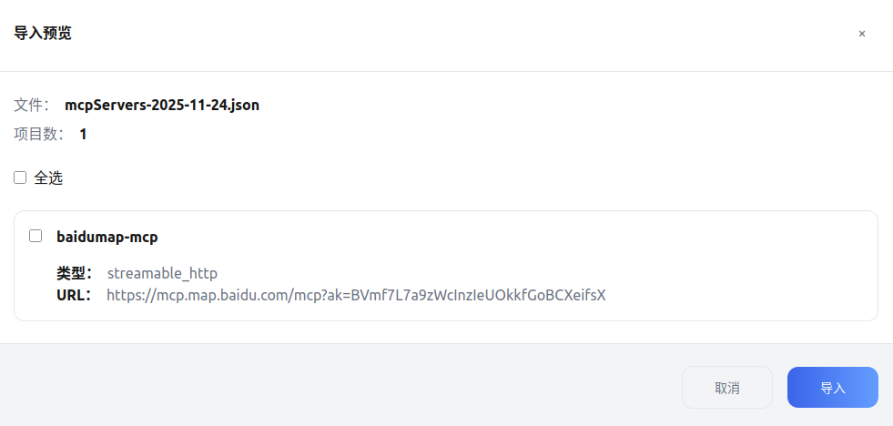

#### 导出配置

KGA 支持指定导出配置，仅将需要导出的配置信息进行导出。

如需导出配置信息，遵循以下步骤。

1. 在左侧导航栏单击**设置**，然后选择 **MCP Server** 或 **提示词r** 页签。
2. 选择待导出的配置项，然后单击**导出**。

### 通知配置

KGA 支持 Webhook 配置，包括 Webhook URL 地址、触发事件等。当配置的触发事件发生时，KGA 自动将对应订阅的内容发送至对应的 URL 地址，以便第三方应用可以接收数据。KGA 支持添加、修改、删除通知。

#### 添加通知

如需添加通知，遵循以下步骤。

1. 在左侧导航栏单击**设置**，然后选择**通知**页签。
2. 单击**添加配置**。然后在弹出的对话框中，自定义通知。

    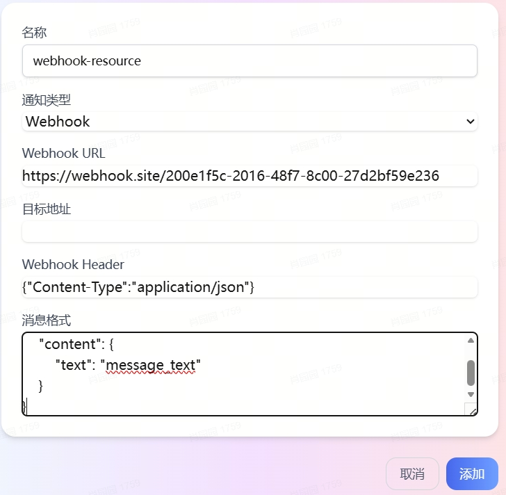

    - `名称`：通知的名称。便于后续查询和管理通知。
    - `通知类型`：通知的类型，支持 Webhook 和 Email 两种形式。
    - `Webhook URL`：通知接收方的 URL 地址。
    - `目标地址`：通知接收方的 第三方 URL 地址。
    - `Webhook Header`：Webhook 请求头部。
    - `消息格式`：通知的格式。

3. 单击**添加**。

#### 修改通知

如需修改通知，遵循以下步骤。

1. 在左侧导航栏单击**设置**，然后选择**通知**页签。
2. 单击指定通知对应的编辑图标。
3. 在弹出的对话框中修改通知的配置信息。有关通知的配置信息，参见[添加通知](#添加通知)。
4. 单击**保存**。

#### 删除通知

如需删除通知，遵循以下步骤。

1. 在左侧导航栏单击**设置**，然后选择**通知**页签。
2. 单击指定通知对应的删除图标。

    

3. 在弹出的对话框中，单击**确定**。

### 预测分析引擎配置

:::warning 说明
预测分析引擎为企业版功能，开源版暂不支持。如需试用，请联系[技术支持](https://www.kaiwudb.com/about/support)。预测分析引擎相关详细信息，参见[企业版文档](https://www.kaiwudb.com/kaiwudb_docs/#/ml-services/ml-service-overview.html)。
:::

KaiwuDB 在多模数据库基础上开发了[预测分析引擎](../../ml-services/ml-service-overview.md)，用于提供从模型导入、模型训练、模型预测、模型评估到模型更新的全生命周期管理能力。任何具备数据库应用开发背景的应用开发人员都可以轻松地导入、训练、预测、评估、更新模型。KGA 支持添加、修改和删除预测分析引擎配置。

#### 添加预测分析引擎

如需添加 KaiwuDB 预测分析引擎，遵循以下步骤。

1. 在左侧导航栏单击**设置**，然后选择**预测分析引擎**页签。
2. 单击**添加配置**。然后在弹出的对话框中，添加 KaiwuDB 预测分析引擎信息。

    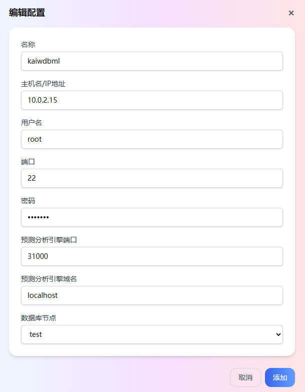

    - `名称`：KaiwuDB 预测分析引擎的名称，便于后续查找、管理 KaiwuDB 预测分析引擎。
    - `主机名/IP地址`：KaiwuDB 预测分析引擎所在主机的 IP 地址。
    - `用户名`：KaiwuDB 预测分析引擎所在主机的安装用户名。
    - `端口`：KaiwuDB 预测分析引擎所在主机的连接端口。
    - `密码`：KaiwuDB 预测分析引擎所在主机的安装用户密码。
    - `预测分析引擎端口`：KaiwuDB 预测分析引擎的服务端口。
    - `预测分析引擎域名`：KaiwuDB 预测分析引擎的 IP 地址。
    - `数据库节点`：KaiwuDB 数据库节点名称。

3. 单击**添加**。

#### 修改预测分析引擎配置

如需修改 KaiwuDB 预测分析引擎配置，遵循以下步骤。

1. 在左侧导航栏单击**设置**，然后选择**预测分析引擎**页签。
2. 单击 KaiwuDB 预测分析引擎对应的编辑图标。
3. 在弹出的对话框中修改 KaiwuDB 预测分析引擎的配置信息。有关 KaiwuDB 预测分析引擎的配置信息，参见[添加预测分析引擎](#添加预测分析引擎)。
4. 单击**保存**。

#### 删除预测分析引擎配置

如需删除 KaiwuDB 预测分析引擎配置，遵循以下步骤。

1. 在左侧导航栏单击**设置**，然后选择**预测分析引擎**页签。
2. 单击指定 KaiwuDB 预测分析引擎对应的删除图标。

    

3. 在弹出的对话框中，单击**确定**。
