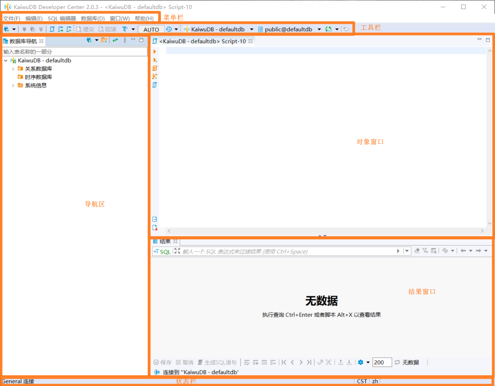
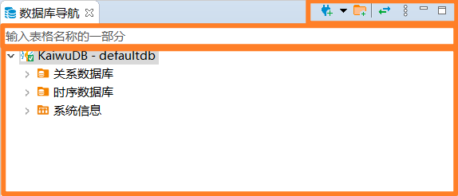
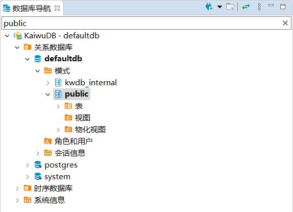
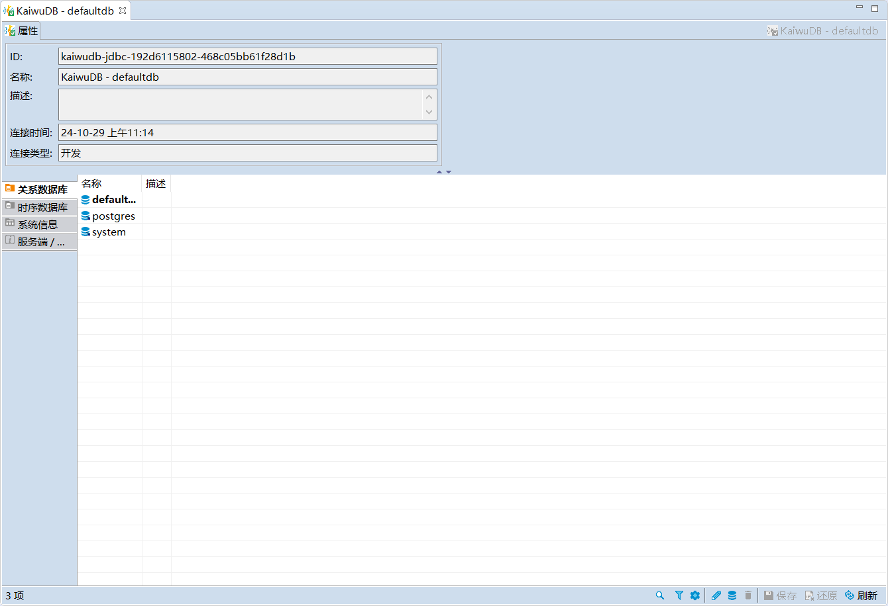
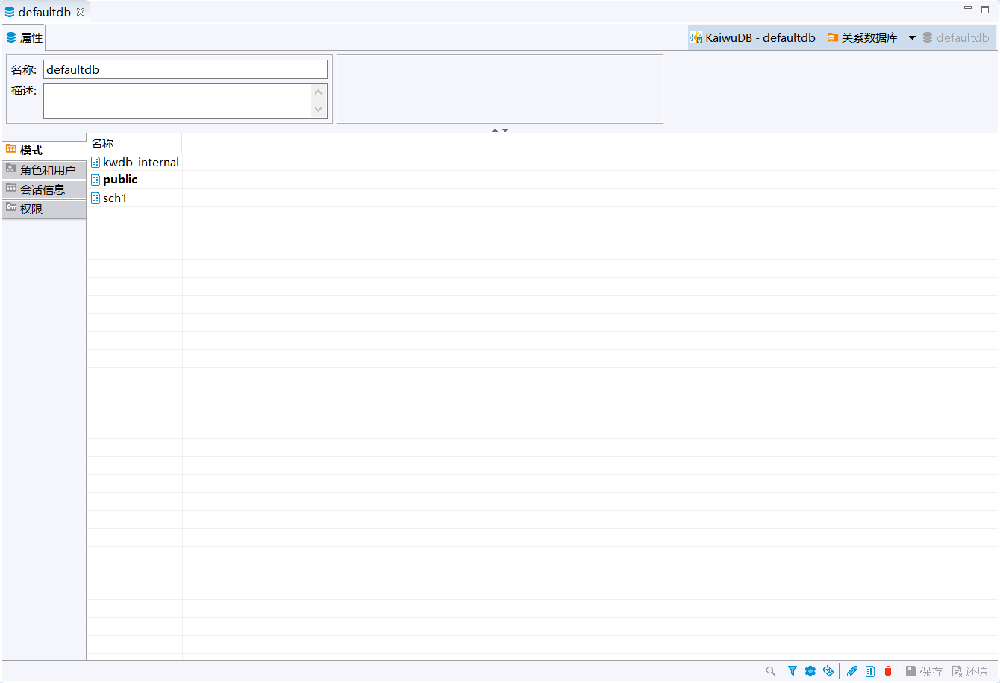
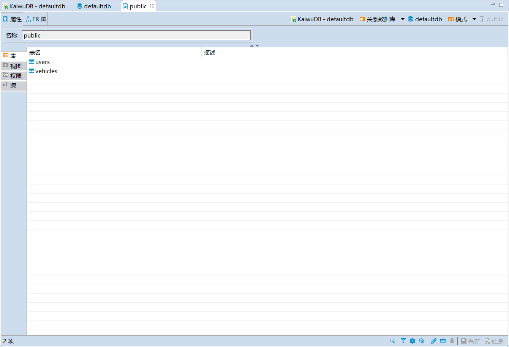
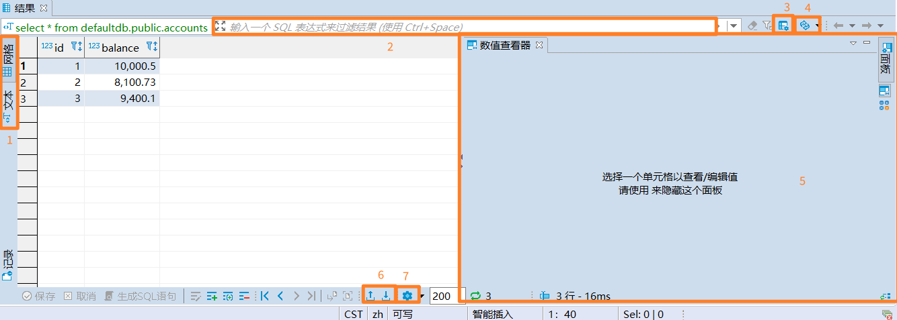

# 用户界面

KaiwuDB 开发者中心窗口包含菜单栏、工具栏、导航区、对象窗口、结果窗口以及状态栏。

## 菜单栏

默认情况下，菜单栏包含以下菜单：

- 文件菜单：包含最近使用的编辑器、保存、另存为、关闭、打印、刷新、退出菜单项。
- 编辑菜单：包含针对活动元素的剪切、复制、粘贴和删除等全局命令。
- SQL 编辑器菜单：用于打开 SQL 编辑器、执行 SQL 语句、导入 SQL 脚本、管理 SQL 编辑器外观等 SQL 相关命令。
- 数据库菜单：管理数据库驱动程序、连接和事务，以及重新连接和断开数据库。
- 窗口菜单：包括显示或隐藏数据库导航、重置透视图选项。
- 帮助菜单：检查版本号、显示每日一贴。

## 工具栏

工具栏包含最基本和经常使用的命令按钮。

高亮按钮表示当前已开启的功能，灰色按钮表示当前禁用的功能。是否开启功能取决于工作区中活动的编辑器。活动视图或编辑器只能使用已开启的功能。

工具栏从左往右包括以下常见按钮：

- 新建连接
- 连接、重新连接、断开连接
- SQL 编辑器、近期 SQL 编辑器、新建 SQL 编辑器
- 提交、回滚
- 切换到手动提交/切换到自动提交。切换到手动提交时，窗口中的值变为 `None`。切换到自动提交时，窗口中的值变为 `AUTO`
- 事务日志：包括事务日志、待处理事务和查询管理器
- 选择数据源：从已有的数据库连接中进行选择
- 选择目录/模式：支持选择 `public`、`internal` 和自定义模式
- 从导航设置连接：包括设置自动同步连接与导航、定位当前 SQL 编辑器在数据库或者目录/模式中的位置
- 返回上一编辑位置

## 导航区

左侧导航区显示已连接的数据库，从上到下分别为导航工具栏、索引栏和导航菜单。

- 导航工具栏：从左到右依次是新建连接、新建文件、连接编辑器。

    

- 索引栏：支持根据关键字检索导航菜单。例如，在导航栏中输入 `public` 后，菜单栏只显示与关键字有关的内容。

    

- 导航菜单：支持用户通过右键菜单对数据库及数据库对象进行操作，不同层级支持的操作不同。

    

    | 对象             | 操作                                                                                      |
    | ---------------- | ----------------------------------------------------------------------------------------- |
    | KaiwuDB          | SQL 编辑器、近期 SQL 编辑器、创建、编辑连接、断开连接、删除、重命名、刷新等功能。         |
    | 关系数据库       | 新建、查看、刷新关系数据库。                                                                  |
    | 时序数据库       | 新建、查看、刷新时序数据库。                                                                  |
    | 自定义数据库     | 新建、编辑、删除、重命名、刷新自定义数据库、创建模式和用户。                                    |
    | 模式             | 新建、查看、刷新模式。                                                                    |
    | 自定义模式       | 新建、编辑、删除、刷新自定义模式、显示 ER 图、生成 SQL 语句。                                        |
    | 表               | 新建、查看、刷新表。                                                                      |
    | 自定义表         | 新建、编辑、编辑数据、在 SQL 控制台中读数据、导出数据、导入数据、生成 SQL 语句、工具、删除等。 |
    | 角色和用户       | 新建、查看、刷新角色和用户。                                                              |
    | 自定义角色和用户 | 编辑、删除、刷新自定义角色或用户。                                                              |
    | 会话信息         | 查看、刷新会话信息。                                                                      |
    | 系统信息         | 查看、刷新系统信息。                                                                      |

    ::: warning 说明
    目前，时序数据库只支持查看模式。
    :::

## 对象窗口

对象窗口用于显示所查看对象的具体信息。

双击导航菜单中的数据库对象，即可在对象窗口查看具体信息并进行相关操作。

- KaiwuDB 数据库窗口

  

- 自定义数据库和模式窗口

  

- 自定义模式和 `public` 模式窗口

  

## 结果面板

结果面板用于展示 SQL 语句的执行结果。

1. 以网格或文本形式显示结果
2. 输入进一步筛选的条件
3. 自定义过滤条件
4. 刷新结果集
5. 数值查看器
6. 导出和导入结果集
7. 配置结果集

## 状态栏

状态栏显示当前时区、语言、读写状态、数据插入模式、当前行数等信息。

