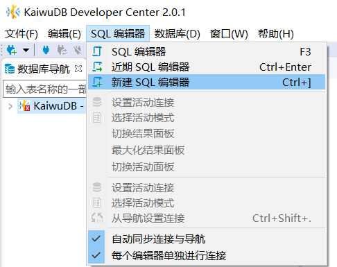

# SQL 编辑器

KaiwuDB 开发者中心支持使用 SQL 编辑器进行以下操作：

- 输入、执行 SQL 语句
- 导入、执行、保存 SQL 脚本
- 修改 SQL 语句格式、复制源代码
- 设置活动连接、活动模式

## 输入和执行 SQL 语句

如需输入和执行 SQL 语句，遵循以下步骤。

1. 单击菜单栏中的 SQL 编辑器，然后选择**新建 SQL 编辑器**。

    

2. 在 SQL 编辑器中输入 SQL 语句，单击左侧的**执行 SQL 语句**按钮或**在新标签页中执行 SQL 语句**按钮。

    

3. 解析执行计划、设置活动连接、选择活动模式。

    - 执行操作

        

    - 解析执行计划结果

        

    - 设置活动连接

        

    - 选择活动模式

        

## 保存 SQL 脚本

如需保存 SQL 脚本，遵循以下步骤。

1. 在 SQL 编辑器页面，右键单击页面空白处，然后从右键菜单中选择**文件** > **保存 SQL 脚本**。

    

2. 选择文档保存位置，然后单击**保存**。

    

## 修改 SQL 语句格式

在 SQL 编辑器页面，右键单击页面空白处，然后从右键菜单中选择**格式**，即可对选中的 SQL 语句进行相关操作。

## 将 SQL 语句复制为源代码

如需将 SQL 语句复制为源代码，遵循以下步骤。

1. 在 SQL 编辑器页面，右键单击页面空白处，然后从右键菜单中选择**将 SQL 复制为源代码**。
2. 在**选择格式**窗口，选择格式和相关设置，然后单击**复制**。

    

## 导入和执行 SQL 脚本

如需导入和执行 SQL 脚本，遵循以下步骤。

1. 单击菜单栏中的 **SQL 编辑器**，然后选择**导入 SQL 脚本**。

    

2. 选择需要导入的脚本，然后单击**打开**。

    

3. 单击左侧的**执行 SQL 脚本**按钮或**在单独的标签页中执行 SQL 脚本**按钮。

    