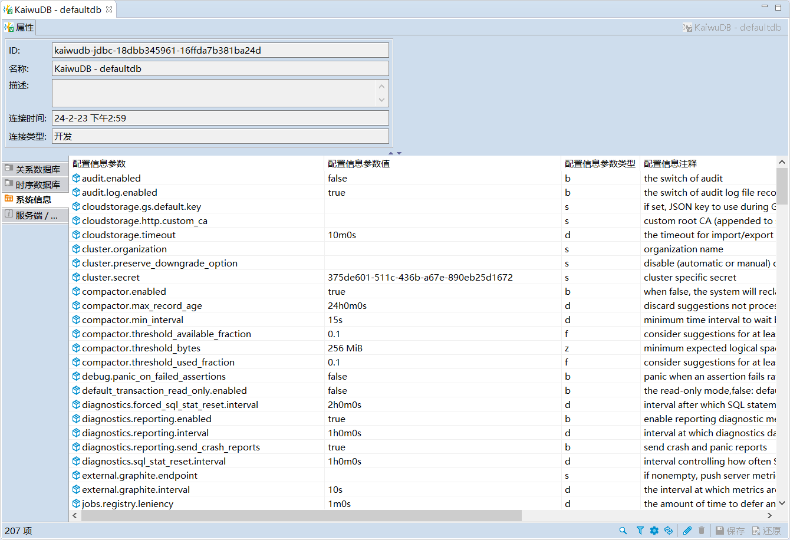

# 系统信息

KaiwuDB 开发者中心支持查看和修改系统配置。

::: warning 说明
修改系统配置会影响 KWDB 内部运行机制。在修改系统配置前，强烈建议明确修改和使用 KWDB 的目的，否则可能会带来一定风险。
:::

## 前提条件

用户拥有 Admin 权限。

## 步骤

如需修改系统配置，遵循以下步骤。

1. 双击**系统信息**，查看 KWDB 所有的配置参数、参数值和参数类型。

    

2. 单击需要修改的配置参数。
3. 完成修改后，单击页面右下方的保存按钮。
4. 在**执行修改**窗口，确认 SQL 语句无误，然后单击**执行**。
