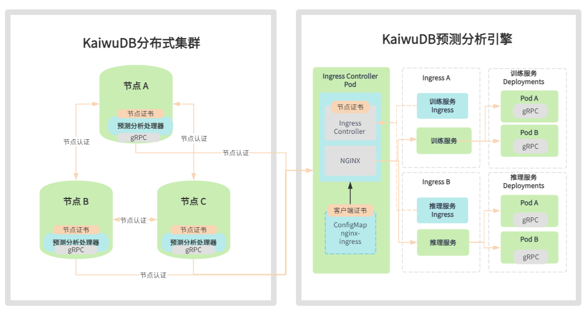
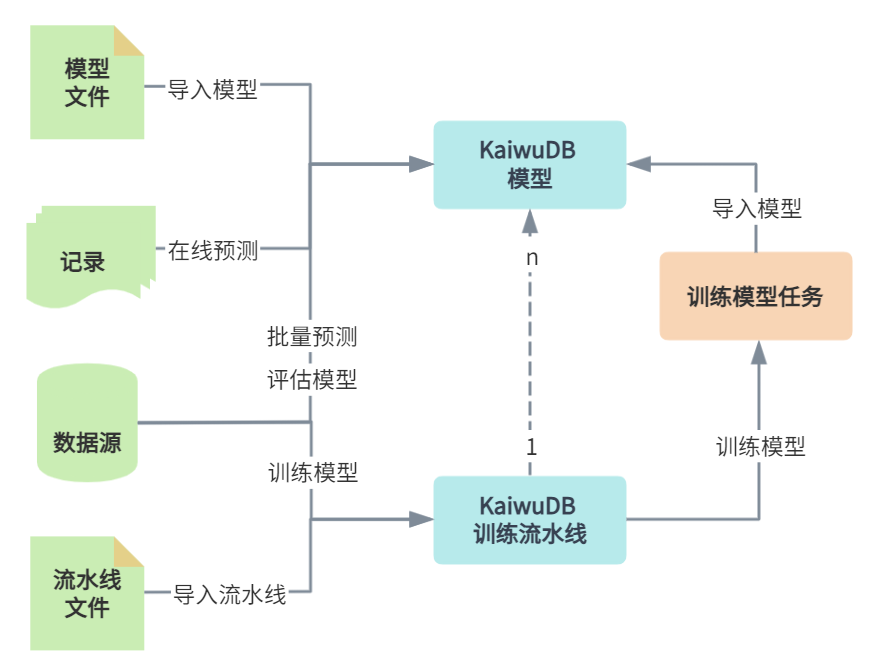

# 预测分析引擎架构

## 部署架构

KaiwuDB 预测分析引擎采用云原生架构。机器学习的工作负载以云服务的形式运行在 Kubernetes 平台上，有效利用 Kubernetes 的高可用性和横向扩展能力。机器学习模型的元数据，包括模型名称、机器学习框架、运行环境、输入输出模式等，和模型本身存储在 KWDB 数据库中，保证数据的持久性和一致性。为了合理分配资源，建议将 KaiwuDB 预测分析引擎与其他引擎部署在不同服务器上。

KaiwuDB 预测分析引擎通过 [NGINX Ingress Controller](https://kubernetes.github.io/ingress-nginx/) 实现与 KWDB 其他引擎之间基于 TLS 的双向安全认证。安装配置 KaiwuDB 预测分析引擎时，用户需要提供由同一个 CA 证书签名的 KWDB 节点证书，包括节点证书（`node.crt`）和节点私钥（`node.key`）。KaiwuDB 预测分析引擎的安装脚本会自动部署 NGINX Ingress Controller 并应用相关配置文件，启用 gRPC 的 TLS 双向认证。

KaiwuDB 预测分析引擎针将实时性要求高的在线预测服务与对计算资源要求较高的训练、评估和批量预测服务分成在线推理引擎和训练引擎。两种引擎可以单独部署也可以共存，满足不同的业务和部署环境的需求。

## 功能架构

KaiwuDB 预测分析引擎包括模型和流水线生命周期管理、预测服务、训练服务三大功能模块。

模型和流水线生命周期管理模块旨在满足模型开发者的需求，包括以下关键功能：

- 导入模型和流水线：支持导入新的预测模型和流水线，不断扩充模型库和流水线库。
- 查看模型和流水线：查看已有模型和流水线的详细信息。
- 删除模型和流水线：允许删除不再需要的模型和流水线，及时维护、清理模型库和流水线库。
- 更新模型版本：支持更新模型版本，支持将多版本模型的某一版本指定为活跃版本。
- 权限管理：确保只有授权用户可以访问、操作模型和流水线，包括导入、查看、删除等操作。

预测服务模块旨在为普通用户提供便捷的在线预测能力，包括以下关键功能：

- 在线预测：使用已部署的模型进行预测，无需深入了解模型的开发和管理。
- 权限管理：允许系统管理员和模型创建者单独管理模型的在线预测权限。

训练服务模块用于训练和评估模型，包括以下关键功能：

- 模型评估：对导入的模型进行评估，包括指标计算和结果展示。
- 模型训练：通过用户数据和训练流水线发起模型训练作业，从而得到预测分析引擎模型。
- 模型批量预测：使用已部署的模型对实时性要求不高但是待预测数据量较大的场景进行预测。
- 权限管理：确保只有授权用户可以评估、训练、批量预测模型等操作。
- 作业管理：支持授权用户查看、中止、删除模型训练、模型评估和批量预测等相关作业。

下图列出了各模块之间的协作关系。

