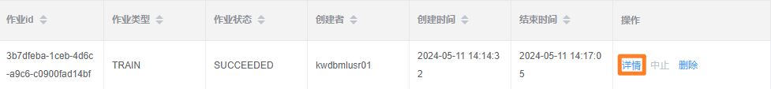
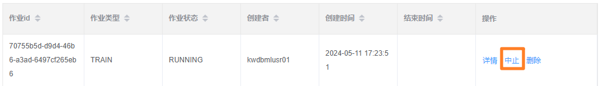
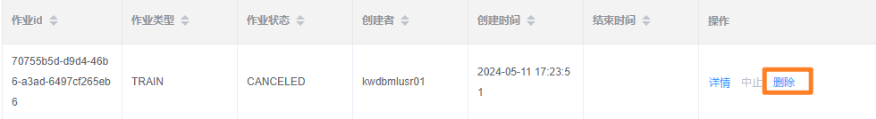
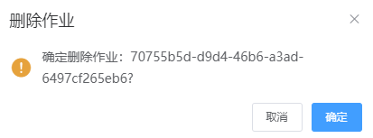

# 作业管理

**作业管理**页面列出所有后台作业的基本信息。

## 查看作业

### 前提条件

用户为 Admin 用户或者作业的创建者。

### 步骤

在**作业管理**页面，单击待查看作业对应的**详情**选项，即可查看作业的 ID、类型、设置、错误等信息。

## 中止作业

### 前提条件

- 用户为 Admin 用户或作业的创建者。
- 待中止的作业正在运行（RUNNING 状态）。

### 步骤

如需中止后台作业，遵循以下步骤。

1. 在**作业管理**页面，单击目标作业对应的**中止**选项。

    

2. 在**停止作业**窗口，单击**确定**。

    

    系统提示停止作业成功，更新网页显示和作业状态。

## 删除作业

### 前提条件

用户为 Admin 用户。

### 步骤

如需删除后台作业，遵循以下步骤。

1. 在**作业管理**页面，单击目标作业对应的**删除**选项。

    

2. 在**删除作业**窗口，单击**确定**。

    

    系统提示删除作业成功并更新网页显示。
