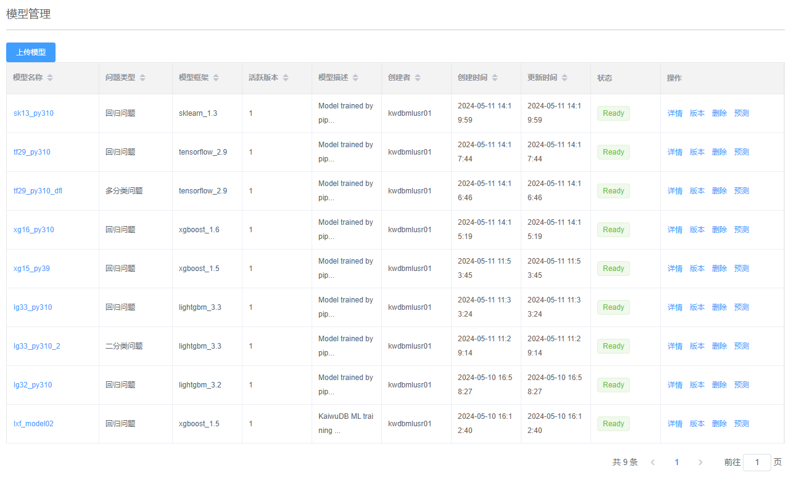
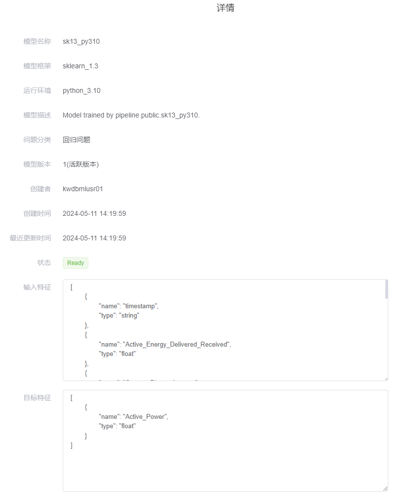
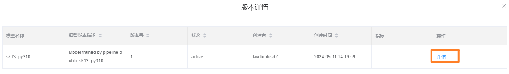
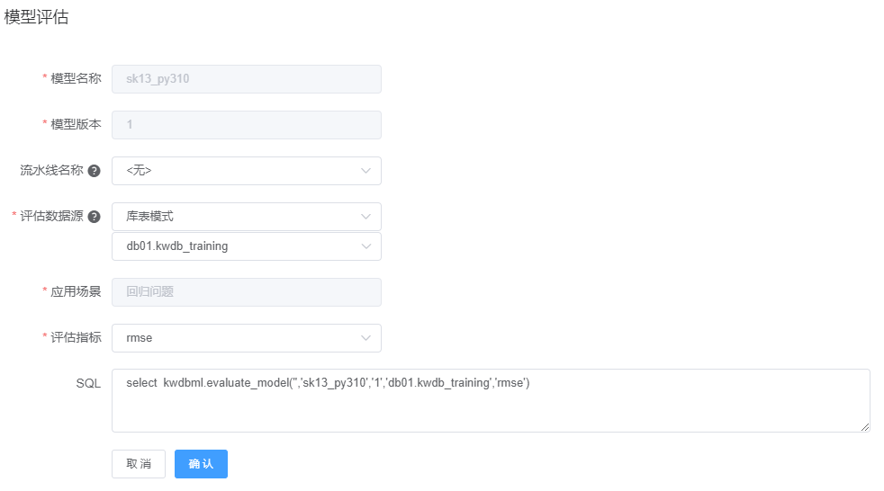
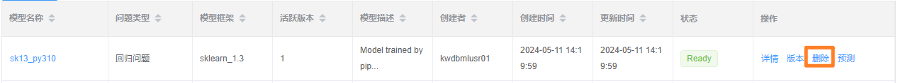
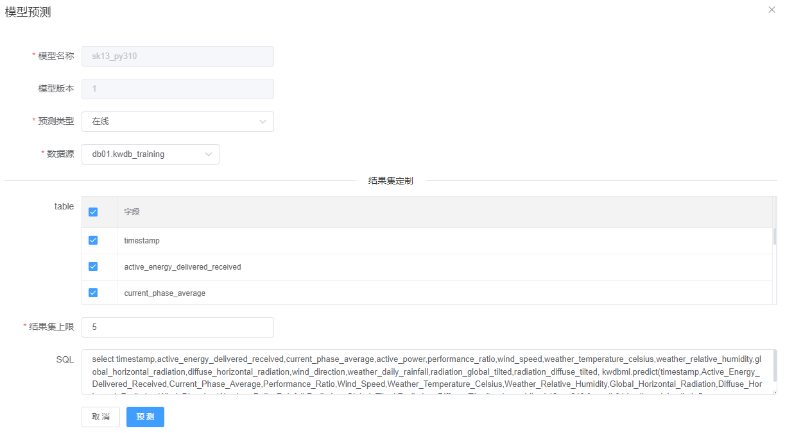
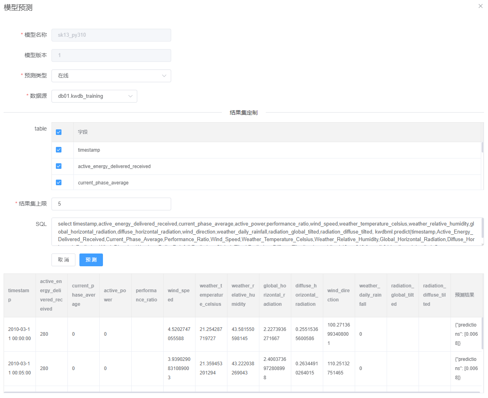
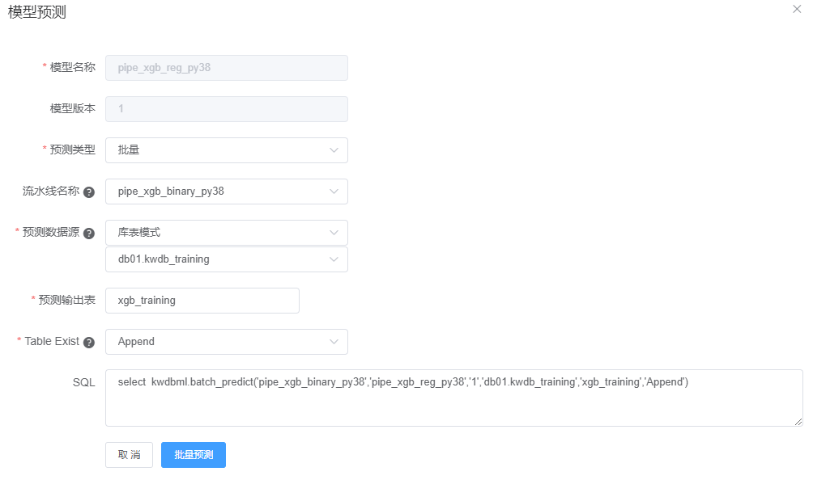

# 模型管理

**模型管理**页面列出所有机器学习模型的基本信息。

## 上传模型

### 前提条件

- 所有用户均可导入新模型。
- 如需导入模型的后续版本，用户为 Admin 用户或者模型的创建者。

### 步骤

如需上传模型，遵循以下步骤。

1. 在**模型管理**页面，单击**上传模型**。

    

2. 在**上传模型**窗口，输入模型的相关信息，上传准备好的模型文件和数据预处理文件。

    | 参数       | 说明                                                                                                                                                           | 示例                                                                                                                                                                                                                                                                                                                                                                                                                                                                                                                                                                                                                                                                                                        |
    | ---------- | -------------------------------------------------------------------------------------------------------------------------------------------------------------- | ----------------------------------------------------------------------------------------------------------------------------------------------------------------------------------------------------------------------------------------------------------------------------------------------------------------------------------------------------------------------------------------------------------------------------------------------------------------------------------------------------------------------------------------------------------------------------------------------------------------------------------------------------------------------------------------------------------- |
    | 模型名称   | - 模型名称必须以字母开头，可以包含字母、数字或下划线。 - 模型名称长度为不能超过 21 个字符。  - 模型名称必须唯一。                                             | `electricity_forecast`                                                                                                                                                                                                                                                                                                                                                                                                                                                                                                                                                                                                                                                                                        |
    | 模型描述   | 可选参数。模型的描述信息。                                                                                                                                                       |   -                                                                                                                                                                                                                                                                                                                                                                                                                                                                                                                                                                                                                                                                                                          |
    | 问题类型   | 模型的问题分类。目前，支持的问题类型包括： - 回归问题  - 二分类问题  - 多分类问题                                                                                     | -                                                                                                                                                                                                                                                                                                                                                                                                                                                                                                                                                                                                                                                                                                           |
    | 框架类型   | 机器学习框架的类型和版本。目前，支持的框架和版本包括： - scikit-learn（sklearn）：1.3  - XGBoost：1.5 和 1.6  - LightGBM：3.2 和 3.3  - TensorFlow：2.8 和 2.9                   | -                                                                                                                                                                                                                                                                                                                                                                                                                                                                                                                                                                                                                                                                                                           |
    | 运行环境   | 模型的运行环境及版本，支持以下运行环境：模型的运行环境及版本。目前，支持的环境版本包括：Python 3.8、3.9 和 3.10。  | - |
    | 模型特征   | 模型的输入特征列信息，包括列名和数据类型。特征列名和数据类型以 JSON 数组的形式定义。支持的输入特征类型包括 STRING、INT、FLOAT。单击**格式化 JSON**，即可优化 JSON 格式。  | `[{"name": "timestamp", "type": "string"}, {"name": "Active_Energy_Delivered_Received", "type": "float"}, {"name": "Current_Phase_Average", "type": "float"}, {"name": "Performance_Ratio", "type": "float"}, {"name": "Wind_Speed", "type": "float"}, {"name": "Weather_Temperature_Celsius", "type": "float"}, {"name": "Weather_Relative_Humidity", "type": "float"}, {"name": "Global_Horizontal_Radiation", "type": "float"}, {"name": "Diffuse_Horizontal_Radiation", "type": "float"}, {"name": "Wind_Direction", "type": "float"}, {"name": "Weather_Daily_Rainfall", "type": "float"}, {"name": "Radiation_Global_Tilted", "type": "float"}, {"name": "Radiation_Diffuse_Tilted", "type": "float"}]` |
    | 输出特征   | 模型的输出目标列信息，包括列名和数据类型。特征列名和数据类型以 JSON 数组的形式定义。支持的输出目标列类型包括 STRING、INT、FLOAT。单击**格式化 JSON**，即可优化 JSON 格式。 | `[{"name": "Active_Power", "type": "float"}]`                                                                                                                                                                                                                                                                                                                                                                                                                                                                                                                                                                                                                                                                 |
    | 模型文件   | - 支持上传打包好的 ZIP 压缩包或者上传多个模型文件。  - 上传文件的大小不能超过 100 M。                                                                         | -                                                                                                                                                                                                                                                                                                                                                                                                                                                                                                                                                                                                                                                                                                           |
    | 数据预处理 | - 支持上传打包好的 ZIP 压缩包或者上传多个数据预处理文件。  - 支持根据选择上传数据统计文件。  - 上传文件的大小不能超过 100 M。                                           | -                                                                                                                                                                                                                                                                                                                                                                                                                                                                                                                                                                                                                                                                                                           |
    | 模型指标   | 可选参数，模型的性能数据，JSON 数组格式。如果用户已知模型的性能数据，上传模型时可以指定模型的性能数据。单击**格式化 JSON**，即可优化 JSON 格式。                                                        | `[{"objective ":"F1", "score":5.7}]`                                                                                                                                                                                                                                                                                                                                                                                                                                                                                                                                                                                                                                                                          |

3. 单击**确定**。

## 查看模型

### 前提条件

- 已经将模型导入到数据库中。
- 用户为 Admin 用户、模型的创建者、或者拥有模型的 SELECT 权限。

### 步骤

在**模型管理**页面，单击待查看的模型的名称或者目标模型对应的**详情**选项，即可查看目标模型的所有相关信息。

## 评估模型

### 前提条件

- 已经将模型导入到数据库中。
- 用户为 Admin 用户、模型的创建者、或者拥有模型的 EVALUTE 权限。

### 步骤

如需评估模型，遵循以下步骤。

1. 在**模型管理**页面，单击目标模型对应的**版本**选项。

    

2. 在**版本详情**窗口，单击**评估**。

    

3. 在**模型评估**窗口，选择对应的流水线、用于评估的数据源和评估指标。

    ::: warning 说明
    如果未导入流水线，支持使用默认设置（`<无>`）。
    :::

    

4. 单击**确认**。

## 设置活跃版本

默认情况下，模型的第一个版本为活跃版本。预测分析引擎自动加载模型的活跃版本，进行在线预测和批量预测模型。

### 前提条件

- 已经将模型导入到数据库中。
- 用户为 Admin 用户、模型的创建者、或者拥有模型的 UPDATE 权限。
- 模型有两个及以上版本。

### 步骤

如需设置模型的活跃版本，遵循以下步骤。

1. 在**模型管理**页面，单击目标模型对应的**版本**选项。

    

2. 在**版本详情**窗口，选择目标版本，然后单击**设置活跃版本**。
3. 在**更新活跃版本**窗口，单击**确定**。

## 删除模型

### 前提条件

- 已经将模型导入到数据库中。
- 用户为 Admin 用户、模型的创建者、或者拥有模型的 DELETE 权限。
- 待删除模型不是正在使用的模型。

### 步骤

如需删除模型，遵循以下步骤。

1. 在**模型管理**页面，单击目标模型对应的**删除**选项。

    

2. 在**删除模型**窗口，单击**确定**。

## 在线预测模型

### 前提条件

- 已经将模型导入到数据库中。
- 用户为 Admin 用户、模型的创建者、或者拥有模型的 PREDICT 权限。

### 步骤

如需在线预测模型，遵循以下步骤。

1. 在**模型管理**页面，单击目标模型对应的**预测**选项。

    

2. 在**模型预测**窗口，设置预测类型、数据源、字段和结果集数量上限。

    

3. 单击**预测**。预测结果将显示在**模型预测**窗口下方。

    

## 批量预测模型

### 前提条件

- 已经将模型导入到数据库中。
- 用户为 Admin 用户、模型的创建者、或者拥有模型的 PREDICT 权限。
- 如果引用的数据源为表或视图，用户拥有目标表或视图的 SELECT 权限。
- 如果引用的数据源为 SQL 查询语句，用户拥有目标对象的 QUERY 权限和 SELECT 权限。

### 步骤

如需批量预测模型，遵循以下步骤。

1. 在**模型管理**页面，单击目标模型对应的**预测**选项。

    

2. 在**模型预测**窗口，设置预测类型、预测数据源、预测输出表和如果已存在输出表需要执行的操作，根据需求选择是否指定流水线，然后单击**批量预测**。

    
