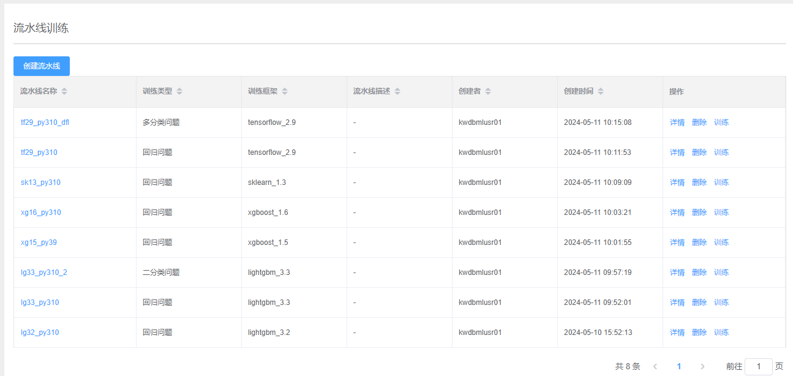
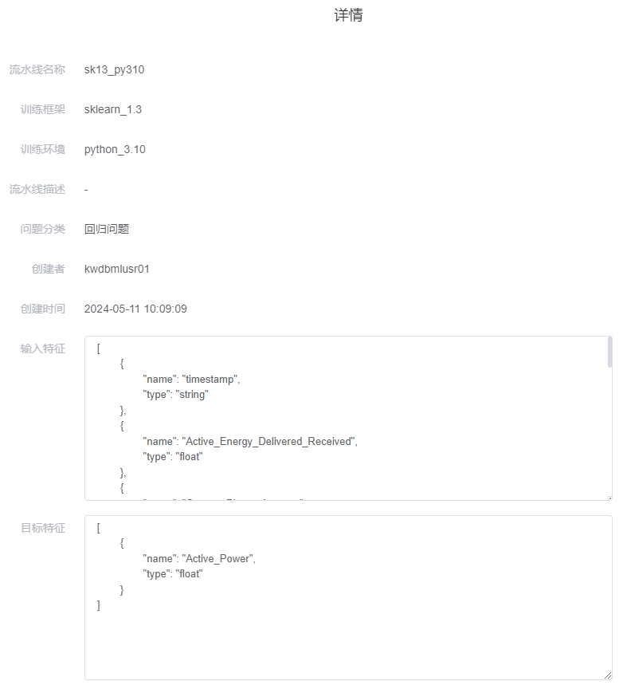
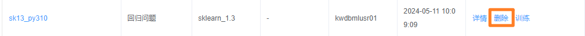
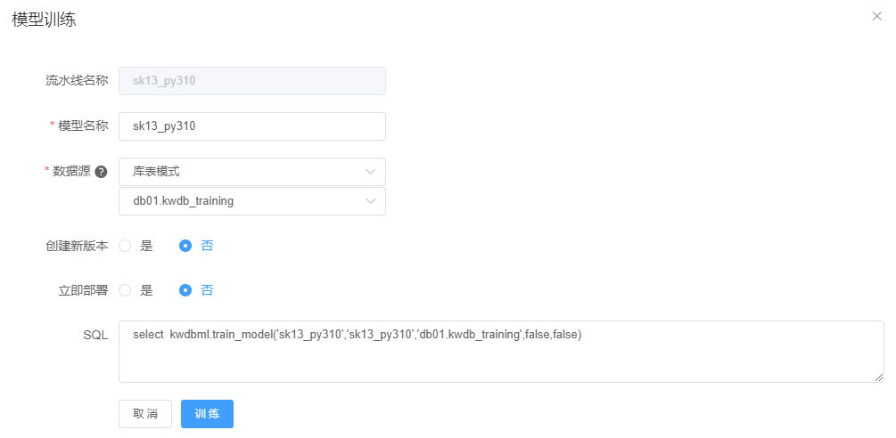

# 训练流水线管理

**流水线训练**页面列出所有导入的训练流水线的基本信息。

## 创建训练流水线

### 前提条件

任何 KWDB 用户均可导入新的训练流水线。

### 步骤

如需创建训练流水线，遵循以下步骤。

1. 在**流水线训练**页面，单击**创建流水线**。

    

2. 在**上传流水线**窗口，输入训练流水线的相关信息，上传准备好的训练流水线文件和数据预处理文件。

    | 参数       | 说明                                                                                                                                                           | 示例                                                                                                                                                                                                                                                                                                                                                                                                                                                                                                                                                                                                                                                                                                        |
    | ---------- | -------------------------------------------------------------------------------------------------------------------------------------------------------------- | ----------------------------------------------------------------------------------------------------------------------------------------------------------------------------------------------------------------------------------------------------------------------------------------------------------------------------------------------------------------------------------------------------------------------------------------------------------------------------------------------------------------------------------------------------------------------------------------------------------------------------------------------------------------------------------------------------------- |
    | 流水线名称 | - 训练流水线名称必须以字母开头，可以包含字母、数字或下划线。 - 训练流水线名称长度为不能超过 21 个字符。| `electricity_forecast`                                                                                                                                                                                                                                                                                                                                                                                                                                                                                                                                                                                                                                                                                        |
    | 流水线描述 | 可选参数，训练流水线的描述信息。                                                                                                                                                     | -                                                                                                                                                                                                                                                                                                                                                                                                                                                                                                                                                                                                                                                                                                            |
    | 问题类型   | 机器学习模型的问题分类。目前，支持的问题类型包括： - 回归问题  - 二分类问题  - 多分类问题                                                                                     | -                                                                                                                                                                                                                                                                                                                                                                                                                                                                                                                                                                                                                                                                                                           |
    | 框架类型   | 机器学习框架的类型和版本。目前，支持的框架和版本包括： - scikit-learn（sklearn）：1.3  - XGBoost：1.5 和 1.6  - LightGBM：3.2 和 3.3  - TensorFlow：2.8 和 2.9                  | -                                                                                                                                                                                                                                                                                                                                                                                                                                                                                                                                                                                                                                                                                                           |
    | 运行环境   | 训练流水线的运行环境及版本，支持以下运行环境：模型的运行环境及版本。目前，支持的环境版本包括：Python 3.8、3.9 和 3.10。                                                                                  | -                                                                                                                                                                                                                                                                                                                                                                                                                                                                                                                                                                                                                                                                                                           |
    | 模型特征   |  训练流水线的输入特征列信息，包括列名和数据类型。特征列名和数据类型以 JSON 数组的形式定义。支持的输入特征类型包括 STRING、INT、FLOAT。单击**格式化 JSON**，即可优化 JSON 格式。| `[{"name": "timestamp", "type": "string"}, {"name": "Active_Energy_Delivered_Received", "type": "float"}, {"name": "Current_Phase_Average", "type": "float"}, {"name": "Performance_Ratio", "type": "float"}, {"name": "Wind_Speed", "type": "float"}, {"name": "Weather_Temperature_Celsius", "type": "float"}, {"name": "Weather_Relative_Humidity", "type": "float"}, {"name": "Global_Horizontal_Radiation", "type": "float"}, {"name": "Diffuse_Horizontal_Radiation", "type": "float"}, {"name": "Wind_Direction", "type": "float"}, {"name": "Weather_Daily_Rainfall", "type": "float"}, {"name": "Radiation_Global_Tilted", "type": "float"}, {"name": "Radiation_Diffuse_Tilted", "type": "float"}]` |
    | 输出特征   | 训练流水线的输出目标列信息，包括列名和数据类型。特征列名和数据类型以 JSON 数组的形式定义。支持的输出目标列类型包括 STRING、INT、FLOAT。单击**格式化 JSON**，即可优化 JSON 格式。 | `[{"name": "Active_Power", "type": "float"}]`                                                                                                                                                                                                                                                                                                                                                                                                                                                                                                                                                                                                                                                                 |
    | 流水线文件 | - 支持上传打包好的 ZIP 压缩包或者上传多个模型文件。  - 上传文件的大小不能超过 100 M。                                                                       | -                                                                                                                                                                                                                                                                                                                                                                                                                                                                                                                                                                                                                                                                                                           |
    | 数据预处理 | - 支持上传打包好的 ZIP 压缩包或者上传多个数据预处理文件。  - 支持根据选择上传数据统计文件。  - 上传文件的大小不能超过 100 M。                            | -                                                                                                                                                                                                                                                                                                                                                                                                                                                                                                                                                                                                                                                                                                           |

3. 单击**确定**。

## 查看训练流水线

### 前提条件

- 已经将训练流水线导入到数据库中。
- 用户为 Admin 用户、训练流水线的创建者、或者拥有训练流水线的 SELECT 权限。

### 步骤

在**流水线训练**页面，单击待查看的训练流水线的名称或者目标训练流水线对应的**详情**选项，即可查看训练流水线的所有相关信息。

## 删除训练流水线

### 前提条件

- 已经将训练流水线导入到数据库中。
- 用户为 Admin 用户、训练流水线的创建者、或者拥有训练流水线的 DELETE 权限。
- 待删除的训练流水线不是正在使用的训练流水线。

### 步骤

如需删除训练流水线，遵循以下步骤。

1. 在**流水线训练**页面，单击目标训练流水线对应的**删除**选项。

    

2. 在**删除流水线**窗口，单击**确定**。

## 训练模型

### 前提条件

- 已经将训练流水线导入到数据库中。
- 用户为 Admin 用户、训练流水线的创建者、或者拥有训练流水线的 TRAIN 权限。
- 如果引用的数据源为表或视图，用户拥有目标表或视图的 SELECT 权限。
- 如果引用的数据源为 SQL 查询语句，用户拥有目标对象的 QUERY 权限和 SELECT 权限。

### 步骤

如需使用训练流水线训练模型，遵循以下步骤。

1. 在**流水线训练**页面，单击目标训练流水线对应的**训练**选项。

    

2. 在**模型训练**窗口，设置模型名称、数据源，选择是否创建模型新版本以及是否立即部署。

    参数说明：

    - 创建新版本：
      - 设置为`是`时，当模型已经存在数据库中并且当前模型与训练得到的新模型的输入输出保持一致时，训练得到的新模型将成为当前模型的新版本。
      - 设置为`否`时，若数据库中存在相同名称的模型，系统返回模型名称重复的错误。
    - 立即部署：
      - 设置为`是`时，当训练得到的新模型成为当前模型的新版本时，该新版本立即成为模型的活跃版本。
      - 设置为`否`时，当训练得到的新模型成为当前模型的新版本时，不改变模型的当前活跃版本。

    

3. 单击**训练**。
