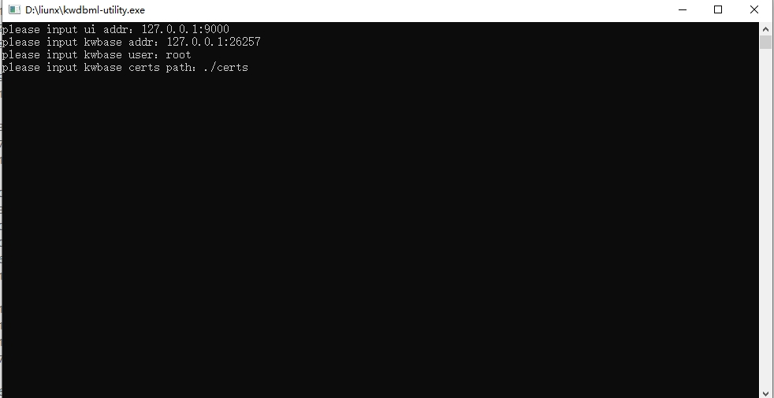

# 工具准备

## Windows 系统

### 前提条件

获取 `KaiwuDB_aiengine_webtool-2.0.x-win-x86_64.zip` 安装包。

### 步骤

1. 解压缩 `KaiwuDB_aiengine_webtool-2.0.x-win-x86_64.zip` 安装包。
2. 进入 `KaiwuDB_aiengine_webtool-2.0.x-win-x86_64` 目录，双击运行 `kwdbml-utility.exe`。
3. 在启动界面，输入以下参数信息：

    - `ui addr`：WEB 服务监听的地址和端口。建议使用 `127.0.0.1:xxxx`，降低对外暴露端口带来的风险。
    - `kwbase addr`：KWDB 数据库的地址。
    - `kwbase user`：KWDB 数据库的用户名。
    - `certs path`：KWDB 数据库证书的存放路径。

    

4. 成功启动服务后，即可通过浏览器访问 WEB 服务监听的地址。

## Linux/Unix 系统

### 可执行文件

#### 前提条件

获取 `KaiwuDB_aiengine_webtool-2.0.x-linux-x86_64.tar.gz` 安装包。

#### 步骤

1. 解压缩 `KaiwuDB_aiengine_webtool-2.0.x-linux-x86_64.tar.gz` 安装包。
2. 进入 `KaiwuDB_aiengine_webtool-2.0.x-linux-x86_64` 目录，运行以下命令启动服务。

    ```shell
    kwdbml-utility --addr ip:port --user root --certs /certs --ui-addr 127.0.0.1:9000
    ```

    参数说明：

    - `addr`：KWDB 数据库的地址。
    - `user`：KWDB 数据库的用户名。
    - `certs`：KWDB 数据库证书的存放路径。
    - `ui-addr`：WEB 服务监听的地址和端口。建议使用 `127.0.0.1:xxxx`，降低对外暴露端口带来的风险。

3. 成功启动服务后，即可通过浏览器访问 WEB 服务监听的地址。

### Docker 镜像

#### 前提条件

获取 `KaiwuDB_aiengine_webtool-2.0.x-linux-x86_64-images.tar.gz` 安装包。

#### 步骤

1. 加载镜像文件。

    ```shell
    docker load -i KaiwuDB_aiengine_webtool-2.0.x-linux-x86_64-images.tar.gz
    ```

2. 运行以下命令启动服务：

    配置示例：

    ```shell
    docker run -d \
    --name mltool \
    -p 32020:9000 \
    -v /local/path/of/certs:/certs \
    kwdbml-utility:v1.0.0 \
    --addr ip:port \
    --user root \
    --certs /certs
    ```

    参数说明：

    - `-p`：本机端口与 Docker 容器内端口的映射关系。配置示例中，`32020` 是本机端口。
    - `-v`：本地文件与容器内文件的映射关系。用户需要将 `/local/path/of/certs` 修改为 KWDB 服务器证书的存放路径路径。
    - `addr`：KWDB 数据库的地址。
    - `user`：KWDB 数据库的用户名。
    - `certs`：KWDB 数据库证书的存放路径。

3. 成功启动服务后，即可通过浏览器访问 WEB 服务监听的地址。
