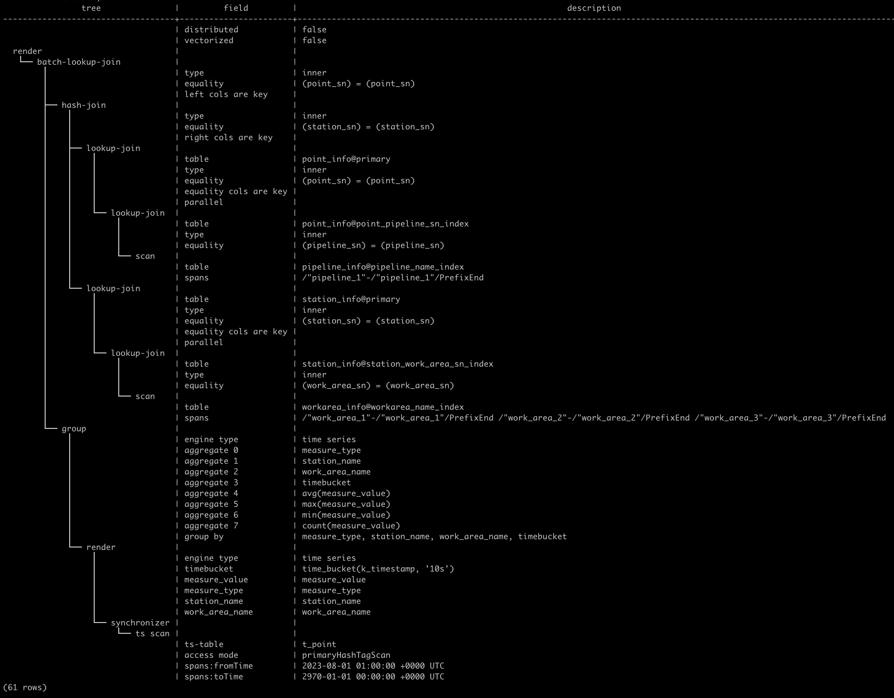
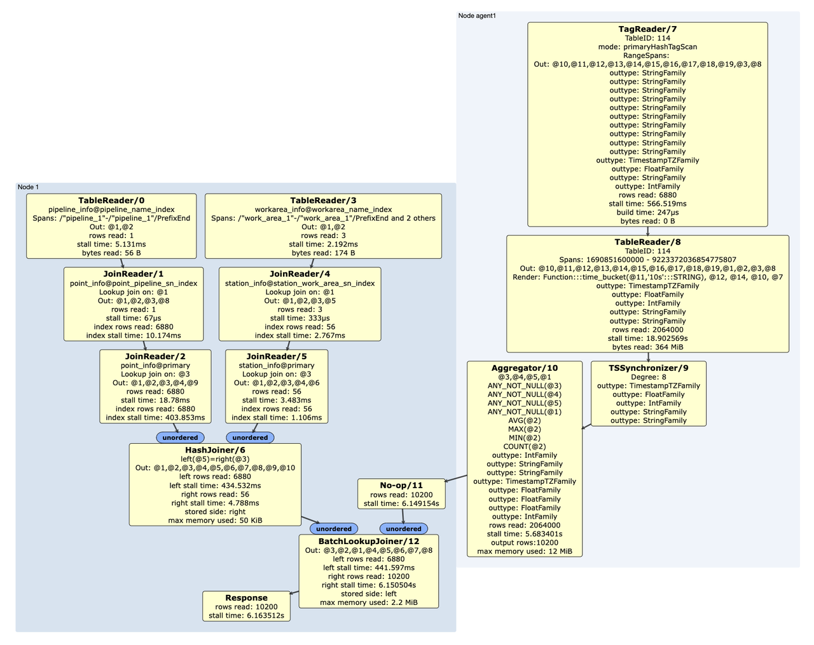

# 多模查询优化

通常情况下，在一些时序数据用户场景中，用户的业务应用和数据不仅涉及时序数据，也会有一些跟设备或其他业务相关的关系数据。用户不仅需要单独分析时序、关系两种数据，有时候也需要对两种数据进行整合分析。KWDB 支持多模数据引擎，提供多模数据管理和分析能力。KWDB 多模查询优化把关系表和时序表的关联计算结果、聚合函数、过滤函数尽可能地下推到时序引擎，最大程度地减少时序引擎发送到关系引擎的数据量，减少跨引擎带来的数据传输量和计算开销，提升数据查询性能和效率。

KWDB 支持配置集群级和会话级多模查询优化。其中会话级多模查询优化的优先级高于集群级多模查询优化。

- 配置集群级多模查询优化。

    集群级多模查询优化设置仅对后续启动的连接生效。默认情况下，开启集群级多模查询优化功能。如需关闭多模查询优化，将 `sql.defaults.multimode.enabled` 参数设置为 `false`。

    ```sql
    SET CLUSTER SETTING sql.defaults.multimode.enabled = false;
    ```

- 配置会话级多模查询优化。

    会话级多模查询优化设置只对当前连接生效。如果启动会话时未指定隔离级别，则继承集群级多模查询优化设置。用户可以使用以下命令开启或关闭会话的多模查询优化。

    ```sql
    -- 开启会话级多模查询优化。
    SET enable_multimodel=true;

    -- 关闭会话级多模查询优化。
    SET enable_multimodel=false;
    ```

开启多模查询优化功能后，系统通过以下组件识别多模查询并生成相应的查询计划。

- 多模查询识别组件：遍历查询块，判断是否为多模查询。多模查询指在同一个查询语句的一个或多个查询块的 `FROM` 语句中同时包括关系表和时序表。
- 多模查询分析组件：分析多模查询的连接方式以及聚合/过滤的特殊处理。将符合条件的过滤和聚合函数下推至时序引擎，避免或减少跨模的数据传输和编码量，提升查询效率。
- 多模查询元计划组件：根据多模查询分析组件产生的元计划来指导优化器剪枝和选择，保证时序表在连接顺序中的位置，从而产生最优的跨模逻辑计划。
- 多模查询逻辑计划组件：根据优化器产生的逻辑计划，对面向连接类型为内连接（INNER JOIN）的时序表和关系表进一步处理，关系引擎采用新的连接模式（BatchLookupJoin），分批把大量连接数据一次性下推至时序引擎。时序引擎引入 HashTagScan 算子，处理 Tag 表的过滤。处理连接、过滤和聚合运算，从而减少关系引擎和时序引擎之间数据交互的次数，提高跨模查询的效率。
  - BatchLookupJoin 算子：处理关系表和时序表的连接。BatchLookupJoin 算子通过 `EXPLAIN` 和 `EXPLAIN ANALYZE` 语句的输出结果展示给用户。BatchLookupJoin 算子的主要功能包括：
    1. 采取 batch 的形式，批量处理关系表的数据。
    2. 将处理结果打包为时序引擎可读的格式，并批量导入时序引擎。
    3. 接受时序引擎返回的结果集并组合成上层算子的结果集。
    4. 返回结果集给上层算子。
  - HashTagScan 算子：为时序引擎提供了基于 Hash Join 的数据处理能力，将 KWDB 关系表的计算逻辑推送至时序引擎内，与时序引擎中的 Tag 表进行高效连接。为了提升连接操作的效率，HashTagScan 支持三种访问模式：
    - PrimaryTagHashScan 模式：在 PrimaryTagHashScan 模式下，如果连接列中存在 Primary Tag，则直接使用 tagIndexTable 的访问方法进行扫描，无需在 Build 阶段创建 Hash 索引。在 Probe 阶段，通过 Primary Tag 获取 Entity ID，并根据 Entity ID 读取所有的 Tag 数据，然后根据其他 Tag 的连接列值进行匹配。匹配成功后，将匹配的 Tag 数据与对应的关系数据拼接，输出一条完整的记录。
    - TagHashScan 模式：在 TagHashScan 模式下，TagHashScanOperator 读取并过滤 Tag 表数据后，使用 Key 列构建 Hash 索引。构建 Hash 索引的过程中，每个 Tag 数据的 Batch 指针都需要进行物化处理。在 Probe 阶段，解析关系数据中的各个连接列，并从 Hash 索引中查询匹配的 Tag 数据。匹配成功后，将匹配的 Tag 数据与关系数据的其他列一起拷贝到输出结果中。
    - RelHashScan 模式：在 RelHashScan 模式下，TagHashScanOperator 读取并过滤 Tag 表数据后，在右侧关系表的列上创建 Hash 索引。然后，左表的数据将与右表中创建的 Hash 索引进行 Probe 处理。在 Probe 阶段，左侧的每条记录会与 Hash 索引中的关系数据进行匹配。匹配成功后，将匹配的 Tag 数据与关系数据的其他列一起拷贝到输出结果中。
- 多模查询物理计划组件：根据新的多模查询逻辑计划构建多模查询的物理计划和相应的算子。
- 多模查询执行器：通过扩展 KWDB 执行器来支持新的多模查询物理计划。

用户可以通过 `EXPLAIN` 和 `EXPLAIN ANALYZE` 语句查看多模查询优化生成的 SQL 访问计划。`EXPLAIN` 和 `EXPLAIN ANALYZE` 语句支持新引入的逻辑计划和物理计划算子，以及增强现有的输出显示，使其更加符合多模查询的需求，主要包括以下两方面：

- 支持查看 BatchLookupJoin 算子和 HashTagScan 算子的基本信息，输出中将显示所有相关的配置和统计信息。
- 展示告警信息。支持查看多模查询分析组件的分析结果，并对有风险的计划展示告警信息。这些告警信息意味着查询不符合多模优化的条件，系统将直接回退到原本的查询计划。KWDB 支持以下告警信息：

  - "unsupported aggregation function or expression"：多模查询中含有时序引擎不支持的聚合函数或表达式
  - "unsupported data type"：多模查询中分组的关系列中含有时序引擎不支持的数据类型
  - "join between time-series tables"：多模查询中多个时序表实例之间存在连接
  - "cross join is not supported in multi-model"：多模查询中关系表与时序表之间存在 Cross Join 类型的连接
  - "semi join is not supported in multi-model"：多模查询中关系表与时序表之间存在 Semi Join 类型的连接
  - "outer join is not supported in multi-model"：多模查询中关系表与时序表之间存在 Outer Join 类型的连接
  - "the access plan cannot be optimized in multi-model"：多模查询中无法优化访问计划
  - "mismatch in left join columns' positions with relationalInfo"：与时序表连接的关系表列无法匹配或找不到需要的信息
  - "cast on tag column is not supported in multi-model"：连接谓词中的时序表 Tag 列上存在类型转换
  - "mismatch on join columns' type or length"：连接谓词中的关系表列与时序表列的类型或长度不匹配
  - "unsupported operation in multi-model context"：不支持的计算操作
  - "join on time-series metrics column"：连接谓词中含有时序表的非 Tag 列

`EXPLAIN` 语句的输出显示提供了关于连接类型，连接条件以及等值键的详细信息。如下图所示，该 SQL 访问计划包含新增的 `batch-look-up` 计划节点。同时，由于该查询中关系表与时序表的 Join 谓词中使用时序表的 Primary Tag 列做连接，因此可以使用已有的 Primary Tag 上的 Hash 索引进行连接和扫描。所以相应的 `ts-scan` 节点的 `access mode` 为 primaryHashTagScan。此外，逻辑计划中也显示了下推到时序引擎的 `group` 节点。



`EXPLAIN ANALYZE` 语句显示更加详细的执行信息，包括连接类型、等值连接列的具体匹配、ON 条件表达式等。除了基本的连接类型和条件外，系统还会输出左右表连接列的详细配置。如果连接操作中存在列合并的情况，`EXPLAIN ANALYZE` 语句还会输出合并的列数。`EXPLAIN ANALYZE` 语句模拟输出如下所示。其中，`TagReader7` 中的 mode，即 `EXPLAIN` 语句得到的查询计划中 `ts-scan` 节点中的 `access mode`，显示为 primaryHashTagScan。当存在 BatchlookupJoiner 时，该算子会格外显示 build time，表示创建多模查询的 Hash 索引所花费的时间。此外，`BatchlookupJoiner/12` 对应上述查询计划中的 BatchLookupJoinNode 节点的新增 join 算子，其左侧数据流为关系型数据，右侧为时序引擎执行结果返回数据。


