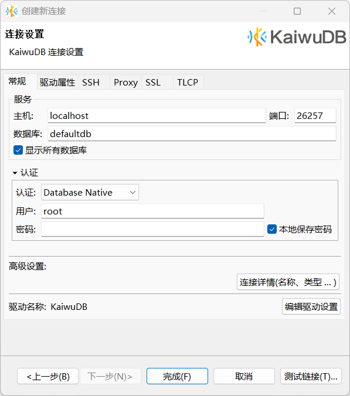

# 使用 KaiwuDB 开发者中心连接 KWDB

安装部署完 KWDB 以后，用户可以使用 [KaiwuDB Developer Center（KaiwuDB 开发者中心）](../../kaiwudb-developer-center/overview.md)连接和管理 KWDB。本文介绍如何使用 KaiwuDB 开发者中心可视化工具连接 KWDB 数据库。

## 安装 KaiwuDB 开发者中心

本节介绍 KaiwuDB 开发者中心支持的操作系统、环境要求，以及如何安装 KaiwuDB 开发者中心。

### 支持的操作系统

::: warning 说明
不同操作系统版本的界面略有差异，但功能完全相同。
:::

KaiwuDB 开发者中心支持以下操作系统：

- Windows 7 及以上 64 位系统
- Linux 内核 2.6 及以上系统
- Mac 操作系统（macOS）

### 环境要求

KaiwuDB 开发者中心的安装需满足以下环境要求：

| 环境 | 要求            |
| ----------------------------------- | ---------------------------------------------- |
| 硬件环境                            | - 内存：1G 及以上   - 硬盘: 10G 及以上                |
| 软件环境                            | - KWDB 2.0 及以上版本   - OpenJRE 8 及以上版本 |

### 安装步骤

如需安装 KaiwuDB 开发者中心，遵循以下步骤。

1. 根据操作系统[下载](https://gitee.com/kwdb/kwdb/releases) KaiwuDB 开发者中心对应的安装包。

   ::: warning 提示：

   因文件大小限制，可能需要下载多个安装包。

   :::

2. 合并解压缩安装包，文件目录如下：

   

3. 双击运行 KaiwuDB 开发者中心应用程序。

## 连接 KWDB 数据库

### 首次连接

首次建立连接或软件中的所有连接都被删除后，软件启动后会自动弹出**新建连接**向导，引导用户建立连接。

以下步骤以首次建立连接为例，说明如何连接数据库。

1. 在**创建新连接**窗口，选择 KaiwuDB 驱动，然后单击**下一步**。

   

2. 在**常规**页签，设置主机、端口、数据库。根据需要选择数据库认证方式（默认为数据库原生认证方式），然后完成对应的用户、密码（如果采用非安全模式，则无需设置密码）等设置。

   

3. （可选）单击**测试链接**，检查连接是否成功。

    

4. 单击**确定**。

   数据库导航区将自动更新，显示用户具有权限的数据库。

   

### 其他连接方式

其他情况下，如需创建连接，可以选择以下任一操作：

- 单击工具栏或数据库导航区工具栏中的**新建连接**按钮。

   

- 在菜单栏中，单击**数据库**，然后从下拉菜单中选择**新建连接**。

   
