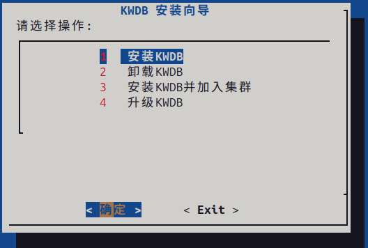
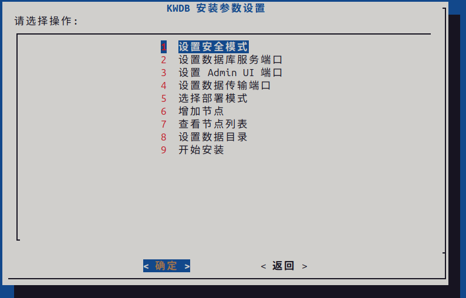
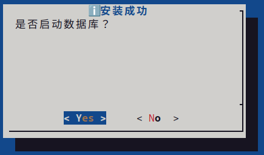

# 终端图形交互模式部署

终端图形交互模式在字符界面下提供图形化交互体验，支持通过方向键和回车键操作复选框、输入框、确认框、进度条等交互组件。

安装过程中内置参数实时校验，配置有误时自动提示重新输入，支持安全模式与非安全模式，部署完成后可选择立即启动数据库。

## 前提条件

**系统要求**：

- 待部署节点的硬件、操作系统和软件依赖满足[部署准备](../prepare.md)要求。
- 已获取 KWDB 安装程序（`.run` 文件）。

**用户权限要求**：

- 安装用户为 `root` 用户或已配置 `sudo` 免密的普通用户。
- 使用容器安装程序部署时，如果安装用户为非 `root` 用户，需要通过以下命令将用户添加到 `docker` 组：

  ```bash
  sudo usermod -aG docker $USER
  ```

## 步骤

1. 登录待部署节点，将 `.run` 安装程序复制到安装目录，并赋予执行权限：

    ```bash
    chmod +x KWDB-*.run
    ```

2. 执行以下命令，以终端图形交互模式启动安装程序：

    ```bash
    ./KWDB-*.run -i
    # 或者
    ./KWDB-*.run --interact
    ```

3. 安装程序启动后，进入主功能菜单，使用方向键选中**安装 KWDB**，按回车确认。

    

4. 进入安装参数设置菜单，根据需要依次选择各配置项进行设置：

    

    各配置项说明：

    | 配置项 | 说明 |
    |--------|------|
    | 设置安全模式 | 支持以下取值：<br>- **非安全模式**：不启用加密传输。<br>- **TLS 加密**：（默认）启用 TLS 安全模式。开启安全模式后，KWDB 自动生成相应证书，存放于 `/etc/kaiwudb/certs` 目录。 |
    | 设置数据库服务端口 | KWDB 服务端口，默认为 `26257`。 |
    | 设置 Admin UI 端口 | KWDB Web 服务端口，默认为 `8080`。 |
    | 设置数据传输端口 | 时序引擎间的数据传输端口，单节点部署时系统会自动忽略该设置，默认为 `27257`。 |
    | 选择部署模式 | 单机模式、单副本集群或三副本集群。单节点部署选择**单机模式**。 |
    | 增加节点 | 添加节点信息，需填写主机名、端口号、用户名和密码。 |
    | 查看节点列表 | 查看已添加的节点信息。 |
    | 设置数据目录 | 数据目录，默认为 `/var/lib/kaiwudb`。 |

5. 所有配置完成后，选中**开始安装**，按回车开始安装 KWDB。

6. 根据需要选择是否为所有用户安装 KWDB。

7. 安装过程中终端会实时显示安装进度。出现错误时，可以通过查看安装目录 `log` 目录下的日志文件获取详细信息。

8. 安装成功后，终端输出安装成功提示，选择是否启动数据库。
    - 选择是：系统自动启动 KWDB。
    - 选择否：后续需要手动启动 KWDB。

        ```bash
        systemctl start kaiwudb
        ```

    

9. 查看服务或节点状态：

    ```bash
    # 查看服务状态
    systemctl status kaiwudb

    # 查看节点状态
    kw-status
    ```

    节点状态返回字段说明：

    | 字段 | 描述 |
    |------|------|
    | `id` | 节点 ID。 |
    | `address` | 节点地址。 |
    | `sql_address` | SQL 地址。 |
    | `build` | 节点运行的 KWDB 版本。 |
    | `started_at` | 节点启动的日期和时间。 |
    | `updated_at` | 节点状态更新的日期和时间。节点正常时，每 10 秒左右记录一次新状态；节点异常时，更新信息可能会有所滞后。 |
    | `locality` | 节点 ID。 |
    | `start_mode` | 节点启动模式。 |
    | `is_available` / `is_live` | 均为 `true` 表示节点处于正常状态；均为 `false` 表示节点处于异常状态。 |

10. （可选）配置 KWDB 开机自启动。

    ```bash
    systemctl enable kaiwudb
    ```

11. 执行 `kw-sql` 使用数据库部署用户登录数据库或者通过以下任一方式连接和管理 KWDB:
    - [kwbase CLI](../access/access-cli.md)
    - [KaiwuDB JDBC](../access/access-jdbc.md)
    - [KaiwuDB 开发者中心](../access/access-kdc.md)