# 使用 KaiwuDB 开发者中心管理 KWDB

安装部署完 KWDB 以后，用户可以使用 [KaiwuDB Developer Center（KaiwuDB 开发者中心）](../../kdc/overview.md)连接和管理 KWDB。本文介绍如何使用 KaiwuDB 开发者中心可视化工具连接 KWDB 数据库、创建 KWDB 数据库、管理数据库对象等操作。

KaiwuDB 开发者中心窗口包含菜单栏、工具栏、导航区、对象窗口、结果窗口以及状态栏。

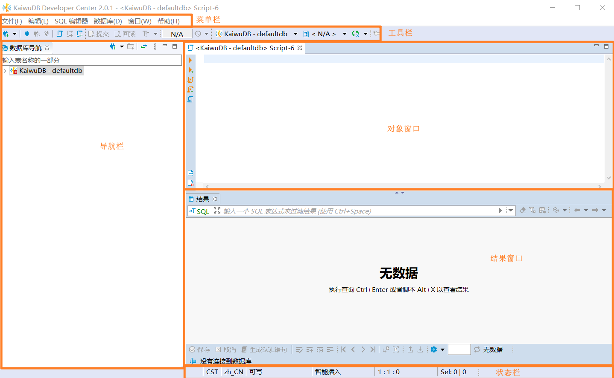

## 时序数据

::: warning 说明
避免频繁地创建、删除时序数据库、时序表。
:::

### 创建时序数据库

如需创建时序数据库，遵循以下步骤。

1. 在数据库导航区，右键单击**时序数据库**，然后选择**新建时序数据库**。

   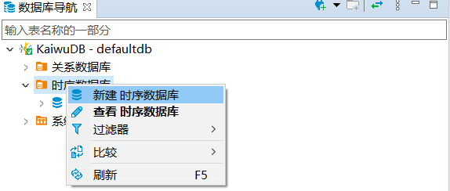

2. 在**创建时序数据库**窗口，填写数据库名称，设置数据库生命周期，然后单击**确定**。默认情况下，数据库的生命周期为 `0` 天，即永不过期。

   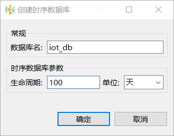

   创建成功后，新建数据库将自动显示在数据库导航区内，继承 KWDB 数据库系统的角色和用户设置。

   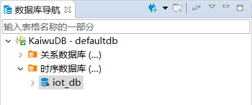

### 创建时序表

如需创建时序表，遵循以下步骤。

1. 在数据库导航区，选择要操作的数据库和模式。
2. 右键单击**时序表**，然后选择**新建时序表**。

   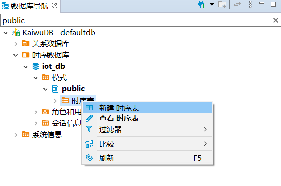

   系统将自动创建名为 `newtable` 的表，并打开对象窗口。

3. 在**属性**页签，填写表名，配置表的生命周期。表名的最大长度为 128 字节。默认情况下，表的生命周期为 `0` 天， 即永不过期。
4. 在**字段**页签，至少添加两个字段。字段名的最大长度为 128 字节。第一个字段的数据类型必须为 timestamp 或 timestamptz 且非空。实际上，系统会将 timestamp 数据类型处理为 timestamptz 数据类型。

   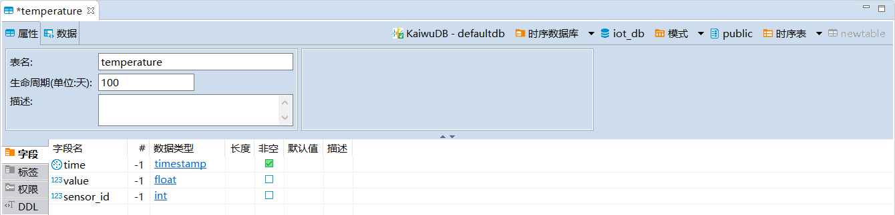

5. 在**标签**页签添加标签，设置标签名称、数据类型、长度、是否为主标签以及是否非空，然后单击**保存**。

   ::: warning 说明

   - 每张时序表至少需要设置一个主标签，且主标签必须为非空标签。
   - 标签名的最大长度为 128 字节。

   :::

   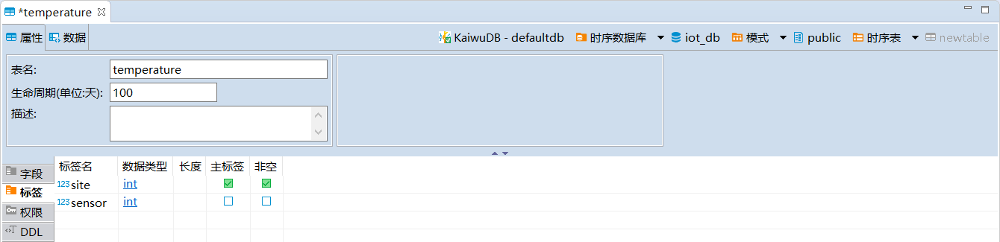

6. 在**执行修改**窗口，确认 SQL 语句无误，然后单击**执行**。

### 写入数据

::: warning 说明

- 系统支持为指定的列写入数据，对于未指定的列，如果该列支持 NULL 值，系统将自动插入默认值 `NULL`。如果该列不支持 NULL 值，系统将提示 `Null value in column %s violates null-null constraints.`。
- 输入 TIMESTAMP 或 TIMESTAMPTZ 类型数据时，日期部分需要使用短横线（`-`）、双引号（`""`）或正斜杠符号（`/`）分割，时间部分需要使用冒号（`:`）分割，支持精确到微秒，例如：`'2023-01-25 10:10:10.123'`、`'2023 01 25 10:10:10.123'` 或 `'2023/01/25 10:10:10.123'`。
- KWDB 支持对具有相同时间戳的数据进行去重处理。默认情况下，后写入的数据会覆盖已存在的具有相同时间戳的数据。用户可通过 `SET CLUSTER SETTING ts.dedup.rule=[ merge | override | discard]` 语句设置数据去重策略。有关详细信息，参见[集群参数配置](../../db-operation/cluster-settings-config.md)。
  :::

如需向时序表中写入数据，遵循以下步骤。

1. 在数据库导航区，右键单击需要编辑数据的表，然后选择**编辑数据**。
2. 在**数据**页面，单击页面下方的**添加新行**按钮，向表中加入相应的数据。

   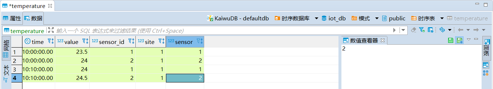

3. 如需查看对应的 SQL 语句，单击**生成 SQL 语句**，然后单击**执行**。
4. 如果无需查看 SQL 语句，单击**保存**。

### 查询数据

在数据库导航区，双击需要查看的时序表，即可查看表的属性和数据信息。

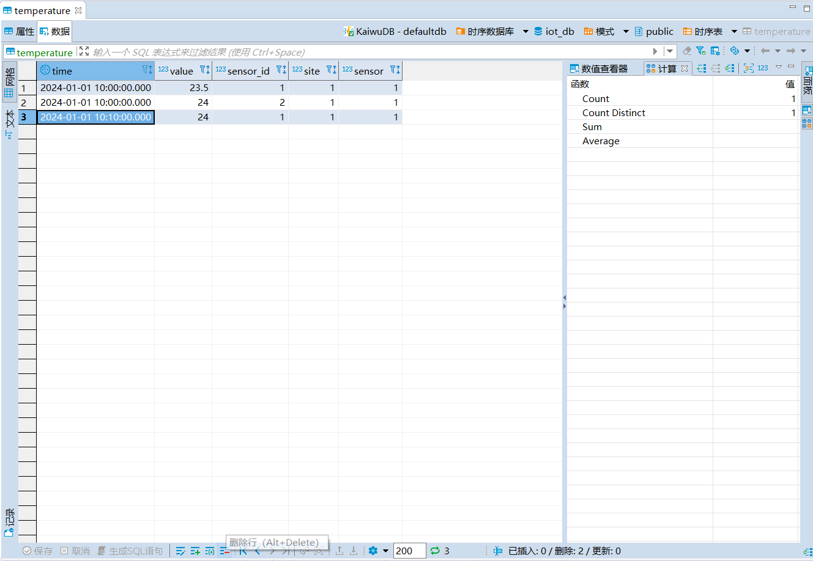

## 关系数据

::: warning 说明
避免频繁地创建、删除关系数据库、关系表。
:::

### 创建关系数据库

如需创建关系数据库，遵循以下步骤。

1. 在数据库导航区，右键单击**关系数据库**，然后选择**新建关系数据库**。

   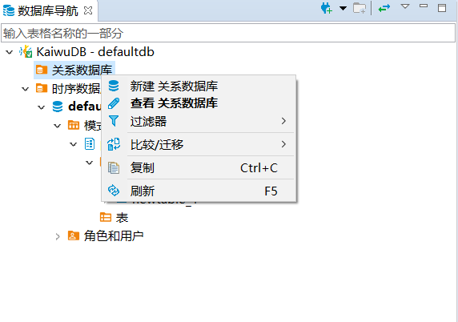

2. 在**创建数据库**窗口，填写数据库名称，然后单击**确定**。

   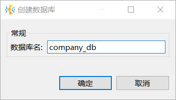

   创建成功后，新建数据库将自动显示在数据库导航区内，继承 KWDB 数据库系统的角色和用户设置。

   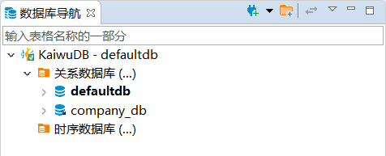

### 创建关系表

如需创建关系表，遵循以下步骤。

1. 在数据库导航区，选择要操作的数据库和模式。

2. 右键单击**表**，然后选择**新建表**。

   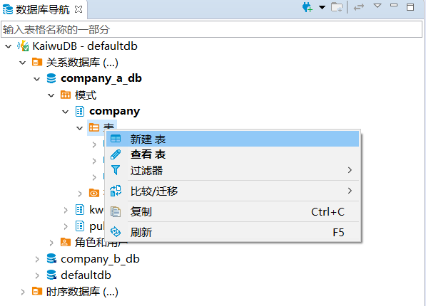

   系统将自动创建名为 `newtable` 的表，并打开对象窗口。

3. 在对象窗口，填写表名、描述信息、添加字段，然后单击**保存**。

   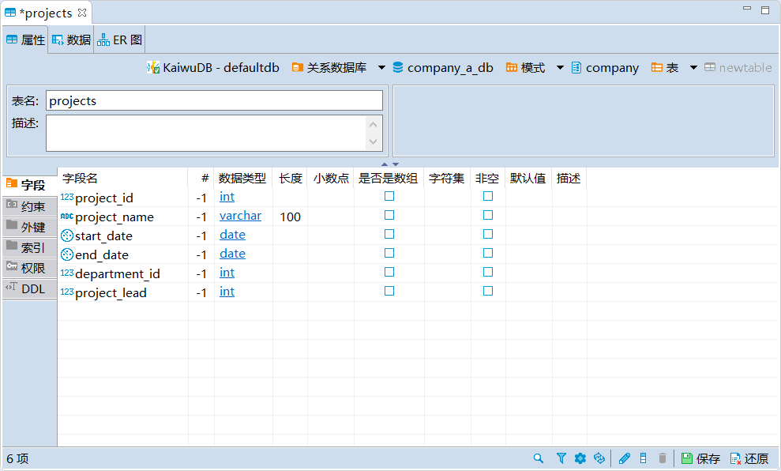

4. 在**执行修改**窗口，确认 SQL 语句无误，然后单击**执行**。

### 写入数据

如需向关系表中写入数据或者修改表中数据，遵循以下步骤。

1. 在数据库导航区，右键单击需要修改的表，然后选择**编辑表**。

   

2. 在**属性**页签，编辑字段、约束、外键、索引或权限，然后单击**保存**。

3. 切换到**数据**页签，单击表格最下方的**添加新行**按钮，向表中加入相应的数据。

   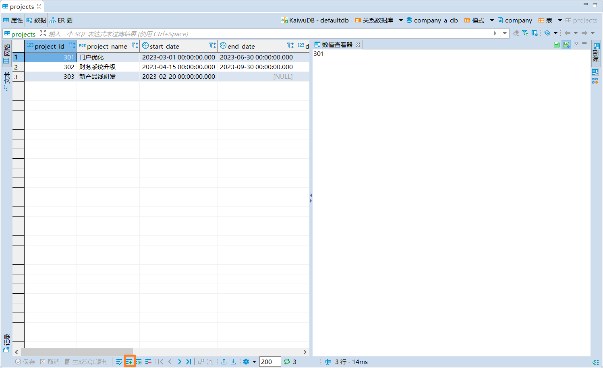

4. 如需查看相应的 SQL 语句，单击**生成 SQL 语句**，然后单击**执行**。
5. 如果无需查看 SQL 语句，单击**保存**。

### 查询数据

在数据库导航区，双击要查看的表，即可查看表的属性、数据和 ER 图信息。

下表列出了属性、数据和 ER 图中的信息：

| 页面  | 信息                                                       |
| ----- | ---------------------------------------------------------- |
| 属性  | 表名、描述、字段、约束、外键、索引、权限和建表语句等信息。 |
| 数据  | 以网格和文本形式查看表内数据。                             |
| ER 图 | 以图形方式展示数据库实体、属性和关系之间的结构和链接。     |
