# 使用 KaiwuDB 开发者中心管理 KWDB

本节演示如何使用 KaiwuDB 开发者中心可视化工具管理 KWDB 多模数据库，具体包括：

- **关系数据操作**：管理相对静态的基础数据，如设备信息、用户档案等
- **时序数据操作**：处理按时间序列变化的动态数据，如传感器读数、监控指标等
- **跨模查询**：通过联合查询关系库和时序库数据，实现多模数据融合分析

## 关系数据操作

### 创建关系数据库

**前提条件**：

用户是 `admin` 角色的成员。默认情况下，`root` 用户属于 `admin` 角色。

**步骤**：

1. 在数据库导航区，右键单击**关系数据库**，选择**新建关系数据库**。

   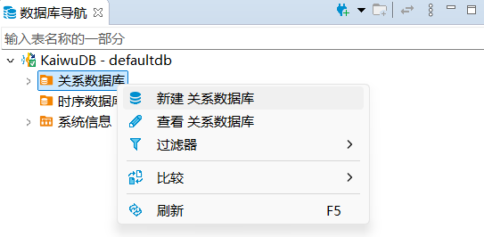

2. 在**创建数据库**窗口，填写数据库名称，单击**确定**。

   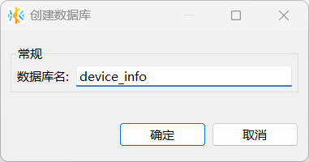

   创建成功后，新建数据库将自动显示在数据库导航区内，继承 KWDB 数据库系统的角色和用户设置。

### 创建关系表

**前提条件**：

用户是 `admin` 角色的成员或者拥有所属数据库的 CREATE 权限。默认情况下，`root` 用户属于 `admin` 角色。

**步骤**：

1. 在数据库导航区，选择要操作的数据库和模式。

2. 右键单击**表**，选择**新建表**。

   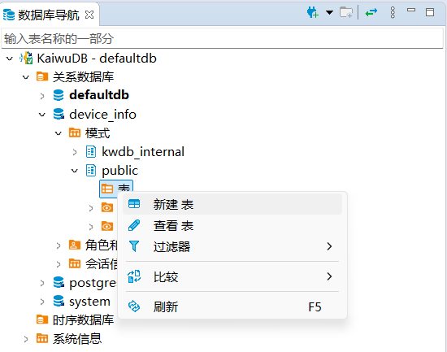

   系统将自动创建名为 `newtable` 的表，并打开对象窗口。

3. 在对象窗口，填写表名，添加字段，单击**保存**。

   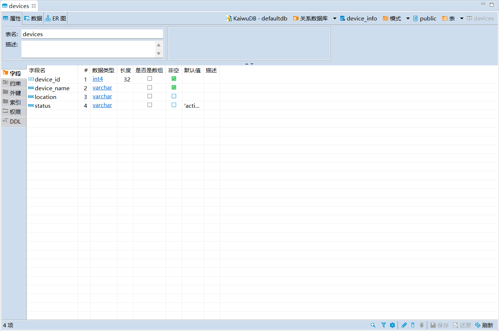

4. 在**执行修改**窗口，确认 SQL 语句无误，单击**执行**。

### 写入数据

**前提条件**：

用户是 `admin` 角色的成员或者拥有目标表的 INSERT 权限。默认情况下，`root` 用户属于 `admin` 角色。

**步骤**:

1. 在数据库导航区，双击单击需要修改的表。

2. 在**数据**页签，单击表格下方的**添加新行**按钮，向表中添加相应数据。

   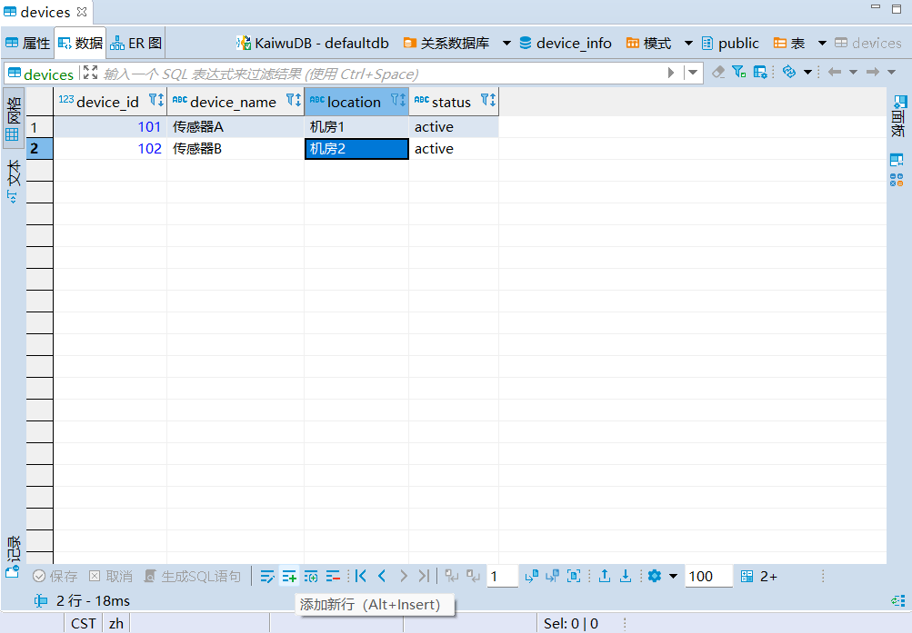

3. 单击**保存**。

### 查询数据

**前提条件**：

用户是 `admin` 角色的成员或者拥有目标表的 SELECT 权限。默认情况下，`root` 用户属于 `admin` 角色。

**步骤**：

1. 在数据库导航区，双击要查看的表，即可在**数据**页签中查看表数据。

   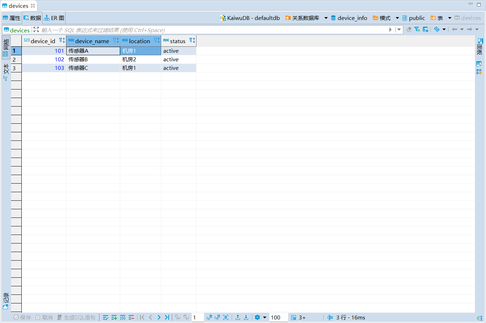

## 时序数据操作

### 创建时序数据库

**前提条件**：

用户是 `admin` 角色的成员。默认情况下，`root` 用户属于 `admin` 角色。

**步骤**：

1. 在数据库导航区，右键单击**时序数据库**，选择**新建时序数据库**。
   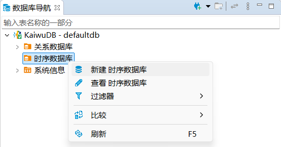

2. 在**创建时序数据库**窗口，填写数据库名称，单击**确定**。

   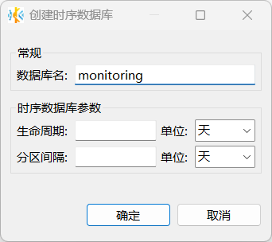

    创建成功后，新建数据库将自动显示在数据库导航区内，继承 KWDB 数据库系统的角色和用户设置。

### 创建时序表

**前提条件**：

用户是 `admin` 角色的成员或者拥有所属数据库的 CREATE 权限。默认情况下，`root` 用户属于 `admin` 角色。

**步骤**：

1. 在数据库导航区，选择要操作的数据库和模式。
2. 右键单击**时序表**，选择**新建时序表**。

   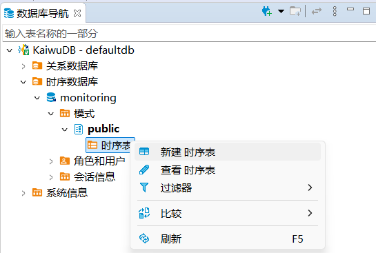

   系统将自动创建名为 `newtable` 的表，并打开对象窗口。

3. 在**属性**页签，填写表名。
4. 在**字段**页签，修改或新建字段，设置字段名称、数据类型、长度、是否非空、默认值和描述信息。注意第一个字段的数据类型必须为 `timestamp` 或 `timestamptz` 且非空。

   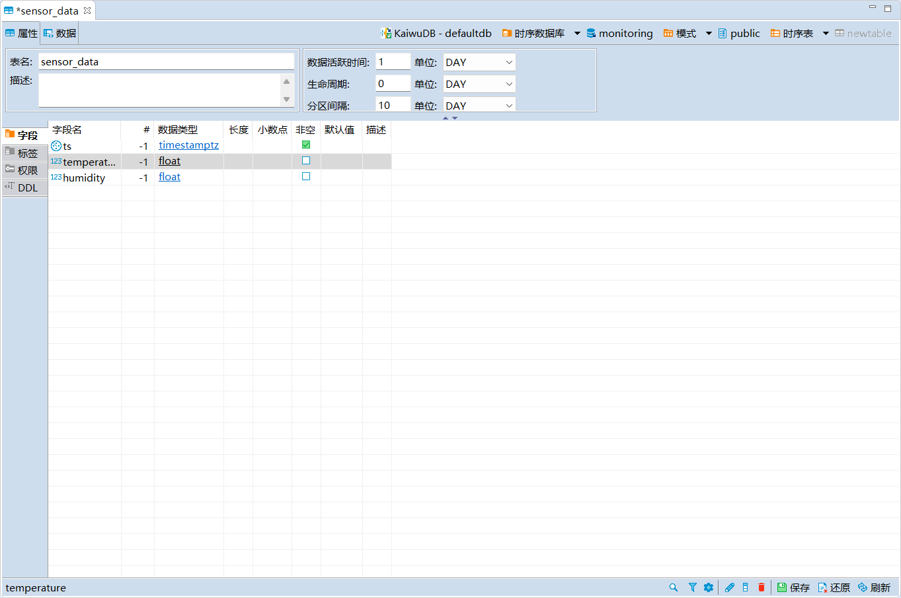

5. 在**标签**页签，修改或添加标签，设置标签名称、数据类型、长度、是否为主标签，是否非空和描述信息，单击**保存**。

    ::: warning 说明

    - 每张时序表至少需要设置一个主标签，且主标签必须为非空标签。
    - 标签名暂时不支持中文字符，最大长度为 128 字节。

    :::

    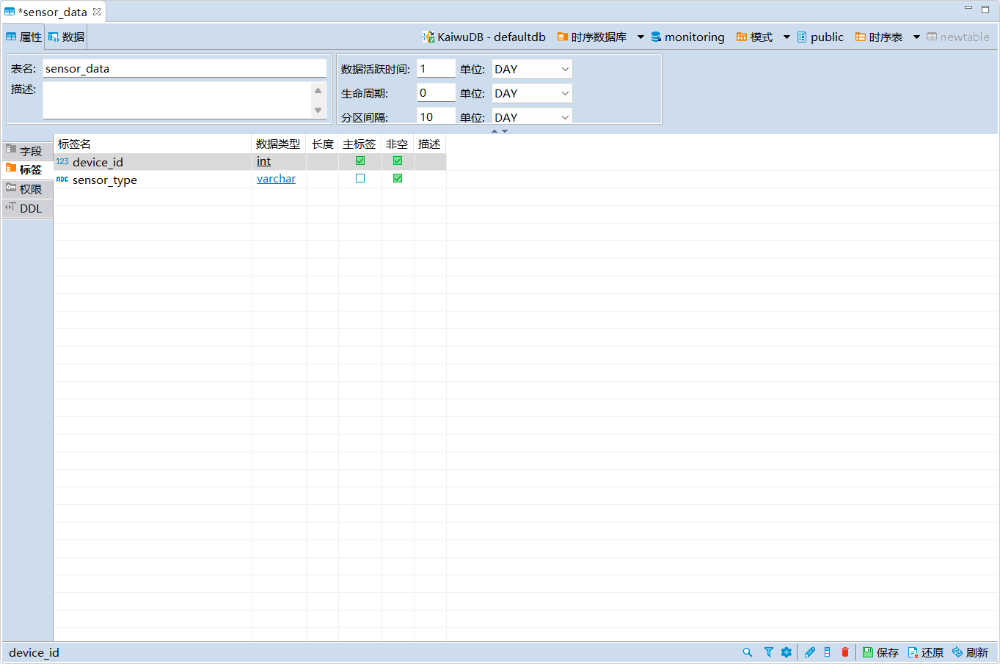

6. 在**执行修改**窗口，确认 SQL 语句无误，然后单击**执行**。

### 写入数据

**前提条件**：

用户是 `admin` 角色的成员或者拥有目标表的 INSERT 权限。默认情况下，`root` 用户属于 `admin` 角色。

**步骤**：

1. 在数据库导航区，右键单击需要编辑数据的表，选择**编辑数据**。
2. 在**数据**页面，单击页面下方的**添加新行**按钮，向表中添加相应数据。

   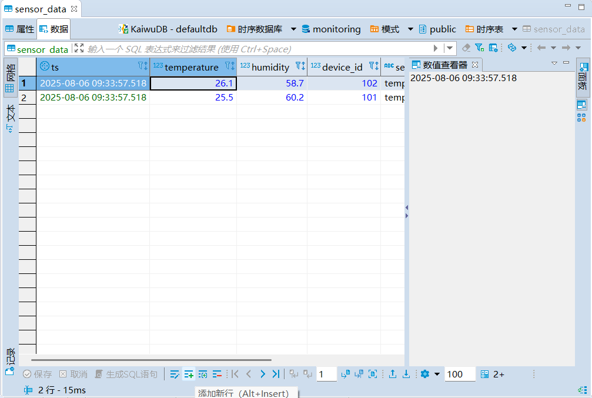

3. 单击**保存**。

### 查询数据

**前提条件**：

用户是 `admin` 角色的成员或者拥有目标表的 SELECT 权限。默认情况下，`root` 用户属于 `admin` 角色。

**步骤**：

1. 在数据库导航区，双击要查看的表，即可在**数据**页签中查看表数据。

   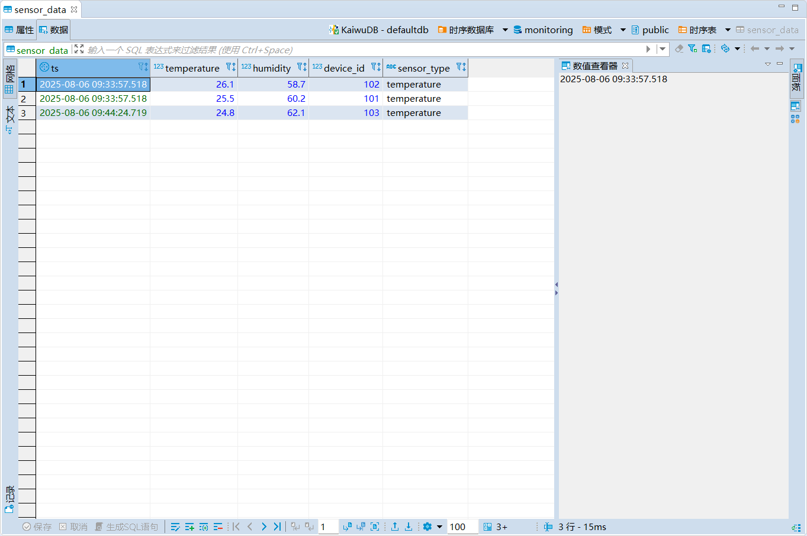

## 跨模查询

KaiwuDB 开发者中心支持使用 SQL 编辑器完成 KWDB 跨模查询操作。

**前提条件**：

用户是 `admin` 角色的成员或者拥有目标表的 SELECT 权限。默认情况下，`root` 用户属于 `admin` 角色。

**步骤**：

1. 单击菜单栏中的 SQL 编辑器，选择**新建 SQL 编辑器**。

   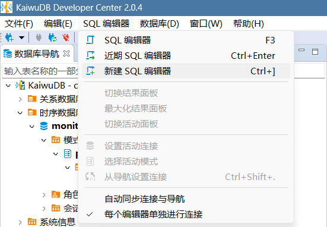

2. 在新建 SQL 编辑器页面，输入跨模查询 SQL 语句。

   

3. 单击左侧的**执行 SQL 语句**按钮，即可获取查询结果。

   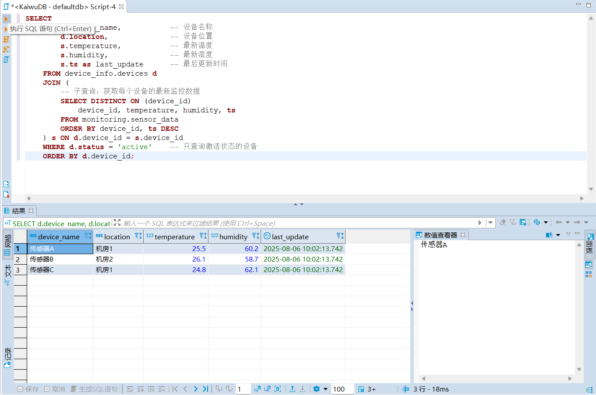