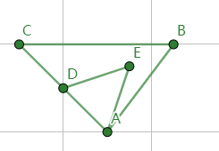

# 时序数据类型

KWDB 时序数据支持以下数据类型：

- 时间类型
- 数值类型
- 布尔类型
- 字符类型

下表列出了 KWDB 支持修改的时序数据类型、默认宽度、最大宽度、可转换的数据类型和特殊要求。

| 原数据类型  | 默认宽度 | 最大宽度   | 支持转换的数据类型                                   | 说明                                                                                            |
| ----------- | -------- | ---------- | ---------------------------------------------------- | ----------------------------------------------------------------------------------------------- |
| TIMESTAMP   | -        | -          | TIMESTAMPTZ、INT8、FLOAT4、FLOAT8                     | 标签不支持该类型。TIMESTAMP 转 INT8 时，输出结果固定为毫秒精度的数字，即 13 位数字。TIMESTAMP 转 FLOAT4 时，输出结果只能保证约前 7 位有效数字的精度。TIMESTAMP 转 FLOAT8 时，输出结果只能保证约前 15-17 位有效数字的精度。    |
| TIMESTAMPTZ | -        | -          | TIMESTAMP、INT8、FLOAT4、FLOAT8                                              | 标签不支持该类型。TIMESTAMPTZ 转 INT8 时，输出结果固定为毫秒精度的数字，即 13 位数字。TIMESTAMPTZ 转 FLOAT4 时，输出结果只能保证约前 7 位有效数字的精度。TIMESTAMPTZ 转 FLOAT8 时，输出结果只能保证约前 15-17 位有效数字的精度。                                                                              |
| INT2        | 2 字节   | -          | INT4、INT8、VARCHAR                                  | INT2 转 VARCHAR 时，VARCHAR 的最小宽度为 6。                                                    |
| INT4        | 4 字节   | -          | INT8、VARCHAR                                        | INT4 转 VARCHAR 时，VARCHAR 的最小宽度为 11。                                                   |
| INT8        | 8 字节   | -          | VARCHAR                                              | INT8 转 VARCHAR 时，VARCHAR 的最小宽度为 20。                                                   |
| FLOAT4      | 4 字节   | -          | FLOAT、VARCHAR                                       | REAL 转 VARCHAR 时，VARCHAR 的最小宽度为 30。                                                   |
| FLOAT8      | 8 字节   | -          | VARCHAR                                              | FLOAT 转 VARCHAR 时，VARCHAR 的最小宽度为 30。                                                  |
| CHAR        | 1 字节   | 1023       | NCHAR、VARCHAR、NVARCHAR                             | CHAR 转 NCHAR 或 NVARCHAR 时，NCHAR 或 NVARCHAR 的宽度不得小于原宽度的 ¼。                     |
| VARCHAR     | 254 字节 | 65534 字节 | CHAR、NCHAR、NVARCHAR、INT2、INT4、INT8、REAL、FLOAT | VARCHAR 转 NCHAR 或 NVARCHAR 时，NCHAR 和 NVARCHAR 的宽度不得小于原宽度的 ¼。                  |
| NCHAR       | 1 字符   | 254 字符   | CHAR、VARCHAR、NVARCHAR                              | NCHAR 转 CHAR 或 VARCHAR 时，CHAR 和 VARCHAR 的宽度不得小于原宽度的 4 倍。                      |
| NVARCHAR    | 63 字符  | 16383 字符 | CHAR、VARCHAR、NCHAR                                 | NVARCHAR 转 CHAR 或 VARCHAR 时，CHAR 和 VARCHAR 的宽度不得小于原宽度的 4 倍。标签不支持该类型。 |

::: warning 说明

- 转换后的数据类型宽度必须大于原数据类型的宽度。例如，INT4 可以转成 INT8，但不能转成 INT2，CHAR(200) 可以转为 VARCHAR (254), 但不能转为 VARCHAR (100)。
- CHAR、VARCHAR、NCHAR、NVARCHAR 字符类型支持同数据类型的宽度转换，但只能增加宽度不能降低宽度。例如，CHAR(100) 可以转为 CHAR(200)，不能转为 CHAR(50)。

:::

## 时间类型

KWDB 时序数据库支持 TIMESTAMP 和 TIMESTAMPTZ 时间类型。

### 类型描述

时间戳包括 TIMESTAMP 和 TIMESTAMPTZ 两个变体。时间戳数值允许精确到纳秒。时间戳常量表示特定日期和时间值的固定值。通常情况下，时间戳常量不可更改。时间戳常量的格式为 `timestamp 'YYYY-MM-DD HH:MM:SS.SSS'`，例如 `timestamp '2023-10-19 15:30:00'`。

| 名称        | 别名                        | 描述                                                               |
| ----------- | --------------------------- | ------------------------------------------------------------------ |
| TIMESTAMP   | TIMESTAMP WITHOUT TIME ZONE | 以协调世界时（Coodinated Universal Time，UTC）格式存储日期和时间。 |
| TIMESTAMPTZ | TIMESTAMP WITH TIME ZONE    | 将时间戳数值从 UTC 时区转换为客户端会话时区。                      |

::: warning 说明

- KWDB 在存储 TIMESTAMPTZ 类型时不包含时区数据。
- KWDB 默认时区为 UTC。因此 TIMESTAMPTZ 的默认值与 TIMESTAMP 一致。
- 时序表第一列（时间戳列）指定为 TIMESTAMP 时，实际处理与 TIMESTAMPTZ 一致。
- KWDB 不支持使用 `ALTER COLUMN ... SET DATA TYPE` 语句更改已有 TIMESTAMP/TIMESTAMPTZ 类型列的精度。

:::

KWDB 时序数据库 timestamp、timestamptz 时间类型支持设置时间戳精度为 3（毫秒）、6（微秒）、9（纳秒）。默认情况下，时间戳精度为 3（毫秒）。时间戳精度指定了秒字段中保留的小数位数。例如，将 `TIMESTAMPTZ` 值指定为 `TIMESTAMPTZ(3)` 会将时间部分截断为毫秒。创建表或添加列的时候，如未指定时间戳列的精度，则采用默认精度。

目前，KWDB 支持采用以下方式写入时间戳：

- `now()` 函数: 根据该列精度转换为 INT64，判断是否超出该精度所支持的时间范围，然后再写入
- STRING 形式时间戳：根据该列精度转换为 INT64，判断是否超出该精度所支持的时间范围，超出精度的部分以四舍五入形式进行截取，然后再进行写入
- INT 形式的时间戳：根据该列时间精度判断是否超出该精度所支持的时间范围，然后再写入

KWDB 支持在查询中对列类型为时间戳、时间戳常量以及结果类型为时间戳的函数和表达式按最高精度进行加减运算并返回运算结果。运算结果支持使用大于号（`>`）、小于号（`<`）、等号（`=`）、大于等于号（`>=`）、小于等于号（`<=`）进行比较。有关详细信息，参见[简单查询](../dml/ts-db/ts-select.md).

### 类型转换

TIMESTAMP 类型的数据可以转换为以下任何一种数据类型。

| 类型 | 描述 |
| --- | --- |
| INT | 超出转换类型的范围时，系统报错。 |
| FLOAT | 结果转换为毫秒数。 |
| STRING | - |
| TIMESTAMPTZ | - |

TIMESTAMPTZ 类型的数据可以转换为以下任何一种数据类型。

| 类型 | 描述 |
| --- | --- |
| INT | 超出转换类型的范围时，系统报错。 |
| FLOAT | 结果转换为毫秒数。 |
| STRING | - |
| TIMESTAMP | - |

### 示例

示例 1：以下示例创建一个名为 `timestamps` 的表，包括 TIMESTAMP 和 TIMESTAMPTZ 时间戳类型的列。

```sql
-- 1. 创建表 timestamps。

create table timestamps (ks timestamp not null, c1 timestamp, c2 timestamptz) tags (site int not null) primary tags (site);
CREATE TABLE

-- 2. 查看表的列。

show columns from timestamps;
    column_name |  data_type  | is_nullable | column_default | generation_expression |  indices  | is_hidden | is_tag
--------------+-------------+-------------+----------------+-----------------------+-----------+-----------+---------
    ks          | TIMESTAMPTZ |    false    | NULL           |                       | {primary} |   false   | false
    c1          | TIMESTAMP   |    true     | NULL           |                       | {}        |   false   | false
    c2          | TIMESTAMPTZ |    true     | NULL           |                       | {}        |   false   | false
    site        | INT4        |    false    | NULL           |                       | {}        |   false   |  true
(4 rows)
```

示例 2：以下示例创建一个名为 `t` 的表并指定时间戳精度。

```sql
-- 1. 创建表 t。

CREATE TABLE t(ts timestamptz(3), ts1 timestamp, ts2 timestamp(6), ts3 timestamp(9)) tags(ptag int not null) primary tags(ptag);

-- 2. 查看创建的表。

SHOW CREATE TABLE t;
  table_name |              create_statement
-------------+----------------------------------------------
  t          | CREATE TABLE t (
             |     ts TIMESTAMPTZ(3) NOT NULL,
             |     ts1 TIMESTAMP(3) NULL,
             |     ts2 TIMESTAMP(6) NULL,
             |     ts3 TIMESTAMP(9) NULL,
             | ) TAGS (
             |     ptag INT4 NOT NULL ) PRIMARY TAGS(ptag)
```

## 数值类型

KWDB 时序数据库支持的数值类型包括整数类型和浮点类型。

### 整数类型

#### 类型描述

KWDB 支持有符号的整数数据类型。

| 名称 | 别名 | 存储空间 | 取值范围                                    |
| ---- | ----------------------------------- | --------------------------------------- | ------------------------------------------- |
| INT2 | SMALLINT                            | 2 字节                                  | -32768 ~ +32767                             |
| INT4 | - INT <br>- INTEGER                      | 4 字节                                  | -2147483648 ~ +2147483647                   |
| INT8 | - INT64 <br>- BIGINT                     | 8 字节                                  | -9223372036854775808 ~ +9223372036854775807 |

::: warning 说明

整数类型支持将数值作为文本输入，例如 `42`、`-1234`、`0xCAFE`。

:::

#### 类型转换

整数类型的数据可以转换为以下任何一种数据类型。

| 类型 | 描述 |
| --- | --- |
| BOOL | 非零的值转换为 `true`，零转换为 `false`。 |
| FLOAT | - |
| STRING | 根据转换后的 STRING 类型的长度进行截断。 |
| TIMESTAMP | 按照毫秒数进行转换。|
| TIMESTAMPTZ | 按照毫秒数进行转换。 |

#### 示例

以下示例创建一个名为 `ints` 的表，包括具有整数类型的列。

```sql
-- 1. 创建表 ints。

create table ints(ts timestamp not null,c1 int,c2 smallint,c3 bigint,c4 integer,c5 int2,c6 int4,c7 int8,c8 int64) tags (tag1 int not null) primary tags (tag1);
CREATE TABLE

-- 2. 查看表的列。

show columns from ints;
  column_name |  data_type  | is_nullable | column_default | generation_expression |  indices  | is_hidden | is_tag
--------------+-------------+-------------+----------------+-----------------------+-----------+-----------+---------
  ts          | TIMESTAMPTZ |    false    | NULL           |                       | {primary} |   false   | false
  c1          | INT4        |    true     | NULL           |                       | {}        |   false   | false
  c2          | INT2        |    true     | NULL           |                       | {}        |   false   | false
  c3          | INT8        |    true     | NULL           |                       | {}        |   false   | false
  c4          | INT4        |    true     | NULL           |                       | {}        |   false   | false
  c5          | INT2        |    true     | NULL           |                       | {}        |   false   | false
  c6          | INT4        |    true     | NULL           |                       | {}        |   false   | false
  c7          | INT8        |    true     | NULL           |                       | {}        |   false   | false
  c8          | INT8        |    true     | NULL           |                       | {}        |   false   | false
  tag1        | INT4        |    false    | NULL           |                       | {}        |   false   |  true
(10 rows)
```

### 浮点类型

#### 类型描述

KWDB 支持 FLOAT8 和 FLOAT4 不确定精度的浮点数据类型，最大精度为 17 位十进制小数。浮点类型支持将数值文本，例如 `1.414` 或 `1234`，作为输入。

在内部处理时，KWDB 使用 64 位双精度 IEEE 754 格式表示浮点数。

| 名称   | 别名           | 存储空间 |
| ------ | --------------------------------------------- | --------------------------------------- |
| FLOAT8 | - DOUBLE <br> - DOUBLE PRECISION <br>- FLOAT | 8 字节                                  |
| FLOAT4 | REAL                                        | 4 字节                                  |

FLOAT 列存储最多 8 个字节的值。但由于元数据的影响，实际存储大小可能会更大。

FLOAT 列支持在查询时通过 `CAST(column as DECIMAL(precision, scale))` 限制显示的精度。其中，`precision` 为小数点左侧和右侧位数之和的最大值，`scale` 为小数点右侧的精确位数。`precision` 不能小于 `scale`。使用 `DECIMAL(precision)` 等效于 `DECIMAL(precision, 0)`。

#### 类型转换

浮点类型的数据可以转换为以下任何一种数据类型。

| 类型 | 描述 |
| --- | --- |
| BOOL | 非零的值转换为 `true`，零转换为 `false`。 |
| FLOAT | 转换为 FLOAT4 类型时，会损失精度。|
| STRING | 根据转换后的 STRING 类型的长度进行截断。 |

#### 示例

以下示例创建一个名为 `floats` 的表，向表中写入数据并使用 CAST 函数限制浮点类型的列的显示精度。

```sql
-- 1. 创建表 floats。

create table floats(ts timestamp not null,c1 float,c2 real,c3 double precision) tags (tag1 int not null) primary tags (tag1);
CREATE TABLE

-- 2. 查看表的列。

show columns from floats;
  column_name |  data_type  | is_nullable | column_default | generation_expression |  indices  | is_hidden | is_tag
--------------+-------------+-------------+----------------+-----------------------+-----------+-----------+---------
  ts          | TIMESTAMPTZ |    false    | NULL           |                       | {primary} |   false   | false
  c1          | FLOAT8      |    true     | NULL           |                       | {}        |   false   | false
  c2          | FLOAT4      |    true     | NULL           |                       | {}        |   false   | false
  c3          | FLOAT8      |    true     | NULL           |                       | {}        |   false   | false
  tag1        | INT4        |    false    | NULL           |                       | {}        |   false   |  true
(5 rows)

-- 3. 向具有浮点类型的列中写入数值。

INSERT INTO floats VALUES (now(), 2.718281828459,3.1415926,1e1,1);
INSERT 1

-- 4. 查看表中的数据。

select * from floats;
               ts               |       c1       |    c2    | c3 | tag1
--------------------------------+----------------+----------+----+-------
  2024-02-05 01:32:15.569+00:00 | 2.718281828459 | 3.141593 | 10 |    1
(1 row)

-- 5. 通过 CAST 函数限制浮点类型的列的显示精度。

select cast(c1 as decimal (8,6)),cast (c2 as decimal (8,2)) from floats;
c1      |c2
--------+-----
2.718282|3.14
(1 row)
```

## 布尔类型

### 类型描述

布尔类型（BOOL）存储布尔值 `false` 或 `true`。通常情况下，布尔值的宽度为 1 个字节。但由于元数据的影响，实际存储大小可能会更大。

| 名称 | 别名 | 存储空间 |
| ---- | ----------------------------------- | --------------------------------------- |
| BOOL | BOOLEAN                             | 1 字节                                  |

布尔值有两个预定义的命名常量：`TRUE` 和 `FALSE`（不区分大小写）。

用户可以通过数值的强制类型转换来获取布尔值。默认情况下，零会被强制转换为 `FALSE`，任何非零的值会被强制转换为 `TRUE`，如下所示：

- `CAST(0 AS BOOL) (false)`
- `CAST(119 AS BOOL) (true)`

### 类型转换

布尔类型的数据可以转换为以下任何一种数据类型。

| 类型 | 描述 |
| --- | --- |
| INT | `true` 转换为 1，`false` 转换为 0。|
| FLOAT | `true` 转换为 1，`false` 转换为 0。|
| STRING | - |

### 示例

以下示例创建一个名为 `bools` 的表，包括具有布尔类型的列。

```sql
-- 1. 创建表 bools。

create table bools(ts timestamp not null,c1 bool,c2 boolean) tags (tag1 int not null) primary tags (tag1);
CREATE TABLE

-- 2. 查看表的列。

show columns from bools;
  column_name |  data_type  | is_nullable | column_default | generation_expression |  indices  | is_hidden | is_tag
--------------+-------------+-------------+----------------+-----------------------+-----------+-----------+---------
  ts          | TIMESTAMPTZ |    false    | NULL           |                       | {primary} |   false   | false
  c1          | BOOL        |    true     | NULL           |                       | {}        |   false   | false
  c2          | BOOL        |    true     | NULL           |                       | {}        |   false   | false
  tag1        | INT4        |    false    | NULL           |                       | {}        |   false   |  true
(4 rows)
```

## 字符类型

### VARBYTES

#### 类型描述

VARBYTES 类型是一种可变长的二进制字符类型，以实际的二进制字符串长度存储数据。如果实际数据长度小于指定的最大长度，不会补齐。如果实际数据长度超过最大长度，则会报错。

VARBYTES 类型的数据基于二进制值进行存储和排序。

| 名称 | 存储空间 |
| ----------------------------------- | --------------------------------------- |
| VARBYTES                            | 0 ~ 65534 字节                           |

#### 示例

以下示例创建一个名为 `varbytes` 的表，包括具有 VARBYTES 字符类型的列。

```sql
-- 1. 创建表 varbytes。

create table varbytes(ts timestamp not null,c1 varbytes,c2 varbytes(65534)) tags (tag1 int not null) primary tags (tag1);
CREATE TABLE

-- 2. 查看表的列。

show columns from varbytes;
  column_name |    data_type    | is_nullable | column_default | generation_expression |  indices  | is_hidden | is_tag
--------------+-----------------+-------------+----------------+-----------------------+-----------+-----------+---------
  ts          | TIMESTAMPTZ     |    false    | NULL           |                       | {primary} |   false   | false
  c1          | VARBYTES(254)   |    true     | NULL           |                       | {}        |   false   | false
  c2          | VARBYTES(65534) |    true     | NULL           |                       | {}        |   false   | false
  tag1        | INT4            |    false    | NULL           |                       | {}        |   false   |  true
(4 rows)
```

### CHAR

#### 类型描述

CHAR 类型是一种定长字符类型，其存储长度由指定长度确定。每个字符所占的字节长度取决于数据库指定的编码方式。当向时序表写入 CHAR 类型数据时，KWDB 按照字节检查长度。如果实际数据长度小于指定长度，用空格补齐。如果实际数据长度超过指定长度，则会报错。

CHAR 类型的格式为 `CHAR[n)`，其中 `n` 为字节数。如未指定长度，则默认为 1 字节。

| 名称 | 别名 | 存储空间 |
| ---- | ----------------------------------- | --------------------------------------- |
| CHAR | CHARACTER                           | 0 ~ 1023 字节                          |

#### 示例

以下示例创建一个具有 CHAR 列的表 `chars` 并向表中写入数据。

```sql
-- 1. 创建表 chars。

create table chars(ts timestamp not null,c1 char,c2 character,c3 char(1023)) tags (tag1 int not null) primary tags (tag1);
CREATE TABLE

-- 2. 查看表的列。

show columns from chars;
  column_name |  data_type  | is_nullable | column_default | generation_expression |  indices  | is_hidden | is_tag
--------------+-------------+-------------+----------------+-----------------------+-----------+-----------+---------
  ts          | TIMESTAMPTZ |    false    | NULL           |                       | {primary} |   false   | false
  c1          | CHAR        |    true     | NULL           |                       | {}        |   false   | false
  c2          | CHAR        |    true     | NULL           |                       | {}        |   false   | false
  c3          | CHAR(1023)  |    true     | NULL           |                       | {}        |   false   | false
  tag1        | INT4        |    false    | NULL           |                       | {}        |   false   |  true
(5 rows)

-- 3. 向表中写入数据。

insert into chars values(now(),'s','9','a1b2c3d4', 1);
INSERT 1

-- 4. 查看表的内容。

select * from chars;
               ts               | c1 | c2 |    c3    | tag1
--------------------------------+----+----+----------+-------
  2024-02-05 01:54:05.369+00:00 | s  |  9 | a1b2c3d4 |    1
(1 row)
```

### NCHAR

#### 类型描述

NCHAR 类型是一种定长字符类型，其存储长度由指定长度确定。NCHAR 类型的数据存储根据定义的字符长度进行，使用固定的 Unicode 编码。当向时序表中写入 NCHAR 类型数据时，KWDB 将按照字符数检查长度，如果实际数据长度小于指定长度，用空格补齐。如果实际数据长度超过指定长度，则会报错。

NCHAR 类型的格式为 `NCHAR[n)`，其中 `n` 为字符数。如未指定长度，则默认为 1 字符。

| 名称 | 存储空间 |
| ----------------------------------- | --------------------------------------- |
| NCHAR                               | 0 ~ 255 字符                              |

#### 示例

以下示例创建一个具有 NCHAR 列的表 `nchars` 并向表中写入数据。

```sql
-- 1. 创建表 nchars。

create table nchars(ts timestamp not null,c1 nchar,c2 nchar(255)) tags (tag1 int not null) primary tags (tag1);
CREATE TABLE

-- 2. 查看表的列。

show columns from nchars;
  column_name |  data_type  | is_nullable | column_default | generation_expression |  indices  | is_hidden | is_tag
--------------+-------------+-------------+----------------+-----------------------+-----------+-----------+---------
  ts          | TIMESTAMPTZ |    false    | NULL           |                       | {primary} |   false   | false
  c1          | NCHAR       |    true     | NULL           |                       | {}        |   false   | false
  c2          | NCHAR(255)  |    true     | NULL           |                       | {}        |   false   | false
  tag1        | INT4        |    false    | NULL           |                       | {}        |   false   |  true
(4 rows)

-- 3. 向表中写入数据。

insert into nchars values(now(),'a','a1b2c3d4',1);
INSERT 1

-- 4. 查看表的内容。

select * from nchars;
               ts               | c1 |    c2    | tag1
--------------------------------+----+----------+-------
  2024-02-05 01:56:16.796+00:00 | a  | a1b2c3d4 |    1
(1 row)
```

### VARCHAR

#### 类型描述

VARCHAR 类型是一种可变长字符类型，存储长度由数据的实际长度确定。存储数据时，如果实际数据长度小于指定的最大长度，根据输入数据的字节实际长度进行存储，不会进行补齐。如果实际数据长度超过指定的最大长度，则会报错。单个字符所占的字节长度取决于数据库指定的编码方式。

VARCHAR 类型的格式为 `VARCHAR[n)`，其中 `n` 为字节数。如果未指定长度，默认为 254 字节。

| 名称 | 存储空间 |
| ----------------------------------- | --------------------------------------- |
| VARCHAR                             | 0 ~ 65534 字节                           |

#### 示例

以下示例创建一个具有 VARCHAR 列的表 `varchars` 并向表中写入数据。

```sql
-- 1. 创建表 varchars。

create table varchars(ts timestamp not null,c1 varchar,c2 varchar(65534)) tags (tag1 int not null) primary tags (tag1);
CREATE TABLE

-- 2. 查看表的列。

show columns from varchars;
  column_name |   data_type    | is_nullable | column_default | generation_expression |  indices  | is_hidden | is_tag
--------------+----------------+-------------+----------------+-----------------------+-----------+-----------+---------
  ts          | TIMESTAMPTZ    |    false    | NULL           |                       | {primary} |   false   | false
  c1          | VARCHAR(254)   |    true     | NULL           |                       | {}        |   false   | false
  c2          | VARCHAR(65534) |    true     | NULL           |                       | {}        |   false   | false
  tag1        | INT4           |    false    | NULL           |                       | {}        |   false   |  true
(4 rows)

-- 3. 向表中写入数据。

insert into nchars values(now(),'a','a1b2c3d4',1);
INSERT 1
```

### NVARCHAR

#### 类型描述

NVARCHAR 类型是一种可变长字符类型，其存储长度由实际字符的长度确定。如果实际数据的长度小于指定的最大长度，不会进行末尾补齐。如果实际数据的长度超过指定的最大长度，则会报错。NVARCHAR 类型的数据存储使用固定的 Unicode 编码。

NVARCHAR 类型的格式为 `NVARCHAR[n)`，其中 `n` 为字符数。如果未指定长度，默认为 63 字符。

| 名称 | 存储空间 |
| ----------------------------------- | --------------------------------------- |
| NVARCHAR                            | 0 ~ 16383 字符                         |

#### 示例

以下示例创建一个具有 NVARCHAR 列的表 `nvarchars` 并向表中写入数据。

```sql
-- 1. 创建表 nvarchars。

create table nvarchars(ts timestamp not null,c1 nvarchar,c2 nvarchar(16383)) tags (tag1 int not null) primary tags (tag1);
CREATE TABLE

-- 2. 查看表的列。

show columns from nvarchars;
  column_name |    data_type    | is_nullable | column_default | generation_expression |  indices  | is_hidden | is_tag
--------------+-----------------+-------------+----------------+-----------------------+-----------+-----------+---------
  ts          | TIMESTAMPTZ     |    false    | NULL           |                       | {primary} |   false   | false
  c1          | NVARCHAR(63)    |    true     | NULL           |                       | {}        |   false   | false
  c2          | NVARCHAR(16383) |    true     | NULL           |                       | {}        |   false   | false
  tag1        | INT4            |    false    | NULL           |                       | {}        |   false   |  true
(4 rows)

-- 3. 向表中写入数据。

insert into nvarchars values(now(),'a1b2c3d4','abc',1);
INSERT 1
```

### GEOMETRY

#### 类型描述

GEOMETRY 数据类型用于存储空间数据，支持存储点（POINT）、线（LINESTRING）、面（POLYGON）等几何图形对象。KWDB 支持对空间数据进行存储、计算和查询。

- 点：包含一组平面坐标，例如 `'POINT(1.0 1.0)'`。
- 线：包含至少两个点的坐标，例如 `'LINESTRING(1.0 1.0, 2.0 2.0)'`。
- 面：n 边形集合，可以包括一个或多个 n 边形。n 边形之间可以嵌套或者互相包含，表示具有孔洞的图形。每一个 n 边形都必须包括 n+1 个点，其中第⼀个点和第 n+1 个点必须相同，以确保面是封闭的。例如：
  - `'POLYGON((1.0 1.0, 2.0 2.0, 3.0 2.0, 1.0 1.0))'` 表示包含一个三角形的面。第⼀层括号表示整个面，第⼆层括号包括构成三角形的点的坐标。
  - `'POLYGON ((3.0 2.0, 4.5 4.0, 1.0 4.0, 3.0 2.0), (2.0 3.0, 3.5 3.5, 3.0 2.0, 2.0 3.0))'` 表示含有内部嵌套三角形的面。第一层括号表示整个面，第二层中，第一个括号表示下图 A、B、C 点组成的三角形，第二个括号表示由 D、E、A 点组成的三角形孔洞。

    

#### 示例

以下示例创建一个具有 GEOMETRY 列的表 `geos` 并向表中写入数据。

```sql
-- 1. 创建表 geos。

create table geos (k_timestamp timestamptz not null, l1 geometry, l2 geometry, l3 geometry) TAGS (site_id int2 not null, sensor_id int4) PRIMARY TAGS(site_id);
CREATE TABLE

-- 2. 查看创建的表 geos。

show create table geos;
        table_name        |           create_statement
--------------------------+----------------------------------------
  tsdb.public.geos        | CREATE TABLE geos (
                          |     k_timestamp TIMESTAMPTZ NOT NULL,
                          |     l1 GEOMETRY NULL,
                          |     l2 GEOMETRY NULL,
                          |     l3 GEOMETRY NULL,
                          | ) TAGS (
                          |     site_id INT2 NOT NULL,
                          |     sensor_id INT4 ) PRIMARY TAGS(site_id)
(1 row)

-- 3. 向表中写入数据。

INSERT INTO geos VALUES(now(),'Point(0.0 0.0)', 'Linestring(1.0 1.0, 2.0 2.0)', 'Polygon((1.0 1.0, 2.0 2.0, 3.0 2.0, 1.0 1.0))',1,1);
INSERT 1

-- 4. 查看表的内容。

select * from geos;
         k_timestamp        |       l1       |              l2              |                      l3                       |     site_id      |     sensor_id    |
----------------------------+----------------+------------------------------+-----------------------------------------------+------------------+-------------------
  2024-01-24 02:09:13+00:00 | Point(0.0 0.0) | Linestring(1.0 1.0, 2.0 2.0) | Polygon((1.0 1.0, 2.0 2.0, 3.0 2.0, 1.0 1.0)) |        1         |       1          |
(1 row)
```
