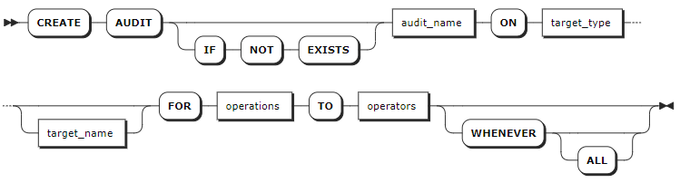
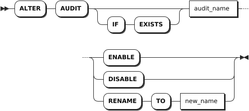
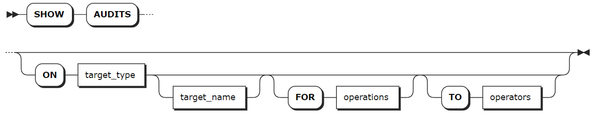
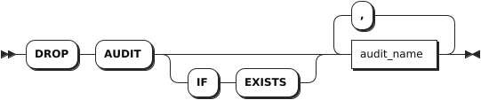

# 审计策略管理

数据库审计以安全事件为中心，以全面审计和精确审计为基础，实时记录数据库活动，对数据库操作进行细粒度审计的合规性管理。通过记录、分析和汇报用户访问数据库的行为，帮助用户事后生成合规报告、追溯事故根源。通过大数据搜索技术提供高效查询审计报告，定位事件原因，以便日后查询、分析、过滤，加强内外部数据库网络行为的监控与审计，提高数据资产安全。

KWDB 支持监控和记录包括管理员在内的用户操作，对系统级、语句级和对象级操作进行审计。其中，开启审计功能后，系统自动启动系统级审计。

下表列出 KWDB 支持的系统级审计操作。

| 对象            | 操作                                                                         |
| --------------- | ---------------------------------------------------------------------------- |
| NODE            | - 重启（RESTART）<br >- 退役（DECOMMISON）<br >- 复役（RECOMMISION）<br >- 退出（QUIT）<br >- 加入（JOIN） |
| CONNECT         | - 登录（LOGIN）<br >- 登出（LOGOUT）                                                  |
| CLUSTER SETTING | - 设置（SET）<br >- 重置（RESET）                                                      |

用户需要通过 SQL 语句创建、启用相应的语句级和对象级审计策略。

下表列出 KWDB 支持的语句级审计操作。

| 对象       | 关系数据库                                                              | 时序数据库                                                          |
| ---------- | ----------------------------------------------------------------------- | ------------------------------------------------------------------- |
| USER       | - CREATE USER <br >- ALTER USER <br >- DROP USER                                    | - CREATE USER <br >- ALTER USER <br >- DROP USER                                 |
| ROLE       | - CREATE ROLE <br >- ALTER ROLE <br >- GRANT ROLE <br >- REVOKE ROLE  <br >- DROP ROLE           | - CREATE ROLE <br >- ALTER ROLE <br >- GRANT ROLE <br >- REVOKE ROLE <br >- DROP ROLE        |
| DATABASE   | - CREATE DATABASE <br >- ALTER DATABASE <br >- DROP DATABASE <br >- IMPORT <br >- EXPORT       | - CREATE DATABASE <br >- ALTER DATABASE <br >- DROP DATABASE <br >- IMPORT <br >- EXPORT |
| SCHEMA     | - CREATE SCHEMA <br >- DROP SCHEMA                                            | -                                                                   |
| TABLE      | - CREATE TABLE <br >- ALTER TABLE <br >- DROP TABLE <br >- TRUNCATE TABLE <br >- IMPORT <br >- EXPORT | - CREATE TABLE <br >- ALTER TABLE <br >- DROP TABLE <br >- IMPORT <br >- EXPORT            |
| VIEW       | - CREATE VIEW <br >- ALTER VIEW <br >- DROP VIEW                                    | -                                                                   |
| INDEX      | - CREATE INDEX <br >- ALTER INDEX <br >- DROP INDEX                                 | -                                                                   |
| SEQUENCE   | - CREATE SEQUENCE <br >- ALTER SEQUENCE <br >- DROP SEQUENCE                        | -                                                                   |
| PRIVILEGE  | - GRANT PRIVILEGE <br >- REVOKE PRIVILEGE                                     | - GRANT PRIVILEGE <br >- REVOKE PRIVILEGE                                 |
| AUDIT      | - CREATE AUDIT <br >- ALTER AUDIT <br >- DROP AUDIT                                 | - CREATE AUDIT <br >- ALTER AUDIT <br >- DROP AUDIT                             |
| RANGE      | ALTER RANGE                                                           | ALTER RANGE                                                       |
| QUERY      | - CANCEL QUERY <br >- EXPLAIN QUERY                                           | - CANCEL QUERY <br >- EXPLAIN QUERY                                       |
| JOB        | - CANCEL JOB <br >- PAUSE JOB <br >- RESUME JOB                                     | - CANCEL JOB <br >- PAUSE JOB <br >- RESUME JOB                                  |
| SCHEDULE   | - ALTER SCHEDULE <br >- PAUSE SCHEDULE <br >- RESUME SCHEDULE                       | - ALTER SCHEDULE <br >- PAUSE SCHEDULE <br >- RESUME SCHEDULE                   |
| SESSION    | - SET SESSION <br >- RESET SESSION <br >- CANCEL SESSION                            | - SET SESSION <br >- RESET SESSION <br >- CANCEL SESSION                        |
| STATISTICS | CREATE STATISTICS                                                     | CREATE STATISTICS                                                 |

下表列出 KWDB 支持的对象级审计操作。

| 对象  | 关系数据库                       | 时序数据库                                                              |
| ----- | -------------------------------- | ----------------------------------------------------------------------- |
| TABLE | - INSERT <br >- SELECT <br >- UPDATE <br >- DELETE |- INSERT <br >- SELECT <br >- UPDATE <br >- DELETE <br >其中，UPDATE 和 DELETE 只支持报错审计。 |
| VIEW  | SELECT                         | -                                                                       |

开启审计功能后，系统会默认将审计结果保存在审计日志文件中。更多审计日志相关的信息，参见[日志管理](../../db-operation/log-mgmt.md)。

## 创建审计策略

`CREATE AUDIT` 语句用于创建语句级、对象级审计策略。用户可以使用 `ALTER AUDIT ENABLE` 或 `ALTER AUDIT DISABLE` 语句开启或禁用创建的审计策略。

### 所需权限

用户是 `admin` 角色的成员。默认情况下，`root` 用户属于 `admin` 角色。

### 语法格式



### 参数说明

| 参数 | 说明 |
| --- | --- |
| `IF NOT EXISTS` | 可选关键字。当使用 `IF NOT EXISTS` 关键字时，如果目标审计策略不存在，系统创建审计策略。如果目标审计策略存在，系统创建审计策略失败，但不会报错。当未使用 `IF NOT EXISTS` 关键字时，如果目标审计策略不存在，系统创建审计策略。如果目标审计策略存在，系统报错，提示目标审计策略已存在。 |
| `audit_name` | 审计策略的名称。审计策略名称必须唯一。 |
| `target_type` | 审计对象类型。支持 user、role、database、schema、table、view、index、sequence、privilege、audit、range、query、job、schedule、session、statistics。支持使用 `ALL` 作为参数值，表示对所有对象类型进行审计。 |
| `target_name` | 数据库已存在的审计对象的名称。格式为 `database_name.target_name`。如果只提供了审计对象名称，则默认对当前数据库的审计对象进行审计。如未指定对象名称，KWDB 对指定对象类型进行审计。<br > **说明** <br >如果对象类型为 database，无法指定对象名称。 |
| `operations` | 审计操作。支持指定一个或多个审计操作，审计操作之间使用逗号（`,`）隔开。支持使用 `ALL` 作为参数值，表示对所有操作进行审计。支持的审计操作取决于对象可执行的操作。 |
| `operators` | 用户或角色名称。支持指定一个或多个用户或角色，用户或角色名称之间使用逗号（`,`）隔开。支持使用 `ALL` 作为参数值，表示对所有用户和角色进行审计。 |
| `WHENEVER` | 可选关键字，指定执行审计的条件。默认为 `ALL`，且只支持设置为 `ALL`，表示总是记录审计。 |

### 语法示例

- 创建语句级审计策略。

    以下示例创建 `atest` 语句级审计策略，对 root 用户执行的数据库创建操作进行审计。

    ```sql
    CREATE AUDIT atest ON DATABASE FOR create TO root;
    ```

- 创建对象级审计策略。

    以下示例创建 `atest` 对象级审计策略，对 root 用户执行的 `t1` 表的查询操作进行审计。

    ```sql
    CREATE AUDIT atest ON TABLE t1 FOR SELECT TO root;
    ```

## 修改审计策略

`ALTER AUDIT` 语句用于启用、禁用、重命名审计策略。

### 所需权限

用户是 `admin` 角色的成员。默认情况下，`root` 用户属于 `admin` 角色。

### 语法格式



### 参数说明

| 参数 | 说明 |
| --- | --- |
| `IF  EXISTS` | 可选关键字。当使用 `IF EXISTS` 关键字时，如果目标审计策略存在，系统修改目标审计策略。如果目标审计策略不存在，系统修改审计策略失败，但不会报错。当未使用 `IF EXISTS` 关键字时，如果目标审计策略存在，系统修改审计策略。如果目标审计策略不存在，系统报错，提示目标审计策略不存在。 |
| `audit_name` | 当前的审计策略名称。|
| `ENABLE` | 启用审计策略。默认情况下，禁用审计策略。 |
| `DISABLE` | 禁用审计策略。 |
| `new_name` | 新的审计策略名称。审计策略名称必须唯一。 |

### 语法示例

- 启动审计策略。

    以下示例启用 `atest` 审计策略。

    ```sql
    ALTER AUDIT atest ENABLE;
    ```

- 重命名审计策略。

    以下示例将 `atest` 审计策略重命名未 `btest`。

    ```sql
    ALTER AUDIT atest RENAME TO btest;
    ```

## 查看审计策略

`SHOW AUDITS` 语句用于查看审计策略。

### 所需权限

无

### 语法格式



### 参数说明

| 参数 | 说明 |
| --- | --- |
| `target_type` | 可选参数，审计对象类型。支持 user、role、database、schema、table、view、index、sequence、privilege、audit、range、query、job、schedule、session、statistics。支持使用 `ALL` 作为参数值，表示查看所有对象的审计策略。 |
| `target_name` | 可选参数，数据库已存在的审计对象的名称。格式为 `database_name.target_name`。如果只提供了审计对象名称，则默认对查看当前数据库中指定对象的审计策略。如未指定对象名称，KWDB 查看指定对象的审计策略。<br > **说明** <br >如果对象类型为 database，无法指定对象名称。 |
| `operations` | 可选参数，审计操作。支持指定一个或多个审计操作，审计操作之间使用逗号（`,`）隔开。 |
| `operators` | 可选参数，用户或角色名称。支持指定一个或多个用户或角色，用户或角色名称之间使用逗号（`,`）隔开。 |

### 语法示例

- 查看所有审计策略。

    ```sql
    SHOW AUDITS;
    ```

    执行成功后，控制台输出以下信息：

    ```sql
      audit_name | target_type | target_name | target_id | operations | operators | condition | whenever | action | level | enable
    -------------+-------------+-------------+-----------+------------+-----------+-----------+----------+--------+-------+---------
      b          | ALL         |             |         0 | ALL        | rest_user |         0 | ALL      |      0 |     0 | false
      c          | DATABASE    |             |         0 | ALL        | rest_user |         0 | ALL      |      0 |     0 | false
      d          | ALL         |             |         0 | ALL        | rest_user |         0 | ALL      |      0 |     0 | false
    (3 rows)
    ```

- 查看指定对象类型的审计策略。

    ```sql
    SHOW AUDITS ON DATABASE;
    ```

    执行成功后，控制台输出以下信息：

    ```sql
      audit_name | target_type | target_name | target_id | operations | operators | condition | whenever | action | level | enable
    -------------+-------------+-------------+-----------+------------+-----------+-----------+----------+--------+-------+---------
      c          | DATABASE    |             |         0 | ALL        | rest_user |         0 | ALL      |      0 |     0 | false
    (1 row)
    ```

## 删除审计策略

`DROP AUDIT` 语句用于删除审计策略。

### 所需权限

用户是 `admin` 角色的成员。默认情况下，`root` 用户属于 `admin` 角色。

### 语法格式



### 参数说明

| 参数 | 说明 |
| --- | --- |
| `IF  EXISTS` | 可选关键字。当使用 `IF EXISTS` 关键字时，如果目标审计策略存在，系统删除目标审计策略。如果目标审计策略不存在，系统删除审计策略失败，但不会报错。当未使用 `IF EXISTS` 关键字时，如果目标审计策略存在，系统删除审计策略。如果目标审计策略不存在，系统报错，提示目标审计策略不存在。 |
| `audit_name` | 审计策略的名称。支持同时删除多个审计策略，审计策略名称之间使用逗号（`,`）隔开。|

### 语法示例

- 删除指定审计策略。

    以下示例删除 `btest` 审计策略。

    ```sql
    DROP AUDIT btest;
    ```

- 删除多个审计策略。

    以下示例删除 `dca`、`dcd` 审计策略。

    ```sql
    DROP AUDIT dca, dcd;
    ```
