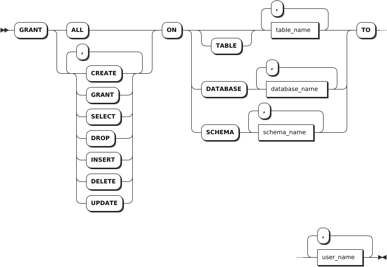

# 权限管理

KWDB 支持对数据库和表在内的数据库对象的访问和操作权限进行管理，从而确保数据库安全性。下表列出 KWDB 支持的权限。

| 权限   | 说明                          | 操作对象                                                            |
|--------|-----------------------------|---------------------------------------------------------------------|
| ALL    | 对指定数据库对象执行所有操作。 | - DATABASE <br >- TABLE <br >- SCHEMA（只适用于关系数据的自定义模式） |
| CREATE | 创建新对象。                   | - DATABASE <br >- TABLE <br >- SCHEMA（只适用于关系数据的自定义模式） |
| DROP   | 删除指定对象。                 | - DATABASE <br >- TABLE <br >- SCHEMA（只适用于关系数据的自定义模式） |
| GRANT  | 授予指定用户特定权限。         | - DATABASE <br >- TABLE <br >- SCHEMA（只适用于关系数据的自定义模式） |
| SELECT | 对指定数据表执行查询操作。     | TABLE                                                               |
| INSERT | 对指定数据表执行数据插入操作。 | TABLE                                                               |
| DELETE | 删除指定数据表。               | TABLE                                                               |
| UPDATE | 更新指定数据表。               | TABLE                                                               |

## 授予权限

`GRANT <privileges>` 语句用于为用户授予指定对象的操作权限。每条语句支持为多个用户授予多个权限。

::: warning 说明

如果用户权限未能及时更新，可以删除该用户后再创建非同名用户，重新授予权限。

:::

### 所需权限

授予权限的用户在目标数据库、表或模式（只适用于关系数据自定义模式）上具备被授予的权限。例如，向其他用户授予目标表的 `SELECT` 权限的用户必须具备目标表的 `GRANT` 和 `SELECT` 权限。

### 语法格式



### 参数说明

| 参数 | 说明 |
| --- | --- |
| `table_name` | 表名，支持同时授予多张表的权限。表名之间使用逗号（`,`）隔开。，权限名称。 |
| `database_name` | 数据库名，支持同时一次授予多个数据库的权限。数据库名之间使用逗号（`,`）隔开。|
| `schema_name` | 模式名。支持同时授予多个用户自定义模式的权限。模式名称之间使用逗号（`,`）隔开。<br> **说明** <br > 该参数只适用于关系数据。|
| `user_name` | 授予权限的用户或角色名称，支持同时向多个用户或角色授予权限。用户或角色名称之间使用逗号（`,`）隔开。 |

### 语法示例

以下示例授予 `operatora` 用户 `db1` 和 `defaultdb` 数据库的创建权限。

```sql
GRANT CREATE ON DATABASE db1, defaultdb TO operatora;
```

## 撤销权限

`REVOKE <privileges>` 语句用于撤销用户指定对象的权限。每条语句支持撤销多个用户的多个权限。

### 所需权限

撤销其他用户的权限的用户具备目标数据库、表或模式（只适用于关系数据自定义模式）的 `GRANT` 权限和被撤销的权限。例如，撤销其他用户目标表的 `SELECT` 权限的用户必须具备目标表的 `GRANT` 和 `SELECT` 权限。

### 语法格式


### 参数说明

| 参数 | 说明 |
| --- | --- |
| `table_name` | 表名，支持同时撤销多张表的权限。表名之间使用逗号（`,`）隔开。，权限名称。 |
| `database_name` | 数据库名，支持同时撤销多个数据库的权限。数据库名之间使用逗号（`,`）隔开。|
| `schema_name` | 模式名。支持同时撤销多个用户自定义模式的权限。模式名称之间使用逗号（`,`）隔开。<br> **说明** <br > 该参数只适用于关系数据。|
| `user_name` | 撤销权限的用户或角色名称，支持同时撤销多个用户或角色的权限。用户或角色名称之间使用逗号（`,`）隔开。 |

### 语法示例

以下示例撤销 `user11` 用户 `db1` 和 `defaultdb` 数据库的创建权限。

```sql
REVOKE CREATE ON DATABASE db1, defaultdb FROM user11;
```

## 查看权限

`SHOW GRANTS` 语句用于查看用户在指定对象中的权限。

### 所需权限

无。如需使用 `SHOW GRANTS ON ROLE` SQL 命令，用户必须具备系统表的 `SELECT` 权限。

### 语法格式


### 参数说明

| 参数 | 说明 |
| --- | --- |
| `table_name` | 表名，支持同时查看多张表的权限。表名之间使用逗号（`,`）隔开。，权限名称。 |
| `database_name` | 数据库名，支持同时查看多个数据库的权限。数据库名之间使用逗号（`,`）隔开。|
| `schema_name` | 模式名。支持同时查看多个用户自定义模式的权限。模式名称之间使用逗号（`,`）隔开。<br> **说明** <br > 该参数只适用于关系数据。|
| `user_name` | 撤销权限的用户或角色名称，支持同时查看多个用户或角色的权限。用户或角色名称之间使用逗号（`,`）隔开。 |

### 语法示例

以下示例查看 `defaultdb` 数据库中 `t1` 表的用户权限的分配情况。

```sql
SHOW GRANTS ON TABLE defaultdb.t1;
```

执行成功后，命令行输出以下信息：

```sql
database_name|schema_name|table_name|grantee|privilege_type
-------------+-----------+----------+-------+--------------
defaultdb    |public     |t1        |admin  |ALL
defaultdb    |public     |t1        |root   |ALL
defaultdb    |public     |t1        |user11 |DELETE
(3 rows)
```
