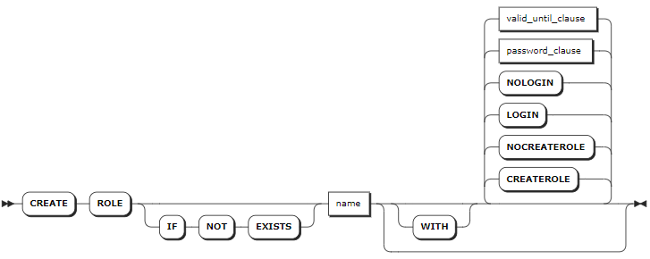
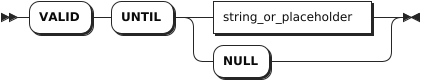
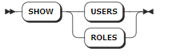
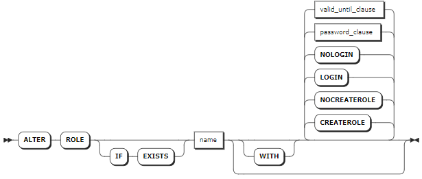
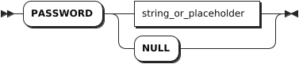
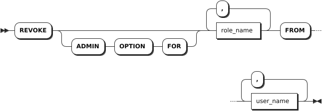
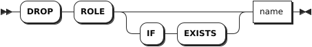

# 角色管理

## 创建角色

`CREATE ROLE` 语句用于创建新角色，并为角色设置一个或多个选项，例如创建角色、设置登录密码等。每条语句只支持创建一个角色。默认情况下，新角色不支持创建角色和登录 KWDB。

### 所需权限

用户具备创建角色（`CREATEROLE`）的权限或者是 `admin` 角色的成员。默认情况下，`root` 用户属于 `admin` 角色。

### 语法格式



- `password_clause`

    

- `valid_until_clause`

    

### 参数说明

| 参数 | 说明 |
| --- | --- |
| `IF NOT EXISTS` | 可选关键字。当使用 `IF NOT EXISTS` 关键字时，如果目标角色不存在，系统创建目标角色。如果目标角色存在，系统创建角色失败，但不会报错。当未使用 `IF NOT EXISTS` 关键字时，如果目标角色不存在，系统创建角色。如果目标角色存在，系统报错，提示目标角色已存在。 |
| `name` | 待创建的角色名。角色名不区分大小写，必须以字母或下划线（`_`）开头，只支持字母，数字或下划线（`_`），长度为 1 - 63 个字符。|
| `CREATEROLE` | 创建角色。设置该选项的角色可以创建、修改、删除其他用户或角色。默认情况下，创建角色时不设置该选项。|
| `NOCREATEROLE` | 创建角色时的默认选项，表示禁止创建角色。|
| `LOGIN` | 创建角色时的默认选项，表示角色可以登录 KWDB 服务器。|
| `NOLOGIN` | 禁止登录 KWDB 服务器。默认情况下，创建角色时不设置该选项。|
| `password_clause` | 设置角色密码。格式为 `PASSWORD <string_or_placeholder>`，也支持使用 `NULL` 值。设置该选项的角色可以使用密码安全访问节点。密码必须采用字符串的形式，并使用单引号（`'`）将密码括起来。默认情况下，创建角色时不设置该选项。|
| `valid_until_clause` | 设置密码有效期，格式为 `VALID UNTIL <string_or_placeholder>`，也支持使用 `NULL` 值。支持 timestamp 格式。到达指定日期或时间后，密码失效。设置时需使用单引号（`'`）将密码有效期括起来。默认情况下，创建角色时不设置该选项。|

### 语法示例

- 创建默认角色。

    以下示例创建 `role1` 角色。默认情况下，该角色无法创建角色，也无法登录 KWDB 服务器。

    ```sql
    -- 1. 创建 role1 角色。

    CREATE ROLE role1;
    CREATE ROLE

    -- 2. 查看角色的权限。

    SHOW ROLES;
      username |                    options                     | member_of
    -----------+------------------------------------------------+------------
      admin    | CREATEROLE                                     | {}
      role1    | NOLOGIN                                        | {}
      root     | CREATEROLE                                     | {admin}
    (3 rows)
    ```

- 创建角色，并为该角色设置创建角色选项。

    以下示例创建 `role2` 角色，并赋予该角色创建角色的权限。

    ```sql
    -- 1. 创建 role2 角色。

    CREATE ROLE role2 WITH CREATEROLE;
    CREATE ROLE

    -- 2. 查看角色的权限。

    SHOW ROLES;
      username |                    options                     | member_of
    -----------+------------------------------------------------+------------
      admin    | CREATEROLE                                     | {}
      role1    | NOLOGIN                                        | {}
      role2    | CREATEROLE, NOLOGIN                            | {}
      root     | CREATEROLE                                     | {admin}
    (4 rows)
    ```

- 创建角色，并为该角色设置登录选项。

    以下示例创建 `role3` 角色，并允许该角色登录 KWDB 服务器。

    ```sql
    -- 1. 创建 role3 角色。

    CREATE ROLE role3 WITH LOGIN;
    CREATE ROLE

    -- 2. 查看角色的权限。

    SHOW ROLES;
      username |                    options                     | member_of
    -----------+------------------------------------------------+------------
      admin    | CREATEROLE                                     | {}
      role1    | NOLOGIN                                        | {}
      role2    | CREATEROLE, NOLOGIN                            | {}
      role3    |                                                | {}
      root     | CREATEROLE                                     | {admin}
    (5 rows)
    ```

- 创建角色，并为该角色设置密码和密码有效期。

    以下示例创建 `role4` 角色，并为该角色设置登录 KWDB 服务器的密码和密码有效期。

    ```sql
    -- 1. 创建 role4 角色。

    CREATE ROLE role4 WITH PASSWORD '11aa!!AA' VALID UNTIL '2024-01-01';
    CREATE ROLE 

    -- 2. 查看角色的权限。

    SHOW ROLES;
      username |                    options                     | member_of
    -----------+------------------------------------------------+------------
      admin    | CREATEROLE                                     | {}
      role1    | NOLOGIN                                        | {}
      role2    | CREATEROLE, NOLOGIN                            | {}
      role3    |                                                | {}
      role4    | NOLOGIN, VALID UNTIL=2024-01-01 00:00:00+00:00 | {}
      root     | CREATEROLE                                     | {admin}
    (6 rows)
    ```

## 查看角色

`SHOW USERS` 和 `SHOW ROLES` 语句均用于查看已创建的角色。

### 语法格式



### 所需权限

无

### 参数说明

无

### 语法示例

以下示例查看已创建的角色。

```sql
SHOW ROLES;
```

执行成功后，控制台输出以下信息：

```sql
  username |                    options                     | member_of
-----------+------------------------------------------------+------------
  admin    | CREATEROLE                                     | {}
  role1    | NOLOGIN                                        | {}
  role2    | CREATEROLE, NOLOGIN                            | {}
  role3    |                                                | {}
  role4    | NOLOGIN, VALID UNTIL=2024-01-01 00:00:00+00:00 | {}
  root     | CREATEROLE                                     | {admin}
(6 rows)
```

## 修改角色

`ALTER ROLE` 语句用于更改角色的一个或多个选项，例如创建角色、设置登录密码等。每条语句只支持更改一个角色。

### 所需权限

用户具备创建角色（`CREATEROLE`）的权限或者是 `admin` 角色的成员。默认情况下，`root` 用户属于 `admin` 角色。

### 语法格式



- `password_clause`

    

- `valid_until_clause`

    

### 参数说明

| 参数 | 说明 |
| --- | --- |
| `IF EXISTS` | 可选关键字。当使用 `IF EXISTS` 关键字时，如果目标角色存在，系统修改目标角色。如果目标角色不存在，系统修改角色失败，但不会报错。当未使用 `IF EXISTS` 关键字时，如果目标角色存在，系统修改角色。如果目标角色不存在，系统报错，提示目标角色不存在。 |
| `name` | 待修改的角色名。角色名不区分大小写，必须以字母或下划线（`_`）开头，只支持字母，数字或下划线（`_`），长度为 1 - 63 个字符。|
| `CREATEROLE` | 创建角色。设置该选项的角色可以创建、修改、删除其他用户或角色。默认情况下，创建角色时不设置该选项。|
| `NOCREATEROLE` | 创建角色时的默认选项，表示禁止创建角色。|
| `LOGIN` | 创建角色时的默认选项，表示角色可以登录 KWDB 服务器。|
| `NOLOGIN` | 禁止登录 KWDB 服务器。默认情况下，创建角色时不设置该选项。|
| `password_clause` | 设置角色密码。格式为 `PASSWORD <string_or_placeholder>`，也支持使用 `NULL` 值。设置该选项的角色可以使用密码安全访问节点。密码必须采用字符串的形式，并使用单引号（`'`）将密码括起来。默认情况下，创建角色时不设置该选项。|
| `valid_until_clause` | 设置密码有效期，格式为 `VALID UNTIL <string_or_placeholder>`，也支持使用 `NULL` 值。支持 timestamp 格式。到达指定日期或时间后，密码失效。设置时需使用单引号（`'`）将密码有效期括起来。默认情况下，创建角色时不设置该选项。|

### 语法示例

- 修改角色，并赋予该角色创建角色的权限。

    以下示例修改 `role1` 角色，并赋予该角色创建角色的权限。

    ```sql
    -- 1. 查看角色的权限。

    SHOW ROLES;
      username |                    options                     | member_of
    -----------+------------------------------------------------+------------
      admin    | CREATEROLE                                     | {}
      role1    | NOLOGIN                                        | {}
      role2    | CREATEROLE, NOLOGIN                            | {}
      role3    |                                                | {}
      role4    | NOLOGIN, VALID UNTIL=2024-01-01 00:00:00+00:00 | {}
      root     | CREATEROLE                                     | {admin}
    (6 rows)

    -- 2. 修改 role1 角色，并赋予该角色创建角色的权限。

    ALTER ROLE role1 WITH CREATEROLE;
    ALTER ROLE

    -- 3. 查看角色的权限。

    SHOW ROLES;
      username |                    options                     | member_of
    -----------+------------------------------------------------+------------
      admin    | CREATEROLE                                     | {}
      role1    | CREATEROLE, NOLOGIN                            | {}
      role2    | CREATEROLE, NOLOGIN                            | {}
      role3    |                                                | {}
      role4    | NOLOGIN, VALID UNTIL=2024-01-01 00:00:00+00:00 | {}
      root     | CREATEROLE                                     | {admin}
    (6 rows)
    ```

- 修改角色的密码和密码有效期。

    以下示例修改 `role4` 角色的用户密码和密码的有效期。

    ```sql
    -- 1. 修改 role4 角色。

    ALTER ROLE role4 WITH PASSWORD 'pas2doc' VALID UNTIL '2025-12-31';
    ALTER ROLE

    -- 2. 查看角色的权限。

    SHOW ROLES;
      username |                    options                     | member_of
    -----------+------------------------------------------------+------------
      admin    | CREATEROLE                                     | {}
      role1    | CREATEROLE, NOLOGIN                            | {}
      role2    | CREATEROLE, NOLOGIN                            | {}
      role3    |                                                | {}
      role4    | NOLOGIN, VALID UNTIL=2025-12-31 00:00:00+00:00 | {}
      root     | CREATEROLE                                     | {admin}
    (6 rows)
    ```

## 为角色添加成员

`GRANT` 语句用于为角色添加成员。成员继承角色的所有权限。

::: warning 说明

如果用户权限未能及时更新，可以删除该用户后再创建非同名用户，重新授予权限。

:::

### 所需权限

用户是角色的管理员或者 `admin` 角色的成员。如需为 `admin` 角色添加成员，用户必须是具有 `WITH ADMIN OPTION` 权限的 `admin` 角色。默认情况下，`root` 用户属于 `admin` 角色。

### 语法格式


### 参数说明

| 参数 | 说明 |
| --- | --- |
| `role_name` | 角色名称。支持一次为多个角色添加同一个成员，角色名称之间使用逗号（`,`）隔开。|
| `user_name` | 待添加的成员的名称，成员可以是用户或角色。支持一次为角色添加多个成员，成员名称之间使用逗号（`,`）隔开。 |
| `WITH ADMIN OPTION` | 将成员指定为角色的管理员。角色管理员有权授予或撤销角色的成员资格。 |

### 语法示例

- 为角色添加成员。默认情况下，新添加的成员没有角色管理员权限。

    以下示例为 `role1` 角色添加成员 `user1`。

    ```sql
    -- 1. 为 role1 角色添加成员 user1。

    GRANT role1 TO user1;
    GRANT 

    -- 2. 查看 role1 角色的成员。

    SHOW GRANTS ON ROLE role1;
      role_name | member | is_admin
    ------------+--------+-----------
      role1     | user1  |  false
    (1 row)
    ```

- 为角色添加角色管理员。

    以下示例为 `role1` 角色添加角色管理员 `user1`。

    ```sql
    -- 1. 为 role1 角色添加角色管理员 user1。

    GRANT role1 TO user1 WITH ADMIN OPTION;
    GRANT

    -- 2. 查看 role1 角色的成员。

    SHOW GRANTS ON ROLE role1;
      role_name | member | is_admin
    ------------+--------+-----------
      role1     | user1  |   true
    (1 row)
    ```

## 从角色中删除成员

`REVOKE` 语句用于将成员从角色中删除。

::: warning 说明

KWDB 不支持将 `root` 用户从 Admin 角色中删除。

:::

### 所需权限

用户是角色的管理员或者 `admin` 角色的成员。如需删除 `admin` 角色的成员，用户必须是具有 `WITH ADMIN OPTION` 权限的 `admin` 角色。默认情况下，`root` 用户属于 `admin` 角色。

### 语法格式



### 参数说明

| 参数 | 说明 |
| --- | --- |
| `WITH ADMIN FOR` | 可选关键字，如果设置该关键字，只撤销成员的角色管理员权限，但不删除其成员资格。如未设置该关键字，删除该角色成员。 |
| `role_name` | 角色名称。支持一次从多个角色中删除同一个成员，角色名称之间使用逗号（`,`）隔开。|
| `user_name` | 从角色中待删除的成员的名称，成员可以是用户或角色。支持一次从角色删除多个成员，成员名称之间使用逗号（`,`）隔开。 |

### 语法示例

- 只撤销成员的角色管理员权限，不删除其成员资格。

    以下示例撤销 `role1` 角色的 `user1` 成员的角色管理员权限，但未删除其成员资格。

    ```sql
    -- 1. 查看 role1 角色的成员。

    SHOW GRANTS ON ROLE role1;
    role_name|member|is_admin
    ---------+------+--------
    role1    |role2 |false
    role1    |user1 |true
    (2 rows)

    -- 2. 撤销 role1 角色的 user1 成员的角色管理员权限，但未删除其成员资格。

    REVOKE ADMIN OPTION FOR role1 FROM user1;
    REVOKE

    -- 3. 查看 role1 角色的成员。

    SHOW GRANTS ON ROLE role1;
    role_name|member|is_admin
    ---------+------+--------
    role1    |role2 |false
    role1    |user1 |false
    (2 rows)
    ```

- 删除角色的成员。

    以下示例删除 `role1` 角色的 `user1` 成员。

    ```sql
    -- 1. 查看 role1 角色的成员。

    SHOW GRANTS ON ROLE role1;
    role_name|member|is_admin
    ---------+------+--------
    role1    |role2 |false
    role1    |user1 |false
    (2 rows)

    -- 2. 删除 role1 角色的 user1 成员。

    REVOKE role1 FROM user1;
    REVOKE

    -- 3. 查看 role1 角色的成员。

    SHOW GRANTS ON ROLE role1;
    role_name|member|is_admin
    ---------+------+--------
    role1    |role2 |false
    (1 row)
    ```

## 删除角色

`DROP ROLE` 语句用于删除已创建的角色。每条语句支持删除一个或多个角色。

### 所需权限

用户具备创建角色（`CREATEROLE`）的权限或者是 `admin` 角色的成员。默认情况下，`root` 用户属于 `admin` 角色。

### 语法格式



### 参数说明

| 参数 | 说明 |
| --- | --- |
| `IF EXISTS` | 可选关键字。当使用 `IF EXISTS` 关键字时，如果目标角色存在，系统删除目标角色。如果目标角色不存在，系统删除角色失败，但不会报错。当未使用 `IF EXISTS` 关键字时，如果目标角色存在，系统删除角色。如果目标角色不存在，系统报错，提示目标角色不存在。 |
| `name` |待删除的角色名称。支持一次删除多个角色，角色名称之间使用逗号（`,`）隔开。|

### 语法示例

以下示例删除 `role1` 角色。

```sql
DROP ROLE role1;
```
