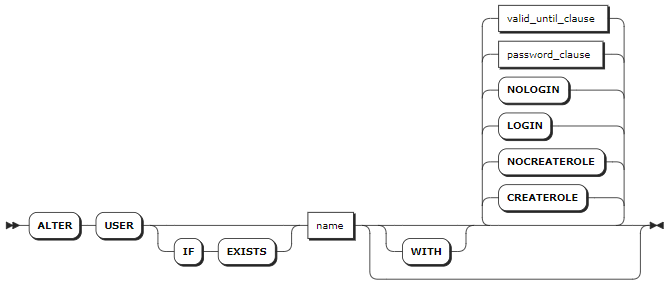

# 用户管理

## 创建用户

`CREATE USER` 语句用于创建新用户，并为新用户设置一个或多个选项，例如创建角色、设置登录密码等。默认情况下，新用户具有登录选项。每条语句只支持创建一个用户。

### 所需权限

用户具备创建角色（`CREATEROLE`）的权限或者是 `admin` 角色的成员。默认情况下，`root` 用户属于 `admin` 角色。

### 语法格式


- `valid_until_clause`

    

- `password_clause`

    

### 参数说明

| 参数 | 说明 |
| --- | --- |
| `IF NOT EXISTS` | 可选关键字。当使用 `IF NOT EXISTS` 关键字时，如果目标用户不存在，系统创建目标用户。如果目标用户存在，系统创建用户失败，但不会报错。当未使用 `IF NOT EXISTS` 关键字时，如果目标用户不存在，系统创建用户。如果目标用户存在，系统报错，提示目标用户已存在。 |
| `name` | 待创建的用户名。用户名不区分大小写，必须以字母或下划线（`_`）开头，只支持字母，数字或下划线（`_`），长度为 1 - 63 个字符。|
| `CREATEROLE` | 创建角色。设置该选项的用户可以创建、修改、删除其他用户或角色。默认情况下，创建用户时不设置该选项。|
| `NOCREATEROLE` | 创建用户时的默认选项，表示禁止创建角色。|
| `LOGIN` | 创建用户时的默认选项，表示用户可以登录 KWDB 服务器。|
| `NOLOGIN` | 禁止登录 KWDB 服务器。默认情况下，创建用户时不设置该选项。|
| `password_clause` | 设置用户密码。格式为 `PASSWORD <string_or_placeholder>`，也支持使用 `NULL` 值。设置该选项的用户可以使用密码安全访问节点。密码必须采用字符串的形式，并使用单引号（`'`）将密码括起来。默认情况下，创建用户时不设置该选项。|
| `valid_until_clause` | 设置密码有效期，格式为 `VALID UNTIL <string_or_placeholder>`，也支持使用 `NULL` 值。支持 timestamp 格式。到达指定日期或时间后，密码失效。设置时需使用单引号（`'`）将密码有效期括起来。默认情况下，创建用户时不设置该选项。|

### 语法示例

- 创建用户。

    以下示例创建 `user1` 用户。默认情况下，该用户无法创建角色，但可以登录 KWDB 服务器。

    ```sql
    CREATE USER user1;
    CREATE USER
    ```

- 创建用户，并赋予该用户创建角色的权限。

    以下示例创建 `user2` 用户，并赋予该用户创建角色的权限。

    ```sql
    CREATE USER user2 WITH CREATEROLE;
    CREATE USER
    ```

- 创建用户，并禁止该用户登录 KWDB 服务器。

    以下示例创建 `user3` 用户，并禁止该用户登录 KWDB 服务器。

    ```sql
    CREATE USER user3 WITH NOLOGIN;
    CREATE USER
    ```

- 创建用户，并为该用户设置密码和密码有效期。

    以下示例创建 `user4` 用户，并为该用户设置登录 KWDB 服务器的密码和密码有效期。

    ```sql
    CREATE USER user4 WITH PASSWORD '11aa!!AA' VALID UNTIL '2023-01-01 00:00:00+00:00';
    CREATE USER
    ```

## 查看用户

`SHOW USERS` 或 `SHOW ROLES` 语句用于查询数据库的用户信息。

### 所需权限

无

### 语法格式


### 参数说明

无

### 语法示例

```sql
SHOW USERS;
```

执行成功后，控制台输出以下信息：

```sql
username|options                              |member_of
--------+-------------------------------------+---------
admin   |CREATEROLE                           |{}
root    |CREATEROLE                           |{admin}
user1   |CREATEROLE                           |{}
user2   |CREATEROLE                           |{}
user3   |VALID UNTIL=2023-01-01 00:00:00+00:00|{}
```

## 修改用户

`ALTER USER` 语句用于为用户更改一个或多个选项，如更改登录密码等。每条语句只能修改一个用户。

### 所需权限

用户具备创建角色（`CREATEROLE`）的权限或者是 `admin` 角色的成员。默认情况下，`root` 用户属于 `admin` 角色。

### 语法格式



- `password_clause`

    

- `valid_until_clause`

    

### 参数说明

| 参数 | 说明 |
| --- | --- |
| `IF EXISTS` | 可选关键字。当使用 `IF EXISTS` 关键字时，如果目标用户存在，系统修改目标用户。如果目标用户不存在，系统修改用户失败，但不会报错。当未使用 `IF EXISTS` 关键字时，如果目标用户存在，系统修改用户。如果目标用户不存在，系统报错，提示目标用户不存在。 |
| `name` | 待修改的用户名。用户名不区分大小写，必须以字母或下划线（`_`）开头，只支持字母，数字或下划线（`_`），长度为 1 - 63 个字符。|
| `CREATEROLE` | 创建角色。设置该选项的用户可以创建、修改、删除其他用户或角色。默认情况下，创建用户时不设置该选项。|
| `NOCREATEROLE` | 创建用户时的默认选项，表示禁止创建角色。|
| `LOGIN` | 创建用户时的默认选项，表示用户可以登录 KWDB 服务器。|
| `NOLOGIN` | 禁止登录 KWDB 服务器。默认情况下，创建用户时不设置该选项。|
| `password_clause` | 设置用户密码。格式为 `PASSWORD <string_or_placeholder>`，也支持使用 `NULL` 值。设置该选项的用户可以使用密码安全访问节点。密码必须是字符串的形式，并使用单引号（`'`）将密码括起来。默认情况下，创建用户时不设置该选项。|
| `valid_until_clause` | 设置密码有效期，格式为 `VALID UNTIL <string_or_placeholder>`，也支持使用 `NULL` 值。支持 timestamp 格式。到达指定日期或时间后，密码失效。设置时需使用单引号（`'`）将密码有效期括起来。默认情况下，创建用户时不设置该选项。|

### 语法示例

- 修改用户，为用户设置 `NOCREATEROLE` 选项。

    ```sql
    -- 1. 查看用户信息。

    SHOW USERS;
      username |                options                | member_of
    -----------+---------------------------------------+------------
      admin    | CREATEROLE                            | {}
      root     | CREATEROLE                            | {admin}
      user1    |                                       | {}
      user2    | CREATEROLE                            | {}
      user3    | NOLOGIN                               | {}
      user4    | VALID UNTIL=2023-01-01 00:00:00+00:00 | {}
    (6 rows)

    -- 2. 修改用户选项。

    ALTER USER user2 WITH NOCREATEROLE;
    ALTER USER

    -- 3. 查看修改结果。

    SHOW USERS;
      username |                options                | member_of
    -----------+---------------------------------------+------------
      admin    | CREATEROLE                            | {}
      root     | CREATEROLE                            | {admin}
      user1    |                                       | {}
      user2    |                                       | {}
      user3    | NOLOGIN                               | {}
      user4    | VALID UNTIL=2023-01-01 00:00:00+00:00 | {}
    (6 rows)
    ```

- 修改用户的密码和密码有效期。

    以下示例修改 `user4` 用户的密码和密码有效期。

    ```sql
    -- 1. 修改 user4 用户的用户密码和密码有效期。

    ALTER USER user4 WITH PASSWORD '11aa!!AA' VALID UNTIL '2023-01-01 00:00:00+00:00';
    ALTER USER

    -- 2. 查看用户信息。

    SHOW USERS;
      username |                    options                     | member_of
    -----------+------------------------------------------------+------------
      admin    | CREATEROLE                                     | {}
      root     | CREATEROLE                                     | {admin}
      user1    |                                                | {}
      user2    |                                                | {}
      user3    | NOLOGIN, VALID UNTIL=2023-12-31 00:00:00+00:00 | {}
      user4    | VALID UNTIL=2023-01-01 00:00:00+00:00          | {}
    (6 rows)
    ```

## 删除用户

`DROP USER` 语句用于删除已创建的用户。每条语句支持删除多个用户。

### 所需权限

用户具备创建角色（`CREATEROLE`）的权限或者是 `admin` 角色的成员。默认情况下，`root` 用户属于 `admin` 角色。

### 语法格式


### 参数说明

| 参数 | 说明 |
| --- | --- |
| `IF EXISTS` | 可选关键字。当使用 `IF EXISTS` 关键字时，如果目标用户存在，系统删除目标用户。如果目标用户不存在，系统删除用户失败，但不会报错。当未使用 `IF EXISTS` 关键字时，如果目标用户存在，系统删除用户。如果目标用户不存在，系统报错，提示目标用户不存在。 |
| `name` |待删除的用户名。支持一次删除多个用户名。|

### 语法示例

以下示例删除 `user1` 用户。

```sql
DROP USER user1;
```
