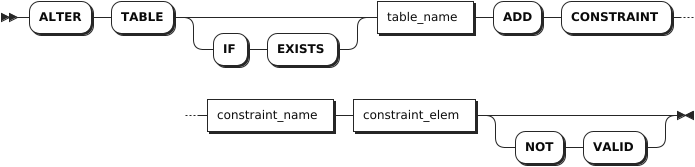
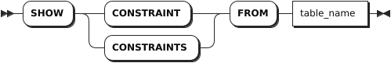
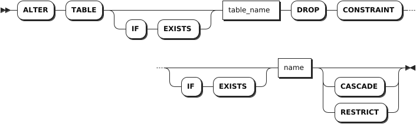

# 约束

## 添加约束

`ADD CONSTRAINT` 语句是 `ALTER TABLE` 语句的一部分，用于为列添加唯一性（UNIQUE）约束、检查（CHECK）约束、外键（FOREIGN KEY）约束。

::: warning 说明

- KWDB 支持使用 `ALTER COLUMN` 语句添加、修改默认约束。
- KWDB 不支持使用 `ALTER TABLE` 语句添加主键约束，只支持在创建表时指定主键约束。

:::

### 所需权限

用户拥有目标表的 CREATE 权限。

### 语法格式



### 参数说明

| 参数 | 说明 |
| --- | --- |
| `IF EXISTS`  | 可选关键字。当使用 `IF EXISTS` 关键字时，如果目标表存在，系统添加约束。如果目标表不存在，系统添加约束失败，但不会报错。当未使用 `IF EXISTS` 关键字时，如果目标表存在，系统添加约束。如果目标表不存在，系统报错，提示目标表不存在。 |
| `table_name`  | 待添加约束的列所在的表。 |
| `constraint_name`  | 约束名。该名称在表中必须唯一，并且遵循[数据库标识符规则](../../../sql-reference/sql-identifiers.md)。  |
| `constraint_elem`  | 待添加的约束，支持以下约束：<br >- `CHECK`：列值满足指定的条件或表达式。<br >- `UNIQUE`：列值都唯一，`NULL` 值除外。<br >- `FOREIGN KEY`：在为列添加外键约束前，该列必须已创建索引。如未创建，先使用 `CREATE INDEX` 语句创建索引，然后再添加外键约束。 |
| `NOT VALID`  | 创建未验证的约束。创建未验证约束时，系统不会检查现有表数据是否满足约束条件。修改表数据时，系统会执行该约束。 |

### 语法示例

- 添加唯一性约束。

    以下示例为 `orders` 表的 `id` 列添加一个名为 `id_unique` 的唯一性约束。

    ```sql
    ALTER TABLE orders ADD CONSTRAINT id_unique UNIQUE (id);
    ALTER TABLE
    ```

- 添加检查约束。

    以下示例为 `orders` 表的 `date` 列添加一个名为 `date_unique` 的检查约束。

    ```sql
    ALTER TABLE orders ADD CONSTRAINT date_check CHECK (date > '2020-01-01') NOT VALID;
    ALTER TABLE
    ```

- 添加外键约束。

    以下示例创建 `office_dogs` 和 `address` 表，且 `office_dogs.address_id` 列的每个值与 `address.id` 列中的唯一值匹配。以下示例还为 `office_dogs` 表的 `address_id` 列创建外键约束。

    ```sql
    -- 1. 创建 office_dogs 表。

    SHOW CREATE TABLE office_dogs;
      table_name  |                                            create_statement                                              
    --------------+---------------------------------------------------------------------------------------------------------+
      office_dogs | CREATE TABLE office_dogs (                                                                               
                  |     id INT8 NOT NULL,                                                                                    
                  |     last_name STRING NULL,                                                                               
                  |     full_name STRING NULL,                                                                               
                  |     alive STRING NULL,                                                                                   
                  |     rides_id UUID NULL,                                                                                  
                  |     rides_length interval NULL,                                                                          
                  |     rides_city STRING NULL,                                                                              
                  |     address_id UUID NULL,                                                                                
                  |     CONSTRAINT "primary" PRIMARY KEY (id ASC),                                                           
                  |     UNIQUE INDEX id_customer_unique (id ASC, full_name ASC),                                             
                  |     INDEX office_dogs_rides_id_idx (rides_id ASC),                                                       
                  |     INDEX office_dogs_rides_length_rides_city_idx (rides_length ASC, rides_city ASC),                    
                  |     FAMILY "primary" (id, last_name, full_name, alive, rides_id, rides_length, rides_city, address_id),  
                  |     CONSTRAINT alive_check CHECK (alive = 'true') ENABLE                                                 
                  | )                                                                                                        
    (1 row)

    -- 2. 创建 address 表。

    SHOW CREATE TABLE address;
      table_name |                create_statement                 
    -------------+------------------------------------------------+
      address    | CREATE TABLE address (                          
                |     id UUID NOT NULL,                           
                |     city STRING NOT NULL,                       
                |     CONSTRAINT "primary" PRIMARY KEY (id ASC),  
                |     FAMILY "primary" (id, city)                 
                | )                                               
    (1 row)

    -- 3. 在 `office_dogs.address_id` 上创建索引：

    CREATE INDEX ON office_dogs (address_id);

    -- 4. 为 office_dogs 表的 address_id 创建外键约束，使用 ON DELETE CASCADE 语句表示当相关行被删除，所有依赖的对象也会被删除。

    ALTER TABLE office_dogs ADD CONSTRAINT address_fk FOREIGN KEY (address_id) REFERENCES address (id) ON DELETE CASCADE;
    ALTER TABLE

    -- 5. 查看 office_dogs 表的约束。

    SHOW CONSTRAINTS FROM office_dogs ;
      table_name  |  CONSTRAINT_name   | CONSTRAINT_type |                              details                               | validated  
    --------------+--------------------+-----------------+--------------------------------------------------------------------+-----------+
      office_dogs | address_fk         | FOREIGN KEY     | FOREIGN KEY (address_id) REFERENCES address (id) ON DELETE CASCADE |   false    
      office_dogs | alive_check        | CHECK           | CHECK (alive = 'true') ENABLE                                      |   true     
      office_dogs | id_customer_unique | UNIQUE          | UNIQUE (id ASC, full_name ASC)                                     |   true     
      office_dogs | primary            | PRIMARY KEY     | PRIMARY KEY (id ASC)                                               |   true     
    (4 rows)
    ```

## 查看约束

`SHOW CONSTRAINTS` 语句用于查看表所有已命名的约束和所有未命名的唯一性约束。

### 所需权限

用户拥有目标表的任意权限。

### 语法格式



### 参数说明

| 参数 | 说明 |
| --- | --- |
| `table_name` | 约束所在的表。 |

### 返回字段说明

| 字段 | 说明 |
| --- | --- |
| `table_name` | 表名。 |
| `constraint_name` | 约束名。|
| `constraint_type` | 约束类型。 |
| `details` | 约束的定义，包括约束适用的列。 |
| `validated` | 列值是否符合约束。 |

### 语法示例

以下示例查看 `orders` 表的约束。

```sql
SHOW CONSTRAINTS FROM orders;
```

执行成功后，控制台输出以下信息：

```sql
  table_name |    constraint_name     | constraint_type |                                               details                                                | validated
-------------+------------------------+-----------------+------------------------------------------------------------------------------------------------------+------------
  orders     | check_priority         | CHECK           | CHECK ((priority BETWEEN 1 AND 5))                                                                   |   true
  orders     | check_status           | CHECK           | CHECK ((status IN ('open':::STRING, 'in progress':::STRING, 'done':::STRING, 'cancelled':::STRING))) |   true
  orders     | date_check             | CHECK           | CHECK ((date > '2020-01-01'))                                                                        |   false
  orders     | id_unique              | UNIQUE          | UNIQUE (id ASC)                                                                                      |   true
  orders     | orders_customer_id_key | UNIQUE          | UNIQUE (customer_id ASC)                                                                             |   true
  orders     | primary                | PRIMARY KEY     | PRIMARY KEY (id ASC)                                                                                 |   true
(6 rows)
```

## 重命名约束

`RENAME CONSTRAINT` 语句是 `ALTER TABLE` 语句的一部分，用于更改约束的名称。

### 所需权限

用户拥有目标表的 CREATE 权限。

### 语法格式


### 参数说明

| 参数 | 说明 |
| --- | --- |
| `IF EXISTS`  | 可选关键字。当使用 `IF EXISTS` 关键字时，如果目标约束存在，系统重命名约束。如果目标约束不存在，系统重命名约束失败，但不会报错。当未使用 `IF EXISTS` 关键字时，如果目标约束存在，系统重命名约束。如果目标约束不存在，系统报错，提示目标表不存在。 |
| `table_name`  | 待重命名约束的列所在的表。 |
| `current_name`  | 当前的约束名称。该名称在表中必须唯一，并且[遵循数据库标识符规则](../../sql-identifiers.md)。 |
| `name`  | 新的约束名称。该名称在表中必须唯一，并且[遵循数据库标识符规则](../../sql-identifiers.md)。  |

### 语法示例

以下示例将 `orders` 表的 `orders_customer_id_key` 约束重命名为 `orders_customer_id_key_rename`。

```sql
-- 1. 将 orders 表的 orders_customer_id_key 约束 重命名为 orders_customer_id_key_rename。

ALTER TABLE orders RENAME CONSTRAINT orders_customer_id_key TO orders_customer_id_key_rename;
ALTER TABLE

-- 2. 查看 orders 表的约束。

SHOW CONSTRAINTS FROM orders;
  table_name |        constraint_name        | constraint_type |                                               details                                                | validated
-------------+-------------------------------+-----------------+------------------------------------------------------------------------------------------------------+------------
  orders     | check_priority                | CHECK           | CHECK ((priority BETWEEN 1 AND 5))                                                                   |   true
  orders     | check_status                  | CHECK           | CHECK ((status IN ('open':::STRING, 'in progress':::STRING, 'done':::STRING, 'cancelled':::STRING))) |   true
  orders     | date_check                    | CHECK           | CHECK ((date > '2020-01-01'))                                                                        |   false
  orders     | id_unique                     | UNIQUE          | UNIQUE (id ASC)                                                                                      |   true
  orders     | orders_customer_id_key_rename | UNIQUE          | UNIQUE (customer_id ASC)                                                                             |   true
  orders     | primary                       | PRIMARY KEY     | PRIMARY KEY (id ASC)                                                                                 |   true
(6 rows)
```

## 删除约束

`DROP CONSTRAINT` 语句是 `ALTER TABLE` 语句的一部分，用于删除检查约束和外键约束。

### 所需权限

用户拥有约束所属表的 CREATE 权限。

### 语法格式



### 参数说明

| 参数 | 说明 |
| --- | --- |
| `IF EXISTS` | 可选关键字。当使用 `IF EXISTS` 关键字时，如果目标约束存在，系统删除目标约束。如果目标约束不存在，系统删除目标约束失败，但不会报错。当未使用 `IF EXISTS` 关键字时，如果目标约束存在，系统删除目标约束。如果目标约束不存在，系统报错，提示目标约束不存在。 |
| `table_name` | 待删除约束所在表的名称。|
| `name` | 待删除约束的名称。|
| `CASCADE` | 可选关键字。删除目标约束及其关联对象。`CASCADE` 不会列出待删除的关联对象，应谨慎使用。 |
| `RESTRICT` | 默认设置，可选关键字。如果其他对象依赖目标约束，则无法删除该约束。 |

### 语法示例

以下示例删除 `orders` 表的 `check_status` 约束。

```sql
-- 1. 查看 orders 表的约束。

SHOW CONSTRAINTS FROM orders;
  table_name |        constraint_name        | constraint_type |                                               details                                                | validated
-------------+-------------------------------+-----------------+------------------------------------------------------------------------------------------------------+------------
  orders     | check_priority                | CHECK           | CHECK ((priority BETWEEN 1 AND 5))                                                                   |   true
  orders     | check_status                  | CHECK           | CHECK ((status IN ('open':::STRING, 'in progress':::STRING, 'done':::STRING, 'cancelled':::STRING))) |   true
  orders     | date_check                    | CHECK           | CHECK ((date > '2020-01-01'))                                                                        |   false
  orders     | orders_customer_id_key_rename | UNIQUE          | UNIQUE (customer_id ASC)                                                                             |   true
  orders     | primary                       | PRIMARY KEY     | PRIMARY KEY (id ASC)                                                                                 |   true
(5 rows)

-- 2. 删除 orders 表的 check_status 约束。

ALTER TABLE orders DROP CONSTRAINT check_status;
ALTER TABLE

-- 3. 查看 orders 表的约束。

SHOW CONSTRAINTS FROM orders;
  table_name |        constraint_name        | constraint_type |              details               | validated
-------------+-------------------------------+-----------------+------------------------------------+------------
  orders     | check_priority                | CHECK           | CHECK ((priority BETWEEN 1 AND 5)) |   true
  orders     | date_check                    | CHECK           | CHECK ((date > '2020-01-01'))      |   false
  orders     | orders_customer_id_key_rename | UNIQUE          | UNIQUE (customer_id ASC)           |   true
  orders     | primary                       | PRIMARY KEY     | PRIMARY KEY (id ASC)               |   true
(4 rows)
```
