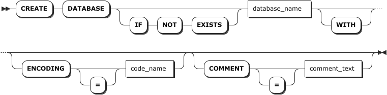
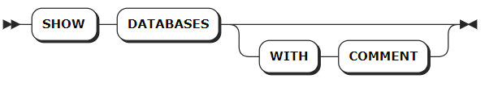
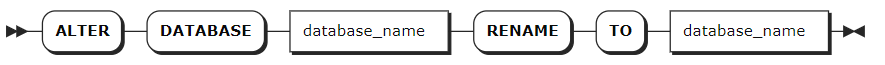
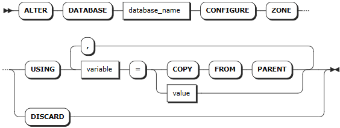
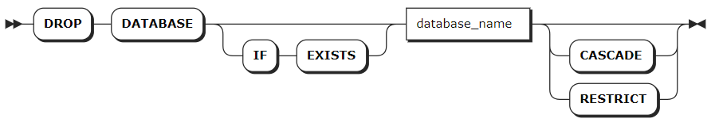

# 数据库

## 创建数据库

`CREATE DATABASE` 语句用于创建关系数据库对象（Relational Database）。每条语句支持创建一个关系数据库。

### 所需权限

用户是 `admin` 角色的成员。默认情况下，`root` 用户属于 `admin` 角色。创建成功后，用户拥有该数据库的全部权限。

### 语法格式



### 参数说明

:::warning 说明
配置可选参数时，必须严格按照 `[ENCODING [=] <'code_name'>] [COMMENT [=] <'comment_text'>]` 的顺序，否则系统将会报错。
:::

| 参数 | 说明 |
| --- | --- |
| `IF NOT EXISTS` | 可选关键字。当使用 `IF NOT EXISTS` 关键字时，如果目标数据库不存在，系统创建目标数据库。如果目标数据库存在，系统创建数据库失败，但不会报错。当未使用 `IF NOT EXISTS` 关键字时，如果目标数据库不存在，系统创建目标数据库。如果目标数据库存在，系统报错，提示目标数据库已存在。 |
| `db_name` | 待创建的数据库的名称。该名称必须唯一，且遵循[数据库标识符规则](../../sql-identifiers.md)。|
| `WITH` | 可选关键字，是否使用该关键字不影响数据库的创建。 |
| `ENCODING` | 可选关键字，指定编码方式。目前，KWDB 只支持 UTF-8 编码以及 UTF-8 的别名（UTF8 和 UNICODE）。编码值应该用单引号（`''`）括起来，并且不区分大小写。例如：`CREATE DATABASE bank ENCODING = 'UTF-8'`。 |
| `COMMENT` | 可选关键字。指定数据库的注释信息。|

### 语法示例

- 创建关系数据库。

    以下示例创建一个名为 `db1` 的关系数据库。

    ```sql
    CREATE DATABASE db1;
    CREATE DATABASE
    ```

- 使用 `IF NOT EXISTS` 关键字创建关系数据库。

    以下示例使用 `IF NOT EXISTS` 关键字创建一个已经存在的 `db1` 关系数据库。系统创建数据库失败，但不报错。

    ```sql
    CREATE DATABASE IF NOT EXISTS db1;
    CREATE DATABASE
    ```

- 创建数据库时，指定数据库的注释信息。

    以下示例创建一个名为 `db_student` 的关系数据库，并将数据库的注释信息设置为 `database for student statistics`。

    ```sql
    CREATE DATABASE db_student COMMENT = 'database for student statistics';
    ```

## 查看数据库

`SHOW DATABASES` 语句用于查看 KWDB 中的所有数据库。

### 所需权限

无

### 语法格式



### 参数说明

| 参数 | 说明 |
| --- | --- |
| `WITH COMMENT` | 可选关键字，查看数据库的注释信息。默认情况下，数据库的注释信息为 `NULL`。|

### 语法示例

:::warning 说明
时序数据库和关系数据库的 `engine_type` 分别为 `TIME SERIES` 和 `RELATIONAL`。
:::

- 查看数据库。

    以下示例查看已创建的数据库。

    ```sql
    SHOW DATABASES;
    ```

    执行成功后，控制台输出以下信息：

    ```sql
      database_name | engine_type
    ----------------+--------------
      db1           | RELATIONAL
      db2           | RELATIONAL
      defaultdb     | RELATIONAL
      postgres      | RELATIONAL
      system        | RELATIONAL
      iot           | TIME SERIES 
    (6 rows)
    ```

- 查看数据库的注释信息。

    以下示例查看数据库的注释信息。

    ```sql
    SHOW DATABASES WITH COMMENT;
    ```

    执行成功后，控制台输出以下信息：

    ```sql
      database_name | engine_type | comment
    ----------------+-------------+----------
      db1           | RELATIONAL  | NULL
      db2           | RELATIONAL  | NULL
      defaultdb     | RELATIONAL  | NULL
      postgres      | RELATIONAL  | NULL
      system        | RELATIONAL  | NULL
      iot           | TIME SERIES | NULL
    (6 rows)
    ```

## 查看数据库的建库语句

`SHOW CREATE DATABASE` 语句用于查看创建数据库的 SQL 语句。目前，关系数据库只支持查看创建数据库时使用的数据库名称。

### 所需权限

无

### 语法格式


### 参数说明

| 参数 | 说明 |
| --- | --- |
| `database_name` | 待查看数据库的名称。|

### 语法示例

以下示例查看 `reldb1` 数据库的建库语句。

```sql
-- 1. 创建数据库 reldb1。

CREATE DATABASE reldb1 WITH ENCODING = 'UTF8';

--2. 查看已创建的 reldb1 数据库。

SHOW CREATE DATABASE reldb1;
  database_name |    create_statement
----------------+-------------------------
  reldb1        | CREATE DATABASE reldb1
(1 row)
```

## 修改数据库

`ALTER DATABASE` 语句用于修改数据库名称以及数据库区域配置。

::: warning 说明
KWDB 不支持修改视图关联的数据库的名称。
:::

### 所需权限

- 修改数据库名称：用户是 `admin` 角色的成员。默认情况下，`root` 用户属于 `admin` 角色。
- 修改数据库区域配置：
  - 修改系统数据库区域配置：用户是 `admin` 角色的成员。默认情况下，`root` 用户属于 `admin` 角色。
  - 修改其他数据库区域配置：用户是 `admin` 角色的成员或者拥有目标数据库的 CREATE 或 ZONECONFIG 权限。默认情况下，`root` 用户属于 `admin` 角色。

### 语法格式

- 修改数据库名称：

  

- 修改数据库区域配置：

    

### 参数说明

| 参数 | 说明 |
| --- | --- |
| `database_name` | 数据库的名称。在修改数据库名称的语法中，第一个 `database_name` 指当前数据库的名称。第二个 `database_name` 指拟修改的的数据库名称。新数据库名称必须唯一，并且[遵循数据库标识符规则](../../sql-identifiers.md)。如果目标数据库为当前数据库，或者将 `sql_safe_updates` 参数设置为 `true`，则无法重命名该数据库。|
| `variable` | 待修改的变量名，关系库支持修改以下变量：<br> - `range_min_bytes`：数据分片的最小大小，单位为字节。数据分片小于该值时，KWDB 会将其与相邻数据分片合并。默认值：256 MiB，设置值应大于 1 MiB（1048576 字节），小于数据分片的最大大小。<br> - `range_max_bytes`：数据分片的最大大小，单位为字节。数据分片大于该值时，KWDB 会将其切分到两个数据分片。默认值： 512 MiB。设置值不得小于 5 MiB（5242880 字节）。<br> - `gc.ttlseconds`：数据在垃圾回收前保留的时间，单位为秒。默认值为 `90000`（25 小时）。设置值建议不小于 600 秒（10 分钟），以免影响长时间运行的查询。设置值较小时可以节省磁盘空间，设置值较大时会增加 `AS OF SYSTEM TIME` 查询的时间范围。另外，由于每行的所有版本都存储在一个永不拆分的单一数据分片内，不建议将该值设置得太大，以免单行的所有更改累计超过 64 MiB，导致内存不足或其他问题。<br>- `num_replicas`：副本数量。默认值为 3。`system` 数据库、`meta`、`liveness` 和 `system` 数据分片的默认副本数为 5。 **注意**：集群中存在不可用节点时，副本数量不可缩减。<br>- `constraints`：副本位置的必需（+）和/或禁止（-）约束。例如 `constraints = '{"+region=NODE1": 1, "+region=NODE2": 1, "+region=NODE3": 1}'` 表示在节点 1、2 和 3 上必须各放置 1 个副本。目前只支持 `region=NODEx` 格式<br>- `lease_preferences`：主副本位置的必需（+）和/或禁止（-）约束的有序列表。例如 `lease_preferences = '[[+region=NODE1]]'` 表示倾向将主副本放置在节点 1。如果不能满足首选项，KWDB 将尝试下一个优先级。如果所有首选项都无法满足，KWDB 将使用默认的租约分布算法，基于每个节点已持有的租约数量来决定租约位置，尝试平衡租约分布。|
| `value` | 变量值。 |
|`COPY FROM PARENT`| 使用父区域的设置值。|
|`DISCARD` | 移除区域配置，采用默认值。|

### 语法示例

- 修改数据库的名称。

    以下示例将 `rdb` 数据库重命名为 `relationaldb`。

    ```sql
    -- 1. 查看所有数据库。
    
    SHOW DATABASES;
    database_name|engine_type
    -------------+-----------
    defaultdb    |RELATIONAL
    postgres     |RELATIONAL
    rdb          |RELATIONAL
    system       |RELATIONAL
    tsdb         |TIME SERIES
    (5 rows)
    
    -- 2. 重命名数据库。
    
    ALTER DATABASE rdb RENAME TO relationaldb;
    ALTER DATABASE
    
    -- 3. 查看所有数据库。
    
    SHOW DATABASES;
    database_name|engine_type
    -------------+-----------
    defaultdb    |RELATIONAL
    postgres     |RELATIONAL
    relationaldb |RELATIONAL
    system       |RELATIONAL
    tsdb         |TIME SERIES
    (5 rows)
    ```

- 修改数据库区域配置
  
  以下示例将 `db3` 数据库副本数改为 5， 将数据在垃圾回收前保留的时间改为 100000 秒。
  
  ```sql
  -- 1. 修改数据库区域配置
  > ALTER DATABASE db3 CONFIGURE ZONE USING num_replicas = 5, gc.ttlseconds = 100000;
  CONFIGURE ZONE 1

  -- 2. 查看数据库区域配置

  > SHOW ZONE CONFIGURATION FOR DATABASE db3;
        target  |               config_sql
  -------------------+------------------------------------------
    DATABASE db3 | ALTER DATABASE db3 CONFIGURE ZONE USING
                |     range_min_bytes = 134217728,
                |     range_max_bytes = 536870912,
                |     gc.ttlseconds = 100000,
                |     num_replicas = 5,
                |     constraints = '[]',
                |     lease_preferences = '[]'
  (1 row)
  ```

## 删除数据库

`DROP DATABASE` 语句用于从 KWDB 中删除数据库及其所有对象。目标数据库不能是当前数据库。如需删除当前数据库，使用 `USE <database_name>` 语句将当前数据库切换成其他数据库，再进行删除。

### 所需权限

用户是 `admin` 角色的成员或者拥有目标数据库及对象的 DROP 权限。默认情况下，`root` 用户属于 `admin` 角色。删除成功后，所有用户针对目标数据库和其下全部模式及对象的所有权限均被删除。

### 语法格式



### 参数说明

| 参数 | 说明 |
| --- | --- |
| `IF EXISTS` | 可选关键字。当使用 `IF EXISTS` 关键字时，如果目标数据库存在，系统删除目标数据库。如果目标数据库不存在，系统删除数据库失败，但不会报错。当未使用 `IF EXISTS` 关键字时，如果目标数据库存在，系统删除目标数据库。如果目标数据库不存在，系统报错，提示目标数据库不存在。 |
| `database_name` | 待删除的数据库的名称。|
| `CASCADE` | 可选关键字，表示级联删除，即删除数据库中的所有表、视图及其关联对象（例如约束和视图）。`CASCADE` 不会列出待删除的关联对象，应谨慎使用。|
| `RESTRICT` | 可选关键字，如果目标数据库包含表和视图，系统报错，提示目标数据库为非空数据库。|

### 语法示例

- 使用 `CASCADE` 关键字删除数据库及其对象。

    以下示例使用 `CASCADE` 关键字删除 `relationaldb` 数据库及其级联对象。

    ```sql
    -- 1. 查看 relationaldb 数据库中的关系表。

    SHOW TABLES FROM relationaldb;
    table_name|table_type
    ----------+----------
    ints      |BASE TABLE
    (1 row)

    -- 2. 删除 relationaldb 数据库及其级联对象。

    DROP DATABASE relationaldb CASCADE;
    DROP DATABASE

    -- 3. 查看 relationaldb 数据库中的关系表。

    SHOW TABLES FROM relationaldb;
    ERROR: target database or schema does not exist
    ```

- 使用 `RESTRICT` 关键字阻止删除非空数据库。

    以下示例使用 `RESTRICT` 关键字阻止删除 `db1` 非空数据库。

    ```sql
    -- 1. 查看 db1 数据库中的关系表。
    
    SHOW TABLES FROM db1;
    table_name|table_type
    ----------+----------
    int       |BASE TABLE
    ints      |BASE TABLE
    (2 rows)
    
    -- 2. 删除 db1 数据库。
    
    DROP DATABASE db1 RESTRICT;
    ERROR:  database "db1" is not empty and RESTRICT was specified
    ```
