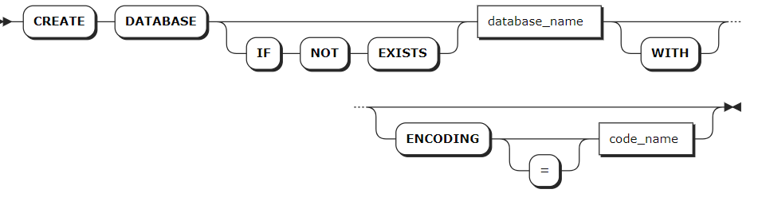
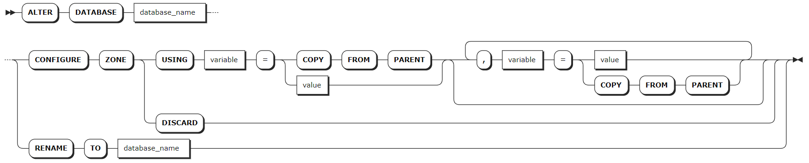

# 数据库对象

## 创建数据库

`CREATE DATABASE` 语句用于创建关系数据库对象（Relational Database）。每条语句支持创建一个关系数据库。

### 所需权限

用户具有 Admin 角色。默认情况下，root 用户具有 Admin 角色。创建成功后，用户拥有该数据库的全部权限。

### 语法格式



### 参数说明

| 参数 | 说明 |
| --- | --- |
| `IF NOT EXISTS` | 可选关键字。当使用 `IF NOT EXISTS` 关键字时，如果目标数据库不存在，系统创建目标数据库。如果目标数据库存在，系统创建数据库失败，但不会报错。当未使用 `IF NOT EXISTS` 关键字时，如果目标数据库不存在，系统创建目标数据库。如果目标数据库存在，系统报错，提示目标数据库已存在。 |
| `db_name` | 待创建的数据库的名称。该名称必须唯一，且遵循[数据库标识符规则](../../sql-identifiers.md)。|
| `WITH` | 可选关键字，是否使用该关键字不影响数据库的创建。 |
| `ENCODING` | 可选关键字，指定编码方式。目前，KWDB 只支持 UTF-8 编码以及 UTF-8 的别名（UTF8 和 UNICODE）。编码值应该用单引号（`''`）括起来，并且不区分大小写。例如：`CREATE DATABASE bank ENCODING = 'UTF-8'`。 |

### 语法示例

- 创建关系数据库。

    以下示例创建一个名为 `db1` 的关系数据库。

    ```sql
    CREATE DATABASE db1;
    CREATE DATABASE
    ```

- 使用 `IF NOT EXISITS` 关键字创建关系数据库。

    以下示例使用 `IF NOT EXISITS` 关键字创建一个已经存在的 `db1` 关系数据库。系统创建数据库失败，但不报错。

    ```sql
    CREATE DATABASE IF NOT EXISTS db1;
    CREATE DATABASE
    ```

## 查看数据库

`SHOW DATABASES` 语句用于查看 KWDB 中的所有数据库。

### 所需权限

无

### 语法格式


### 参数说明

| 参数 | 说明 |
| --- | --- |
| `WITH COMMENT` | 可选关键字，查看数据库的注释信息。默认情况下，数据库的注释信息为 `NULL`。|

### 语法示例

:::warning 说明
时序数据库和关系数据库的 `engine_type` 分别为 `TIME SERIES` 和 `RELATIONAL`。
:::

- 查看数据库。

    以下示例查看已创建的数据库。

    ```sql
    SHOW DATABASES;
    ```

    执行成功后，控制台输出以下信息：

    ```sql
      database_name | engine_type
    ----------------+--------------
      db1           | RELATIONAL
      db2           | RELATIONAL
      defaultdb     | RELATIONAL
      postgres      | RELATIONAL
      system        | RELATIONAL
      iot           | TIME SERIES 
    (6 rows)
    ```

- 查看数据库的注释信息。

    以下示例查看数据库的注释信息。

    ```sql
    SHOW DATABASES WITH COMMENT;
    ```

    执行成功后，控制台输出以下信息：

    ```sql
      database_name | engine_type | comment
    ----------------+-------------+----------
      db1           | RELATIONAL  | NULL
      db2           | RELATIONAL  | NULL
      defaultdb     | RELATIONAL  | NULL
      postgres      | RELATIONAL  | NULL
      system        | RELATIONAL  | NULL
      iot           | TIME SERIES | NULL
    (6 rows)
    ```

## 修改数据库

`ALTER DATABASE` 语句用于修改数据库名称，配置数据库的 Range 副本参数。

::: warning 说明
KWDB 不支持修改视图关联的数据库的名称。
:::

### 所需权限

- 修改数据库名称：用户为 Admin 用户或者 Admin 角色成员。默认情况下，root 用户具有 Admin 角色。
- 配置系统数据库 range 副本参数：用户为 Admin 用户或者 Admin 角色成员。
- 配置其他数据库 Range 副本参数：用户拥有目标数据库的 CREATE 或 ZONECONFIG 权限。

### 语法格式



### 参数说明

| 参数 | 说明 |
| --- | --- |
| `database_name` | 数据库的名称。在修改数据库名称的语法中，第一个 `database_name` 指当前数据库的名称。第二个 `database_name` 指拟修改的的数据库名称。新数据库名称必须唯一，并且[遵循数据库标识符规则](../../sql-identifiers.md)。如果目标数据库为当前数据库，或者将 `sql_safe_updates` 参数设置为 `true`，则无法重命名该数据库。|
| `variable` | 待修改的变量，KWDB 支持修改以下变量：<br > - `range_min_bytes`：区域的最小数据范围（单位：字节）。当数据范围小于该阈值时会与相邻范围合并。默认值为 `134217728`（128 MiB）。<br >- `range_max_bytes`：区域的最大数据范围（单位：字节）。数据范围达到该阈值时，KWDB 会将其切分到两个范围。默认值为`536870912` (512 MiB)。<br >- `gc.ttlseconds`：垃圾回收前，保留被覆盖的值的时间（单位：秒）。取值较小，有助于节省磁盘空间。取值较大，增加 `AS OF SYSTEM TIME` 查询允许的范围。不建议取值小于 `600` 秒（`10` 分钟），避免对长时间运行的查询产生影响。另外，由于一行的所有版本都存储在一个永不拆分的单个范围内，也不建议取值太高，避免对该行的所有更改加起来可能超过 `64` MiB，从而导致服务器内存不足或其他问题。默认值为 `90000`（`25` 小时）。<br > - `num_replicas`：区域的副本数，默认值为 `3`。对于 `system` 数据库以及 `.meta`、`.liveness` 和 `.system` 范围，默认值为 `5`。<br > - `constraints`：全能型副本位置的必需（`+`）和/或禁止（`-`）约束。<br >- `lease_preferences`：影响租约位置的必需（`+`）和/或禁止（`-`）约束的有序列表。如果不能满足第一个优先级，KWDB 将尝试满足第二个优先级，依此类推。如果不能满足所有首选项，KWDB 使用默认的租约放置算法，该算法基于每个节点已拥有的租约数量来决定租约放置。用户可以尽量让所有节点拥有大致相同数量的租约。列表中的每个值可以包含多个约束。<br > 例如，`[[+zone=zn-east-1b, +ssd], [+zone=zn-east-1a], [+zone=zn-east-1c, +ssd]]` 列表表示首选位于 `zn-east-1b` 区域具有 SSD 的节点，然后是位于 `zn-east-1a` 区域的节点，最后位于 `zn-east-1c` 区域具有 SSD 的节点。如未指定此字段，则不应用租约偏好首选项。注意，租约偏好约束无需与 `constraints` 字段共享，用户可以只定义 `lease_preferences` 而不引用 `constraints` 字段中的任何值。用户也可以不定义 `constraints` 字段而只定义 `lease_preferences`。|
| `value` | 要修改的变量值。 |

### 语法示例

- 修改数据库的名称。

    以下示例将 `rdb` 数据库重命名为 `relationaldb`。

    ```sql
    -- 1. 查看所有数据库。

    SHOW DATABASES;
    database_name|engine_type
    -------------+-----------
    defaultdb    |RELATIONAL
    postgres     |RELATIONAL
    rdb          |RELATIONAL
    system       |RELATIONAL
    tsdb         |TIME SERIES
    (5 rows)

    -- 2. 重命名数据库。

    ALTER DATABASE rdb RENAME TO relationaldb;
    ALTER DATABASE

    -- 3. 查看所有数据库。

    SHOW DATABASES;
    database_name|engine_type
    -------------+-----------
    defaultdb    |RELATIONAL
    postgres     |RELATIONAL
    relationaldb |RELATIONAL
    system       |RELATIONAL
    tsdb         |TIME SERIES
    (5 rows)
    ```

- 设置数据库的 Range 副本参数。

    以下示例将 `db3` 数据库的区域副本数量设置为 `5`，将垃圾回收之前的保留时间设置为 `100000`。

    ```sql
    -- 1. 配置 db3 数据库的区域副本数量和垃圾回收之前的时间。

    ALTER DATABASE db3 CONFIGURE ZONE USING num_replicas = 5, gc.ttlseconds = 100000;
    CONFIGURE ZONE 1

    -- 2. 查看 db3 数据库的区域配置信息。

    SHOW ZONE CONFIGURATION FOR DATABASE db3;
        target    |             raw_config_sql
    ---------------+------------------------------------------
      DATABASE db3 | ALTER DATABASE db3 CONFIGURE ZONE USING
                  |     range_min_bytes = 134217728,
                  |     range_max_bytes = 536870912,
                  |     gc.ttlseconds = 100000,
                  |     num_replicas = 5,
                  |     constraints = '[]',
                  |     lease_preferences = '[]'
    (1 row)
    ```

## 删除数据库

`DROP DATABASE` 语句用于从 KWDB 中删除数据库及其所有对象。目标数据库不能是当前数据库。如需删除当前数据库，使用 `USE <database_name>` 语句将当前数据库切换成其他数据库，再进行删除。

### 所需权限

用户拥有目标数据库和其下全部模式及对象的 DROP 权限。删除成功后，所有用户针对目标数据库和其下全部模式及对象的所有权限均被删除。

### 语法格式


### 参数说明

| 参数 | 说明 |
| --- | --- |
| `IF EXISTS` | 可选关键字。当使用 `IF EXISTS` 关键字时，如果目标数据库存在，系统删除目标数据库。如果目标数据库不存在，系统删除数据库失败，但不会报错。当未使用 `IF EXISTS` 关键字时，如果目标数据库存在，系统删除目标数据库。如果目标数据库不存在，系统报错，提示目标数据库不存在。 |
| `database_name` | 待删除的数据库的名称。|
| `CASCADE` | 可选关键字，表示级联删除，即删除数据库中的所有表、视图及其关联对象（例如约束和视图）。`CASCADE` 不会列出待删除的关联对象，应谨慎使用。|
| `RESTRICT` | 可选关键字，如果目标数据库包含表和视图，系统报错，提示目标数据库为非空数据库。|

### 语法示例

- 使用 `CASCADE` 关键字删除数据库及其对象。

    以下示例使用 `CASCADE` 关键字删除 `relationaldb` 数据库及其级联对象。

    ```sql
    -- 1. 查看 relationaldb 数据库中的关系表。

    SHOW TABLES FROM relationaldb;
    table_name|table_type
    ----------+----------
    ints      |BASE TABLE
    (1 row)

    -- 2. 删除 relationaldb 数据库及其级联对象。

    DROP DATABASE relationaldb CASCADE;
    DROP DATABASE

    -- 3. 查看 relationaldb 数据库中的关系表。

    SHOW TABLES FROM relationaldb;
    ERROR: target database or schema does not exist
    ```

- 使用 `RESTRICT` 关键字阻止删除非空数据库。

    以下示例使用 `RESTRICT` 关键字阻止删除 `db1` 非空数据库。

    ```sql
    -- 1. 查看 db1 数据库中的关系表。

    SHOW TABLES FROM db1;
    table_name|table_type
    ----------+----------
    int       |BASE TABLE
    ints      |BASE TABLE
    (2 rows)

    -- 2. 删除 db1 数据库。

    DROP DATABASE db1 RESTRICT;
    ERROR:  database "db1" is not empty and RESTRICT was specified
    ```
