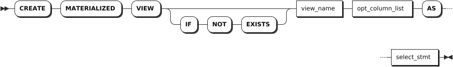
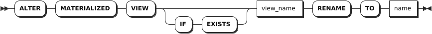
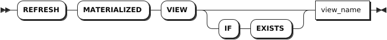

# 物化视图

物化视图（Materialized View）是一种特殊的数据库对象。它是一种存储底层查询结果的视图。

## 创建物化视图

`CREATE MATERIALIZED VIEW` 语句用于创建物化视图。创建物化视图时，系统会将查询结果写入物化试图。用户无法向物化视图中插入数据，也无法修改或删除物化视图中的数据。当用户查询物化视图中的数据时，物化视图返回的存储数据可能已经过时。如需从物化视图中获取最新数据，用户需要手动[刷新物化视图](#刷新物化视图)。

KWDB 不支持基于临时表、临时视图创建物化视图，也不支持显式事务创建物化视图。

### 所需权限

用户是 `admin` 角色的成员或者拥有所属数据库的 CREATE 权限和引用表的 SELECT 权限。默认情况下，`root` 用户属于 `admin` 角色。

### 语法格式



### 参数说明

| 参数 | 说明 |
| --- | --- |
| `IF NOT EXISTS` | 可选关键字，当使用 `IF NOT EXISTS` 关键字时，如果目标物化视图不存在，系统创建物化视图。如果目标物化视图存在，系统创建物化视图失败，但不会报错。当未使用 `IF NOT EXISTS` 关键字时，如果目标物化视图不存在，系统创建物化视图。如果目标物化视图存在，系统报错，提示目标物化视图已存在。 |
| `view_name` | 待创建物化视图的名称，该名称在数据库中必须唯一，并且遵循[数据库标识符规则](../../../sql-reference/sql-identifiers.md)。如果没有将父数据库设置为默认值，必须将物化视图名称格式设置为 `database.view_name`。 |
| `opt_column_list` | 可选项，物化视图列名列表。支持指定一个或多个物化视图的列名，列名之间使用逗号（`,`）隔开。如果指定物化视图的列名，控制台输出指定的列名，而不是输出通过 `select_stmt` 语句指定的列的列名。 |
| `select_stmt` | `SELECT` 查询语句。 |

### 语法示例

本示例假设已经创建一个名为 `orders` 的表，包括顾客 ID，订单号和订单金额。以下示例为 `orders` 表创建一个名为 `small_order` 的物化视图，获取订单号和订单金额。

```sql
-- 1. 查看 orders 表的信息。

SELECT * FROM orders;
  customer_id |   id   | total
--------------+--------+--------
       100001 | 100001 |   234
       100001 | 100002 |   120
       100002 | 100003 |    59
       100002 | 100004 |   120
(4 rows)

-- 2. 创建 small_order 物化视图，获取订单号和订单金额。

CREATE MATERIALIZED VIEW small_order (id, amount) AS SELECT id, total FROM orders;


-- 3. 查看物化视图信息。

SELECT * FROM small_order;
    id   | amount
---------+---------
  100001 |    234
  100002 |    120
  100003 |     59
  100004 |    120
(4 rows)
```

## 修改物化视图

`ALTER MATERIALIZED VIEW` 语句用于修改物化视图的名称。

### 所需权限

用户是 `admin` 角色的成员或者拥有重命名前物化视图的 DROP 权限以及重命名后物化视图所属父数据库 CREATE 的权限。默认情况下，`root` 用户属于 `admin` 角色。

### 语法格式



### 参数说明

| 参数 | 说明 |
| --- | --- |
| `IF EXISTS` | 可选关键字。当使用 `IF EXISTS` 关键字时，如果目标物化视图存在，系统修改目标物化视图。如果目标物化视图不存在，系统修改目标物化视图失败，但不会报错。当未使用 `IF EXISTS` 关键字时，如果目标物化视图存在，系统修改目标物化视图。如果目标物化视图不存在，系统报错，提示目标物化视图不存在。 |
| `view_name` | 待重命名的物化视图的名称。支持使用 `SELECT * FROM information_schema.tables WHERE table_type = 'MATERIALIZED VIEW'` 语句查看物化视图名称。 |
| `name` | 新的物化视图名称。该名称在数据库中必须唯一，并且[遵循数据库标识符规则](../../sql-identifiers.md)。 |

### 语法示例

以下示例将 `test_view` 物化视图重命名为 `names`。

```sql
-- 1. 查看所有物化视图。

SELECT * FROM information_schema.tables WHERE table_type = 'MATERIALIZED VIEW';
  table_catalog | table_schema | table_name  | table_type              | is_insertable_into | version | namespace_oid
----------------+--------------+-------------+-------------------------+--------------------+---------+----------------
  db2           | public       | test_view   | MATERIALIZED VIEW       | NO                 |       1 |    1497612465
  db2           | public       | small_order | MATERIALIZED VIEW       | NO                 |       1 |    1497612465
(2 rows)

-- 2. 将 test_view 物化视图重命名为 names。

ALTER MATERIALIZED VIEW test_view rename to names;

-- 3. 查看所有物化视图。

SELECT * FROM information_schema.tables WHERE table_type = 'MATERIALIZED VIEW';
  table_catalog | table_schema | table_name  | table_type              | is_insertable_into | version | namespace_oid
----------------+--------------+-------------+-------------------------+--------------------+---------+----------------
  db2           | public       | names       | MATERIALIZED VIEW       | NO                 |       1 |    1497612465
  db2           | public       | small_order | MATERIALIZED VIEW       | NO                 |       1 |    1497612465
(2 rows)
```

## 刷新物化视图

`REFRESH MATERIALIZED VIEW` 语句用于手动刷新物化视图。如未手动刷新物化视图，物化视图中的数据会一直保持不变。刷新物化视图，不会影响用户查询数据。用户可以使用 `SHOW JOBS` SQL 语句查看正在执行的刷新任务。如果执行刷新数据时已经有正在刷新的操作，系统会报错。

KWDB 不支持显式事务刷新物化视图。

### 所需权限

用户是 `admin` 角色的成员或者拥有物化视图的 UPDATE 权限。默认情况下，`root` 用户属于 `admin` 角色。

### 语法格式



### 参数说明

| 参数 | 说明 |
| --- | --- |
| `view_name` | 物化视图的名称。|

### 语法示例

以下示例刷新 `small_orders` 物化视图。

```sql
REFRESH MATERIALIZED VIEW small_orders;
```

## 删除物化视图

`DROP MATERIALIZED VIEW` 语句用于从数据库中删除物化视图。

### 所需权限

- 删除无依赖关系的物化视图：用户是 `admin` 角色的成员或者拥有目标物化视图的 DROP 权限。默认情况下，`root` 用户属于 `admin` 角色。
- 删除存在依赖关系的物化视图：用户是 `admin` 角色的成员或者是拥有目标物化视图及其关联对象的 DROP 权限。默认情况下，`root` 用户属于 `admin` 角色。

### 语法格式


### 参数说明

| 参数 | 说明 |
| --- | --- |
| `IF EXISTS` | 可选关键字。当使用 `IF EXISTS` 关键字时，如果目标物化视图存在，系统删除目标物化视图。如果目标物化视图不存在，系统删除目标物化视图失败，但不会报错。当未使用 `IF EXISTS` 关键字时，如果目标物化视图存在，系统删除目标物化视图。如果目标物化视图不存在，系统报错，提示目标物化视图不存在。 |
| `view_name_list` | 待删除的物化视图名称列表。支持指定一个或多个无依赖关系的物化视图，物化视图名称之间使用逗号（`,`）隔开。支持使用 `SELECT * FROM information_schema.tables WHERE table_type = 'MATERIALIZED VIEW'` 语句查看物化视图名称。  |
| `CASCADE` | 可选关键字。删除目标物化视图及其关联对象。`CASCADE` 不会列出待删除的关联对象，应谨慎使用。 |
| `RESTRICT` | 默认设置，可选关键字。如果其他对象依赖目标物化视图，则无法删除该物化视图。 |

### 语法示例

以下示例删除 `names` 物化视图。

```sql
-- 1. 查看所有物化视图。

SELECT * FROM information_schema.tables WHERE table_type = 'MATERIALIZED VIEW';
  table_catalog | table_schema | table_name  | table_type              | is_insertable_into | version | namespace_oid
----------------+--------------+-------------+-------------------------+--------------------+---------+----------------
  db2           | public       | names       | MATERIALIZED VIEW       | NO                 |       1 |    1497612465
  db2           | public       | small_order | MATERIALIZED VIEW       | NO                 |       1 |    1497612465
(2 rows)

-- 2. 删除 names 物化视图。

DROP MATERIALIZED VIEW names;

-- 3. 查看所有物化视图。

SELECT * FROM information_schema.tables WHERE table_type = 'MATERIALIZED VIEW';
  table_catalog | table_schema | table_name  | table_type              | is_insertable_into | version | namespace_oid
----------------+--------------+-------------+-------------------------+--------------------+---------+----------------
  db2           | public       | small_order | MATERIALIZED VIEW       | NO                 |       1 |    1497612465
(1 rows)
```
