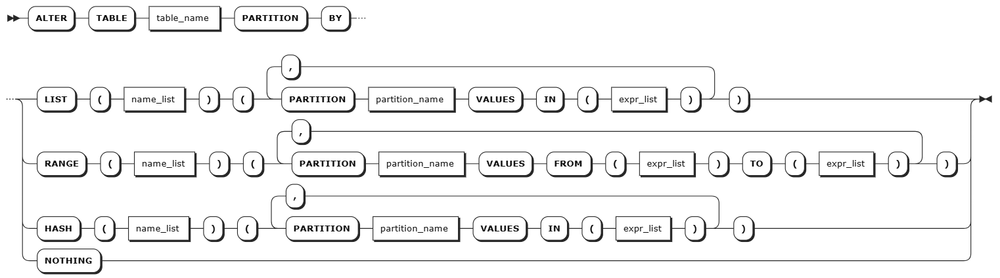
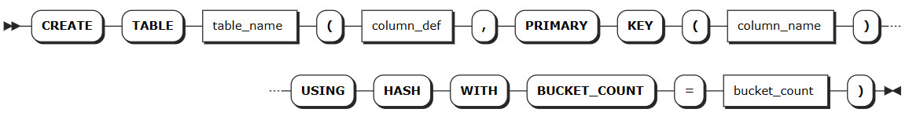
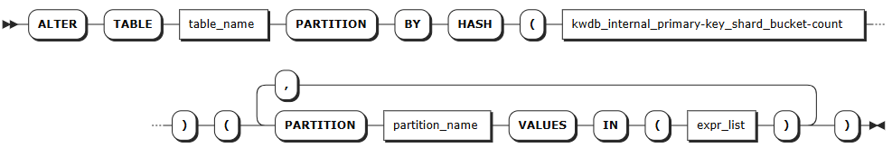

# 分区管理

表分区是一种数据库优化技术，通过对数据存储位置进行行级控制，将数据分布到指定节点上，从而有效降低查询延迟并提升性能。

## 工作原理

关系数据库中，表分区功能由两个核心组件协同工作：

### 分区定义

用户可以在创建表或修改表时，对表的一列或多列定义分区策略。KWDB 支持根据数据特征和查询模式选择以下任意一种分区方式：

| 分区方式 | 语法                 | 适用场景                         | 主要特点                                                     | 示例场景                       |
| :------- | :------------------- | :------------------------------- | :----------------------------------------------------------- | :----------------------------- |
| 列表分区 | `PARTITION BY LIST`  | 分区键值数量有限且相对固定       | - 明确枚举每个分区的所有可能值<br>- 支持单列或多列组合作为分区键<br>- 可设置 `DEFAULT` 分区兜底 | 按国家/地区对用户数据分区      |
| 范围分区 | `PARTITION BY RANGE` | 分区键值数量庞大，无法逐一列举   | - 通过上下界定义连续值范围<br>- 支持 `MINVALUE`/`MAXVALUE` 边界<br>- 下界包含，上界排除<br>- NULL 值视为最小值 | 按时间范围对订单数据分区       |
| 哈希分区 | `PARTITION BY HASH`  | 需要数据均匀分布，无明显业务分组 | - 使用哈希函数映射到固定分区数<br>- 数据分布相对均匀<br>- 支持与 `USING HASH WITH BUCKET_COUNT` 联用，将索引键值分布到多个分片桶（bucket）中，实现更均匀的数据分布 | 按用户 ID 哈希分区实现负载均衡 |

::: warning 说明

- **范围分区表达式**：仅在创建时计算一次。例如，在 2025-01-30 创建的 `< (now() - '1d')` 分区将始终包含小于 2025-01-29 的值，不会动态更新。
- **哈希分区配置**：主要用于数据分布优化。与 `USING HASH WITH BUCKET_COUNT` 联用时，需要先通过 `SET experimental_enable_hash_sharded_indexes = ON;` 语句启用哈希分片索引功能。
- **分区限制**：目前暂不支持创建分区后修改分区，也不支持主键嵌套分区。

:::

### 区域配置

分区定义仅为满足条件的表行添加标识。要使分区真正发挥作用，需要配置区域（zone）并将其应用到相应分区。配置优先级：分区 > 表 > 数据库。

## 创建分区

### 所需权限

- 建表时创建分区：用户是 `admin` 角色成员或拥有数据库的 CREATE 权限。默认情况下，root 用户属于 `admin` 角色。
- 修改表时创建分区：用户是 `admin` 角色成员或拥有目标表的 CREATE 权限。默认情况下，root 用户属于 `admin` 角色。

### 语法格式

::: warning 说明

以下语法仅列出创建分区的必需参数。关于创建表和修改表支持的完整参数，参见[创建表](../../../sql-reference/ddl/relational-db/relational-table.md#创建表)和[修改表](../../../sql-reference/ddl/relational-db/relational-table.md#修改表)。

:::

- 建表时创建分区

  

- 改表时创建分区

  

- 通过哈希分片索引创建分区

  1. 建表时定义哈希分片

        

  2. 改表时创建分区

        

### 参数说明

| 参数             | 说明                                                         |
| :--------------- | :----------------------------------------------------------- |
| `table_name`     | 分区所在的表名                                               |
| `column_def`     | 表列定义。列定义列表，支持定义一列或多列，各列之间使用逗号（`,`）隔开。列名在表中必须唯一，但可以与索引或约束同名。每列必须定义列名、数据类型，可以选择定义列级约束或其他列限定（例如计算列），格式为 `<column_name> <typename> [col_qual_list]`。在列级别定义的主键、唯一性约束、检查约束将作为表创建的一部分移动到表级别 |
| `name_list`      | 分区键，必须为主键列的开头                                         |
| `partition_name` | 分区名称                                                     |
| `expr_list`      | 分区值表达式列表                                             |
| `column_name`    | 主键列名                                                     |
| `bucket_count`   | 分片桶数，必须为整数                                         |
| `kwdb_internal_primary-key_shard_bucket-count`   | 启用哈希分片索引功能后系统生成的内部列，用于存储哈希分片键，其中 `primary-key` 为分区所在表的主键名，`bucket-count` 为建表时设置的分片桶数 |

### 语法示例

### 语法示例

- 建表时创建分区

    ```SQL
    -- 创建电商订单管理数据库
    CREATE DATABASE ecommerce_orders;

    -- 创建按地区分区的订单表，不同地区的订单数据分别存储，便于地区化管理和就近访问
    CREATE TABLE ecommerce_orders.regional_orders (
        order_id BIGINT,
        region_code INT,  -- 地区代码：1-华北，2-华东，3-华南
        customer_id BIGINT,
        product_id BIGINT,
        order_amount DECIMAL(10,2),
        order_status VARCHAR(20),
        created_at TIMESTAMP DEFAULT NOW(),
        PRIMARY KEY (region_code, order_id)  -- 分区键必须在主键的开头
    ) PARTITION BY LIST (region_code) (
        PARTITION north_china VALUES IN (1),    -- 华北地区分区
        PARTITION east_china VALUES IN (2),     -- 华东地区分区
        PARTITION south_china VALUES IN (3)     -- 华南地区分区
    );
    ```

- 修改表时创建分区

    ```SQL
    -- 为现有表添加按时间范围的分区
    ALTER TABLE existing_orders 
    PARTITION BY RANGE (created_at) (
        PARTITION q1_2025 VALUES FROM ('2025-01-01') TO ('2025-04-01'),
        PARTITION q2_2025 VALUES FROM ('2025-04-01') TO ('2025-07-01'),
        PARTITION q3_2025 VALUES FROM ('2025-07-01') TO ('2025-10-01'),
        PARTITION q4_2025 VALUES FROM ('2025-10-01') TO ('2026-01-01')
    );
    ```

- 通过哈希分片索引创建分区

    ```SQL
    -- 启用哈希分片索引
    SET experimental_enable_hash_sharded_indexes = ON;
    
    -- 创建使用哈希分片的用户表
    CREATE TABLE users (
        user_id BIGINT,
        username VARCHAR(50),
        email VARCHAR(100),
        created_at TIMESTAMP DEFAULT NOW(),
        PRIMARY KEY (user_id) USING HASH WITH BUCKET_COUNT = 8
    );
    
    -- 查看表索引信息
    SHOW INDEXES FROM users;
    
    -- 为哈希分片表创建分区
    ALTER TABLE users 
    PARTITION BY HASH (kwdb_internal_user_id_shard_8) (
        PARTITION shard_0 VALUES IN (0),
        PARTITION shard_1 VALUES IN (1),
        PARTITION shard_2 VALUES IN (2),
        PARTITION shard_3 VALUES IN (3),
        PARTITION shard_4 VALUES IN (4),
        PARTITION shard_5 VALUES IN (5),
        PARTITION shard_6 VALUES IN (6),
        PARTITION shard_7 VALUES IN (7)
    );
    ```

## 设置分区

`ALTER PARTITION` 语句用于修改表分区的副本区域配置。

::: warning 注意

- **异常和缩容对规则执行的影响**：当规则指定的目标节点包含异常节点或正在进行缩容操作时，设置的 `lease_preferences` 和 `constraints` 可能无法按照指定规则成功分布。
- **规则对分布式高可用和缩容的影响**：
  - 如果集群中某个节点异常，指向该节点的 `lease_preferences` 可能会失效，但系统会保持高可用性，`constraints` 设置的约束可能会限制后续的高可用副本补充操作。
  - 执行缩容操作时，设置的 `lease_preferences` 可能会失效，但系统仍然保持高可用性，`constraints` 约束设置可能导致缩容操作无法正常完成。

:::

### 所需权限

用户是 `admin` 角色成员或拥有目标表的 CREATE 权限。默认情况下，root 用户属于 `admin` 角色。

### 语法格式


### 参数说明

| 参数             | 说明                                                         |
| :--------------- | :----------------------------------------------------------- |
| `partition_name` | 待修改的分区名称                                             |
| `table_name`     | 分区所在的表名                                               |
| `variable`       | 支持修改以下变量：<br>- `num_replicas`：副本数量。默认值为 3<br>- `constraints`：副本位置的必需（+）和/或禁止（-）约束。例如 `constraints = '{"+region=NODE1": 1, "+region=NODE2": 1, "+region=NODE3": 1}'` 表示在节点 1、节点 2、节点 3 上必须各放置 1 个副本。目前只支持 `region=NODEx` 格式<br>- `lease_preferences`：主副本位置的必需（+）和/或禁止（-）约束的有序列表。例如 `lease_preferences = '[[+region=NODE1]]'` 表示倾向将主副本放置在节点 1。如果不能满足首选项，KWDB 将尝试下一个优先级。如果所有首选项都无法满足，KWDB 将使用默认的租约分布算法，基于每个节点已持有的租约数量来决定租约位置，尝试平衡租约分布。列表中的每个值可以包含多个约束<br><br>**注意**：<br>- 租约偏好不必与 `constraints` 字段共享，用户可以单独定义 `lease_preferences`<br>- 设置 `constraints` 时需要同步设置 `num_replicas`，且 `constraints` 数量需要小于等于 `num_replicas` 数量。`constraints` 中的顺序无影响 |
| `value`          | 变量值，可以是具体的配置值，也可以是 `COPY FROM PARENT`，即使用父区域的设置值 |
| `DISCARD`        | 移除区域配置，采用默认值                                     |

### 语法示例

```SQL
-- 华北分区：数据存储在所有节点，lease 偏向节点 1
ALTER PARTITION north_china OF TABLE ecommerce_orders.regional_orders 
CONFIGURE ZONE USING 
    num_replicas = 3, 
    constraints = '{"+region=NODE1": 1, "+region=NODE2": 1, "+region=NODE3": 1}',
    lease_preferences = '[[+region=NODE1]]';

-- 华东分区：数据存储在所有节点，lease 偏向 节点 2
ALTER PARTITION east_china OF TABLE ecommerce_orders.regional_orders 
CONFIGURE ZONE USING 
    num_replicas = 3, 
    constraints = '{"+region=NODE1": 1, "+region=NODE2": 1, "+region=NODE3": 1}',
    lease_preferences = '[[+region=NODE2]]';

-- 华南分区：数据存储在所有节点，lease 偏向 节点 3
ALTER PARTITION south_china OF TABLE ecommerce_orders.regional_orders 
CONFIGURE ZONE USING 
    num_replicas = 3, 
    constraints = '{"+region=NODE1": 1, "+region=NODE2": 1, "+region=NODE3": 1}',
    lease_preferences = '[[+region=NODE3]]';

-- 向表中写入数据
INSERT INTO ecommerce_orders.regional_orders VALUES
  (1001, 1, 5001, 2001, 299.99, 'completed', '2025-01-15 10:30:00'),  -- 华北地区订单
  (1002, 2, 5002, 2002, 459.50, 'pending', '2025-01-15 11:15:00'),    -- 华东地区订单  
  (1003, 3, 5003, 2003, 189.00, 'completed', '2025-01-15 14:20:00'),  -- 华南地区订单
  (1004, 1, 5004, 2001, 799.99, 'processing', '2025-01-15 16:45:00'), -- 华北地区订单
  (1005, 2, 5005, 2004, 329.00, 'completed', '2025-01-15 18:30:00'),  -- 华东地区订单
  (1006, 3, 5006, 2005, 259.99, 'pending', '2025-01-15 20:15:00');    -- 华南地区订单

-- 查询数据分布情况
SELECT database_name, table_name, range_id, start_pretty, end_pretty, lease_holder, replicas, range_size 
FROM kwdb_internal.ranges 
WHERE database_name = 'ecommerce_orders' AND table_name = 'regional_orders';
```