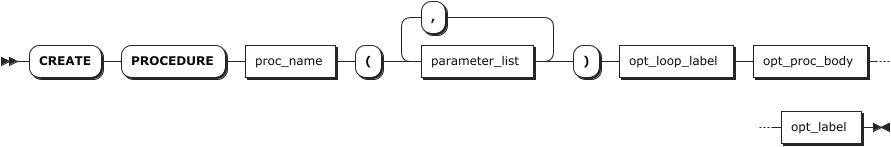
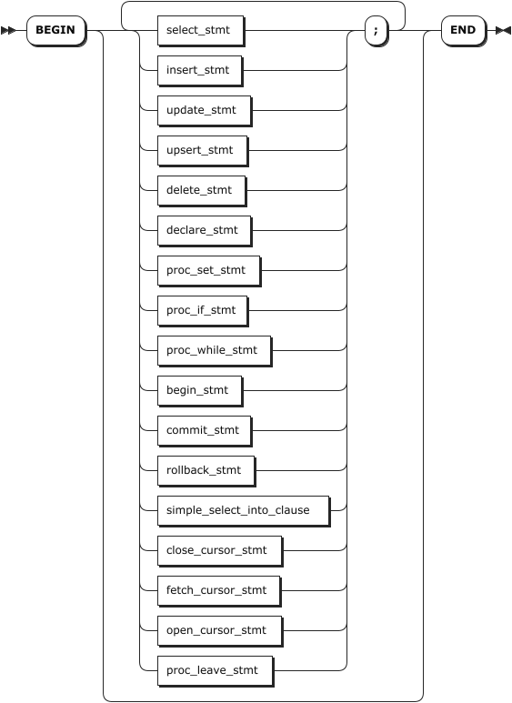
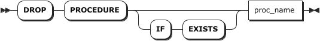

# 存储过程

在 KWDB 数据库中，存储过程（Stored Procedure）是一种数据库对象，用于存储复杂程序，以便外部程序调用。存储过程是为了完成特定功能的 SQL 语句集，经编译、创建并保存在数据库中。用户可以通过指定存储过程的名字和参数来调用执行存储过程。

KWDB 关系引擎支持创建、修改、查看、删除、执行存储过程。存储过程支持全部的 SQL 语法和以下特殊的语法结构：

- `DECLARE`
- `SET`
- `SELECT`、`DELETE`、`INSERT`、`UPDATE INTO`、`UPSERT`
- `OPEN`、`FETCH`、`CLOSE`
- `CONTINUE HANDLER`、`EXIT HANDLER`
- `IFELSE`
- `LOOP`
- `LABEL`
- `LEAVE`
- 事务语句
- 特殊函数（`ROW_COUNT()`）
- `PREPARE`、`EXECUTE`、`DEALLOCATE`

::: warning 说明

- 不支持存储过程中嵌套存储过程。
- 不支持显式事务调用存储过程。
- 不支持 `EXPLAIN`（`ANALYZE`）语句中显示存储过程的执行计划。
- 存储过程内部不支持引用除关系表、时序表之外的数据库对象，例如视图、序列等。
- 存储过程不支持设置传参方式，如 `IN`、`OUT`、`INOUT`，所有参数都作为输入参数处理。
- 存储过程中如果有多个结果集，其中部分结果集为空，则不显示空结果集。
- 在使用驱动连接数据库时，`PREPARE` 模式下只支持正常输出一个结果集。

:::

## 创建存储过程

`CREATE PROCEDURE` 语句用于创建存储过程。

### 所需权限

用户是 `admin` 角色的成员或者拥有当前数据库的 CREATE 权限和存储过程体中引用的所有对象的相关权限（例如表的 SELECT 权限）。默认情况下，`root` 用户属于 `admin` 角色。

### 语法格式



- opt_proc_body

    

- proc_set_stmt

    

- proc_if_stmt

    

- proc_while_stmt

    

- simple_select_into_clause

    

- proc_leave_stmt

    

### 参数说明

| 参数 | 说明 |
| --- | --- |
| `proc_name` | 待创建的存储过程的名称。|
| `parameter_list` | 存储过程的传入参数定义，支持定义一个或多个传入参数，各传入参数之间使用逗号（`,`）隔开，格式为 `var_name var_type`。<br>- `var_name`：变量名称。<br>- `var_type`：变量的数据类型，支持 INT2、INT4、INT8、FLOAT4、FLOAT8、DECIMAL、STRING、TEXT、CHAR、VARCHAR、TIMESTAMP、TIMESTAMPTZ。如未设置，默认为 NULL。|
| `opt_loop_label` | 存储过程体的标签，格式为 `LABEL label_name:`。|
| `opt_proc_body` | 存储过程体，包括在过程调用的时候必须执行的 SQL 语句。存储过程体以 `BEGIN` 关键字开始，以 `END` 关键字结束。<br >**说明** <br >如果使用 KaiwuDB JDBC 创建存储过程，需要使用双美元符号（`$$`）将 `BEGIN ...END` 语句包裹起来。|
| `opt_label` | 存储过程体的标签，与 `opt_loop_label` 参数成对出现，格式为 `label_name`。|
| `select_stmt`| 选择语句，用于读取数据。 |
| `insert_stmt`| 插入语句，用于向表中写入一行或多行数据。|
| `update_stmt`| 更新语句，用于更新目标表中某行数据，格式为 `UPDATE .... RETURNING target_list INTO select_into_targets`。 |
| `upsert_stmt`| 更新插入语句，用于更新、插入数据。 |
| `delete_stmt`| 删除语句，用于删除目标表中的行数据，格式为 `DELETE FROM .... RETURNING target_list INTO select_into_targets`。|
| `declare_stmt`| 用于声明自定义变量、处理程序以及游标。有关详细信息，参见[声明](../../other-sql-statements/declare-sql.md)语句。|
| `proc_set_stmt` | 用于设置自定义变量，格式为 `SET var_name = a_expr`。其中，`var_name` 表示自定义变量的名称，`a_expr` 表示自定义变量赋值的表达式，支持正常的自定义变量取值和存储过程中定义的临时变量（`DECLARE` 语句声明的变量）。<br > 在存储过程中设置的自定义变量仅对当前会话有效，会话结束后自动失效。<br > 在存储过程中设置的自定义变量，在调用存储过程后，用户仍可在外部会话中访问和修改该自定义变量。<br > 在存储过程中设置自定义变量的类型后，不支持修改自定义变量的类型。后续赋值必须与初始类型一致，否则系统报错。<br > 如果存储过程外部设置了自定义变量，在创建存储过程中设置自定义变量时，系统检查存储过程外部是否已存在具有相同名称的自定义变量。如果存在且类型一致，则成功设置自定义变量。否则，系统将报错。<br >**说明** <br > 在存储过程内设置的自定义变量值不受 `COMMIT`、`ROLLBACK` 事务语句的影响。|
| `proc_if_stmt` | `IF` 条件语句，用于根据给定的条件执行不同的 SQL 语句块，格式为 `IF a_expr THEN proc_stmt_list opt_stmt_elsifs opt_stmt_else ENDIF`。<br>- `a_expr`：`IF` 语句的条件表达式，该表达式必须是返回布尔值的表达式。<br>- `proc_stmt_list`：满足条件后需要执行的语句。支持的语句与 `CREATE PROCEDURE` 语句支持的语句相同。 <br>- `opt_stmt_elsifs`：可选项，`IF` 语句的其他条件分支。 <br>- `opt_stmt_else`：可选项，`IF` 语句的 `ELSE` 条件分支。|
| `proc_while_stmt` | `WHILE` 循环语句，用于在指定条件为真时重复执行一段代码，格式为 `opt_loop_label WHILE a_expr DO proc_stmt_list ENDWHILE opt_label`。<br>- `opt_loop_label`：`WHILE` 循环语句的标签，格式为 `LABEL label_name：`。 <br>-`a_expr`：`WHILE` 循环语句的条件判断表达式。 <br>-`proc_stmt_list`：满足条件后需要执行的语句。支持的语句与 `CREATE PROCEDURE` 语句支持的语句相同。 <br>- `opt_label`：`WHILE` 循环语句的标签，与 `opt_loop_label` 参数成对出现，格式为 `label_name`。 |
| `begin_stmt` | 启动事务语句。 |
| `commit_stmt` | 提交事务语句。 |
| `rollback_stmt` | 回滚事务语句。 |
| `simple_select_into_clause` | 简单查询语句，格式为 `SELECT .... INTO select_into_targets from_clause ....`。<br> `select_into_targets`: 支持写入一个多个变量，包括自定义变量，各变量之间使用逗号（`,`）隔开。|
| `declare_cursor_stmt` | 声明游标语句。有关详细信息，参见[声明游标](../../other-sql-statements/declare-sql.md#声明游标)。|
| `open_cursor_stmt` | 打开游标语句。有关详细信息，参见[打开游标](../../other-sql-statements/cursor-sql.md#打开游标)。 |
| `fetch_cursor_stmt` | 获取游标语句。有关详细信息，参见[获取游标](../../other-sql-statements/cursor-sql.md#获取游标)。 |
| `close_cursor_stmt` | 关闭游标语句。有关详细信息，参见[关闭游标](../../other-sql-statements/cursor-sql.md#关闭游标)。 |
| `proc_leave_stmt`| 在使用 `LABEL` 关键字为存储过程体或 `WHILE` 语句定义标签时，可以使用 `LEAVE` 语句跳出存储过程体或 `WHILE` 循环，格式为 `LEAVE label_name`。 |
| `prepare_stmt` | 预处理语句，格式为 `PREPARE stmt_name AS stmt_sql`。预处理语句名称在当前会话中必须全局唯一。在存储过程中创建预处理语句时，若与已存在的预处理语句重名，系统将报错。在存储过程中创建的预处理语句仅对当前会话有效，会话结束后自动清理。<br > 在存储过程中，预处理语句定义的 SQL 语句必须是存储过程支持的单个完整 SQL 语句。SQL 语句的参数占位符仅支持美元符号（`$`）且仅能替换 SQL 中的值（如 `WHERE id = $1`），不能替换表名、列名、关键字等标识符。<br > 在存储过程中，预处理语句支持 `SELECT`、`INSERT`、`UPDATE`、`UPSERT`、`DELETE` 语句。<br > 在存储过程中，预处理语句不支持事务语句（`BEGIN`、`START TRANSACTION`、`COMMIT`、`ROLLBACK`）、会话控制语句（`USE`）、存储过程的流程控制语句、存储过程相关的语句（`CREATE PROCEDURE`、`ALTER PROCEDURE`、`DROP PROCEDURE`、`CALL PROCEDURE`）、`SELECT INTO` 语句、DDL 语句。<br > 存储过程内部可以使用在存储过程外部定义的预处理语句。反之，如果系统未主动释放存储过程中创建的预处理语句，在存储过程外部也可以使用该预处理语句。<br >**说明** <br >- 不支持预处理语句中嵌套另一个预处理语句。<br >- 预处理语句中不能包含存储过程中定义的临时变量（`DECLARE` 语句声明的变量）和自定义变量。<br >- 运行预处理语句后，如果未显式执行 `DEALLOCATE PREPARE` 语句，预处理对象会保留在当前会话中。此时，如果在存储过程外部创建具有相同名称的预处理对象，系统会报错。 |
| `execute_stmt` | 执行预处理语句，格式为 `EXECUTE stmt_name para_value`。<br >**说明** <br > 执行预处理语句中不能包含存储过程中定义的临时变量（`DECLARE` 语句声明的变量）或传入参数。用户需要通过 `SET @var = variable` 语句提前进行转换。 |
| `deallocate_stmt` | 释放预处理语句，格式为 `DEALLOCATE PREPARE stmt`。如需删除所有的预处理语句，使用 `DEALLOCATE ALL` 或者 `DEALLOCATE PREPARE ALL` 语句。|

### 语法示例

- 创建存储过程。

    以下示例创建一个名为 `test` 的存储过程。

    ```sql
    -- 设置分隔符。
    delimiter \\

    -- 创建存储过程。
    create procedure test() 
    label test:
    begin 
            declare a int;
            declare b int;
            declare err int;
            declare exit HANDLER FOR NOT FOUND,SQLEXCEPTION
            BEGIN
            SET err = -1;
            SELECT a,b;
            ROLLBACK;
            ENDHANDLER;
            
            START TRANSACTION;
            set a = 10;
            select a, b from t1;
            update t1 set a =  a + 1 where b > 0;
            insert into t1 values (a, b);
            label my_loop:
            WHILE b <= 10 DO 
                    declare d int;
                    set d = b + 2;
                    if d > 9 then 
                            select * from t1; 
                            leave my_loop;
                    elsif b > 5 then 
                            select * from t2; 
                    endif;
                    set b = b + 1; 
            ENDWHILE my_loop; 
            IF err = 0 THEN
                    SELECT a,b;
            ENDIF;
            COMMIT;
    end test\\
    delimiter ;
    CREATE PROCEDURE
    ```

- 创建存储过程，并在存储过程中设置自定义变量。

    ```sql
    -- 设置分隔符。
    DELIMITER \\

    -- 创建存储过程。
    CREATE PROCEDURE proc1()
    BEGIN
    declare a int;
    set a = 10;
    set @b = 1;
    select @b;
    
    set @b = a;
    select @b;
    
    END //
    CREATE PROCEDURE
    Time: 60.4819ms
    ```

- 创建存储过程，并在存储过程中使用 `PREPARE`、`EXECUTE`、`DEALLOCATE` 语句。

    ```sql
    -- 设置分隔符。
    DELIMITER \\

    -- 创建存储过程。    
    CREATE PROCEDURE proc1()
    BEGIN
      PREPARE stmt as SELECT 1;
      EXECUTE stmt;
      DEALLOCATE PREPARE stmt;
    END //

    CREATE PROCEDURE
    Time: 60.4819ms
    ```

## 调用存储过程

`CALL` 语句用于调用存储过程。

::: warning 说明

- 如果在创建存储过程时定义了自定义变量，在调用存储过程时，系统检查存储过程外部是否已存在具有相同名称的自定义变量。如果存在且类型一致，系统将成功调用存储过程并用新的自定义变量值覆盖原有值。否则，系统将报错。
- 如果在创建存储过程时定义了预处理语句，在调用存储过程时，系统检查预处理语句的语法。如果不符合语法，系统将报错。
- 如果在创建存储过程时定义了执行预处理语句，在调用存储过程时，系统检查执行预处理语句的对象是否存在。如果不存在，系统将报错。
- 如果在创建存储过程时定义了释放预处理语句，在调用存储过程时，系统检查释放预处理语句的对象是否存在。如果不存在，系统将报错。

:::

### 所需权限

用户是 `admin` 角色的成员或者拥有目标存储过程 EXECUTE 权限和存储过程体中引用的所有对象的相关权限（例如表的 SELECT 权限）。默认情况下，`root` 用户属于 `admin` 角色。

### 语法格式


### 参数说明

| 参数 | 说明 |
| --- | --- |
| `proc_name` | 待调用的存储过程的名称。|
| `input_param_list` | 传入参数列表，支持定义一个或多个传入参数，各传入参数之间使用逗号（`,`）隔开。<br> **说明**：<br> 调用存储过程时，指定的传入参数的数量、顺序和类型必须与创建存储过程时定义的传入参数的数量、顺序和类型保持一致。 |

### 语法示例

以下示例调用 `test1` 存储过程，查看当参数 `a` 取值为 `1` 时， `test1` 存储过程中的数据。

```sql
-- 设置分隔符。
DELIMITER \\

-- 创建存储过程。
CREATE PROCEDURE test1(a int) 
label test:
begin 
    if a > 5 then 
        select a;
    else 
        select 5,4,3,2,1;
    endif;
end test \\

-- 设置分隔符。
DELIMITER ;

-- 调用存储过程。
call test1(1);
  ?column? | ?column? | ?column? | ?column? | ?column?
-----------+----------+----------+----------+-----------
         5 |        4 |        3 |        2 |        1
```

## 修改存储过程

`ALTER PROCEDURE` 语句用于修改存储过程的注释信息。用户也可以使用 `COMMENT ON` 命令修改存储过程的注释信息，有关详细信息，参见[添加注释](../relational-db/relational-comment.md#添加注释)。

### 所需权限

用户是 `admin` 角色的成员或者拥有目标存储过程的 CREATE 权限。默认情况下，`root` 用户属于 `admin` 角色。

### 语法格式


### 参数说明

| 参数 | 说明 |
| --- | --- |
| `proc_name` | 待修改的存储过程的名称。|
| `comment_text` | 存储过程的注释信息。|

### 语法示例

以下示例为 `proc1` 存储过程添加注释信息。

```sql
ALTER PROCEDURE proc1 COMMENT IS 'test query sql and if else logical';
```

## 查看存储过程

`SHOW PROCEDURES` 语句用于查看当前数据库下已创建的存储过程。

`SHOW CREATE PROCEDURE` 语句用于查看指定存储过程的创建语句。

### 所需权限

用户拥有目标存储过程的任何权限。

### 语法格式

- 查看存储过程

    

- 查看存储过程的创建语句

    

### 参数说明

| 参数 | 说明 |
| --- | --- |
| `WITH COMMENT` | 可选关键字，查看存储过程的注释信息。|
| `proc_name` | 待查看的存储过程的名称。|

### 语法示例

- 查看当前数据库下已创建的存储过程。

    ```sql
    SHOW PROCEDURES;
    procedure_name
    ------------------
    proc1
    (1 row)
    ```

- 查看当前数据库下已创建的带有注释信息的存储过程。

    ```sql
    SHOW PROCEDURES WITH COMMENT;
    procedure_name |              comment
    -----------------+-------------------------------------
    proc1           | test query sql and if else logical
    (1 row)
    ```

- 查看指定存储过程的创建语句。

    以下示例查看 `proc1` 存储过程的创建语句。

    ```sql
    SHOW CREATE PROCEDURE proc1;
    procedure_name |                    procedure_body
    -----------------+-------------------------------------------------------
    proc1           | CREATE PROCEDURE proc1()
                    | BEGIN
                    |     DECLARE a INT4;
                    |     DECLARE b INT4;
                    |     DECLARE err INT4;
                    |     DECLARE EXIT HANDLER FOR NOT FOUND,SQLEXCEPTION
                    |     BEGIN
                    |         SET err = -1;
                    |         SELECT a, b;
                    |         ROLLBACK TRANSACTION;
                    |     ENDHANDLER;
                    |     BEGIN TRANSACTION;
                    |     SET a = 10;
                    |     SELECT a, b FROM test.public.t1;
                    |     UPDATE test.public.t1 SET a = a + 1 WHERE b > 0;
                    |     INSERT INTO test.public.t1 VALUES (a, b);
                    |     LABEL my_loop:
                    |     WHILE b <= 10 DO
                    |         DECLARE d INT4;
                    |         SET d = b + 2;
                    |         IF d > 9 THEN
                    |         SELECT t1.a, t1.b FROM test.public.t1;
                    |         LEAVE my_loop;
                    |     ELSIF b > 5 THEN
                    |         SELECT t2.a, t2.b, t2.c FROM test.public.t2;
                    |     ENDIF;
                    |         SET b = b + 1;
                    |     ENDWHILE my_loop;
                    |     IF err = 0 THEN
                    |         SELECT a, b;
                    |     ENDIF;
                    |     COMMIT TRANSACTION;
                    | END
    (1 row)
    ```

## 删除存储过程

`DROP PROCEDURE` 语句用于删除存储过程。

### 所需权限

用户是 `admin` 角色的成员或者拥有目标存储过程的 DROP 权限。默认情况下，`root` 用户属于 `admin` 角色。

### 语法格式



### 参数说明

| 参数 | 说明 |
| --- | --- |
| `IF EXISTS` | 可选关键字。当使用 `IF EXISTS` 关键字时，如果目标存储过程存在，系统删除目标存储过程。如果目标存储过程不存在，系统删除存储过程失败，但不会报错。当未使用 `IF EXISTS` 关键字时，如果目标存储过程存在，系统删除目标存储过程。如果目标存储过程不存在，系统报错，提示目标存储过程不存在。 |
| `proc_name` | 待删除的存储过程的名称。|

### 语法示例

以下示例删除 `proc1` 存储过程。

```sql
DROP PROCEDURE proc1;
```
