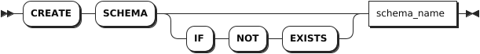
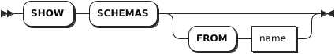
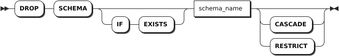

# 模式

## 创建模式

`CREATE SCHEMA` 语句用于创建模式。每条语句支持创建一个模式。

### 所需权限

用户拥有模式所属数据库的 CREATE 权限。

### 语法格式



### 参数说明

| 参数 | 说明 |
| --- | --- |
| `schema_name` | 模式名称，模式名称不能与当前数据库的现有模式名称重复。默认情况下，数据库包括 `information_schema`、`pg_catalog`、`public`、`kwdb_internal` 模式。|

### 语法示例

以下示例为 `db1` 数据库创建 `myschema1` 模式。

```sql
-- 1. 创建 db1 数据库。

CREATE DATABASE db1;
CREATE DATABASE

-- 2. 使用 db1 数据库。

USE db1;
SET

-- 3. 创建 myschema1 模式。

CREATE SCHEMA myschema1;
CREATE SCHEMA
```

## 查看模式

`SHOW SCHEMAS` 语句用于查看数据库已创建的模式。

### 所需权限

无

### 语法格式



### 参数说明

| 参数 | 说明 |
| --- | --- |
| `name` | 待查看模式所在的数据库的名称。如未指定，则默认使用当前数据库。|

### 语法示例

以下示例查看当前数据库中的模式。

```sql
SHOW SCHEMAS;
```

执行成功后，命令行输出以下信息：

```sql
     schema_name
----------------------
  information_schema
  kwdb_internal
  pg_catalog
  public
(4 rows)
```

## 删除模式

`DROP SCHEMA` 语句用于删除已有的模式。每个语句支持删除多个模式。用户需按顺序删除多个模式，如果删除某个模式时出现异常，系统会立即报错，并且回滚整个删除操作。KWDB 支持级联和非级联删除模式。当模式存在关联对象时，只有使用级联删除才能删除目标模式，否则系统报错。

### 所需权限

用户拥有 SCHEMA 的 DROP 权限。

### 语法格式



### 参数说明

| 参数 | 说明 |
| --- | --- |
| `IF EXISTS` | 可选关键字。当使用 `IF EXISTS` 关键字时，如果目标模式存在，系统删除目标模式。如果目标模式不存在，系统删除目标模式失败，但不会报错。当未使用 `IF EXISTS` 关键字时，如果目标模式存在，系统删除目标模式。如果目标模式不存在，系统报错，提示目标模式不存在。 |
| `schema_name` | 待删除模式的名称。|
| `CASCADE` | 可选关键字。删除目标模式及其关联对象。`CASCADE` 不会列出待删除的关联对象，应谨慎使用。 |
| `RESTRICT` | 默认设置，可选关键字。如果其他对象依赖目标模式，则无法删除该模式。 |

### 语法示例

以下示例以非级联方式删除 `myschema1`、`myschema2` 模式及其关联对象，系统报错。

```sql
DROP SCHEMA myschema1, myschema2;
ERROR: schema "myschema1" is not empty and CASCADE was not specified
SQLSTATE: 2BP01
```

以下示例级联删除 `myschema1` 和 `myschema2` 模式。

```sql
DROP SCHEMA myschema1, myschema2 CASCADE;
```
