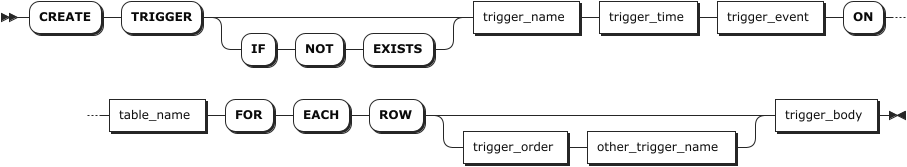
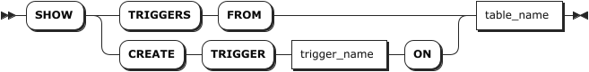
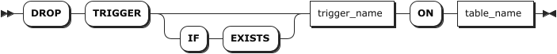

# 触发器

为了在数据层实现自动化、可靠且低耦合的业务逻辑处理，同时保障数据的完整性与一致性，KWDB 关系引擎支持触发器。

## 创建触发器

`CREATE TRIGGER` 语句用于为指定关系表创建触发器。

### 所需权限

用户是 `admin` 角色的成员或者拥有触发器关联表的 `CREATE` 权限和触发器主体中相关 SQL 操作的权限。默认情况下，`root` 用户属于 `admin` 角色。

### 语法格式



### 参数说明

| 参数 | 说明 |
| --- | --- |
| `IF NOT EXISTS` | 可选关键字。当使用 `IF NOT EXISTS` 关键字时，如果目标触发器不存在，系统创建触发器。如果目标触发器存在，系统创建触发器失败，但不会报错。当未使用 `IF NOT EXISTS` 关键字时，如果目标触发器不存在，系统创建触发器。如果目标触发器存在，系统报错，提示目标触发器已存在。 |
| `trigger_name` | 待创建的触发器的名称。 |
| `table_name` | 触发器关联的表的名称。<br > **说明** <br >- 触发器关联的对象必须是关系引擎的普通表。<br >- 不支持在触发器主体中对触发器关联的表进行操作。<br >- 当两张表中的触发器存在互相触发的关系时，会在触发任一触发器时报错。 |
| `trigger_time` | 用于指定触发器的触发时机，支持以下选项：<br >- `BEFORE`：在执行 SQL 操作之前激活触发器。<br >- `AFTER`：在执行 SQL 操作之后激活触发器。如果目标表上同时存在 `BEFORE` 和 `AFTER` 触发器，所有相关的 `BEFORE` 触发器和行操作（`INSERT`、`UPDATE`、`DELETE`）执行成功后，才会激活 `AFTER` 触发器。<br > **说明** <br >- 对于语句级触发器，`BEFORE` 或 `AFTER` 触发器失败，均会导致整个触发语句失败，从而回滚全部操作。<br >- 对于行级触发器，如果 `BEFORE` 触发器失败，则不会执行对应行的插入、更新操作。 |
| `trigger_event` | 用于指定触发器的触发事件，支持以下选项：<br >- `INSERT`：插入数据时激活触发器。<br >- `UPDATE`：更新数据时激活触发器。<br >- `DELETE`：删除数据时激活触发器。 |
| `FOR EACH ROW` | 用于指定行级触发器，该触发器会在触发事件影响的每行数据上各执行一次。 |
| `trigger_order` | 用于指定触发器的触发顺序。当目标表上存在多个具有相同触发时机和触发事件的触发器时，用户可以在创建触发器时指定触发顺序。支持以下选项： <br >- `FOLLOWS`：先激活已有的触发器再激活新创建的触发器。 <br >- `PRECEDES`：先激活新创建的触发器再激活已有的触发器。 <br >默认情况下，按照创建触发器的顺序激活触发器。 |
| `other_trigger_name` | 其他触发器的名称。当目标时序表上存在多个触发器时，可以在创建触发器时指定各个触发器的触发顺序。 |
| `trigger_body` | 用于指定触发器主体，包括激活触发器的 SQL 语句。触发器主体支持执行多条 SQL 语句，也支持跨表操作。当执行多条 SQL 语句时，需要使用 `BEGIN ... END` 复合语句封装 SQL 语句并需要使用 DELIMITER 语句修改 SQL 语句的终结符。支持在触发器主体中使用 `OLD` 和 `NEW` 别名引用触发器关联表中的列：<br >- `OLD.col_name`：引用更新前或删除前的现有行数据，适用于 `DELETE` 和 `UPDATE` 操作。`DELETE` 触发器只能使用 `OLD` 别名。<br >- `NEW.col_name`：引用待插入的新行数据或更新后的行数据，适用于 `INSERT` 和 `UPDATE` 操作。INSERT 触发器只能使用 `NEW` 别名。<br > **说明** <br >- 触发器主体不支持 DDL 语句、事务语句、`SELECT` 语句、存储过程语句、以及 `PREPARE`、`EXECUTE` 预处理语句。<br >- 修改或者删除触发器中 SQL 语句操作的表时，不会立即影响触发器。触发器会在下一次触发时报错。<br >- 如果使用 KaiwuDB JDBC 创建触发器，需要使用双美元符号（`$$`）将 `BEGIN ...END` 复合语句包裹起来。 |

### 语法示例

以下示例创建一个 `BEFORE` 触发器，当向 `orders` 表写入数据时，激活 `BEFORE` 触发器。然后触发器向 `audit_log` 表中写入数据。

```sql
-- 创建 orders 和 audit_log 表。
create table orders (id int, name string, price float, time timestamp);
create table audit_log(id int, name string, price float, time timestamp, currentuser string);

-- 创建触发器，绑定 orders 上的 insert 操作，时机为 BEFORE。
delimiter \\
create trigger my_trigger
before insert
on orders for each row
begin
    insert into audit_log values (NEW.id, NEW.name, NEW.price, NEW.time, current_user());
end \\
delimiter ;

-- 向 orders 表写入数据。
insert into orders values (1, 'kwdb', 99.99, now());

-- 查询 audit_log 表的内容。
select * from audit_log;
 id | name | price |               time                 |     current_user
-----+------+-------+-----------------------------------+-------------------
  1 | kwdb | 99.99 | 2025-04-28 09:26:45.028688+00:00.  |         kkk
```

## 查看触发器

`SHOW TRIGGERS` 或 `SHOW CREATE TRIGGER` 语句用于查看所有或指定触发器的信息。

### 所需权限

无

### 语法格式



### 参数说明

| 参数           | 说明                  |
|----------------|---------------------|
| `trigger_name` | 待查看触发器的名称。   |
| `table_name`   | 触发器关联的表的名称。 |

### 语法示例

以下示例查看 `orders` 表上的所有触发器。

```sql
SHOW TRIGGERS FROM orders;
```

执行成功后，控制台输出以下信息：

```sql
  trigger_name | trigger_action_time | trigger_event | trigger_order | on_table | enabled
---------------+---------------------+---------------+---------------+----------+----------
  my_trigger   | BEFORE              | INSERT        |             1 | orders   |  true
(1 row)
```

## 修改触发器

`ALTER TRIGGER...RENAME TO` 语句用于重命名触发器。

### 所需权限

用户是 `admin` 角色的成员或者拥有触发器关联表的 `DROP` 权限。默认情况下，`root` 用户属于 `admin` 角色。

### 语法格式


### 参数说明

| 参数               | 说明                  |
|--------------------|---------------------|
| `trigger_name`     | 待修改触发器的名称。   |
| `table_name`       | 触发器关联的表的名称。 |
| `new_trigger_name` | 触发器的新名称。       |

### 语法示例

以下示例将 `orders` 表关联的 `my_trigger` 触发器重命名为 `trigger_test`。

```sql
ALTER TRIGGER my_trigger ON orders RENAME TO trigger_test;
```

## 删除触发器

`DROP TRIGGER` 语句用于删除已创建的触发器。

### 所需权限

用户是 `admin` 角色的成员或者拥有触发器关联表的 `DROP` 权限。默认情况下，`root` 用户属于 `admin` 角色。

### 语法格式



### 参数说明

| 参数 | 说明 |
| --- | --- |
| `IF EXISTS` | 可选关键字。当使用 `IF EXISTS` 关键字时，如果目标触发器存在，系统删除触发器。如果目标触发器不存在，系统删除触发器失败，但不会报错。当未使用 `IF EXISTS` 关键字时，如果目标触发器存在，系统删除触发器。如果目标触发器不存在，系统报错，提示目标触发器不存在。|
| `trigger_name` | 待删除触发器的名称。 |
| `table_name` | 触发器关联的表的名称。 |

### 语法示例

以下示例删除 `orders` 表关联的 `trigger_test` 触发器。

```sql
DROP TRIGGER trigger_test ON orders;
```
