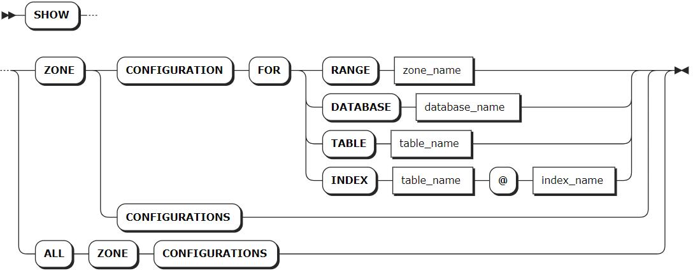
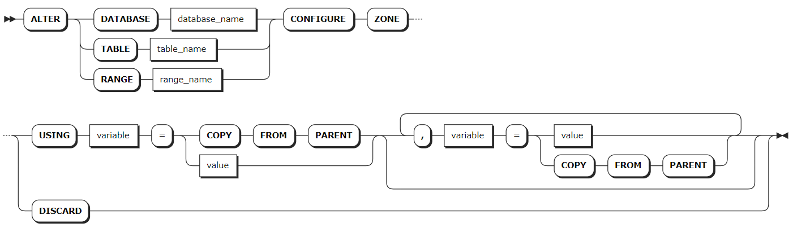

# 区域配置

## 查看区域配置

`SHOW ZONE CONFIGURATIONS` 语句用于查看当前副本区域的详细信息。

### 所需权限

无

### 语法格式



### 参数说明

| 参数 | 说明 |
| --- | --- |
| `zone_name` | 系统 Range 的名称。 |
| `database_name` | 数据库的名称。 |
| `table_name` | 表的名称。 |
| `index_name` | 索引的名称。 |

### 语法示例

以下示例查看 `db1` 数据库的区域配置。

```sql
SHOW ZONE CONFIGURATION FOR DATABASE db1;
```

执行成功后，控制台输出以下信息：

```sql
     target    |             raw_config_sql
---------------+------------------------------------------
  DATABASE db1 | ALTER DATABASE db1 CONFIGURE ZONE USING
               |     range_min_bytes = 1048576,
               |     range_max_bytes = 8388608,
               |     gc.ttlseconds = 100000,
               |     num_replicas = 5,
               |     constraints = '[]',
               |     lease_preferences = '[]'
(1 row)
```

## 修改区域配置

`ALTER CONFIGURE ZONE` 语句用于修改或移除数据库、表、Range 分区的区域配置。

### 所需权限

- 修改 `system` 数据库及其 Range 分区或表：用户为 Admin 用户或者 Admin 角色成员。
- 修改其他数据库及其 Range 分区或表时：用户拥有目标数据库或目标表的 CREATE 权限或 ZONECONFIG 权限。

### 语法格式



### 参数说明

| 参数 | 说明 |
| --- | --- |
| `database_name` | 待修改区域配置的数据库的名称。 |
| `table_name` | 待要修改区域配置的表的名称。 |
| `range_name` | 待修改区域配置的系统 Range 分区的名称。 |
| `variable` | 待修改的变量，KWDB 支持修改以下变量：<br > - `range_min_bytes`：区域的最小数据范围（单位：字节）。当数据范围小于该阈值时会与相邻范围合并。默认值为 `134217728`（128 MiB）。<br >- `range_max_bytes`：区域的最大数据范围（单位：字节）。数据范围达到该阈值时，KWDB 会将其切分到两个范围。默认值为`536870912` (512 MiB)。<br >- `gc.ttlseconds`：垃圾回收前，保留被覆盖的值的时间（单位：秒）。取值较小，有助于节省磁盘空间。取值较大，增加 `AS OF SYSTEM TIME` 查询允许的范围。不建议取值小于 `600` 秒（`10` 分钟），避免对长时间运行的查询产生影响。另外，由于一行的所有版本都存储在一个永不拆分的单个范围内，也不建议取值太高，避免对该行的所有更改加起来可能超过 `64` MiB，从而导致服务器内存不足或其他问题。默认值为 `90000`（`25` 小时）。<br > - `num_replicas`：区域的副本数，默认值为 `3`。对于 `system` 数据库以及 `.meta`、`.liveness` 和 `.system` 范围，默认值为 `5`。<br > - `constraints`：全能型副本位置的必需（`+`）和/或禁止（`-`）约束。<br >- `lease_preferences`：影响租约位置的必需（`+`）和/或禁止（`-`）约束的有序列表。如果不能满足第一个优先级，KWDB 将尝试满足第二个优先级，依此类推。如果不能满足所有首选项，KWDB 使用默认的租约放置算法，该算法基于每个节点已拥有的租约数量来决定租约放置。用户可以尽量让所有节点拥有大致相同数量的租约。列表中的每个值可以包含多个约束。<br > 例如，`[[+zone=zn-east-1b, +ssd], [+zone=zn-east-1a], [+zone=zn-east-1c, +ssd]]` 列表表示首选位于 `zn-east-1b` 区域具有 SSD 的节点，然后是位于 `zn-east-1a` 区域的节点，最后位于 `zn-east-1c` 区域具有 SSD 的节点。如未指定此字段，则不应用租约偏好首选项。注意，租约偏好约束无需与 `constraints` 字段共享，用户可以只定义 `lease_preferences` 而不引用 `constraints` 字段中的任何值。用户也可以不定义 `constraints` 字段而只定义 `lease_preferences`。|
| `COPY FROM PARENT` | 从父区域中复制取值。 |
| `value` | 拟修改的变量值。 |
| `DISCARD` | 移除 Range 分区配置。 |

### 语法示例

- 修改数据库的区域配置。

    以下示例修改 `db3` 数据库的 `num_replicas` 和 `gc.ttlseconds` 区域配置。

    ```sql
    -- 1. 修改 db3 数据库的 num_replicas 和 gc.ttlseconds 区域配置。

    ALTER DATABASE db3 CONFIGURE ZONE USING num_replicas = 5, gc.ttlseconds = 100000;
    CONFIGURE ZONE 1

    -- 2. 查看 db3 数据库的区域配置。

    SHOW ZONE CONFIGURATION FOR DATABASE db3;
      zone_name |               config_sql                 
    +-----------+-----------------------------------------+
      db3       | ALTER DATABASE db3 CONFIGURE ZONE USING  
                |     range_min_bytes = 16777216,          
                |     range_max_bytes = 67108864,          
                |     gc.ttlseconds = 100000,              
                |     num_replicas = 5,                    
                |     constraints = '[]',                  
                |     lease_preferences = '[]'             
    (6 rows)
    ```

- 修改表的区域配置。

    以下示例修改 `orders` 表的 `num_replicas` 和 `gc.ttlseconds` 区域配置。

    ```sql
    -- 1. 修改 orders 表的 num_replicas 和 gc.ttlseconds 区域配置。

    ALTER TABLE orders CONFIGURE ZONE USING num_replicas = 3, gc.ttlseconds = 100000;
    CONFIGURE ZONE 1

    -- 2. 查看 orders 表的区域配置。

    SHOW ZONE CONFIGURATION FOR TABLE orders;
        target    |             raw_config_sql
    ---------------+------------------------------------------
      TABLE orders | ALTER TABLE orders CONFIGURE ZONE USING
                  |     range_min_bytes = 134217728,
                  |     range_max_bytes = 536870912,
                  |     gc.ttlseconds = 100000,
                  |     num_replicas = 3,
                  |     constraints = '[]',
                  |     lease_preferences = '[]'
    (1 row)
    ```

- 移除表的区域配置。

    以下示例移除 `orders` 表的区域配置。

    ```sql
    -- 1. 移除 orders 表的区域配置。

    ALTER TABLE orders CONFIGURE ZONE DISCARD;
    CONFIGURE ZONE 1

    -- 2. 查看 orders 表的区域配置。

    SHOW ZONE CONFIGURATION FOR TABLE orders;
        target     |              raw_config_sql
    ----------------+-------------------------------------------
      RANGE default | ALTER RANGE default CONFIGURE ZONE USING
                    |     range_min_bytes = 134217728,
                    |     range_max_bytes = 536870912,
                    |     gc.ttlseconds = 90000,
                    |     num_replicas = 1,
                    |     constraints = '[]',
                    |     lease_preferences = '[]'
    (1 row)
    ```
