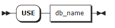
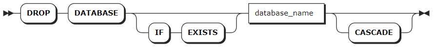

# 数据库

作为一款多模数据库系统，KWDB 支持用户在一个 KWDB 实例中创建一个或多个数据库对象（Database）用来管理时序和关系数据。其中专门用于存储和管理时间数据的数据库对象为时序数据库（Time Series Database）。时序数据库中包括 public 模式和用户自定义的时序表。


## 创建数据库

`CREATE TS DATABASE` 语句用于创建时序数据库，每条语句只支持创建一个时序数据库。

### 所需权限

用户具有 Admin 角色。默认情况下，root 用户具有 Admin 角色。创建成功后，用户拥有该数据库的全部权限。

### 语法格式


### 参数说明

| 参数 | 说明 |
| --- | --- |
| `database_name` | 待创建的数据库的名称。该名称必须唯一，且遵循[数据库标识符规则](../../sql-identifiers.md)。目前，数据库名称不支持中文字符，最大长度不能超过 63 个字节。|
| `keep_duration` | 可选参数。指定数据库的生命周期，默认值为 `0d`，即不会过期删除。支持配置的时间单位包括：秒（S 或 SECOND）、分钟（M 或 MINUTE）、小时（H 或 HOUR）、天（D 或 DAY）、周（W 或 WEEK）、月（MON 或 MONTH）、年（Y 或 YEAR），例如 `RETENTIONS 10 DAY`。取值必须是整数值，最大值不得超过 `1000` 年。|
| `interval` | 可选参数，指定数据库数据目录分区的时间范围。默认值为 `10d`，即每 10 天进行一次分区。支持配置的时间单位包括：天（D 或 DAY）、周（W 或 WEEK）、月（MON 或 MONTH）、年（Y 或 YEAR）。取值必须是整数值，最大值不得超过 `1000` 年。|

::: warning 说明

- 生命周期的配置不适用于当前分区。当生命周期的取值小于分区时间范围的取值时，即使数据库的生命周期已到期，由于数据存储在当前分区中，用户仍然可以查询数据。
- 当时间分区的所有数据超过生命周期时间点（`now() - retention time`）时，系统尝试删除该分区的数据。如果此时用户正在读写该分区的数据，或者系统正在对该分区进行压缩或统计信息处理等操作，系统无法立即删除该分区的数据。系统会在下一次生命周期调度时再次尝试删除数据（默认情况下，每小时调度一次）。
- 生命周期和分区时间范围设置与系统的存储空间密切相关。生命周期越长，分区时间范围越大，系统所需的存储空间也越大。有关存储空间的计算公式，参见[预估磁盘使用量](../../../db-operation/cluster-planning.md#预估磁盘使用量)。
- 当用户单独指定或者修改数据库内某一时序表的生命周期或分区时间范围时，该配置只适用于该时序表。

:::

### 语法示例

- 创建数据库。

    以下示例创建一个名为 `ts_db` 的数据库。

    ```sql
    CREATE TS DATABASE ts_db;
    ```

    执行成功后，控制台输出以下信息：

    ```sql
    CREATE TS DATABASE
    ```

- 创建数据库时，指定数据库的生命周期。

    以下示例创建一个名为 `ts_db_temp` 的数据库，并将数据库的生命周期设置为 `50d`。

    ```sql
    CREATE TS DATABASE ts_db_temp RETENTIONS 50d;
    ```

    执行成功后，控制台输出以下信息：

    ```sql
    CREATE TS DATABASE
    ```

- 创建数据库时，指定数据库的生命周期和分区时间范围。

    以下示例创建一个名为 `iot` 的数据库，并将数据库的生命周期和分区时间范围分别设置为 `50d` 和 `2d`。

    ```sql
    CREATE TS DATABASE iot RETENTIONS 50d PARTITION INTERVAL 2d;
    ```

    执行成功后，控制台输出以下信息：

    ```sql
    CREATE TS DATABASE
    ```

## 查看数据库

`SHOW DATABASES` 语句用于查看 KWDB 数据库系统中包含的所有数据库，包括关系数据库和时序数据库。

### 所需权限

无

### 语法格式


### 参数说明

| 参数 | 说明 |
| --- | --- |
| `WITH COMMENT` | 可选关键字，查看数据库的注释信息。默认情况下，数据库的注释信息为 `NULL`。|

### 语法示例

:::warning 说明
时序数据库和关系数据库的 `engine_type` 分别为 `TIME SERIES` 和 `RELATIONAL`。
:::

- 查看已创建的数据库。

    以下示例查看已创建的数据库。

    ```sql
    SHOW DATABASES;
    ```

    执行成功后，控制台输出以下信息：

    ```sql
      database_name  |   engine_type 
    -----------------+-------------------        
      defaultdb      | RELATIONAL
      postgres       | RELATIONAL
      system         | RELATIONAL
      ts_db          | TIME SERIES
    (4 rows)
    ```

- 查看已创建数据库的注释信息。

    以下示例查看数据库的注释信息。

    ```sql
    SHOW DATABASES WITH COMMENT;
    ```

    执行成功后，控制台输出以下信息：

    ```sql
      database_name       | engine_type |            comment
    ----------------------+-------------+--------------------------------
      defaultdb           | RELATIONAL  | NULL
      postgres            | RELATIONAL  | NULL
      ts_db               | TIME SERIES | database for power statistics
      system              | RELATIONAL  | NULL
    (4 rows)
    ```

## 切换数据库

`USE` 语句用于将指定数据库切换成当前使用的数据库。

### 所需权限

用户拥有数据库的 CREATE 或 ALL 权限。

### 语法格式



### 参数说明

| 参数 | 说明 |
| --- | --- |
| `db_name` | 待使用的数据库的名称。|

### 语法示例

以下示例将 `ts_db` 数据库设置为当前数据库。

```sql
USE ts_db;
```

## 修改数据库

`ALTER DATABASE` 语句用于修改数据库的名称、生命周期或分区时间范围。

### 所需权限

- 修改数据库名称：用户为 Admin 用户或者 Admin 角色成员。
- 修改数据库生命周期或分区时间范围：用户拥有数据库的 CREATE 或 ALL 权限。

### 语法格式

- 修改数据库名称

    

- 修改数据库的生命周期或分区时间范围

    

### 参数说明

| 参数 | 说明 |
| --- | --- |
| `old_name` | 当前数据库的名称。|
| `new_name` | 拟修改的数据库名称，新数据库名称必须唯一，并且遵循[数据库标识符规则](../../sql-identifiers.md)。目前，数据库名称不支持中文字符，最大长度不能超过 63 个字节。|
| `database_name` | 待修改的数据库名称。|
| `keep_duration` | 数据库的生命周期，默认值为 `0d`，即不会过期删除。支持配置的时间单位包括：秒（S 或 SECOND）、分钟（M 或 MINUTE）、小时（H 或 HOUR）、天（D 或 DAY）、周（W 或 WEEK）、月（MON 或 MONTH）、年（Y 或 YEAR），例如 `RETENTIONS 10 DAY`。取值必须是整数值，最大值不得超过 `1000` 年。|
| `interval` | 可选参数，指定数据库数据目录分区的时间范围。默认值为 `10d`，即每 10 天进行一次分区。支持配置的时间单位包括：天（D 或 DAY）、周（W 或 WEEK）、月（MON 或 MONTH）、年（Y 或 YEAR）。取值必须是整数值，最大值不得超过 `1000` 年。|

::: warning 说明

- 生命周期的配置不适用于当前分区。当生命周期的取值小于分区时间范围的取值时，即使数据库的生命周期已到期，由于数据存储在当前分区中，用户仍然可以查询数据。
- 当时间分区的所有数据超过生命周期时间点（`now() - retention time`）时，系统尝试删除该分区的数据。如果此时用户正在读写该分区的数据，或者系统正在对该分区进行压缩或统计信息处理等操作，系统无法立即删除该分区的数据。系统会在下一次生命周期调度时再次尝试删除数据（默认情况下，每小时调度一次）。
- 生命周期和分区时间范围设置与系统的存储空间密切相关。生命周期越长，分区时间范围越大，系统所需的存储空间也越大。有关存储空间的计算公式，参见[预估磁盘使用量](../../../db-operation/cluster-planning.md#预估磁盘使用量)。
- 当用户单独指定或者修改数据库内某一时序表的生命周期或分区时间范围时，该配置只适用于该时序表。

:::

### 语法示例

- 修改数据库的名称。

    以下示例将 `ts_db` 数据库重命名为 `tsdb`。

    ```sql
    ALTER DATABASE ts_db RENAME TO tsdb;
    ```

- 修改数据库的生命周期。

    以下示例将 `tsdb` 数据库的生命周期设置为 `10 day`。

    ```sql
    ALTER TS DATABASE tsdb SET RETENTIONS = 10 day;
    ```

- 修改数据库的分区时间范围。

    以下示例将 `tsdb` 数据库的分区时间范围设置为 `2 day`。

    ```sql
    ALTER TS DATABASE tsdb SET PARTITION INTERVAL = 2 day;
    ```

## 删除数据库

`DROP DATABASE` 语句用于删除数据库及其所有对象。目标数据库不能是当前数据库。如需删除当前数据库，使用 `USE <database_name>` 语句将当前数据库切换成其他数据库，再进行删除。

### 所需权限

用户拥有目标数据库及对象的 DROP 权限。删除成功后，所有用户针对目标数据库和其对象的所有权限均被删除。

### 语法格式



### 参数说明

| 参数 | 说明 |
| --- | --- |
| `IF EXISTS` | 可选关键字。当使用 `IF EXISTS` 关键字时，如果目标数据库存在，系统删除目标数据库。如果目标数据库不存在，系统删除数据库失败，但不会报错。当未使用 `IF EXISTS` 关键字时，如果目标数据库存在，系统删除目标数据库。如果目标数据库不存在，系统报错，提示目标数据库不存在。 |
| `database_name` | 待删除的数据库的名称。|
| `CASCADE` | 可选关键字，表示级联删除，即删除数据库中的所有表。`CASCADE` 关键字不会列出待删除的关联对象，应谨慎使用。|

### 语法示例

以下示例使用 `CASCADE` 关键字删除 `tsdb` 数据库及其级联对象。

```sql
-- 1. 查看 tsdb 数据库中的时序表。

SHOW TABLES FROM tsdb;
  table_name  |    table_type
--------------+--------------------
  sensor_data | TIME SERIES TABLE
  temp        | TIME SERIES TABLE
  water       | TIME SERIES TABLE
(3 rows)

-- 2. 删除 tsdb 数据库及其级联对象。

DROP DATABASE tsdb CASCADE;
DROP DATABASE

-- 3. 查看 tsdb 数据库中的时序表。

SHOW TABLES FROM tsdb;
ERROR: target database or schema does not exist
```
