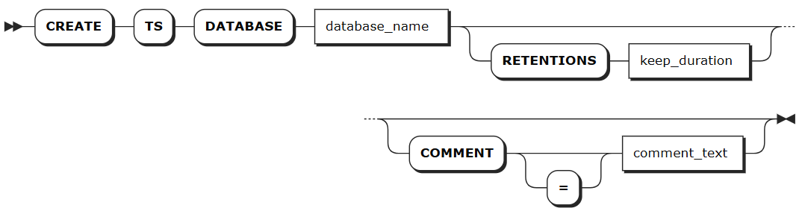
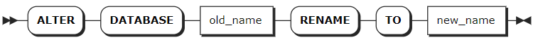
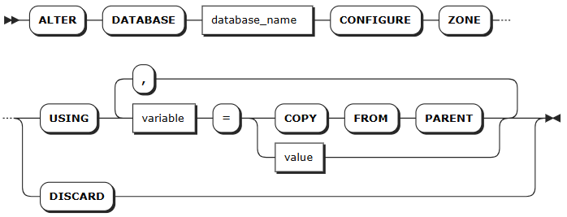

# 数据库

作为一款多模数据库系统，KWDB 支持用户在一个 KWDB 实例中创建一个或多个数据库对象（Database）用来管理时序和关系数据。其中专门用于存储和管理时间数据的数据库对象为时序数据库（Time Series Database）。时序数据库中包括 public 模式和用户自定义的时序表。

## 创建数据库

`CREATE TS DATABASE` 语句用于创建时序数据库，每条语句只支持创建一个时序数据库。

### 所需权限

用户具有 Admin 角色。默认情况下，root 用户具有 Admin 角色。创建成功后，用户拥有该数据库的全部权限。

### 语法格式



### 参数说明

:::warning 说明
配置可选参数时，必须严格按照 `[RETENTIONS <keep_duration>] [COMMENT [=] <'comment_text'>]` 的顺序，否则系统将会报错。
:::

| 参数 | 说明 |
| --- | --- |
| `database_name` | 待创建的数据库的名称。该名称必须唯一，且遵循[数据库标识符规则](../../sql-identifiers.md)。目前，数据库名称不支持中文字符，最大长度不能超过 63 个字节。|
| `keep_duration` | 可选参数，设置数据库的数据生命周期。数据超过此时长后将被系统自动清除。<br>默认值： `0s`（永久保留）<br>时间单位：<br>- 秒：`s` 或 `second`<br>- 分钟：`m` 或 `minute`<br>- 小时：`h` 或 `hour`<br>- 天：`d` 或 `day`<br>- 周：`w` 或 `week`<br>- 月：`mon` 或 `month`<br>- 年：`y` 或 `year`<br>取值范围:正整数，上限为 1000 年<br>**说明：**<br>- 表级设置优先于库级设置。<br>- 保留时长越长，存储空间占用越大，请根据业务需求合理配置。<br>- 如果待写入的数据已超过生命周期限制，系统会直接丢弃该数据，不予写入。|
| `comment_text` | 可选参数。指定数据库的注释信息。 |

### 语法示例

- 创建数据库。

    以下示例创建一个名为 `ts_db` 的数据库。

    ```sql
    CREATE TS DATABASE ts_db;
    ```

    执行成功后，控制台输出以下信息：

    ```sql
    CREATE TS DATABASE
    ```

- 创建数据库时，指定数据库的生命周期。

    以下示例创建一个名为 `ts_db_temp` 的数据库，并将数据库的生命周期设置为 `50d`。

    ```sql
    CREATE TS DATABASE ts_db_temp RETENTIONS 50d;
    ```

    执行成功后，控制台输出以下信息：

    ```sql
    CREATE TS DATABASE
    ```

- 创建数据库时，指定数据库的注释信息。

    以下示例创建一个名为 `ts_db_power` 的数据库，并将数据库的注释信息设置为 `database for power statistics`。

    ```sql
    CREATE TS DATABASE ts_db_power COMMENT = 'database for power statistics';
    ```

    执行成功后，控制台输出以下信息：

    ```sql
    CREATE TS DATABASE
    ```

## 查看数据库

`SHOW DATABASES` 语句用于查看 KWDB 数据库系统中包含的所有数据库，包括关系数据库和时序数据库。

### 所需权限

无

### 语法格式


### 参数说明

| 参数 | 说明 |
| --- | --- |
| `WITH COMMENT` | 可选关键字，查看数据库的注释信息。默认情况下，数据库的注释信息为 `NULL`。|

### 语法示例

:::warning 说明
时序数据库和关系数据库的 `engine_type` 分别为 `TIME SERIES` 和 `RELATIONAL`。
:::

- 查看已创建的数据库。

    以下示例查看已创建的数据库。

    ```sql
    SHOW DATABASES;
    ```

    执行成功后，控制台输出以下信息：

    ```sql
      database_name  |   engine_type 
    -----------------+-------------------        
      defaultdb      | RELATIONAL
      postgres       | RELATIONAL
      system         | RELATIONAL
      ts_db          | TIME SERIES
    (4 rows)
    ```

- 查看已创建数据库的注释信息。

    以下示例查看数据库的注释信息。

    ```sql
    SHOW DATABASES WITH COMMENT;
    ```

    执行成功后，控制台输出以下信息：

    ```sql
      database_name       | engine_type |            comment
    ----------------------+-------------+--------------------------------
      defaultdb           | RELATIONAL  | NULL
      postgres            | RELATIONAL  | NULL
      ts_db               | TIME SERIES | database for power statistics
      system              | RELATIONAL  | NULL
    (4 rows)
    ```

## 查看数据库的建库语句

`SHOW CREATE DATABASE` 语句用于查看创建数据库的 SQL 语句以及创建数据库时指定的相关参数。

时序数据库支持查看创建数据库时使用的数据库名称、以及生命周期 `retentions` 参数的取值。创建数据库时，如果指定 `retentions` 的取值，则显示指定的取值。如未指定，则显示该参数的默认值 `0s`。

### 所需权限

无

### 语法格式


### 参数说明

| 参数 | 说明 |
| --- | --- |
| `database_name` | 待查看数据库的名称。|

### 语法示例

以下示例查看 `tsdb1` 数据库的建库语句和相关参数取值。

```sql
-- 1. 创建数据库 tsdb1，并将 `retentions` 参数的取值设置为 `10d`。

CREATE TS DATABASE tsdb1 RETENTIONS 10d;

--2. 查看已创建的 tsdb1 数据库。

SHOW CREATE DATABASE tsdb1;
  database_name |          create_statement
----------------+-------------------------------------
  tsdb1         | CREATE TS DATABASE tsdb1
                |      retentions 864000s
(1 row)
```

## 切换数据库

`USE` 语句用于将指定数据库切换成当前使用的数据库。

### 所需权限

用户拥有数据库的 CREATE 或 ALL 权限。

### 语法格式


### 参数说明

| 参数 | 说明 |
| --- | --- |
| `db_name` | 待使用的数据库的名称。|

### 语法示例

以下示例将 `ts_db` 数据库设置为当前数据库。

```sql
USE ts_db;
```

## 修改数据库

`ALTER DATABASE` 语句用于修改数据库的名称、生命周期和区域配置。

### 所需权限

- 修改数据库的名称：用户为 Admin 用户或者 Admin 角色成员。
- 修改数据库生命周期：用户为 Admin 用户或者 Admin 角色成员。
- 修改数据库区域设置
  - 修改系统数据库区域配置：用户为 Admin 用户或 Admin 角色成员。
  - 修改其他数据库区域配置：用户拥有目标数据库的 CREATE 或 ZONECONFIG 权限。

### 语法格式

- 修改数据库名称

    

- 修改数据库的生命周期

    

- 修改数据库的区域配置

    

### 参数说明

| 参数 | 说明 |
| --- | --- |
| `old_name` | 当前数据库的名称。|
| `new_name` | 拟修改的数据库名称，新数据库名称必须唯一，并且遵循[数据库标识符规则](../../sql-identifiers.md)。目前，数据库名称不支持中文字符，最大长度不能超过 63 个字节。|
| `database_name` | 待修改的数据库名称。|
| `keep_duration` | 可选参数，设置数据库的数据生命周期。数据超过此时长后将被系统自动清除。<br>默认值： `0s`（永久保留）<br>时间单位：<br>- 秒：`s` 或 `second`<br>- 分钟：`m` 或 `minute`<br>- 小时：`h` 或 `hour`<br>- 天：`d` 或 `day`<br>- 周：`w` 或 `week`<br>- 月：`mon` 或 `month`<br>- 年：`y` 或 `year`<br>取值范围:正整数，上限为 1000 年<br>**说明：**<br>- 表级设置优先于库级设置。<br>- 保留时长越长，存储空间占用越大，请根据业务需求合理配置。<br>- 如果待写入的数据已超过生命周期限制，系统会直接丢弃该数据，不予写入。|
| `variable` | 要修改的变量名，时序库支持修改以下变量：<br>- `range_min_bytes`：分区的最小大小，单位为字节。分区小于该值时，KWDB 会将其与相邻分区合并。默认值：256 MiB，设置值应大于 1 MiB（1048576 字节），小于分区的最大大小。 <br>- `range_max_bytes`：分区的最大大小，单位为字节。分区大于该值时，KWDB 会将其切分到两个分区。默认值： 512 MiB。设置值不得小于 5 MiB（5242880 字节）。<br>- `gc.ttlseconds`：数据在垃圾回收前保留的时间，单位为秒。默认值为 `90000`（25 小时）。设置值建议不小于 600 秒（10 分钟），以免影响长时间运行的查询。设置值较小时可以节省磁盘空间，设置值较大时会增加 `AS OF SYSTEM TIME` 查询的时间范围。另外，由于每行的所有版本都存储在一个永不拆分的单一分区内，不建议将该值设置得太大，以免单行的所有更改累计超过 64 MiB，导致内存不足或其他问题。<br>- `num_replicas`：副本数量。默认值为 3。`system` 数据库、`meta`、`liveness` 和 `system` 分区的默认副本数为 5。 **注意**：集群中存在不可用节点时，副本数量不可缩减。<br>- `ts_merge.days`：时序分区合并时间。同一个时序表同哈希点按照时间戳分裂后，超过该时间的分区将自动合并，且合并后不会再自动拆分。默认值：10（10天）。设置值必须大于等于 0，设置值为 0 时表示时序分区按照时间戳分裂后便立刻自动合并。系统分区数量过多导致出现网络等故障时可以将该值适当调小，以缓解数据过大的问题。**提示：**  KWDB 默认只根据哈希点拆分分区，因此分区按时间合并功能默认关闭，如需支持按时间合并分区，需将 `kv.kvserver.ts_split_interval` 实时参数设置为 `1`, 将 `kv.kvserver.ts_split_by_timestamp.enabled` 实时参数设置为 `true` 以支持按照哈希点和时间戳拆分分区。 |
| `value` | 变量值。 |
|`COPY FROM PARENT`| 使用父区域的设置值。|
|`USING REBALANCE` | 手动触发数据分片的区域重新分配和负载均衡。<br><br>适用于以下场景：<br>- 关闭自动均衡后的主动调优<br>- 负载不均时的人工干预<br><br>KWDB 默认自动执行后台数据分片均衡，用户通过 `SET CLUSTER SETTING kv.allocator.ts_consider_rebalance.enabled = false;` 关闭自动均衡功能后，可在系统低负载时段进行手动均衡。<br><br>注意：<br>- 该功能仅适用于用户数据分片，不适用于系统数据分片<br>- 建议在业务低峰期执行，避免影响正常业务性能。 |
|`DISCARD` | 移除区域配置，采用默认值。|

### 语法示例

- 修改数据库的名称。

    以下示例将 `ts_db` 数据库重命名为 `tsdb`。

    ```sql
    ALTER DATABASE ts_db RENAME TO tsdb;
    ```

- 修改数据库的生命周期。

    以下示例将 `tsdb` 数据库的生命周期设置为 `10 day`。

    ```sql
    ALTER TS DATABASE tsdb SET RETENTIONS = 10 day;
    ```

- 修改数据库的区域配置。
  
    以下示例将 `tsdb` 数据库的副本数改为5个，将数据在垃圾回收前保留的时间改为100000秒。

    ```SQL
    -- 1. 修改区域配置
    > ALTER DATABASE tsdb CONFIGURE ZONE USING num_replicas = 5, gc.ttlseconds = 100000;
    CONFIGURE ZONE 1

    -- 2. 查看修改是否成功
    > SHOW ZONE CONFIGURATION FOR DATABASE tsdb;
    zone_name |               config_sql                 
    +-----------+-----------------------------------------+
    tsdb       | ALTER DATABASE tsdb CONFIGURE ZONE USING  
              |     range_min_bytes = 268435456,          
              |     range_max_bytes = 536870912,          
              |     gc.ttlseconds = 100000,              
              |     num_replicas = 5,                    
              |     constraints = '[]',                  
              |     lease_preferences = '[]'             
    (6 rows)
    ```

## 删除数据库

`DROP DATABASE` 语句用于删除数据库及其所有对象。目标数据库不能是当前数据库。如需删除当前数据库，使用 `USE <database_name>` 语句将当前数据库切换成其他数据库，再进行删除。

::: warning 说明
删除时序库时，系统检查当前时序库是否被流计算引用。如果是，则输出错误消息并列出所有引用此时序库的流计算名称。用户可以使用 `CASCADE` 关键字级联删除时序库及相关的流计算。
:::

### 所需权限

用户拥有目标数据库及对象的 DROP 权限。删除成功后，所有用户针对目标数据库和其对象的所有权限均被删除。

### 语法格式


### 参数说明

| 参数 | 说明 |
| --- | --- |
| `IF EXISTS` | 可选关键字。当使用 `IF EXISTS` 关键字时，如果目标数据库存在，系统删除目标数据库。如果目标数据库不存在，系统删除数据库失败，但不会报错。当未使用 `IF EXISTS` 关键字时，如果目标数据库存在，系统删除目标数据库。如果目标数据库不存在，系统报错，提示目标数据库不存在。 |
| `database_name` | 待删除的数据库的名称。|
| `CASCADE` | 可选关键字，表示级联删除，即删除数据库中的所有表。`CASCADE` 关键字不会列出待删除的关联对象，应谨慎使用。|

### 语法示例

以下示例使用 `CASCADE` 关键字删除 `tsdb` 数据库及其级联对象。

```sql
-- 1. 查看 tsdb 数据库中的时序表。

SHOW TABLES FROM tsdb;
  table_name  |    table_type
--------------+--------------------
  sensor_data | TIME SERIES TABLE
  temp        | TIME SERIES TABLE
  water       | TIME SERIES TABLE
(3 rows)

-- 2. 删除 tsdb 数据库及其级联对象。

DROP DATABASE tsdb CASCADE;
DROP DATABASE

-- 3. 查看 tsdb 数据库中的时序表。

SHOW TABLES FROM tsdb;
ERROR: target database or schema does not exist
```
