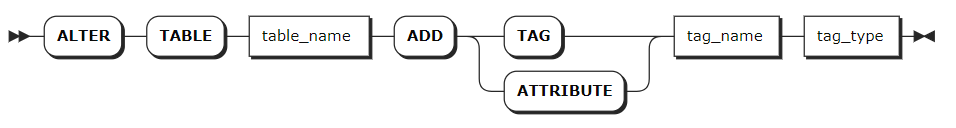
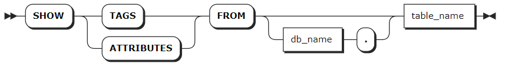
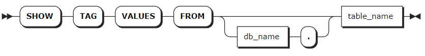
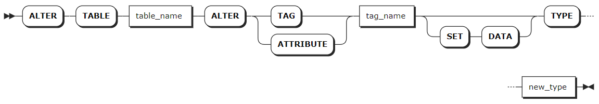
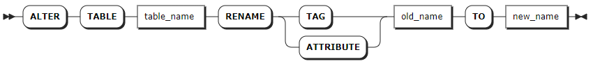
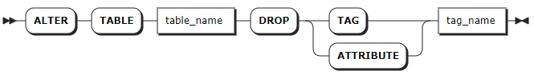

# 标签

数据库标签（TAG）描述数据对象特征和行为，例如数据类型、长度、默认值等。标签定义了数据对象的结构和规则，确保数据的完整性和有效性。

KWDB 支持使用 ATTRIBUTE 和 ATTRIBUTES 作为 TAG 和 TAGS 的别名。

## 添加标签

KWDB 支持在创建表时创建表的标签，也支持使用 `ALTER TABLE ... ADD TAG` 语句为表添加标签。`ADD TAG` 为在线操作，不会阻塞表中的数据读写。

::: warning 说明
目前，KWDB 不支持一次添加多个标签或者为已有时序表添加主标签和非空标签。
:::

### 所需权限

用户拥有目标表的 CREATE 权限。

### 语法格式



### 参数说明

| 参数 | 说明 |
| --- | --- |
| `table_name` | 表名，支持通过 `<database_name>.<table_name>` 指定其他数据库中的表。 |
| `tag_name` | 标签名，不支持数据库级别的自定义标签。标签名的最大长度为 128 字节。 |
| `tag_type` | 标签类型，不支持 TIMESTAMP、TIMESTAMPTZ、NVARCHAR、GEOMETRY 数据类型。 |

### 语法示例

以下示例为 `ts_table` 表添加名为 `color` 的标签。

```sql
ALTER TABLE ts_table ADD TAG color VARCHAR(30);
```

## 查看标签

`SHOW TAGS` 语句用于查看目标表的全部标签信息。

### 所需权限

用户拥有目标表的任何权限。

### 语法格式



### 参数说明

| 参数 | 说明 |
| --- | --- |
| `db_name` | 待查看表所在的数据库的名称。如未指定，则默认使用当前数据库。|
| `table_name` | 待查看表的名称，支持通过 `<database_name>.<table_name>` 指定其他数据库中的表。 |

### 语法示例

以下示例查看当前数据库中 `sensor_data` 表的标签。

```sql
SHOW TAGS FROM sensor_data;
```

执行成功后，控制台输出以下信息：

```sql
      tag     |    type     | is_primary | nullable
--------------+-------------+------------+-----------
  sensor_id   | INT4        |    true    |  false
  sensor_type | VARCHAR(30) |   false    |  false
(2 rows)
```

## 查看标签值

`SHOW TAG VALUES` 语句用于查看目标表的全部标签值信息。

### 所需权限

用户拥有目标表的 SELECT 权限。

### 语法格式



### 参数说明

| 参数 | 说明 |
| --- | --- |
| `db_name` | 待查看表所在的数据库的名称。如未指定，则默认使用当前数据库。|
| `table_name` | 待查看表的名称，支持通过 `<database_name>.<table_name>` 指定其他数据库中的表。 |

### 语法示例

以下示例查看当前数据库中 `sensor_data` 表的标签值。

```sql
SHOW TAG VALUES FROM sensor_data;
```

执行成功后，控制台输出以下信息：

```sql
  sensor_id 
------------
          1
(1 row)
```

## 修改标签

KWDB 支持使用 `ALTER TABLE ... ALTER TAG` 语句修改标签的数据类型和宽度。`ALTER TAG` 为在线操作，不会阻塞表中的数据读写。修改数据类型时，如果已有标签的值与新数据类型不匹配，修改操作仍然可以执行成功，不符合新数据类型的标签值在查询时将显示为 `NULL`。

### 所需权限

用户拥有目标表的 CREATE 权限。

### 语法格式



### 参数说明

| 参数 | 说明 |
| --- | --- |
| `table_name` | 表名，支持通过 `<database_name>.<table_name>` 指定其他数据库中的表。如未指定，则默认使用当前数据库。|
| `tag_name` | 待修改标签的名称。 |
| `new_type` |  拟修改的数据类型和宽度。<br > **说明** <br >- 转换后的数据类型宽度必须大于原数据类型的宽度。例如，INT4 可以转成 INT8，但不能转成 INT2，CHAR(200) 可以转为 VARCHAR (254), 但不能转为 VARCHAR (100)。<br >- CHAR、VARCHAR、NCHAR、NVARCHAR 字符类型支持同数据类型的宽度转换，但只能增加宽度不能降低宽度。例如，CHAR(100) 可以转转为 CHAR(200)，不能转为 CHAR(50)。有关 KWDB 支持修改的数据类型、默认宽度、最大宽度、可转换的数据类型等详细信息，参见[时序数据类型](../../../sql-reference/data-type/data-type-ts-db.md)。 |

### 语法示例

以下示例将 `ts_table` 表的 `color` 标签的数据类型和宽度修改为 `VARCHAR(50)`。

```sql
ALTER TABLE ts_table ALTER TAG color TYPE VARCHAR(50);
```

## 重命名标签

KWDB 支持使用 `ALTER TABLE ... RENAME TAG` 语句修改标签名称。

### 所需权限

用户拥有目标表的 CREATE 权限。

### 语法格式



### 参数说明

| 参数 | 说明 |
| --- | --- |
| `table_name` | 表名，支持通过 `<database_name>.<table_name>` 指定其他数据库中的表。如未指定，则默认使用当前数据库。|
| `old_name` | 当前标签名，不支持修改主标签名称。 |
| `new_name` | 拟修改的标签名。标签名的最大长度为 128 字节。 |

### 语法示例

以下示例将 `ts_table` 表的 `site` 标签重命名为 `location`。

```sql
ALTER TABLE ts_table RENAME TAG site TO location;
```

## 删除标签

KWDB 支持使用 `ALTER TABLE ... DROP TAG` 语句删除标签。`DROP TAG` 为在线操作，不会阻塞表中的数据读写。

::: warning 说明

- KWDB 不支持删除主标签。
- 目前，KWDB 不支持一次删除多个标签。
- 如果待删除的标签列已创建索引，删除该标签时，标签列关联的索引将一并删除。

:::

### 所需权限

用户拥有目标表的 CREATE 权限。

### 语法格式



### 参数说明

| 参数 | 说明 |
| --- | --- |
| `table_name` | 表名，支持通过 `<database_name>.<table_name>` 指定其他数据库中的表。如未指定，则默认使用当前数据库。 |
| `tag_name` | 待删除标签的名称，不支持删除主标签。|

### 语法示例

以下示例删除 `ts_table` 表的 `color` 标签。

```sql
ALTER TABLE ts_table DROP TAG color;
```
