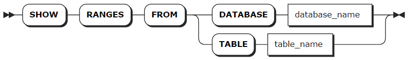

# Range

KWDB 将所有用户数据和几乎所有系统数据存储在排序的键值对映射中。这个键空间被划分为多个键空间中的连续块，即分区（range）。每个键始终可以在单个分区内找到。 从 SQL 的角度来看，时序表最初会映射到单个分区，分区中的每个键值对对应表中的一行。分区的大小达到 512 MiB后，系统会自动将其拆分为两个分区。随着表的增长，新生成的分区也会继续进行类似的拆分操作。当用户数据减少时，分区会自动合并。注意：由于 KWDB 采用标记删除的方式处理数据删除，分区不会立即合并，只有在垃圾回收过程中实际删除数据后，分区才会合并。

每个分区都隶属于一个特定的副本区域（zone）。集群在重新平衡分区时，会考虑副本区域的配置，以确保遵守所有约束条件。副本区域更多信息见[副本区域](./ts-zone.md)。

KWDB 支持用户使用 `SHOW RANGES` 语句查看时序库、表的分区信息。

## 查看分区

`SHOW RANGES` 语句用于查看数据库、表的分区信息，验证 SQL 数据如何映射到基础分区以及分区副本的位置。

### 所需权限

用户为 Admin 用户或者 Admin 角色成员。默认情况下，root 用户具有 Admin 角色。

### 语法格式



### 参数说明

| 参数 | 说明 |
| --- | --- |
| `database_name` | 待查看的数据库名。 |
| `table_name` | 待查看的表名。 |

### 语法示例

- 查看表的分区。

    以下示例查看 `vehicles` 表的 Range 分区。

    ```sql
    SHOW RANGES FROM TABLE vehicles;
    ```

    执行成功后，控制台输出以下信息：

    ```sql
      start_key | end_key | range_id | range_size_mb | lease_holder | lease_holder_locality | replicas | replica_localities
    ------------+---------+----------+---------------+--------------+-----------------------+----------+---------------------
      NULL      | NULL    |      180 |      0.000077 |            1 |                       | {3}      | {""}
    (1 row)
    ```
- 查看数据库的分区。

    以下示例查看 `vtx` 数据库的 Range 分区。

    ```sql
    SHOW RANGES FROM DATABASE vtx;
    ```

    执行成功后，控制台输出以下信息：

    ```sql
      table_name | start_key | end_key | range_id | range_size_mb | lease_holder | lease_holder_locality | replicas | replica_localities
    -------------+-----------+---------+----------+---------------+--------------+-----------------------+----------+---------------------  
      vehicles   | NULL      | NULL    |      180 |      0.000077 |            1 |                       | {3}      | {""}
    (1 row)
    ```
