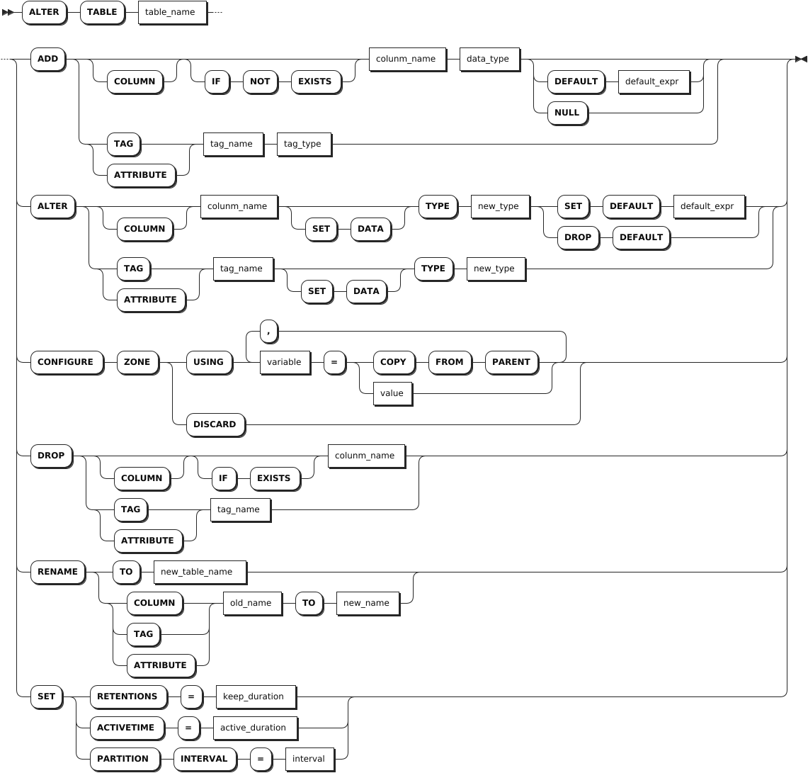

# 时序表

时序表（TIME SERIES TABLE）是用于存储时间序列数据的数据表。

## 创建表

### 所需权限

用户拥有 DATABASE CREATE 权限。

### 语法格式


### 参数说明

:::warning 说明
目前，时序表名、列名和标签名称不支持中文字符。
:::

| 参数 | 说明 |
| --- | --- |
| `table_name`| 待创建的时序表的名称，表名的最大长度为 128 字节。在指定数据库中，时序表名称必须唯一，并且遵循[数据库标识符规则](../../sql-identifiers.md)。 |
| `column_list`| 待创建的数据列列表。支持添加两个以上的列定义，最多可指定 4096 列。列定义包括列名、数据类型和默认值。<br> 列名的最大长度为 128 字节，支持指定 NOT NULL，默认为空值。支持自定义第一列的列名，但数据类型必须是 TIMESTAMPTZ 或 TIMESTAMP 且非空。默认时区为 UTC。<br > 对于非时间类型的数据列，默认值只能是常量。对于时间类型的列（TIMESTAMPTZ 或 TIMESTAMP），默认值可以是常量，也可以是 `now()` 函数。如果默认值类型与列类型不匹配，设置默认值时，系统报错。支持默认值设置为 NULL。 |
| `tag_list`| 标签列表，支持添加一个或多个标签定义，最多可指定 `128` 个标签。标签定义包含标签名和数据类型，标签名的最大长度为 128 字节，支持指定 NOT NULL，默认为空值。不支持 TIMESTAMP、TIMESTAMPTZ、NVARCHAR 和 GEOMETRY 数据类型。 |
| `primary_tag_list`| 主标签列表，支持添加一个或多个主标签名称，最多可指定 `4` 个。主标签必须包含在标签列表内且指定为 NOT NULL，不支持浮点类型和除 VARCHAR 之外的变长数据类型。VARCHAR 类型长度默认 `64` 字节，最大长度为 `128` 字节。|
| `keep_duration`| 可选参数，指定表的生命周期。超过设置的生命周期后，系统自动从数据库中清除目标表中数据。默认值为 `0d`，即不会过期删除。支持配置的时间单位包括：秒（S 或 SECOND）、分钟（M 或 MINUTE）、小时（H 或 HOUR）、天（D 或 DAY）、周（W 或 WEEK）、月（MON 或 MONTH）、年（Y 或 YEAR）。取值必须是整数值，最大值不得超过 `1000` 年。<br > **说明** <br > - 生命周期的配置不适用于当前分区。当生命周期的取值小于分区时间范围的取值时，即使表的生命周期已到期，由于数据存储在当前分区中，用户仍然可以查询数据。 <br > - 当时间分区的所有数据超过生命周期时间点（`now() - retention time`）时，系统尝试删除该分区的数据。如果此时用户正在读写该分区的数据，或者系统正在对该分区进行压缩或统计信息处理等操作，系统无法立即删除该分区的数据。系统会在下一次生命周期调度时再次尝试删除数据（默认情况下，每小时调度一次）。 <br > - 生命周期和分区时间范围设置与系统的存储空间密切相关。生命周期越长，分区时间范围越大，系统所需的存储空间也越大。有关存储空间的计算公式，参见[预估磁盘使用量](../../../db-operation/cluster-planning.md#预估磁盘使用量)。<br > - 当用户单独指定或者修改数据库内某一时序表的生命周期或分区时间范围时，该配置只适用于该时序表。|
| `active_duration`| 可选参数，指定数据的活跃时间。超过设置的时间后，系统自动压缩表数据。默认值为 `1d`，表示系统对表数据中 1 天前的分区进行压缩。支持配置的时间单位包括：秒（S 或 SECOND）、分钟（M 或 MINUTE）、小时（H 或 HOUR）、天（D 或 DAY）、周（W 或 WEEK）、月（MON 或 MONTH）、年（Y 或 YEAR）。默认时间单位为天（D 或 DAY）。取值必须是整数值，最大值不得超过 `1000` 年。如果设置为 `0`，表示不压缩表数据。 |
| `interval`| 可选参数，指定表数据目录分区的时间范围。默认值为 `10d`，即每 10 天进行一次分区。支持配置的时间单位包括：天（D 或 DAY）、周（W 或 WEEK）、月（MON 或 MONTH）、年（Y 或 YEAR）。取值必须是整数值，最大值不得超过 `1000` 年。|
| `DICT ENCODING`| 可选参数，启用字符串的字典编码功能，提升字符串数据的压缩能力。表中存储的字符串数据重复率越高，压缩优化效果越明显。该功能只适用于 CHAR 和 VARCHAR 长度小于等于 `1023` 的字符串，且只能在建表时开启。开启后不支持禁用。 |

### 语法示例

- 创建时序表。

    以下示例创建一个名为 `sensor_data` 的时序表。

    ```sql
    -- 1. 创建 sensor_data 时序表。

    CREATE TABLE sensor_data (
      k_timestamp TIMESTAMP NOT NULL,
      temperature FLOAT NOT NULL,
      humidity FLOAT,
      pressure FLOAT
    ) TAGS (
          sensor_id INT NOT NULL,
          sensor_type VARCHAR(30) NOT NULL
    ) PRIMARY TAGS (sensor_id);
    
    -- 2. 查看创建的表。
    
    SHOW CREATE sensor_data;
      table_name  |                        create_statement
    --------------+-----------------------------------------------------------------
      sensor_data | CREATE TABLE sensor_data (
                  |     k_timestamp TIMESTAMPTZ NOT NULL,
                  |     temperature FLOAT8 NOT NULL,
                  |     humidity FLOAT8 NULL,
                  |     pressure FLOAT8 NULL
                  | ) TAGS (
                  |     sensor_id INT4 NOT NULL,
                  |     sensor_type VARCHAR(30) NOT NULL ) PRIMARY TAGS(sensor_id)
    (1 row)
    ```

- 创建时序表并设置数据的活跃时间。

    以下示例创建一个名为 `power` 的时序表并将数据的活跃时间设置为 `20D`。

    ```sql
    CREATE TABLE power (ts TIMESTAMP NOT NULL, value FLOAT) TAGS (sensor_id INT NOT NULL) PRIMARY TAGS (sensor_id) ACTIVETIME 20D;
    ```

- 创建时序表并设置表的生命周期和分区时间范围。

    以下示例创建一个名为 `temp` 的时序表并将表的生命周期和分区时间范围分别设置为 `20D` 和 `5D`。

    ```sql
    -- 1. 创建 temp 时序表并设置表的生命周期和分区时间范围。

    CREATE TABLE temp (ts TIMESTAMP NOT NULL, value FLOAT) TAGS (sensor_id INT NOT NULL) PRIMARY TAGS (sensor_id) RETENTIONS 20D PARTITION INTERVAL 5D;
    CREATE TABLE

    -- 2. 查看表的生命周期。

    SHOW RETENTIONS ON TABLE temp;
      name | retentions | sample
    -------+------------+---------
      temp | 20d        | NULL
    (1 row)
    ```

- 创建时序表并开启字符串字典编码。

    以下示例创建一个名为 `water` 的时序表并开启字符串字典编码。

    ```sql
    CREATE TABLE water (ts TIMESTAMP NOT NULL, value FLOAT) TAGS (sensor_id INT NOT NULL) PRIMARY TAGS (sensor_id) DICT ENCODING;
    ```

## 查看表

`SHOW TABLES` 语句用于查看当前或指定数据库下的所有表，如未指定数据库则默认为当前数据库。

### 所需权限

用户拥有指定表的任何权限。

### 语法格式

查看当前或指定数据库下的所有表。如未指定，则默认使用当前数据库。


### 参数说明

| 参数 | 说明 |
| --- | --- |
| `db_name` | 待查看表所在的数据库的名称。如未指定，则默认使用当前数据库。|
| `schema_name` | 可选参数，待查看表所使用的模式名称。时序表只支持使用目标数据库的 public 模式。 |
| `table_name` | 待查看表的名称。|
| `WITH COMMENT` | 可选关键字，查看表的注释信息。默认情况下，时序表的注释信息为空。|

### 语法示例

- 查看当前数据库的所有表。

    ```sql
    SHOW TABLES;
    ```

    执行成功后，控制台输出以下信息：

    ```sql
    table_name    | table_type
    --------------+-------------------------------       
    sensor_data   | TIME SERIES TABLE
    ```

- 查看其它数据库中的表。

    以下示例查看 `tsdb` 数据库中的表。

    ```sql
    SHOW TABLES FROM tsdb;
    ```

    执行成功后，控制台输出以下信息：

    ```sql
      table_name  |    table_type
    --------------+--------------------
      t1          | TIME SERIES TABLE
      t2          | TIME SERIES TABLE
      t3          | TIME SERIES TABLE
      t4          | TIME SERIES TABLE
      t5          | TIME SERIES TABLE
    (5 rows)
    ```

- 查看带有注释信息的表。

    以下示例查看带有注释信息的表。

    ```sql
    -- 1. 为 power 表添加注释。

    COMMENT ON TABLE power IS 'power for all devices';
    COMMENT ON TABLE

    -- 2. 查看带有注释信息的表。

    SHOW TABLES WITH COMMENT;
      table_name  |    table_type     |      comment
    --------------+-------------------+--------------------
      power       | TIME SERIES TABLE | power for all devices
    (1 row)
    ```

## 查看表的建表语句

`SHOW CREATE [TABLE] <table_name>` 语句用于查看当前或指定数据库下指定表的建表语句。如未指定数据库，则默认为当前数据库。创建时序表时，如果指定 `activetime`、`retentions` 和 `partition interval` 参数的取值，则显示指定的取值。如未指定，`activetime` 参数显示默认值，而 `retentions` 和 `partition interval` 参数继承库级别的参数取值。如果库级别也未指定参数取值，则显示该参数的默认值。

默认情况下，`activetime`、`retentions` 和 `partition interval` 参数的取值分别为 `1d`、`0s`、`10d`。

### 所需权限

用户拥有指定表的任何权限。

### 语法格式


### 参数说明

| 参数            | 说明                                                      |
|-----------------|---------------------------------------------------------|
| `database_name` | 待查看表所在的数据库的名称。如未指定，则默认使用当前数据库。 |
| `table_name`    | 待查看表的名称。                                           |

### 语法示例

- 查看当前数据库中指定表的建表语句。

    以下示例查看当前数据库中 `t3` 表的建表语句。

    ```sql
    -- 1. 创建 t3 时序表，指定 activetime 参数的取值。

    CREATE TABLE t3(ts timestamp NOT NULL, a int) TAGS(ptag int NOT NULL) PRIMARY TAGS(ptag) ACTIVETIME 10s;

    -- 2. 查看已创建的 t1 时序表。

    SHOW CREATE TABLE t3;
      table_name |              create_statement
    -------------+----------------------------------------------
      t3         | CREATE TABLE t3 (
                |     ts TIMESTAMPTZ NOT NULL,
                |     a INT4 NULL
                | ) TAGS (
                |     ptag INT4 NOT NULL ) PRIMARY TAGS(ptag)
                |     retentions 0s
                |     activetime 10s
                |     partition interval 10d
    (1 row)
    ```

- 查看其它数据库中指定表的建表语句。

    以下示例查看 `tsdb` 数据库中 `t1` 表的建表语句。

    ```sql
    SHOW CREATE tsdb.t1;
    ```

    执行成功后，控制台输出以下信息：

    ```sql
        table_name   |              create_statement
    -----------------+----------------------------------------------
      tsdb.public.t1 | CREATE TABLE t1 (
                    |     ts TIMESTAMPTZ NOT NULL,
                    |     c1 INT4 NULL
                    | ) TAGS (
                    |     site INT4 NOT NULL ) PRIMARY TAGS(site)
                    |     retentions 0s
                    |     activetime 0s
                    |     partition interval 10d
    (1 row)
    ```

## 修改表

`ALTER TABLE` 语句用于修改以下表信息：

- 修改表名、设置表的数据生命周期、活跃时间和数据目录分区的时间范围
- 添加列、修改列名、列的数据类型或宽度、设置列的默认值、删除列的默认值
- 添加标签、修改标签名、标签的数据类型或宽度、删除标签

::: warning 说明

- 删除列时，原表至少保留两列数据列，且不支持删除第一列（时间戳列）。
- 不支持添加、删除、重命名主标签。
- 目前，不支持一次添加、删除多个列或标签。

:::

### 所需权限

- 重命名表：用户拥有目标表的 DROP 权限及所在数据库的 CREATE 权限。
- 其它修改表操作：用户拥有目标表的 CREATE 权限。

### 语法格式



### 支持的操作

- ADD
  - `ADD COLUMN`: 添加列，需指定列名和数据类型，也支持指定列的默认值。每张表最多支持 4096 列。
    - `COLUMN`：可选关键字，如未使用，默认添加列。
    - `IF NOT EXISTS`：可选关键字。当使用 `IF NOT EXISTS` 关键字时，如果列名不存在，系统创建列。如果列名存在，系统创建列失败，但不会报错。当未使用 `IF NOT EXISTS` 关键字时，如果列名不存在，系统创建列。如果列名存在，系统报错，提示列名已存在。
    - `DEFAULT <default_expr>`：可选关键字。系统写入表数据时写入指定的默认值，从而不需要显式定义该列的值。对于非时间类型的数据列，默认值只能是常量。对于时间类型的列（TIMESTAMPTZ 或 TIMESTAMP），默认值可以是常量，也可以是 `now()` 函数。如果默认值类型与列类型不匹配，设置默认值时，系统报错。支持默认值设置为 NULL。
    - `NULL`：可选关键字，默认为 `NULL`，且只支持 `NULL`。
  - `ADD TAG/ATTRITBUTE`：添加标签，需指定标签的名称和数据类型，不支持添加主标签。
- ALTER
  - `ALTER COLUMN`: 修改列的数据类型或宽度，设置或删除列的默认值。
    - `SET DATA`：可选关键字，是否使用不影响修改列的数据类型和宽度。
    - `SET DEFAULT <default_expr>`：必选关键字。系统写入表数据时写入指定的默认值，从而不需要显式定义该列的值。对于非时间类型的数据列，默认值只能是常量。对于时间类型的列（TIMESTAMPTZ 或 TIMESTAMP），默认值可以是常量，也可以是 `now()` 函数。如果默认值类型与列类型不匹配，设置默认值时，系统报错。支持默认值设置为 NULL。
    - `DROP DEFAULT`：必选关键字。删除已定义的列的默认值，删除后将不再写入默认值。
  - `ALTER TAG/ATTRITBUTE`：修改标签的数据类型或宽度，其中 `SET DATA` 为可选关键字，是否使用不影响修改标签的数据类型和宽度，不支持修改主标签的数据类型和宽度。**注意**：如果待修改的标签列已创建索引，必须先删除该索引，再进行修改。
- DROP
  - `DROP COLUMN`: 删除列，需指定列名。
    - `COLUMN`：可选关键字，如未使用，默认添加列。
    - `IF EXISTS`：可选关键字。当使用 `IF EXISTS` 关键字时，如果列名存在，系统删除列。如果列名不存在，系统删除列失败，但不会报错。当未使用 `IF EXISTS` 关键字时，如果列名存在，系统删除列。如果列名不存在，系统报错，提示列名不存在。
  - `DROP TAG/ATTRITBUTE`：删除标签，需指定标签名称。不支持删除主标签。如果待删除的标签列已创建索引，删除该标签时，需要先删除标签列关联的索引。
- RENAME
  - `RENAME TO`: 修改表的名称。
  - `RENAME COLUMN`：修改列的名称。
  - `RENAME TAG/ATTRIBUTE`：修改标签的名称。
- SET
  - `SET RETENTIONS`：设置表的生命周期。
  - `SET ACTIVETIME`：设置表数据的活跃时间。
  - `SET PARTITION INTERVAL`：设置表数据目录分区的时间范围。

### 参数说明

| 参数 | 说明 |
| --- | --- |
| `table_name` | 表名，支持通过 `<database_name>.<table_name>` 指定其他数据库中的表。如未指定，则默认使用当前数据库。 |
| `column_name` | 列名，新增列名不得与待修改表的当前列名和标签名重复。列名的最大长度为 128 字节。 |
| `data_type` | 数据类型。有关时序表支持的数据类型，参见[时序数据类型](../../../sql-reference/data-type/data-type-ts-db.md)。|
| `tag_name` | 标签名，不支持数据库级别的自定义标签。标签名的最大长度为 128 字节。 |
| `tag_type` | 标签类型，支持所有数值类型、布尔类型以及除 NVARCHAR 之外的字符类型。 |
| `new_type` | 拟修改的数据类型和宽度。<br > **说明** <br >- 转换后的数据类型宽度必须大于原数据类型的宽度。例如，INT4 可以转成 INT8，但不能转成 INT2，CHAR(200) 可以转为 VARCHAR (254), 但不能转为 VARCHAR (100)。<br >- CHAR、VARCHAR、NCHAR、NVARCHAR 字符类型支持同数据类型的宽度转换，但只能增加宽度不能降低宽度。例如，CHAR(100) 可以转转为 CHAR(200)，不能转为 CHAR(50)。有关 KWDB 支持修改的数据类型、默认宽度、最大宽度、可转换的数据类型等详细信息，参见[时序数据类型](../../../sql-reference/data-type/data-type-ts-db.md)。 |
| `new_table_name` | 拟修改的表名。表名最大长度为 128 字节。 |
| `old_name` | 当前列名或标签名，不支持修改主标签名称。|
| `new_name` | 拟修改的列名或标签名。列名或标签名的最大长度为 128 字节。 |
| `keep_duration`| 可选参数，指定表的生命周期。超过设置的生命周期后，系统自动从数据库中清除目标表中数据。默认值为 `0d`，即不会过期删除。支持配置的时间单位包括：秒（S 或 SECOND）、分钟（M 或 MINUTE）、小时（H 或 HOUR）、天（D 或 DAY）、周（W 或 WEEK）、月（MON 或 MONTH）、年（Y 或 YEAR）。取值必须是整数值，最大值不得超过 `1000` 年。<br > **说明** <br > - 生命周期的配置不适用于当前分区。当生命周期的取值小于分区时间范围的取值时，即使表的生命周期已到期，由于数据存储在当前分区中，用户仍然可以查询数据。 <br > - 当时间分区的所有数据超过生命周期时间点（`now() - retention time`）时，系统尝试删除该分区的数据。如果此时用户正在读写该分区的数据，或者系统正在对该分区进行压缩或统计信息处理等操作，系统无法立即删除该分区的数据。系统会在下一次生命周期调度时再次尝试删除数据（默认情况下，每小时调度一次）。 <br > - 生命周期和分区时间范围设置与系统的存储空间密切相关。生命周期越长，分区时间范围越大，系统所需的存储空间也越大。有关存储空间的计算公式，参见[预估磁盘使用量](../../../db-operation/cluster-planning.md#预估磁盘使用量)。<br > - 当用户单独指定或者修改数据库内某一时序表的生命周期或分区时间范围时，该配置只适用于该时序表。|
| `active_duration`| 可选参数，指定数据的活跃时间。超过设置的时间后，系统自动压缩表数据。默认值为 `1d`，表示系统对表数据中 1 天前的分区进行压缩。支持配置的时间单位包括：秒（S 或 SECOND）、分钟（M 或 MINUTE）、小时（H 或 HOUR）、天（D 或 DAY）、周（W 或 WEEK）、月（MON 或 MONTH）、年（Y 或 YEAR）。默认时间单位为天（D 或 DAY）。取值必须是整数值，最大值不得超过 `1000` 年。如果设置为 `0`，表示不压缩表数据。 |
| `interval`| 可选参数，指定表数据目录分区的时间范围。默认值为 `10d`，即每 10 天进行一次分区。支持配置的时间单位包括：天（D 或 DAY）、周（W 或 WEEK）、月（MON 或 MONTH）、年（Y 或 YEAR）。取值必须是整数值，最大值不得超过 `1000` 年。|

### 语法示例

以下示例对 `ts_table` 表进行以下操作：

- 修改表的名称、生命周期、表数据的活跃时间、表数据目录分区的时间范围
- 增加、删除列、修改列的名称、数据类型
- 增加、删除标签、修改标签的名称、宽度

```sql
-- 修改表的名称。

ALTER TABLE ts_table RENAME TO tstable;

-- 修改表的生命周期。

ALTER TABLE ts_table SET RETENTIONS = 20d;

-- 修改表数据的活跃时间。

ALTER TABLE ts_table SET ACTIVETIME = 20d;

-- 修改表数据目录分区的时间范围。

ALTER TABLE ts_table SET PARTITION INTERVAL = 2d;

-- 新增列。

ALTER TABLE ts_table ADD COLUMN c3 INT NULL;

-- 新增列并设置列的默认值。

ALTER TABLE ts_table ADD COLUMN c4 VARCHAR(50) DEFAULT 'aaa';

-- 删除列。

ALTER TABLE ts_table DROP c3;

-- 修改列的名称。

ALTER TABLE ts_table RENAME COLUMN c2 TO c4;

-- 修改列的数据类型。

ALTER TABLE ts_table ALTER COLUMN c3 TYPE INT8;

-- 修改列的默认值。

ALTER TABLE ts_table ALTER COLUMN c4 SET DEFAULT '789';

-- 删除列的默认值。

ALTER TABLE ts_table ALTER COLUMN c4 DROP DEFAULT;

-- 新增标签。

ALTER TABLE ts_table ADD TAG color VARCHAR(30);

-- 删除标签。

ALTER TABLE ts_table DROP TAG color;

-- 修改标签名。

ALTER TABLE ts_table RENAME TAG site TO location;

-- 修改标签的宽度。

ALTER TABLE ts_table ALTER color TYPE VARCHAR(50);
```

## 删除表

`DROP TABLE` 语句用于删除当前或指定数据库的所有表。

### 所需权限

用户拥有目标表的 DROP 权限。删除成功后，所有用户针对目标表的所有权限均被删除。

### 语法格式


### 参数说明

| 参数 | 说明 |
| --- | --- |
| `table_name` | 待删除表的名称。支持通过 `<database_name>.<table_name>` 指定其他数据库中的表。如未指定，则默认使用当前数据库。|

### 语法示例

以下示例删除 `ts_table` 表。

```sql
DROP TABLE ts_table;
```
