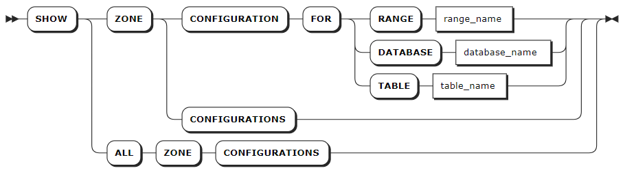

# 区域配置

 KWDB 集群中，每个分区都隶属于一个特定的副本区域（zone）。集群在重新平衡分区时，会考虑副本区域的配置，以确保遵守所有约束条件。

集群启动时，会自动生成预配置的副本区域和 `default` 副本区域。其中预配置的副本区域适用于内部系统数据，`default` 副本区域适用于集群中的其他数据。用户可以直接使用或调整上述副本区域，也可以为指定时序库或时序表单独设置副本区域。

表数据适用的副本区域分为以下级别：

- **集群**：预配置的`default`副本区域，适用于未受指定数据库、表或行约束的数据。此区域可以调整但不能删除。
- **数据库**：为指定时序库单独设置副本区域。
- **表**：为指定时序表单独设置副本区域。

数据复制过程中，副本区域的优先级排序为 表 > 数据库 > 集群。

内部系统数据存储在系统分区内，适用于以下级别的副本区域：

- **集群级**：预配置的`default`副本区域，适用于未受具体副本区域约束的系统数据。
- **系统分区**：KWDB 为`meta` 和 `liveness`等关键系统分区预先设置了副本区域。用户也可以根据需要为系统分区配置新的副本区域。系统分区的副本区域修改后可能会覆盖默认设置。KWDB 还为内部系统数据库和 `system.jobs` 表配置了预设的副本区域。

用户可以使用`SHOW ZONE CONFIGURATION`语句查看指定对象及集群内的所有副本区域设置。

## 查看区域配置

- `SHOW ZONE CONFIGURATION` 语句用于查看指定对象的副本区域信息。

- `SHOW ZONE CONFIGURATIONS`和`SHOW ALL ZONE CONFIGURATIONS`用于查看集群所有系统分区、`system`数据库和系统表的副本信息。

### 所需权限

无

### 语法格式



### 参数说明

| 参数 | 说明 |
| --- | --- |
| `range_name` | 分区名称，包括：<br>-  `default`：默认副本设置<br>- `meta`：所有数据的位置信息<br>- `liveness`：给定时间活动节点的信息 <br>- `system`：分配新表ID所需的信息以及追踪集群节点状态<br>- `timeseries`：集群监控数据 |
| `database_name` | 数据库的名称。 |
| `table_name` | 表的名称。 |

### 语法示例

- 查看指定系统分区的副本信息
  
     以下示例查看 `default` 默认系统分区的副本区域信息。
     
     ```sql
     SHOW ZONE CONFIGURATION FOR RANGE default;
     ```
     
     执行成功后，控制台输出以下信息：
     
     ```sql
          target     |              raw_config_sql
     ----------------+-------------------------------------------
     RANGE default | ALTER RANGE default CONFIGURE ZONE USING
                    |     range_min_bytes = 268435456,
                    |     range_max_bytes = 536870912,
                    |     gc.ttlseconds = 90000,
                    |     num_replicas = 3,
                    |     constraints = '[]',
                    |     lease_preferences = '[]'
     (1 row)
     ```
     
- 查看指定数据库的副本信息
  
     以下示例查看 `db1` 数据库的副本区域信息。
     
     ```sql
     SHOW ZONE CONFIGURATION FOR DATABASE db1;
     ```
     
     执行成功后，控制台输出以下信息：
     
     ```sql
          target    |             raw_config_sql
     ---------------+------------------------------------------
     DATABASE db1 | ALTER DATABASE db1 CONFIGURE ZONE USING
                    |     range_min_bytes = 1048576,
                    |     range_max_bytes = 8388608,
                    |     gc.ttlseconds = 100000,
                    |     num_replicas = 5,
                    |     constraints = '[]',
                    |     lease_preferences = '[]'
     (1 row)
     ```
     
- 查看指定表的副本区域信息
  
     以下示例查看 `t1` 表的副本区域信息。
     
     ```sql
     SHOW ZONE CONFIGURATION FOR TABLE t1;
     ```
     
     执行成功后，控制台输出以下信息：
     
     ```sql
          target     |              raw_config_sql
     ----------------+-------------------------------------------
     RANGE default | ALTER RANGE default CONFIGURE ZONE USING
                    |     range_min_bytes = 268435456,
                    |     range_max_bytes = 536870912,
                    |     gc.ttlseconds = 90000,
                    |     num_replicas = 3,
                    |     constraints = '[]',
                    |     lease_preferences = '[]'
     (1 row)
     ```