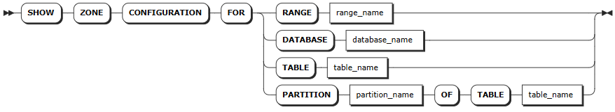
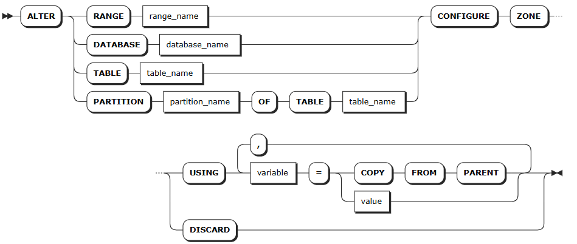

# 区域配置

 KWDB 集群中，每个数据分片都隶属于一个特定的副本区域（zone）。集群在重新平衡数据分片时，会考虑副本区域的配置，以确保遵守所有约束条件。

集群启动时，会自动生成预配置的副本区域和 `default` 副本区域。其中预配置的副本区域适用于内部系统数据，`default` 副本区域适用于集群中的其他数据。用户可以直接使用或调整上述副本区域，也可以为指定时序库或时序表单独设置副本区域。

表数据适用的副本区域分为以下级别：

- **集群**：预配置的 `default` 副本区域，适用于未受指定数据库、表或行约束的数据。此区域可以调整但不能删除。
- **数据库**：为指定时序库单独设置副本区域。
- **表**：为指定时序表单独设置副本区域。

数据复制过程中，副本区域的优先级排序为 表 > 数据库 > 集群。

内部系统数据存储在系统数据分片内，适用于以下级别的副本区域：

- **集群级**：预配置的 `default` 副本区域，适用于未受具体副本区域约束的系统数据。
- **系统数据分片**：KWDB 为 `meta` 和 `liveness` 等关键系统数据分片预先设置了副本区域。用户也可以根据需要为系统数据分片配置新的副本区域。系统数据分片的副本区域修改后可能会覆盖默认设置。KWDB 还为内部系统数据库和 `system.jobs` 表配置了预设的副本区域。

用户可以使用 `SHOW ZONE CONFIGURATION` 语句查看指定对象及集群内的所有副本区域配置，使用 `ALTER ... CONFIGURE ZONE` 语句来添加、修改、重置和删除副本区域配置。

## 查看区域配置

- `SHOW ZONE CONFIGURATION` 语句用于查看指定对象的副本区域信息。

- `SHOW ZONE CONFIGURATIONS` 和 `SHOW ALL ZONE CONFIGURATIONS` 用于查看集群所有系统数据分片、`system` 数据库和系统表的副本信息。

### 所需权限

无

### 语法格式



### 参数说明

| 参数 | 说明 |
| --- | --- |
| `range_name` | 数据分片名称，包括：<br>-  `default`：默认副本设置<br>- `meta`：所有数据的位置信息<br>- `liveness`：给定时间活动节点的信息 <br>- `system`：分配新表ID所需的信息以及追踪集群节点状态<br>- `timeseries`：集群监控数据 |
| `database_name` | 数据库的名称。 |
| `table_name` | 表的名称。 |

### 语法示例

- 查看指定系统数据分片的副本信息
  
     以下示例查看 `default` 默认系统数据分片的副本区域信息。

     ```sql
     SHOW ZONE CONFIGURATION FOR RANGE default;
     ```

     执行成功后，控制台输出以下信息：

     ```sql
          target     |              raw_config_sql
     ----------------+-------------------------------------------
     RANGE default | ALTER RANGE default CONFIGURE ZONE USING
                    |     range_min_bytes = 268435456,
                    |     range_max_bytes = 536870912,
                    |     gc.ttlseconds = 90000,
                    |     num_replicas = 3,
                    |     constraints = '[]',
                    |     lease_preferences = '[]'
     (1 row)
     ```

- 查看指定数据库的副本信息
  
     以下示例查看 `db1` 数据库的副本区域信息。

     ```sql
     SHOW ZONE CONFIGURATION FOR DATABASE db1;
     ```

     执行成功后，控制台输出以下信息：

     ```sql
          target    |             raw_config_sql
     ---------------+------------------------------------------
     DATABASE db1 | ALTER DATABASE db1 CONFIGURE ZONE USING
                    |     range_min_bytes = 1048576,
                    |     range_max_bytes = 8388608,
                    |     gc.ttlseconds = 100000,
                    |     num_replicas = 5,
                    |     constraints = '[]',
                    |     lease_preferences = '[]'
     (1 row)
     ```

- 查看指定表的副本区域信息
  
     以下示例查看 `t1` 表的副本区域信息。

     ```sql
     SHOW ZONE CONFIGURATION FOR TABLE t1;
     ```

     执行成功后，控制台输出以下信息：

     ```sql
          target     |              raw_config_sql
     ----------------+-------------------------------------------
     RANGE default | ALTER RANGE default CONFIGURE ZONE USING
                    |     range_min_bytes = 268435456,
                    |     range_max_bytes = 536870912,
                    |     gc.ttlseconds = 90000,
                    |     num_replicas = 3,
                    |     constraints = '[]',
                    |     lease_preferences = '[]'
     (1 row)
     ```

## 修改区域配置

`ALTER ... CONFIGURE ZONE` 语句用于以下操作：

- 修改数据库、表、数据分片的区域配置
- 移除数据库、表、数据分片的区域配置
- 对指定数据库、表或数据分片进行手动均衡

### 所需权限

- 修改系统数据库或系统数据数据分片：用户为 Admin 用户或者 Admin 角色成员。默认情况下，root 用户具有 Admin 角色。
- 修改其他库或其他库下的数据分片或表：用户拥有目标对象的 CREATE 权限或 ZONECONFIG 权限。

### 语法格式



### 参数说明

| 参数 | 说明 |
| --- | --- |
| `range_name` | 待修改的数据分片名称，包括：<br>-  `default`：默认副本设置<br>- `meta`：所有数据的位置信息<br>- `liveness`：给定时间活动节点的信息 <br>- `system`：分配新表ID所需的信息以及追踪集群节点状态<br>- `timeseries`：集群监控数据|
| `database_name` | 待修改的数据库名称。|
| `table_name` | 待修改的表名称。|
| `partition_name` | 待修改的表分区名。|
| `variable` | 要修改的变量名，时序库支持修改以下变量：<br>- `range_min_bytes`：数据分片的最小大小，单位为字节。数据分片小于该值时，KWDB 会将其与相邻数据分片合并。默认值：256 MiB，设置值应大于 1 MiB（1048576 字节），小于数据分片的最大大小。 <br>- `range_max_bytes`：数据分片的最大大小，单位为字节。数据分片大于该值时，KWDB 会将其切分到两个数据分片。默认值： 512 MiB。设置值不得小于 5 MiB（5242880 字节）。<br>- `gc.ttlseconds`：数据在垃圾回收前保留的时间，单位为秒。默认值为 `90000`（25 小时）。设置值建议不小于 600 秒（10 分钟），以免影响长时间运行的查询。设置值较小时可以节省磁盘空间，设置值较大时会增加 `AS OF SYSTEM TIME` 查询的时间范围。另外，由于每行的所有版本都存储在一个永不拆分的单一数据分片内，不建议将该值设置得太大，以免单行的所有更改累计超过 64 MiB，导致内存不足或其他问题。<br>- `num_replicas`：副本数量。默认值为 3。`system` 数据库、`meta`、`liveness` 和 `system` 数据分片的默认副本数为 5。 **注意**：集群中存在不可用节点时，副本数量不可缩减。<br>- `constraints`：副本位置的必需（+）和/或禁止（-）约束。例如 `constraints = '{+region=node1: 1, +region=node2: 1, +region=node3: 1}'` 表示在 `node1`、`node2`、`node3` 上必须各放置 1 个副本。目前只支持 `region=nodex` 格式。 <br> - `lease_preferences`：主副本位置的必需（+）和/或禁止（-）约束的有序列表。例如 `lease_preferences = '[[+region=node1]]'` 表示倾向将主副本放置在 `node1`。如果不能满足首选项，KWDB 将尝试下一个优先级。如果所有首选项都无法满足，KWDB 将使用默认的租约分布算法，基于每个节点已持有的租约数量来决定租约位置，尝试平衡租约分布。列表中的每个值可以包含多个约束。<br>- `ts_merge.days`：时序数据分片合并时间。同一个时序表同哈希点按照时间戳分裂后，超过该时间的数据分片将自动合并，且合并后不会再自动拆分。默认值：10（10天）。设置值必须大于等于 0，设置值为 0 时表示时序数据分片按照时间戳分裂后便立刻自动合并。系统数据分片数量过多导致出现网络等故障时可以将该值适当调小，以缓解数据过大的问题。<br><br>**提示**：<br>- 租约偏好不必与 `constraints` 字段共享，用户可以单独定义 `lease_preferences`。<br>- 设置 `constraints` 时需要同步设置 `num_replicas`，且 `constraints` 数量需要小于等于 `num_replicas` 数量。`constraints` 中的顺序无影响。<br>- KWDB 默认只根据哈希点拆分数据分片，因此数据分片按时间合并功能默认关闭，如需支持按时间合并数据分片，需将 `kv.kvserver.ts_split_interval` 实时参数设置为 `1`, 将 `kv.kvserver.ts_split_by_timestamp.enabled` 实时参数设置为 `true` 以支持按照哈希点和时间戳拆分数据分片。 |
| `value` | 变量值。 |
|`COPY FROM PARENT`| 使用父区域的设置值。|
|`REBALANCE` | 手动触发数据分片的区域重新分配和负载均衡。<br><br>适用于以下场景：<br>- 关闭自动均衡后的主动调优<br>- 负载不均时的人工干预<br><br>KWDB 默认自动执行后台数据分片均衡，用户通过 `SET CLUSTER SETTING kv.allocator.ts_consider_rebalance.enabled = false;` 关闭自动均衡功能后，可在系统低负载时段进行手动均衡。<br><br>注意：<br>- 该功能仅适用于用户数据分片，不适用于系统数据分片<br>- 建议在业务低峰期执行，避免影响正常业务性能。 |
|`DISCARD` | 移除区域配置，采用默认值。|

### 语法示例

- 修改数据库的区域配置
  
     以下示例将 `vtx` 数据库的副本数改为5个，将数据在垃圾回收前保留的时间改为100000秒。

     ```SQL
     > ALTER DATABASE vtx CONFIGURE ZONE USING num_replicas = 5, gc.ttlseconds = 100000;
     CONFIGURE ZONE 1

     > SHOW ZONE CONFIGURATION FOR DATABASE vtx;
     zone_name |               config_sql                 
     +-----------+-----------------------------------------+
     vtx       | ALTER DATABASE vtx CONFIGURE ZONE USING  
               |     range_min_bytes = 268435456,          
               |     range_max_bytes = 536870912,          
               |     gc.ttlseconds = 100000,              
               |     num_replicas = 5,                    
               |     constraints = '[]',                  
               |     lease_preferences = '[]'             
     (6 rows)
     ```

- 修改表的区域配置
  
     以下示例将 `vehicles` 表的副本数改为3个，将数据在垃圾回收前保留的时间改为100000秒。

     ```SQL
     > ALTER TABLE vehicles CONFIGURE ZONE USING num_replicas = 3, gc.ttlseconds = 100000;
     CONFIGURE ZONE 1

     > SHOW ZONE CONFIGURATION FOR TABLE vehicles;
          target    |             raw_config_sql
     ---------------+------------------------------------------
     TABLE vehicles | ALTER TABLE vehicles CONFIGURE ZONE USING
                    |     range_min_bytes = 268435456,
                    |     range_max_bytes = 536870912,
                    |     gc.ttlseconds = 100000,
                    |     num_replicas = 3,
                    |     constraints = '[]',
                    |     lease_preferences = '[]'
     (1 row)
     ```

- 移除表的区域配置
  
  以下示例恢复了 `vehicles` 表的默认区域配置。

     ```SQL
     > ALTER TABLE vehicles CONFIGURE ZONE DISCARD;
     CONFIGURE ZONE 1

     > SHOW ZONE CONFIGURATION FOR TABLE vehicles;
          target     |              raw_config_sql
     ----------------+-------------------------------------------
     RANGE default | ALTER RANGE default CONFIGURE ZONE USING
                    |     range_min_bytes = 268435456,
                    |     range_max_bytes = 536870912,
                    |     gc.ttlseconds = 90000,
                    |     num_replicas = 3,
                    |     constraints = '[]',
                    |     lease_preferences = '[]'
     (1 row)
     ```

- 手动均衡指定时序表的数据分片

  以下示例将时序表 `sensor` 的数据分片进行了手动均衡。

  ```SQL
  > ALTER TABLE sensor CONFIGURE ZONE USING REBALANCE;
  ALTER TABLE 
  ```