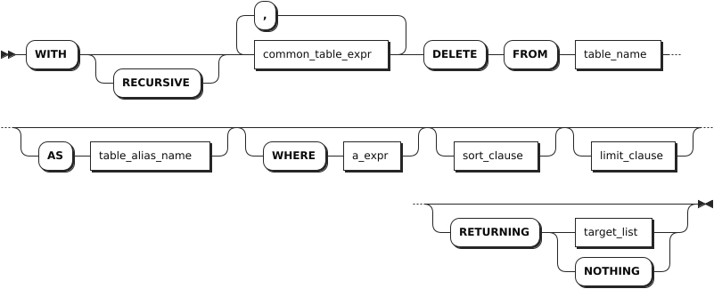
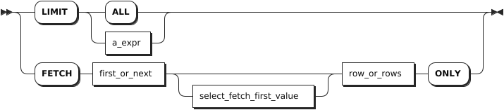
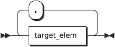

# DELETE

`DELETE` 语句用于删除目标表中的行数据。

::: warning 说明
默认情况下，当 `sql_safe_updates` 会话变量设置为 `true` 时，无法删除所有数据列数据。如需删除所有数据，应先将 `sql_safe_updates` 会话变量设置为 `false`。
:::

## 所需权限

用户拥有目标表的 SELECT 和 DELETE 权限。

## 语法格式



- `common_table_expr`

    

- `sort_clause`

    

- `limit_clause`

    

- `target_list`

    

## 参数说明

| 参数 | 说明 |
| --- | --- |
| `common_table_expr` |可与 `WITH` 关键字结合，组成 `WITH AS` 短语。通过将需要频繁执行的 SQL 片段用别名添加到全局范围，可以在需要时直接调用该别名的 SQL 片段，从而减少重复执行，优化执行效率。 |
| `table_name` |待删除的行的表名。 |
| `AS table_alias_name` |目标表的别名。使用别名时，可以完全隐藏实际的表名。 |
| `WHERE a_expr` | `DELETE` 操作的筛选语句，只删除 `a_expr` 返回 `TRUE` 的记录。`a_expr` 必须是使用列返回布尔值的标量表达式（例如 `<column> = <value>`）。如未使用 `WHERE` 子句，则删除表中所有行中的数据。如需删除所有数据，建议使用 `TRUNCATE` 语句。|
| `RETURNING target_list` |返回指定类型的值。`target_list` 可以是表中特定列的名称。支持使用星号（`*`）表示返回所有列，也可以使用标量表达式指定列。如果不希望在响应中返回任何内容，甚至不返回更新的行数，使用 `RETURNING NOTHING`。 |

## 语法示例

以下示例假设已经创建 `account_details` 表并向表中写入数据。

```sql
-- 1. 创建 account_details 表。

CREATE TABLE account_details(account_id INT8 DEFAULT unique_rowid() PRIMARY KEY, balance DECIMAL, account_type STRING);
CREATE TABLE

-- 2. 向表中写入数据。

INSERT INTO account_details VALUES(1, 20000, 'save'), (2, 30000, 'save'), (3, 40000, 'del'), (4, 50000, 'insert');
INSERT 4

-- 3. 查看表数据。

SELECT * FROM account_details;
  account_id | balance | account_type
-------------+---------+---------------
           1 |   20000 | save
           2 |   30000 | save
           3 |   40000 | del
           4 |   50000 | insert
(4 rows)
```

- 使用主键或唯一键删除指定行。

    ```sql
    DELETE FROM account_details WHERE account_id = 1;
    DELETE 1

    SELECT * FROM account_details;
      account_id | balance | account_type
    -------------+---------+---------------
              2 |   30000 | save
              3 |   40000 | del
              4 |   50000 | insert
    (3 rows)
    ```

- 使用非唯一键删除数据。

    ```sql
    DELETE FROM account_details WHERE account_type='save';
    DELETE 1

    SELECT * FROM account_details;
      account_id | balance | account_type
    -------------+---------+---------------
              3 |   40000 | del
              4 |   50000 | insert
    (2 rows)
    ```

- 返回已删除的行。

    ```sql
    DELETE FROM account_details WHERE account_id = 3 RETURNING *;
    DELETE 1;
      account_id | balance | account_type
    -------------+---------+---------------
              3 |   40000 | del
    (1 row)


    SELECT * FROM account_details;
      account_id | balance | account_type
    -------------+---------+---------------
              4 |   50000 | insert
    (1 row)
    ```

- 删除所有行。

    ```sql
    SET sql_safe_updates = false;
    SET

    DELETE FROM account_details;
    DELETE 1


    SELECT * FROM account_details;
    account_id|balance|account_type
    ----------+-------+------------
    (0 rows)
    ```
