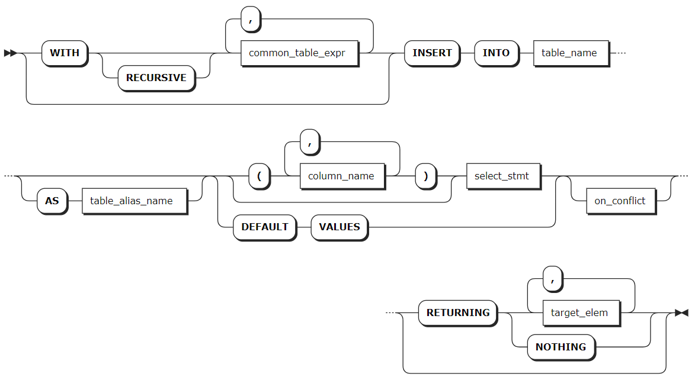
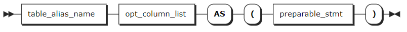
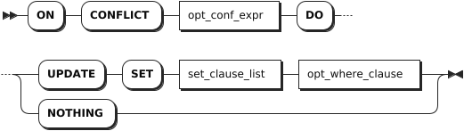

# INSERT

`INSERT` 语句用于向表中写入一行或多行数据。如果写入的数据与唯一性约束冲突，可以使用 `INSERT ON CONFLICT` 子句更新数据。

## 所需权限

用户拥有目标表的 INSERT 权限。如需使用 `INSERT ON CONFLICT`、`ON CONFLICT DO UPDATE` 子句，用户还需要拥有目标表的 SELECT 和 UPDATE 权限。

## 语法格式



- `common_table_expr`

    

- `on_conflict`

    

## 参数说明

| 参数 | 说明 |
| --- | --- |
| `common_table_expr` | 支持与 `WITH` 关键字结合，组成 `WITH AS` 短语。通过将需要频繁执行的 SQL 片段用别名添加到全局范围，可以在需要时直接调用该别名的 SQL 片段，从而减少重复执行，优化执行效率。|
| `table_alias_name` | 目标表的别名。使用别名时，可以完全隐藏实际的表名。|
| `column_name` | 要写入数据的列名。支持指定一个或多个列名，列名之间使用逗号（`,`）隔开。如果省略列名，将向表中所有的列写入数据。|
| `preparable_stmt` | 用作通用表达式的语句或子查询。|
| `table_name` | 要写入数据的目标表。|
| `select_stmt` | 用于生成要写入数据的 `SELECT` 子句。确保每个值的数据类型与目标列的数据类型匹配。如果指定了列名，必须按照列名指定的顺序提供值。如果没有指定列名，则必须按照表中列的声明顺序提供值。|
| `DEFAULT VALUES` | 需要使用默认值填充每一列时，可以使用 `DEFAULT VALUES` 替代 `SELECT` 子句来获取结果集。要填充某一列的默认值，可在 `SELECT` 语句中忽略该值或在相应位置使用 `DEFAULT` 字段。|
| `RETURNING target_list` | 在写入数据后，可以基于写入的行返回指定类型的值。`target_list` 可以是表中特定列的名称。支持使用星号（`*`）表示返回所有列，也可以使用标量表达式指定列。如果不希望在响应中返回任何内容，甚至不返回更新的行数，使用 `RETURNING NOTHING`。|
| `on_conflict` 子句 | 当遇到唯一键约束冲突时，使用 `ON CONFLICT` 子句比简单的 `INSERT` 操作更为灵活和实用。通常情况下，当要写入的数据的一个或多个列与唯一性约束冲突时，KWDB 会返回错误。使用 `ON CONFLICT` 子句可以指定具有唯一键约束的列。`DO UPDATE SET` 子句用于指定要更新的列（支持所有 `UPDATE` 语句支持的 `SET` 表达式，包括带有 `WHERE` 子句的表达式）。为避免在冲突时更新现有行，可以将 `ON CONFLICT` 设置为 `DO NOTHING`。|

## 语法示例

以下示例假设已经创建 `accounts` 表。

```sql
CREATE TABLE accounts(id INT8 DEFAULT unique_rowid() PRIMARY KEY, balance DECIMAL);
CREATE TABLE
```

- 写入单行数据。

    ```sql
    -- 指定列名按顺序写入数据。
    INSERT INTO accounts (balance, id) VALUES (10000.50, 1);
    INSERT 1

    -- 未指定列名，按表中列顺序写入数据。
    INSERT INTO accounts VALUES (2, 20000.75);
    INSERT 1
    ```

- 写入多行数据

    ```sql
    INSERT INTO accounts (id, balance) VALUES (3, 8100.73), (4, 9400.10);
    INSERT 2
    ```

- 使用 `SELECT` 子句中写入数据。

    ```sql
    CREATE TABLE accounts_type(id INT8 DEFAULT unique_rowid(),balance DECIMAL, data_type INT);
    CREATE TABLE

    INSERT INTO accounts_type (id, balance) SELECT id, balance FROM accounts;
    INSERT 4
    ```

- 写入默认值。

    ```sql
    -- 通过不指定列，写入默认值或NULL值
    INSERT INTO accounts (id) VALUES (8);
    INSERT 1

    --使用 DEFAULT 关键字向指定列写入默认值
    INSERT INTO accounts (id, balance) VALUES (9, DEFAULT);
    INSERT 1


    SELECT * FROM accounts WHERE id in (8, 9);
      id | balance
    -----+----------
      8 | NULL
      9 | NULL
    (2 rows)

    --使用 DEFAULT VALUES 关键字向所有写入默认值

    INSERT INTO accounts DEFAULT VALUES;
    INSERT 1

    SELECT * FROM accounts;
              id         | balance
    ---------------------+-----------
                      1 | 10000.50
                      2 | 20000.75
                      3 |  8100.73
                      4 |  9400.10
                      8 | NULL
                      9 | NULL
      962613247401426945 | NULL
    (7 rows)
    ```

- 使用 `RETURNING` 子句写入数据并返回指定列的值。

    ```sql
    INSERT INTO accounts (id, balance) VALUES (DEFAULT, 1000), (DEFAULT, 250) RETURNING id;
              id
    ----------------------
      962613455969189889
      962613455969353729
    (2 rows)
    ```

- 使用 `ON_CONFLICT` 子句处理唯一键约束冲突。

    ```sql
    -- 使用DO UPDATE SET表达式要求检测到唯一性冲突时，将该行存储在名为 excluded的临时表中。通过使用临时表 excluded 来更新对应的列 
    INSERT INTO accounts (id, balance) VALUES (8, 500.50) ON CONFLICT (id) DO UPDATE SET balance = excluded.balance;
    INSERT 1


    SELECT * FROM accounts WHERE id = 8;
    id|balance
    --+-------
    8 |500.50 
    (1 row)

    -- 使用 DO UPDATE SET 表达式利用现有的值来更新行
    INSERT INTO accounts (id, balance) VALUES (8, 500.50) ON CONFLICT (id) DO UPDATE SET balance = accounts.balance + excluded.balance;
    INSERT 1

    SELECT * FROM accounts WHERE id = 8;
    id|balance
    --+-------
    8 |1001.00
    (1 row)

    -- 使用 WHERE 子句有条件地应用 DO UPDATE SET 表达式
    INSERT INTO accounts (id, balance) VALUES (8, 700) ON CONFLICT (id) DO UPDATE SET balance = excluded.balance WHERE excluded.balance < accounts.balance;
    INSERT 1

    SELECT * FROM accounts WHERE id = 8;
    id|balance
    --+-------
    8 |700    
    (1 row)

    --使用 ON CONFLICT DO NOTHING 阻止冲突行更新，允许写入非冲突行
    INSERT INTO accounts (id, balance) VALUES (8, 125.50), (10, 450) ON CONFLICT (id) DO NOTHING;
    INSERT 1

    SELECT * FROM accounts WHERE id in (8, 10);
    id|balance
    --+-------
    8 |700    
    10|450    
    (2 rows)
    ```
