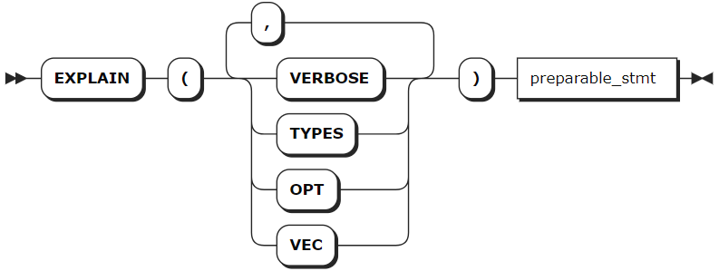
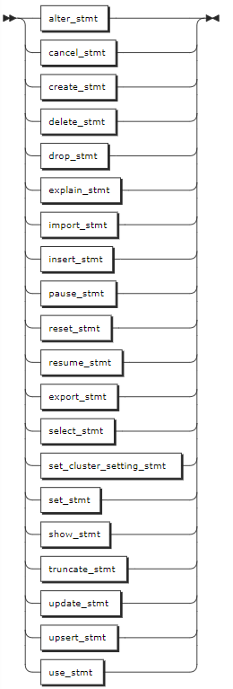

# SELECT 优化

KWDB 支持使用 `EXPLAIN` 或 `EXPLAIN ANALYSE` 的输出，为 `SELECT` 优化提供支持的信息。目前，KWDB 支持以下 SELECT 优化策略：

- 级别越少，查询速度越快。
- 重组查询以减少处理级别通常会提高性能。避免扫描整个表，这是访问数据最慢的方式。可以通过创建至少包含查询在其 `WHERE` 子句中筛选的列之一的索引来避免这种情况。

基于 `EXPLAIN` 语句的输出，KWDB 支持使用以下方式确定是否需要进行全表扫描查询：

- 查看 `Field` 属性值为 `table` 的行的 `Description` 值，获取查询使用的索引。
- 查看 `Field` 属性值为 `spans` 的行的 `Description` 值，获得索引中需要被扫描的 `Key` 值范围。

## EXPLAIN

`EXPLAIN` 语句返回 KWDB 可解释语句的查询计划。用户可以使用这些信息来优化查询。

### 所需权限

用户需要对所解释的语句具有适当的权限。

### 语法格式



- `preparable_stmt`

    

### 参数说明

| 参数 | 说明 |
| --- | --- |
| `VERBOSE` | 显示尽可能多的查询计划信息。 |
| `TYPES` | 包括 KWDB 选择用来计算中间 SQL 表达式的数据类型。 |
| `OPT` | 查看由基于成本的优化器（Cost-Based Optimizer, COB）生成的查询计划树。`OPT` 和 `VERBOSE` 关键字用于查看优化器在规划查询时使用的成本的详细信息。`OPT` 和 `TYPES` 关键字用于查看成本和类型的详细信息。 |
| `VEC` | 查看有关查询的矢量化执行计划的详细信息。如果查询的表包含不支持的数据类型，则返回未处理的数据类型错误。 <br > **说明** <br > 默认情况下，禁用矢量化执行引擎。如需开启，需运行 `SET vectorize = on` 命令。|
| `preparable_stmt` | 需要进行 `EXPLAIN` 操作的语句。基本上，所有语句都可以和 `EXPLAIN ANALYSE` 组合使用，例如 `CREATE`、`INSERT`、`UPDATE`、`DELETE` 等。|

### 返回结果字段说明

执行成功的 EXPLAIN 语句将返回具有以下字段的表：

- Tree：查询计划的层次结构的树状表示形式。
- Field：查询计划的属性名称。分布式和向量化的属性适用于整个查询计划。所有其他属性应用于树列中的查询计划节点。
- Description：有关字段中参数的附加信息。
- Columns：提供给层次结构较低层的流程的列，包含在类型和详细的输出中。
- Ordering：结果在层次结构的每一层呈现给流程的顺序，以及结果集在每一层的其他属性。该字段包含在使用 TYPES 和 VERBOSE 选项的输出结果中。

### 语法示例

以下示例假设已创建 `accounts`、`accounts_type` 表并写入相关数据。

```sql
-- 创建 accounts 表。

CREATE TABLE accounts(id INT8 DEFAULT unique_rowid() PRIMARY KEY, balance DECIMAL);
CREATE TABLE 

-- 创建 accounts_type 表。

CREATE TABLE accounts_type(id INT8 DEFAULT unique_rowid(),balance DECIMAL, data_type INT);
CREATE TABLE
```

- 不使用任何参数的 `EXPLAIN` 语句。

    ```sql
    EXPLAIN SELECT * FROM accounts;
    tree|field      |description     
    ----+-----------+----------------
        |distributed|true            
        |vectorized |false           
    scan|           |                
        |table      |accounts@primary
        |spans      |FULL SCAN       
    (5 rows)
    ```

- 在连接查询上使用 `EXPLAIN` 语句。

    ```sql
    EXPLAIN SELECT * FROM accounts AS a JOIN accounts_type AS b ON a.id=b.id;
    tree     |field            |description          
    ---------+-----------------+---------------------
            |distributed      |true                 
            |vectorized       |false                
    hash-join|                 |                     
    │       |type             |inner                
    │       |equality         |(id) = (id)          
    │       |left cols are key|                     
    ├── scan|                 |                     
    │       |table            |accounts@primary     
    │       |spans            |FULL SCAN            
    └── scan|                 |                     
            |table            |accounts_type@primary
            |spans            |FULL SCAN            
    (12 rows)
    ```

- 使用 `VERBOSE` 选项的 `EXPLAIN` 语句。

    ```sql
    EXPLAIN(VERBOSE) SELECT * FROM accounts;
    tree|field      |description     |columns      |ordering
    ----+-----------+----------------+-------------+--------
        |distributed|true            |             |        
        |vectorized |false           |             |        
    scan|           |                |(id, balance)|        
        |table      |accounts@primary|             |        
        |spans      |FULL SCAN       |             |        
    (5 rows)
    ```

- 使用 `TYPES` 选项的 `EXPLAIN` 语句。

    ```sql
    EXPLAIN(TYPES) SELECT * FROM accounts;
    tree|field      |description     |columns                  |ordering
    ----+-----------+----------------+-------------------------+--------
        |distributed|true            |                         |        
        |vectorized |false           |                         |        
    scan|           |                |(id int, balance decimal)|        
        |table      |accounts@primary|                         |        
        |spans      |FULL SCAN       |                         |        
    (5 rows)
    ```

- 使用 `OPT` 选项的 `EXPLAIN` 语句。

    ```sql
    EXPLAIN(OPT) SELECT * FROM accounts WHERE id > 2 ORDER BY balance DESC;
    text                             
    ---------------------------------
    sort                             
    └── scan accounts               
          └── CONSTRAINT: /1: [/3 - ]
    (3 rows)
    ```

- 使用 `OPT`、`VERBOSE` 组合的 `EXPLAIN` 语句。

    ```sql
    EXPLAIN(OPT, VERBOSE) SELECT * FROM accounts WHERE id > 2 ORDER BY balance DESC;
    text                                                                 
    ---------------------------------------------------------------------
    sort                                                                 
    ├── columns: id:1 balance:2                                         
    ├── stats: [rows=333.333333, distinct(1)=333.333333, null(1)=0]     
    ├── cost: 409.225479                                                
    ├── key: (1)                                                        
    ├── fd: (1)-->(2)                                                   
    ├── ordering: -2                                                    
    ├── prune: (2)                                                      
    ├── interesting orderings: (+1)                                     
    └── scan accounts                                                   
          ├── columns: id:1 balance:2                                    
          ├── CONSTRAINT: /1: [/3 - ]                                    
          ├── stats: [rows=333.333333, distinct(1)=333.333333, null(1)=0]
          ├── cost: 346.676667                                           
          ├── key: (1)                                                   
          ├── fd: (1)-->(2)                                              
          ├── prune: (2)                                                 
          └── interesting orderings: (+1)                                
    (18 rows)
    ```

- 使用 `OPT`、`TYPES` 组合的 `EXPLAIN` 语句。

    ```sql
    EXPLAIN(OPT, TYPES) SELECT * FROM accounts WHERE id > 2 ORDER BY balance DESC;
    text                                                                 
    ---------------------------------------------------------------------
    sort                                                                 
    ├── columns: id:1(int!null) balance:2(decimal)                      
    ├── stats: [rows=333.333333, distinct(1)=333.333333, null(1)=0]     
    ├── cost: 409.225479                                                
    ├── key: (1)                                                        
    ├── fd: (1)-->(2)                                                   
    ├── ordering: -2                                                    
    ├── prune: (2)                                                      
    ├── interesting orderings: (+1)                                     
    └── scan accounts                                                   
          ├── columns: id:1(int!null) balance:2(decimal)                 
          ├── CONSTRAINT: /1: [/3 - ]                                    
          ├── stats: [rows=333.333333, distinct(1)=333.333333, null(1)=0]
          ├── cost: 346.676667                                           
          ├── key: (1)                                                   
          ├── fd: (1)-->(2)                                              
          ├── prune: (2)                                                 
          └── interesting orderings: (+1)                                
    (18 rows)
    ```

- 使用 `VEC` 选项的 `EXPLAIN` 语句。

    ```sql
    SET vectorize = on;
    SET

    EXPLAIN(VEC) SELECT * FROM accounts WHERE id > 2;
    text                     
    -------------------------
    │                        
    └ Node 1                 
      └ *colexec.colBatchScan
    (3 rows)
    ```

- 使用 `EXPLAIN` 语句获取查询使用的索引和键，判定是否进行了全表扫描。

    ```sql
    -- 1. 创建表
    CREATE TABLE explain_test (k INT PRIMARY KEY, v INT);
    CREATE TABLE

    -- 2. 由于 v 列没有索引，查询 v 列时会扫描全表。

    EXPLAIN SELECT * FROM explain_test WHERE v BETWEEN 4 AND 5;
    tree|field      |description          
    ----+-----------+---------------------
        |distributed|true                 
        |vectorized |false                
    scan|           |                     
        |table      |explain_test@primary 
        |spans      |FULL SCAN            
        |filter     |(v >= 4) AND (v <= 5)
    (6 rows)

    -- 3. 在 v 列上创建索引。

    CREATE INDEX index_v ON explain_test (v);
    CREATE INDEX

    -- 4. 查询时避免了全表扫描。

    EXPLAIN SELECT * FROM explain_test WHERE v BETWEEN 4 AND 5;
    tree|field      |description         
    ----+-----------+--------------------
        |distributed|false               
        |vectorized |false               
    scan|           |                    
        |table      |explain_test@index_v
        |spans      |/4-/6               
    (5 rows)
    ```

## EXPLAIN ANALYZE

`EXPLAIN ANALYZE` 语句用于执行 SQL 查询，生成包含查询详细信息的文件。这些信息用于定位查询花费时间的具体部分，以及根据输入规范处理输入行流并对其进行处理的组件的运行时长，从而解决查询较慢的问题。

### 所需权限

用户需要对所解释的语句具有适当的权限。

### 语法格式


- `preparable_stmt`

    

### 参数说明

| 参数 | 说明 |
| --- | --- |
| `preparable_stmt` | 需要进行 `EXPLAIN ANALYSE` 操作的语句。基本上，所有语句都可以和 `EXPLAIN ANALYSE` 组合使用，例如 `CREATE`、`INSERT`、`UPDATE`、`DELETE` 等。 |

### 语法示例

使用 `EXPLAIN ANALYZE` 语句执行 `SELECT` 查询。

```sql
EXPLAIN ANALYZE(DEBUG) SELECT * FROM accounts WHERE id > 2 ORDER BY balance DESC;
text                                                                        
----------------------------------------------------------------------------
Statement diagnostics bundle generated. Download from the Admin UI (Advanced
Debug -> Statement Diagnostics History), via the direct link below, or using
the command line.                                                           
Admin UI: http://127.0.0.1:8080                                             
Direct link: http://127.0.0.1:8080/_admin/v1/stmtbundle/857952323520757761  
Command line: kwbase statement-diag list / download                         
(6 rows)
```
