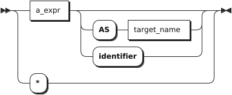
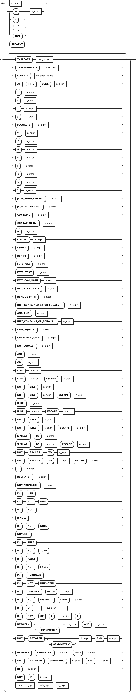

# SELECT

简单 `SELECT` 子句是读取和处理现有数据的主要 SQL 语法。当用作独立语句时，简单 `SELECT` 子句也称为 `SELECT` 语句。但是，它也是一个选择子句，可以与其他结构组合以形成更复杂的选择查询。KWDB 支持通过 `SET CLUSTER SETTING sql.auto_limit.quantity = <value>` 配置 SQL 查询结果的返回行数。

KWDB 支持在查询中对列类型为时间戳、时间戳常量以及结果类型为时间戳的函数和表达式进行时间加减运算，运算结果支持使用大于号（`>`）、小于号（`<`）、等号（`=`）、大于等于号（`>=`）、小于等于号（`<=`）进行比较。运算中可以包含 `interval` 常量、其他时间戳列以及结果类型为 interval、timestamp 或 timstamptz 的函数和表达式。如果运算符两边均为 timestamp 或 timestamptz 类型，则只支持减法运算，差值对应的纳秒数不得超过 INT64 范围，对应的天数不得超过 `106751` 天。超出范围时，系统将显示为 `106751 days 23:47:16.854776`。

加减运算中，`interval` 常量支持的单位包括微秒（us）、毫秒（ms）、秒（s）、分（m）、小时（h）、天（d）、周（w）、月（mon）、年（y）。目前，KWDB 不支持复合时间格式，如 `1d1h`。

毫秒、秒、分、小时的取值范围受纳秒最大值（INT64）范围限制。下表列出具体支持的取值范围：

| 单位      | 取值范围                                |
| --------- | --------------------------------------- |
| 微秒（us） | [-62,167,219,200,000, 31,556,995,200,000] |
| 毫秒（ms） | [-9,223,372,036,854, 9,223,372,036,854] |
| 秒（s）    | [-9,223,372,036, 9,223,372,036]         |
| 分（m）    | [-153,722,867, 153,722,867]             |
| 小时（h）  | [-2,562,047, 2,562,047]                 |

天、周、月、年的取值范围受加减计算结果的限制。计算结果对应的毫秒数不得超过 INT64 范围。

::: warning 说明
时间加减表达式支持出现在以下位置：

- `SELECT` 列表：例如 `SELECT ts+1h FROM table1;` 将返回表中时间戳列加上 1 小时后的结果。
- `WHERE` 子句：例如 `SELECT * FROM table1 WHERE ts+1h > now();` 将返回表中时间戳列加上 1 小时后大于当前时间的数据。
- `ORDER BY` 子句：例如 `SELECT * FROM table1 ORDER BY ts+1h;` 将按时间戳列加上 1 小时后的值进行排序。
- `HAVING` 子句：例如 `SELECT MAX(ts) FROM table1 GROUP BY ts HAVING ts+1h > now();` 将筛选出满足条件的分组结果。
- 参数类型为 timestamp 的函数调用：例如 `SELECT CAST(ts+1h AS timestamp) FROM table1;` 可以将时间戳列加上 1 小时后的结果转换为 timestamp 类型。
- 使用比较运算符的表示连接条件：例如 `SELECT * FROM table1,table2 WHERE table1.ts+1h > table2.ts;` 表示在连接两个表时使用时间加减条件。

:::

## 所需权限

用户拥有目标表的 SELECT 权限。

## 语法格式

- 简单查询

    

  - `target_elem`

    

  - `table_ref`

    

  - `a_expr`

    

  - `window_definition`

    

- 复杂查询

    

  - `select_clause`

    

  - `ordedr_by_clause`

    

  - `for_locking_clause`

    

  - `limit_clause`

    

  - `offset_clause`

    

## 参数说明

- **简单查询**

| 参数 | 说明 |
| --- | --- |
| `DISTINCT` 或者 `ALL` | 默认情况下或者指定  `ALL` 关键字时，`SELECT` 操作返回所有的行，但不删除重复的行。当使用 `DISTINCT` 关键字时，系统删除返回结果中重复的行。|
| `DISTINCT ON ( a_expr [, ...] )` | `a_expr[,…]`，由一个或多个标量表达式组成的列表。<br >- 当未使用 `ON` 关键字时，如果两行通过 `SELECT` 操作计算得到的所有结果均相等，则认为两行是重复的。<br >-当使用 `ON` 关键字时，如果 `ON` 关键字列出的标量表达式相等，则认为两行是重复的。当使用 `DISTINCT ON` 判定两行重复时，系统使用 `FROM` 子句中第一行的数据，按照 `ORDER BY` 子句指定的顺序来计算剩余的目标表达式。如果未使用 `ORDER BY` 子句，系统将随机选择任一重复行中作为第一行。|
| `target_elem` | 可以是标量表达式，也可以是星号（`*`）。当其为标量表达式时，用来计算每个结果行中的一列。当其为星号（`*`）时，自动从 `FROM` 子句中检索所有列。如果 `target_elem` 包含聚合函数，则可以使用 `GROUP BY` 子句进一步控制聚合。|
| `table_ref` | 检索数据的表的表达式。在 `FROM` 子句中使用两个或多个表的表达式（使用逗号（`,`）隔开）等效于使用一个交叉连接（CROSS JOIN）表达式。有关交叉连接的详细信息，参见[跨模查询](../data-query.md)。|
| `AS OF SYSTEM TIME` | 检索时间戳中存在的数据。注意，由于系统时间返回历史数据，读取的结果可能会过时。|
| `WHERE a_expr` | `SELECT` 操作的筛选语句。`a_expr` 必须使用列（例如 `<column> = <value>`），只检索表达式返回值为 `TRUE` 的行。`ROWNUM` 为从 `1` 开始的序列，逐行进行条件筛选。若不满足条件，则不自增。若满足条件，则自增 `1`，不存在序号跳跃。<br>**提示**：当 WHERE 条件中包含多个嵌套子查询和逻辑运算符（AND、OR），且某些子查询存在语义错误时，执行可能会报错 `internal error: invalid index`。|
| `GROUP BY + a_expr` | `GROUP BY` 子句，用于使用一定的规则（在 `a_expr` 中指定）将一个数据集划分成若干个小的区域，然后针对若干个小区域进行数据处理。在 `target_elem` 或 `HAVING` 中使用聚合函数时，请在 `GROUP BY` 之后列出列分组。聚合查询与 `GROUP BY` 连用时，应避免 `GROUP BY` 后的结果集行数过大。|
|  `HAVING + a_expr`  | 当 `WHERE` 关键字无法与聚合函数一起使用时，`HAVING` 子句可以用来筛选分组后的各组数据。通常情况下，`HAVING` 子句与 `GROUP BY` 子句联用，只检索 `a_expr` 表达式返回值为 `TRUE` 的聚合函数组。`a_expr` 必须是使用聚合函数返回布尔值的标量表达式（例如 `<聚合函数> = <value>`）。`HAVING` 子句的作用类似于 `WHERE` 子句，但适用于聚合函数。|
| `WINDOW window_definition_list` | 由 `window_definition` 组成的窗口定义列表，支持的参数：<br >- `window_name`：新窗口框架的名称。<br >- `opt_existing_window_name`：现有窗口框架的可选名称，在不同的窗口定义中定义。<br >- `opt_sort_clause`：可选 `ORDER BY` 子句。<br >- `opt_frame_clause`：可选的框架子句，包含框架边界和/或 `EXCLUDE` 子句。|

- **复杂查询**

| 参数 | 说明 |
| --- | --- |
| `SELECT` 子句 | `SELECT` 子句支持以下任一形式：<br >- `simple_SELECT_clause`：简单 `SELECT` 子句。<br >- `values_clause`：`VALUES` 子句。<br >- `table_clause`：表子句。<br >- `set_operation`：集合操作。|
| `ORDER BY` | `ORDER BY` 子句由若干个 `ORDER` 规范列表（可选，使用逗号（`,`）隔开）和 `ASC`/`DESC` 关键字（可选）组成。`ORDER` 规范支持以下任一形式：<br >- `a_expr`：任意标量表达式，使用计算该表达式的结果作为排序键。<br >- `PRIMARY KEY` + `table_name`：表的主键，使用给定表的主键作为排序键。该表必须是数据源的一部分。<br >- `INDEX` + `table_name` + `@` + `index_name`：表示法索引 `@`，使用给定表的索引的索引列作为排序键。该表必须是数据源的一部分。<br >- 可选的关键字 `ASC` 和 `DESC`：用来指定排列的顺序，默认值为 `ASC`。当关键字为 `ASC` 时，按照排序键的升序（从小到大）来排列。当关键字为 `DESC` 时，按照排序键的降序（从大到小）来排列。|
| `FOR LOCKING` 子句 | 通过控制对表中一个或多个行的并发访问来排序事务。|
| `LIMIT` 子句 | 支持 `LIMIT + count` 格式，操作限制为仅检索 `count` 行。KWDB 也支持使用 `sql.auto_limit.quantity` 集群参数配置 SQL 查询结果的返回行数。但是，`Limit` 子句的优先级大于 `sql.auto_limit.quantity` 集群参数。|
| `OFFSET` 子句| 跳过指定行数，通常与 `LIMIT` 子句组合使用，以实现结果集分页。如果希望限制查询结果的数量并跳过初始结果集中的若干行，可以使用 `OFFSET` 子句来获取下一部分结果集。通常用于处理大型表的数据分页，从而避免一次性检索所有行。|

## 语法示例

以下示例假设已经创建 `accounts` 表并写入数据。

```sql
-- 1. 创建 accounts 表。

CREATE TABLE accounts(id INT8 DEFAULT unique_rowid() PRIMARY KEY, name STRING, balance DECIMAL, enabled BOOL);
CREATE TABLE

-- 2. 写入数据。

INSERT INTO accounts VALUES (1, 'lily', 10000.5, true), (2, 'ruarc', 20000.75, true), (3, 'tullia', 30000, false), (4, 'arturo', 45000, false);
INSERT 4
```

- 检索特定列。

    以下示例检索 `accounts` 表 中 `balance < 21000` 的数据。

    ```sql
    SELECT id FROM accounts WHERE balance < 21000;
    id
    --
    1 
    2 
    (2 rows)
    ```

- 检索所有列。

    以下示例检索 `accounts` 表的所有列。

    ```sql
    SELECT * FROM accounts;
    id|name  |balance |enabled
    --+------+--------+-------
    1 |lily  |10000.5 |t      
    2 |ruarc |20000.75|t      
    3 |tullia|30000   |f      
    4 |arturo|45000   |f      
    (4 rows)
    ```

- 使用单个条件过滤表。

    以下示例过滤 `accounts` 表中 `balance < 21000` 的数据。

    ```sql
    SELECT id FROM accounts WHERE balance < 21000;
    id
    --
    1 
    2 
    (2 rows)
    ```

- 使用多个条件过滤表。

    以下示例过滤 `accounts` 表中 `balance > 25000` 且 `enabled = false` 的数据。

    ```sql
    SELECT * FROM accounts WHERE balance > 25000 AND enabled = false;
    id|name  |balance|enabled
    --+------+-------+-------
    3 |tullia|30000  |f      
    4 |arturo|45000  |f      
    (2 rows)
    ```

- 使用 `DISTINCT` 进行去重查询。

    以下示例使用 `DISTINCT` 关键字对 `accounts` 表进行去重查询。

    ```sql
    SELECT DISTINCT name FROM accounts WHERE enabled=true;
    name 
    -----
    lily 
    ruarc
    (2 rows)
    ```

- 使用多个条件过滤表。

    以下示例使用 `WHERE IN(<逗号分隔的值列表>)` 子句查询 `accounts` 表中指定列的值。

    ```sql
    SELECT name FROM accounts WHERE balance in (10000.5, 20000.75);
    name 
    -----
    lily 
    ruarc
    (2 rows)
    ```

- 修改输出列的名称。

    以下示例查询 `accounts` 表的 `name` 列，并使用 `AS` 关键字将输出列的列名指定为 `n`。

    ```sql
    SELECT name AS n, balance FROM accounts WHERE enabled=true;
    n    |balance 
    -----+--------
    lily |10000.5 
    ruarc|20000.75
    lily |50000.5 
    (3 rows)
    ```

- 查询字符串值。

    在 `SELECT` 语句中使用 `LIKE` 关键字在列中搜索部分匹配的字符串，支持以下通配符：

    - `%`：匹配 `0` 个或多个任意字符。
    - `_`：匹配 `1` 个任意字符。
    - `[charlist]`：匹配字符列 `charlist` 中的任意字符。
    - `charlist` 或 `[!charlist]`：不匹配字符列 `charlist` 中的任意字符。

    以下示例查询 `accounts` 表中含有 `li` 字符的数据。

    ```sql
    SELECT * FROM accounts WHERE name LIKE '%li%';
    id|name  |balance|enabled
    --+------+-------+-------
    1 |lily  |10000.5|t      
    3 |tullia|30000  |f      
    5 |lily  |50000.5|t      
    (3 rows)
    ```

- 在整个列上使用聚合函数，计算数据。

    以下示例查询 `accounts` 表中 `bakance` 值最小的数据。

    ```sql
    SELECT MIN(balance) FROM accounts;
    min    
    -------
    10000.5
    (1 row)
    ```

    KWDB 支持把聚合函数检索到的值作为 `WHERE` 子句表达式的一部分。

    ```sql
    SELECT id, name, balance FROM accounts WHERE balance = (SELECT MIN(balance) FROM accounts);
    id|name|balance
    --+----+-------
    1 |lily|10000.5
    (1 row)
    ```

- 在检索出的行数据上进行聚合函数操作。

    以下示例对 `accounts` 表的数据进行过滤，然后对查询结果的 `balance` 值进行求和计算。

    ```sql
    SELECT SUM(balance) FROM accounts WHERE enabled=true;
    SUM     
    --------
    80001.75
    (1 row)
    ```

- 筛选加入聚合函数中的列。

    以下示例使用 `FILTER(WHERE<BOOLEAN 表达式>)` 过滤 `accounts` 表中由聚合函数处理的行。`<BOOLEAN 表达式>` 是 `FILTER` 子句的布尔表达式。那些返回 `FALSE` 或 `NULL` 的值不会被输入到聚合函数中。

    ```sql
    SELECT count(*) AS unfiltered, count(*) FILTER (WHERE balance > 15000) AS filtered FROM accounts; 
    unfiltered|filtered
    ----------+--------
    5         |4       
    (1 row)
    ```

- 将检索到的行分组，然后对每组数据执行聚合函数。

    以下示例查询 `accounts` 表，使用 `GROUP BY` 子句对查询结果进行分组，然后在每行上执行聚合函数。

    ```sql
    SELECT enabled AS state, SUM(balance) AS state_balance FROM accounts GROUP BY enabled;
    state|state_balance
    -----+-------------
    t    |80001.75     
    f    |75000        
    (2 rows)
    ```

- 过滤聚合组。

    以下示例查询 `accounts` 表，使用 `GROUP BY` 子句对查询结果进行分组，然后使用 `HAVING` 子句过滤聚合组。`HAVING` 子句必须返回布尔值。

    ```sql
    SELECT enabled AS state, SUM(balance) AS state_balance FROM accounts GROUP BY enabled HAVING AVG(balance) between 100 AND 30000;
    state|state_balance
    -----+-------------
    t    |80001.75     
    (1 row)
    ```

- 在 `Having` 子句中使用聚合函数查询表。

    以下示例在 `Having` 子句中使用聚合函数查询 `accounts` 表。

    ```sql
    SELECT name, enabled FROM accounts WHERE enabled = true GROUP BY name, enabled HAVING count(name) > 1;
    name|enabled
    ----+-------
    lily|t      
    (1 row)
    ```

- 使用 `LIMIT` + `count` 的形式查询表。

    以下示例使用 `LIMIT` + `count` 的形式查询 `accounts` 表。

    ```sql
    SELECT * FROM accounts LIMIT 5;
    id|name  |balance |enabled
    --+------+--------+-------
    1 |lily  |10000.5 |t      
    2 |ruarc |20000.75|t      
    3 |tullia|30000   |f      
    4 |arturo|45000   |f      
    5 |lily  |50000.5 |t      
    (5 rows)
    ```

- 使用 `FETCH FIRST` + `count` 的形式查询表。

    以下示例使用 `FETCH FIRST` + `count` 的形式查询 `accounts` 表。

    ```sql
    SELECT * FROM accounts FETCH FIRST 2 ROW ONLY;
    id|name |balance |enabled
    --+-----+--------+-------
    1 |lily |10000.5 |t      
    2 |ruarc|20000.75|t      
    (2 rows)
    ```

- 使用 `LIMIT` 和 `OFFSET` 子句查询表。

    以下示例使用 `LIMIT` 和 `OFFSET` 子句查询 `accounts` 表。

    ```sql
    SELECT id, name FROM accounts LIMIT 1 OFFSET 1;
      id | name
    -----+-----------
      2 | Zhang San 
    (1 row)
    ```

- 使用 `OFFSET` 和 `NEXT` 关键字查询表。

    以下示例使用 `OFFSET` 和 `NEXT` 关键字查询 `accounts` 表。`OFFSET n` 表示从查询结果集中的第 `n` 行开始返回记录，并继续返回接下来指定行数的记录。

    ```sql
    SELECT * FROM accounts OFFSET 2 rows FETCH NEXT 2 ROW ONLY;
      id |  name   | balance | enabled
    -----+---------+---------+----------
      3 | Zhao Si |   30000 |  false
      4 | Wang Wu |   45000 |  false
    (2 rows)
    ```
