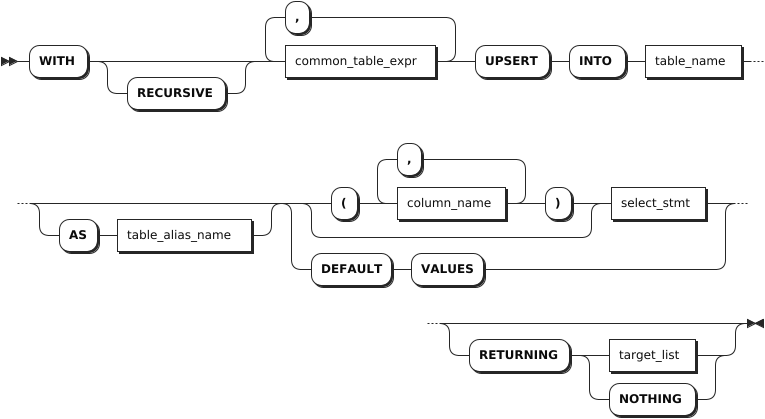
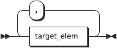

# UPSERT

`UPSERT` 语句在语义上等效于 `INSERT ON CONFLICT`。但是，两者的性能特征略有不同。

- `UPSERT` 语句只考虑主键列是否存在唯一性冲突。指定的值不违反唯一性约束时，写入行。指定的值违反唯一性约束时，更新行。主键列不存在冲突而非主键列存在冲突时，执行会出现错误。
- `INSERT ON CONFLICT` 较为灵活。除了主键列，它还考虑其他列是否存在唯一性冲突的情况。虽然在一些复杂的情况下会使得代码变得冗长，但却能有效避免非主键列冲突存在时，操作失败的情况发生。

## 所需权限

用户拥有目标表的 SELECT、INSERT、UPDATE 权限。

## 语法格式



- `common_table_expr`

    

- `target_list`

    

## 参数说明

| 参数 | 说明 |
| --- | --- |
| `common_table_expr` |可与 `WITH` 关键字结合，组成 `WITH AS` 短语。通过将需要频繁执行的 SQL 片段用别名添加到全局范围，可以在需要时直接调用该别名的 SQL 片段，从而减少重复执行，优化执行效率。 |
| `table_name` |待更新的行的表名。 |
| `AS table_alias_name` |目标表的别名。使用别名时，可以完全隐藏实际的表名。 |
| `column_name` | 待更新的列名。支持指定一个或多个列名，列名之间使用逗号（`,`）隔开。如果省略列名，将更新表中所有的列。|
| `select_stmt` | 生成要写入数据的 `SELECT` 子句。确保每个值的数据类型与目标列的数据类型匹配。如果指定列名，必须按照列名指定的顺序提供列值。如未指定列名，则按照表中列的声明顺序提供列值。|
| `DEFAULT VALUES` | 需要使用默认值填充每一列时，可以使用 `DEFAULT VALUES` 替代 `SELECT` 子句来获取结果集。要填充某一列的默认值，可在 `SELECT` 语句中忽略该值或在相应位置使用 `DEFAULT` 字段。|
| `RETURNING target_list` |返回指定类型的值。`target_list` 可以是表中特定列的名称。支持使用星号（`*`）表示返回所有列，也可以使用标量表达式指定列。如果不希望在响应中返回任何内容，甚至不返回更新的行数，使用 `RETURNING NOTHING`。 |

## 语法示例

以下示例假设已经创建 `accounts` 表并写入数据。

```sql
-- 1. 创建表。

CREATE TABLE accounts(id INT8 DEFAULT unique_rowid() PRIMARY KEY, balance DECIMAL);
CREATE TABLE 

-- 2. 写入数据。

INSERT INTO accounts (id, balance) VALUES (1, 10000.5), (2, 20000.75);
INSERT 2

-- 3. 查询表数据。

SELECT * FROM accounts;                         
id | balance 
---+---------
1  | 10000.5 
2  | 20000.75
(2 rows)
```

- 指定值不违反主键唯一性约束时写入单行数据。

    ```sql
    UPSERT INTO accounts (id, balance) VALUES (3, 6325.20);
    INSERT 1

    SELECT * FROM accounts;
    id|balance 
    --+--------
    1 |10000.5 
    2 |20000.75
    3 |6325.20 
    (3 rows)
    ```

- 指定值不违反主键唯一性约束时写入多行数据。

    ```sql
    UPSERT INTO accounts (id, balance) VALUES (4, 1970.4), (5, 2532.9), (6, 4473.0);
    INSERT 3

    SELECT * FROM accounts;
    id|balance 
    --+--------
    1 |10000.5 
    2 |20000.75
    3 |6325.20 
    4 |1970.4  
    5 |2532.9  
    6 |4473.0  
    (6 rows)
    ```

    - 指定值违反主键唯一性约束时更新行。

    ```sql
    SELECT * FROM accounts;
    id|balance 
    --+--------
    1 |10000.5 
    2 |20000.75
    3 |6325.20 
    4 |1970.4  
    5 |2532.9  
    6 |4473.0  
    (6 rows)


    UPSERT INTO accounts (id, balance) VALUES (3, 7500.83);
    INSERT 1


    SELECT * FROM accounts;
    id|balance 
    --+--------
    1 |10000.5 
    2 |20000.75
    3 |7500.83 
    4 |1970.4  
    5 |2532.9  
    6 |4473.0  
    (6 rows)
    ```

- 非主键列存在冲突时系统报错。

    ```sql
    SELECT * FROM accounts;
    id|balance 
    --+--------
    1 |10000.5 
    2 |20000.75
    3 |7500.83 
    4 |1970.4  
    5 |2532.9  
    6 |4473.0  
    (6 rows)

    -- 为非主键列添加唯一性约束
    ALTER TABLE accounts ADD CONSTRAINT unique_balance UNIQUE (balance);
    ALTER TABLE

    --写入值与非主键列冲突

    UPSERT INTO accounts VALUES (7, 1970.4);
    ERROR:  duplicate key value (balance)=(1970.4) violates unique CONSTRAINT "accounts_balance_key"
    ```

    在这种情况下，`INSERT ON CONFLICT` 便显得较为灵活。

    ```sql
    INSERT INTO accounts VALUES (7, 1970.4) ON CONFLICT (balance) DO UPDATE SET id = excluded.id;
    INSERT 1


    SELECT * FROM accounts;
    id|balance 
    --+--------
    1 |10000.5 
    2 |20000.75
    3 |7500.83 
    5 |2532.9  
    6 |4473.0  
    7 |1970.4  
    (6 rows)
    ```
