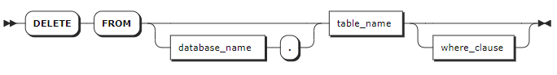

# DELETE

`DELETE` 语句用于删除指定时序表中的行数据。

::: warning 说明

- 如果在删除数据时系统发生异常中断，可以通过重启服务并查询表中的数据来获取已删除的数据信息，也可以通过查询日志了解已删除的数据行数。
- 默认情况下，当 `sql_safe_updates` 会话变量设置为 `true` 时，无法删除所有数据列数据。如需删除所有数据，应先将会话变量 `sql_safe_updates` 设置为 `false`。

:::

## 所需权限

用户拥有目标表的 SELECT 和 DELETE 权限。

## 语法格式



## 参数说明

| 参数 | 说明 |
| --- | --- |
| `database_name` | 可选参数，用于指定待删除数据所在的数据库。如未指定，默认使用当前数据库。|
| `table_name` | 待删除数据的时序表名。 |
| `where_clause` | 可选参数，指定删除数据列数据的时间范围以及是否删除表的标签数据。如未指定，默认删除表内数据列的所有数据，保留表的标签数据。`WHERE` 子句支持以下两种格式：<br>- `where <timestamp_column> = <value>`：指定待删除数据的时间范围，保留标签数据。其中时间戳列必须是数据所在表的第一列，对应的数值只支持时间戳常量，例如 `'2023-12-01 08:00:00'`。KWDB 支持指定一个或多个时间范围，支持使用 `< `、`>`、`=`、`!=`、`>=`、`<=`、`and`、`or`、`in` 和 `not in` 操作符。<br>- `where <primary_tag> = <value>`：同时删除数据列数据和标签数据，其中 `value` 只支持常量。如果待删除数据的时序表拥有多个主标签，需要列出所有主标签和标签值，用 `and` 连接，例如 `ptag1 = 1 and ptag2 = 2`。 |

## 语法示例

以下示例假设已经创建 `ts` 时序数据库、`table1` 和 `table2` 时序表。

```sql
-- 1. 创建和使用时序数据库。

CREATE TS DATABASE ts;
use ts;
SET

-- 2. 创建 table1 时序表并写入数据。

CREATE TABLE table1 (time timestamp not null, e1 smallint, e2 float, e3 bool) TAGS (tag1 smallint not null, tag2 int not null, tag3 bool) PRIMARY TAGS (tag1, tag2);
CREATE TABLE

INSERT INTO table1 VALUES ('2023-05-31 10:00:00', 1000,1000000,true, 1, 1, false), ('2023-05-31 11:00:00', 2000,2000000, true, 1, 1, false), ('2023-05-31 10:00:00', 1000,1000000,true, 2, 1, false), ('2023-05-31 11:00:00', 2000,2000000,true, 2, 1, false), ('2023-05-31 10:00:00', 1000,1000000,true, 3, 1, false), ('2023-05-31 11:00:00', 2000,2000000,true, 3, 1, false);
INSERT 6

-- 3. 创建 table2 时序表并写入数据。

CREATE TABLE table2 (time timestamp not null, e1 smallint, e2 float, e3 bool) TAGS (tag1 smallint not null, tag2 int not null, tag3 bool) PRIMARY TAGS (tag1, tag2);
CREATE TABLE

INSERT INTO table2 VALUES ('2023-05-31 10:00:00', 1000,1000000,true, 1, 1, false), ('2023-05-31 11:00:00', 2000,2000000, true, 1, 1, false), ('2023-05-31 10:00:00', 1000,1000000,true, 2, 1, false), ('2023-05-31 11:00:00', 2000,2000000,true, 2, 1, false), ('2023-05-31 10:00:00', 1000,1000000,true, 3, 1, false), ('2023-05-31 11:00:00', 2000,2000000,true, 3, 1, false);
INSERT 6

-- 4. 查看 table1 时序表数据。

SELECT * FROM table1;
            time            |  e1  |  e2   |  e3  | tag1 | tag2 | tag3
----------------------------+------+-------+------+------+------+--------
  2023-05-31 10:00:00+00:00 | 1000 | 1e+06 | true |    1 |    1 | false
  2023-05-31 11:00:00+00:00 | 2000 | 2e+06 | true |    1 |    1 | false
  2023-05-31 10:00:00+00:00 | 1000 | 1e+06 | true |    2 |    1 | false
  2023-05-31 11:00:00+00:00 | 2000 | 2e+06 | true |    2 |    1 | false
  2023-05-31 10:00:00+00:00 | 1000 | 1e+06 | true |    3 |    1 | false
  2023-05-31 11:00:00+00:00 | 2000 | 2e+06 | true |    3 |    1 | false
(6 rows)

-- 5. 查看 table2 时序表数据。

SELECT * FROM table2;
            time            |  e1  |  e2   |  e3  | tag1 | tag2 | tag3
----------------------------+------+-------+------+------+------+--------
  2023-05-31 10:00:00+00:00 | 1000 | 1e+06 | true |    1 |    1 | false
  2023-05-31 11:00:00+00:00 | 2000 | 2e+06 | true |    1 |    1 | false
  2023-05-31 10:00:00+00:00 | 1000 | 1e+06 | true |    2 |    1 | false
  2023-05-31 11:00:00+00:00 | 2000 | 2e+06 | true |    2 |    1 | false
  2023-05-31 10:00:00+00:00 | 1000 | 1e+06 | true |    3 |    1 | false
  2023-05-31 11:00:00+00:00 | 2000 | 2e+06 | true |    3 |    1 | false
(6 rows)
```

- 只删除表的数据列数据，保留标签数据。

    以下示例删除 `table1` 表的所有数据列数据，保留标签数据。

    ```sql
    DELETE FROM table1;
    DELETE 6

    SELECT * FROM table1;
      time | e1 | e2 | e3 | tag1 | tag2 | tag3
    -------+----+----+----+------+------+-------
    (0 rows)

    SHOW TAG VALUES FROM table1;
      tag1 | tag2 | tag3
    -------+------+--------
        1 |    1 | false
        2 |    1 | false
        3 |    1 | false
    (2 rows)
    ```

- 同时删除表的数据列数据和标签列数据。

    以下示例删除 `table2` 表的数据列数据和标签数据。

    ```sql
    DELETE FROM table2 WHERE tag1 = 1 AND tag2 = 1;
    DELETE 2

    SELECT * FROM table2;
                time            |  e1  |  e2   |  e3  | tag1 | tag2 | tag3
    ----------------------------+------+-------+------+------+------+--------
      2023-05-31 10:00:00+00:00 | 1000 | 1e+06 | true |    2 |    1 | false
      2023-05-31 11:00:00+00:00 | 2000 | 2e+06 | true |    2 |    1 | false
      2023-05-31 10:00:00+00:00 | 1000 | 1e+06 | true |    3 |    1 | false
      2023-05-31 11:00:00+00:00 | 2000 | 2e+06 | true |    3 |    1 | false
    (4 rows)


    SHOW TAG VALUES FROM table2;
      tag1 | tag2 | tag3
    -------+------+--------
        2 |    1 | false
        3 |    1 | false
    (2 rows)
    ```

- 删除表中指定时间段的数据列数据，保留标签数据。

    以下示例删除 `table2` 表中指定时间段的数据列数据，保留标签数据。

    ```sql
    DELETE FROM table2 WHERE time > '2023-05-01 10:00:00';
    DELETE 2

    SELECT * FROM table2;
                time            |  e1  |  e2   |  e3  | tag1 | tag2 | tag3
    ----------------------------+------+-------+------+------+------+--------
      2023-05-31 10:00:00+00:00 | 1000 | 1e+06 | true |    3 |    1 | false
      2023-05-31 11:00:00+00:00 | 2000 | 2e+06 | true |    3 |    1 | false
    (2 rows)

    SHOW TAG VALUES FROM table2;
      tag1 | tag2 | tag3
    -------+------+--------
        2 |    1 | false
        3 |    1 | false
    (2 rows)
    ```

- 删除表的多个时间段的数据列数据，保留标签数据。

    以下示例删除 `table1` 表多个时间段的数据，保留标签数据。

    ```sql
    DELETE FROM table1 WHERE time in ('2023-05-01 10:00:00', '2023-05-01 11:00:00');
    DELETE 2

    SELECT * FROM table1;
      time | e1 | e2 | e3 | tag1 | tag2 | tag3
    -------+----+----+----+------+------+-------
    (0 rows)

    SHOW TAG VALUES FROM table1;
      tag1 | tag2 | tag3
    -------+------+--------
        2 |    1 | false
        3 |    1 | false
    (2 rows)
    ```
