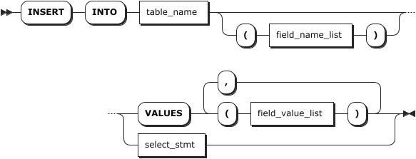

# INSERT

`INSERT` 语句用于向目标表中插入数据，包括：

- 向指定时序表插入一行或多行时序数据。
- 使用 `SELECT` 子句将其他时序表的查询结果插入到指定时序表或关系表中。
- 使用 `SELECT` 子句将跨模查询结果插入到指定时序表。

::: warning 说明

- KWDB 支持乱序写入数据。默认情况下，KWDB 以数据写入的顺序返回查询结果。如需对返回数据进行排序，支持在查询数据时使用 `ORDER BY` 子句并指定排序条件。
- KWDB 支持对具有相同时间戳的数据进行去重处理。默认情况下，后写入的数据覆盖已有的具有相同时间戳的数据。用户可以通过 `SET CLUSTER SETTING ts.dedup.rule=[ merge | override | discard]` 语句设置数据去重策略。更多信息，参见[集群实时参数配置](../../../db-operation/cluster-settings-config.md#实时参数)。
- 当使用 `SELECT` 子句将跨模查询结果插入到指定时序表时，如果首列不是时间戳列，系统报错，提示 "first column must be timestamp when the target table is table of time series"。

:::

## 所需权限

- 直接插入数据：用户是 `admin` 角色的成员或者拥有目标表的 INSERT 权限。默认情况下，`root` 用户属于 `admin` 角色。
- 插入其他时序表的查询结果：用户是 `admin` 角色的成员或者拥有目标表的 INSERT 权限和对应表的 SELECT 权限。默认情况下，`root` 用户属于 `admin` 角色。

## 语法格式



## 参数说明

| 参数 | 说明 |
| --- | --- |
| `table_name` | 表名，支持通过 `<database_name>.<table_name>` 指定其他数据库中的表。如未指定，则默认使用当前数据库。|
| `field_name_list` | 可选参数，支持指定一个或多个数据列和标签列。数据列或标签列之间使用逗号（`,`）隔开。<br > - 指定列名时，可指定目标表的全部或部分数据列或标签列，顺序可与表定义的列顺序不同。指定列必须包括第一列时间戳列和主标签列。如果指定列均为标签列，系统将根据写入数据添加标签值。<br > - 未指定列名时，数据值和标签值将按照表定义的列顺序写入。对于未指定列，如果该列支持空值，系统将自动写入默认值 `NULL`。如果该列不支持空值，系统提示 `Null value in column %s violates not-null constraints.`。 |
| `field_value_list` | 要写入的数据值和标签值列表，支持添加一个或多个数据值和标签值。数据值和标签值之间使用逗号（`,`）隔开。<br > - 指定列名时，数据值和标签值将按照列名顺序写入，数据类型须与列类型一致，数据值数量须与指定的列数量一致。<br > - 未指定列名时，数据值和标签值将按照表定义的列顺序写入，数据类型须与列类型一致，数据值数量须与列数量一致。<br > 写入的数据必须包括时间戳数据和主标签值，可以使用 `NOW()` 函数获取服务器当前时间，精确到毫秒，也可以使用时间字符串或 INT64 数据类型表示时间戳，单位为毫秒。<br > - 写入多行数据时，如果同一主标签值对应不同的普通标签值，系统将使用首次写入的主标签和普通标签值，替换同一主标签值对应的普通标签值。 |
| `select_stmt` | `SELECT` 语句，具体语法，参见[简单查询](../ts-db/ts-select.md)。`SELECT` 语句返回的列数必须与 `INSERT INTO` 语句中要插入的列数一致。<br > **说明** <br > 目前，KWDB 不支持插入指定表的重复列或重复数据，例如 `INSERT INTO t1 SELECT c1, c1 from t0` 或者 `SELECT 0,0 from t0`。 |

## 语法示例

- 不指定列名向时序表写入一行数据。

    ```sql
    INSERT INTO ts_table VALUES ('2023-07-13 14:06:32.272', 10.2, 219, 0.32, 1,1);
    ```

- 不指定列名向时序表写入多行数据。

    ```sql
    INSERT INTO ts_table2 VALUES ('2023-07-13 14:06:32.272', 10.2, 219, 0.32,1,1), ('2023-07-13 14:06:32.272', 10.15, 217, 0.33,2,0);
    ```

- 按照表定义顺序指定列名向时序表写入一行数据。

    ```sql
    INSERT INTO ts_table (k_timestamp, e1, e2, e3, id) VALUES ('2023-07-13 14:06:32.272', 10.2, 219, 0.32, 1);
    ```

- 不按表定义顺序指定列名向时序表写入一行数据。

    ```sql
    INSERT INTO ts_table (e1, e2, e3, id, k_timestamp) VALUES (10.2, 219, 0.32, 1,'2023-07-13 14:06:32.272');
    ```

- 指定部分列名向时序表写入多行数据。

    ```sql
    INSERT INTO ts_table (k_timestamp, e1,id) VALUES (now(), 10.2,1), ('2023-07-13 14:06:32.272', 10.15,2), (1681972496619, 10.4,3);
    ```

- 向时序表写入其他时序表的查询结果。

    ```sql
    INSERT INTO ts_table SELECT * FROM temperature;
    ```

- 向关系表写入其他时序表的查询结果。

    ```sql
    INSERT INTO test.test1 SELECT * FROM test_ts.ts_table;
    ```

- 向时序表写入跨模查询结果。

    ```sql
    -- 成功
    INSERT INTO test_ts.ts_table2 SELECT t2.time,t1.col1,t1.col2,t2.e3,t2.e4,t2.e5,t2.e6,t2.attr1 FROM test.test1 AS t1 JOIN test_ts.ts_table AS t2 ON t2.e1=t1.col1;

    -- 报错：first column must be timestamp when the target table is table of time series
    INSERT INTO test_ts.ts_table2 SELECT t2.e1, t1.col1,t1.col2,t2.e3,t2.e4,t2.e5,t2.e6,t2.attr1 FROM test.test1 AS t1 JOIN test_ts.ts_table AS t2 ON t2.e1=t1.col1;
    ```
