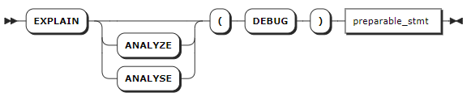
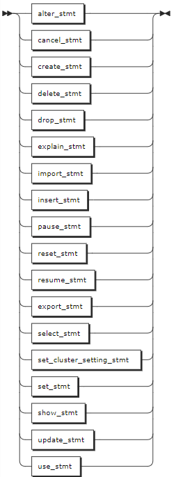

# SELECT 优化

KWDB 支持使用 `EXPLAIN` 的输出，为 `SELECT` 优化提供支持的信息。目前，KWDB 支持以下 SELECT 优化策略：

- 级别越少，查询速度越快。
- 重组查询以减少处理级别通常会提高性能。避免扫描整个表，这是访问数据最慢的方式。可以通过创建至少包含查询在其 `WHERE` 子句中筛选的列之一的索引来避免这种情况。

## EXPLAIN

`EXPLAIN` 语句返回 KWDB 可解释语句的查询计划。用户可以使用这些信息来优化查询。

### 所需权限

用户需要对所解释的语句具有适当的权限。

### 语法格式


### 参数说明

| 参数 | 说明 |
| --- | --- |
| `option_list` | 可选参数，支持同时指定一个或多个选项，各选项之间使用逗号（`,`）隔开。支持以下选项：<br>- VERBOSE：显示尽可能多的查询计划信息。<br>- TYPES：包括 KWDB 用来计算中间 SQL 表达式的数据类型。<br>- OPT：查看基于成本的优化器生成的查询计划树。 |
| `stmt` | 待解释的 `SELECT` 语句。 |

### 返回结果形式

执行成功的 EXPLAIN 语句将返回具有以下字段的表：

- Tree：查询计划的层次结构的树状表示形式。
- Field：查询计划的属性名称。分布式和向量化的属性适用于整个查询计划。所有其他属性应用于树列中的查询计划节点。
- Description：有关字段中参数的附加信息。
- Columns：提供给层次结构较低层的流程的列，包含在类型和详细的输出中。
- Ordering：结果在层次结构的每一层呈现给流程的顺序，以及结果集在每一层的其他属性。该字段包含在使用 TYPES 和 VERBOSE 选项的输出结果中。

### 语法示例

以下示例假设已经创建 `t3` 时序表并写入相应的数据。

```sql
-- 1. 创建 t3 时序表。
CREATE TABLE t3(k_timestamp timestamp not null,e1 int) TAGS (c1 smallint not null,c2 nchar(10) not null,c3 char not null,c4 varchar(10) not null,size int not null) PRIMARY TAGS (c1,c2,c3,c4) ;

-- 2. 向 t3 时序表中写入数据。

INSERT INTO t3 VALUES ('2024-1-1 1:00:00',1,1,'100','a','aa',2);
INSERT INTO t3 VALUES ('2024-1-1 1:01:00',2,2,'200','a','aaa',2);
INSERT INTO t3 VALUES ('2024-1-1 2:00:00',3,2,'200','a','aaa',6);
INSERT INTO t3 VALUES ('2024-1-1 3:00:00',4,4,'500','b','bb',4);
INSERT INTO t3 VALUES ('2024-1-1 4:00:00',5,5,'500','b','bb',5);
INSERT INTO t3 VALUES ('2024-1-1 5:00:00',6,6,'6','b','bbb',6);
INSERT INTO t3 VALUES ('2024-1-1 6:00:00',7,7,'8','c','cc',7);
INSERT INTO t3 VALUES ('2024-1-1 7:00:00',8,8,'8','c','cc',8);
INSERT INTO t3 VALUES ('2024-1-1 8:00:00',9,9,'9','c','cc',9);
INSERT INTO t3 VALUES ('2024-1-1 9:00:00',10,10,'10','c','ccc',10);
```

- 不使用任何参数的 `EXPLAIN` 语句。

    ```sql
    EXPLAIN SELECT c1 FROM t3 WHERE c1 = 1;
          tree     |     field     |  description
    ---------------+---------------+-----------------
                  | distributed   | true
                  | vectorized    | false
      synchronizer |               |
      └── ts scan |               |
                  | ts-table      | t3
                  | access mode   | tableTableMeta
                  | tag filter[0] | c1 = 1
    (7 rows)
    ```

- 使用 `VERBOSE` 选项的 `EXPLAIN` 语句。

    ```sql
    EXPLAIN (VERBOSE) SELECT c1 FROM t3 WHERE c1 = 1;
          tree     |     field     |  description   | columns | ordering
    ---------------+---------------+----------------+---------+-----------
                  | distributed   | true           |         |
                  | vectorized    | false          |         |
      synchronizer |               |                | (c1)    |
      └── ts scan |               |                | (c1)    |
                  | ts-table      | t3             |         |
                  | access mode   | tableTableMeta |         |
                  | tag filter[0] | c1 = 1         |         |
    (7 rows)
    ```

- 使用 `TYPES` 选项的 `EXPLAIN` 语句。

    ```sql
    EXPLAIN (TYPES) SELECT c1 FROM t3 WHERE c1 = 1;
          tree     |     field     |          description          |  columns  | ordering
    ---------------+---------------+-------------------------------+-----------+-----------
                  | distributed   | true                          |           |
                  | vectorized    | false                         |           |
      synchronizer |               |                               | (c1 int2) |
      └── ts scan |               |                               | (c1 int2) |
                  | ts-table      | t3                            |           |
                  | access mode   | tableTableMeta                |           |
                  | tag filter[0] | ((c1)[int2] = (1)[int])[bool] |           |
    (7 rows)
    ```

- 使用 `OPT` 选项的 `EXPLAIN` 语句。

    ```sql
    EXPLAIN (OPT) SELECT c1 FROM t3 WHERE c1 = 1;
        text
    ------------
      t-s-scan
    (1 row)
    ```

- 使用 `OPT`、`VERBOSE` 组合的 `EXPLAIN` 语句。

    ```sql
    EXPLAIN (OPT,VERBOSE) SELECT c1 FROM t3 WHERE c1 = 1;
                            text
    ----------------------------------------------------
      t-s-scan
      ├── columns: c1:3
      ├── stats: [rows=8, distinct(3)=0.8, null(3)=0]
      ├── cost: 0.01
      └── fd: ()-->(3)
    (5 rows)
    ```

## EXPLAIN ANALYZE

`EXPLAIN ANALYZE` 语句用于执行 SQL 查询，生成包含查询详细信息的文件。这些信息用于定位查询花费时间的具体部分，以及根据输入规范处理输入行流并对其进行处理的组件的运行时长，从而解决查询较慢的问题。

### 所需权限

用户需要对所解释的语句具有适当的权限。

### 语法格式



- `preparable_stmt`

    

### 参数说明

| 参数 | 说明 |
| --- | --- |
| `preparable_stmt` | 需要进行 `EXPLAIN ANALYSE` 操作的语句。基本上，所有语句都可以和 `EXPLAIN ANALYSE` 组合使用，例如 `CREATE`、`INSERT`、`UPDATE`、`DELETE` 等。 |

### 语法示例

使用 `EXPLAIN ANALYZE` 语句执行 `SELECT` 查询。

```sql
EXPLAIN ANALYZE(DEBUG) SELECT * FROM accounts WHERE id > 2 ORDER BY balance DESC;
text                                                                        
----------------------------------------------------------------------------
Statement diagnostics bundle generated. Download FROM the Admin UI (Advanced
Debug -> Statement Diagnostics History), via the direct link below, or using
the command line.                                                           
Admin UI: http://127.0.0.1:8080                                             
Direct link: http://127.0.0.1:8080/_admin/v1/stmtbundle/857952323520757761  
Command line: kwbase statement-diag list / download                         
(6 rows)
```
